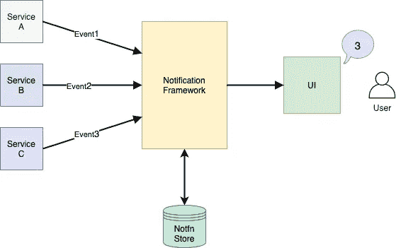
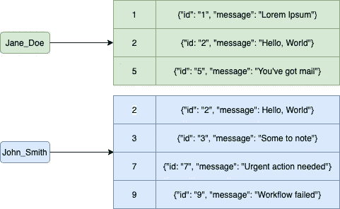
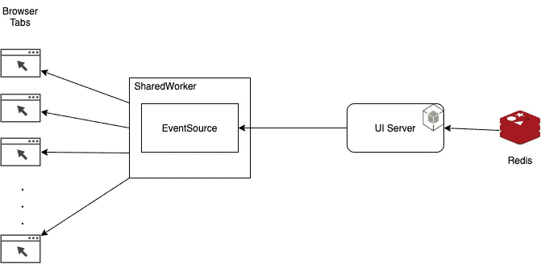
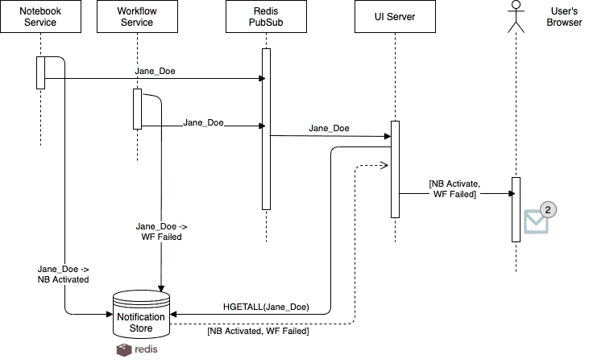

# 为基于微服务的应用构建通知框架

> 原文：<https://medium.com/walmartglobaltech/building-a-notification-framework-for-microservice-based-application-6fe5ac9dfcee?source=collection_archive---------0----------------------->

## 带有 [Vatsalya 序列号](https://medium.com/u/e91e0ab67926?source=post_page-----6fe5ac9dfcee--------------------------------)

Photo by [Liam Truong](https://unsplash.com/@liamtruong?utm_source=medium&utm_medium=referral) on [Unsplash](https://unsplash.com?utm_source=medium&utm_medium=referral)

[微服务](https://microservices.io/)是一种流行的设计模式，在这种模式下，大型应用程序被分解成多个独立的、松散耦合的服务，这些服务通过预定义的接口相互通信。沃尔玛的 ML 平台是使用相同的原理构建的——部署在 Kubernetes 集群中的独立服务通过 REST API 进行通信。作为一个平台特性，为用户提供针对事件的通知是一个优先需求。为此，我们开发了一个模型框架，任何对通知服务感兴趣的基于微服务的应用程序都可以使用它。

# 高层设计

High-Level Design for serving notifications

在高层次上，系统应该能够根据以下规则生成和处理通知。

1.  每个服务可以独立地生成针对一个用户或一组用户的通知。
2.  所有以用户为目标的通知都将存储在通知存储中
3.  对于在线用户，通知消息应该立即在 UI 中弹出。对于离线用户，一旦他们登录，通知应该在通知托盘中可用。
4.  用户可以将通知标记为已读或删除旧通知。
5.  如果需要，系统还可以选择清除旧的通知。

除了所需的规则，我们还为系统添加了一些所需的功能:

1.  该系统不应该给微服务带来很大的负担。
2.  该系统应该是快速且相当稳定的。
3.  虽然不希望丢失通知，但是稍微延迟发送通知是可以的。

我们将整个系统设计成一个基于 Java 的库，可以导入到任何有兴趣发送通知的微服务中。对于通知存储，Redis 是选项，服务器发送事件(SSE)用于将通知发送到 UI 客户端(用户的浏览器)。我们将在随后的章节中分别介绍每个系统，然后将它们放在一起，看看它们是如何组合起来完成这个特性的。

# 后端实现

## 模拟通知

一个非常简单的通知结构设计需要两个字段——目标用户和消息。这是我们最初使用的结构，随着功能的成熟，我们添加了更多的字段来增强界面，并将更多的信息捆绑到数据结构中。最后，我们正式确定了通知的结构。

## 存储通知

在通知存储中存储通知有两个要点需要考虑:

*   给定一个通知，应该很容易把它推进商店
*   给定一个用户，应该很容易从商店获得他们的通知。

Redis 作为一个键值存储，以毫秒级的延迟完成了这两项任务。此外，Redis 已被证明具有故障恢复能力和高度可伸缩性。因此，选择它作为通知的后备存储。

此外，Redis 内置了对列表和地图等更高级 ADT 的支持。我们利用映射(即 Redis 中的散列)来存储通知。对于每个用户，存储通知 JSON 的通知 id 的相应散列。每个惟一的用户 id 充当 Redis 中的一个键。这种结构确保系统支持两个用户，每个用户有两个潜在的通知。

Storage structure inside Redis

Redis 可以以线程安全的方式支持高度并发的工作负载。它还可以通过 Redis Sentinels 提供生产级支持，以实现高可用性，并通过 AOF 文件备份提供持久性。关于如何设置运行生产级 Redis 集群，有很好的文档(参见 [Redis Sentinel](https://redis.io/topics/sentinel) 和 [Redis Persistence](https://redis.io/topics/persistence) )。

## 将通知推送到商店

通知库公开了具有`notifyUsers`和`notifyGroup`方法的`NotifierClient`接口。为了触发通知，微服务将调用带有一个`Notification`对象和用户 id 列表的`notifyUsers`方法来发送通知。该库还允许创建可用于将相似用户(例如，特定项目的所有用户、使用 GPU 的所有用户等)聚集在一起的组。)和微服务可以选择使用`notifyGroup`方法向整个组发送通知。

[Jedis](https://github.com/redis/jedis) 是 Java 中最知名的与 Redis 通信的库，也就是我们在库中用来读写通知的库。Jedis 支持 Sentinel 支持和连接池等高级特性，这也使它成为生产服务器的理想选择。

为了防止读写偶尔中断，对 Redis 的调用通过 [Resilience4J](https://resilience4j.readme.io/docs/getting-started) 包装，确保在临时故障的情况下进行正确的重试和错误处理。

# 前端实现

为了启用前端，我们使用一个 Express server 作为用户浏览器和后端微服务之间的中间件，来执行身份验证和会话管理。我们利用这个服务器从 Redis 读取通知，并将它们推送给用户。

## 将通知推送到浏览器

服务器发送事件(SSE)是建立在 HTTP 之上的一项技术。对于登录到系统的每个用户，我们在用户会话期间建立一个持久的 HTTP 连接。SSE 的协议规范规定 JSON 数据被转换成一个字符串，每个事件以两个换行符结束。你可以查看[本教程](https://javascript.info/server-sent-events)来阅读更多关于如何使用 Javascript 使用 SSE 的内容。

一旦建立了连接，我们就利用 Node.js 事件模型，在 Redis 中有新的通知可用时，将数据推送到客户机。我们发出一个通知事件，该事件被附加到 HTTP SSE 处理程序范围内的事件侦听器上。我们使用登录用户的惟一 id 将来自 Redis 的消息与用户的连接进行匹配。

这个 [GitHub 代码片段](https://github.com/daichi-m/notification4J/blob/main/ui/send-to-browser.js)描述了它是如何完成的。

## 在浏览器中接收通知

在客户端，SSE 提供了一个 EventSource API，允许我们连接到服务器并从服务器接收更新。SSE 有一个限制，即它一次只能支持六个并发连接。由于我们在每个浏览器选项卡中打开一个新的连接，这就限制了我们的用户一次只能打开六个选项卡。为了规避这个限制，我们使用了[共享工作者](https://developer.mozilla.org/en-US/docs/Web/API/SharedWorker)。这使我们能够在 SharedWorker 中创建一个持久连接，并跨不同的浏览器选项卡和 iframes 访问它。shared workers 的一个缺点是 Safari 和 IE 不支持它，但由于我们的大部分用户都使用 Chrome 和 Firefox，这被认为是一个可以接受的解决方案。如果用户正在使用 IE 或 Safari，我们就退回到 SSE 模型，那里只允许 6 个标签。

当用户第一次登录时，一个新的共享工作者实例被实例化，然后被附加到窗口实例。然后可以在所有浏览器上下文中访问它。然后，Web 页面可以使用 MessagePort 对象与共享工作器通信，并附加一个事件处理程序，每次共享工作器推送消息时都会调用该事件处理程序。

github 中的[代码片段包含了在浏览器中接收通知的代码。](https://github.com/daichi-m/notification4J/blob/main/ui/recv-in-browser.js)

## 向用户显示通知

每次打开新标签或浏览器窗口时，共享工作器都会为每个新标签分配一个端口号。这些端口号为每个用户保存在一个数组中。每当生成新通知时，它会被推送到所有端口，以使其在选项卡之间保持一致。在关闭选项卡时，会触发一个`beforeUnload`事件，在该事件中，我们会从阵列中删除相应的端口。

为了只在用户在选项卡上活动时显示通知，我们处理由[页面可见性 API](https://developer.mozilla.org/en-US/docs/Web/API/Page_Visibility_API) 公开的`visibilitychange`事件。处理程序将页面标记为非隐藏，然后用来自后端的通知刷新 redux 存储。这将触发对 UI 的呈现，并且通知将显示在 snackbar 中。

# 连接后端和前端

该系统有两个部分协同工作来提供整个通知系统:

1.  一组后端服务—生成通知并将它们保存到 Redis
2.  UI 负责向用户显示通知，或者在用户在线时实时显示，或者在用户在线时显示为错过的通知列表。

## 后端到前端—通过 Redis 发布订阅

对于实时场景，UI 需要在新的通知生成后立即得到提示。我们使用 Redis PubSub 创建从后端服务到 UI 服务器的反馈通道，然后通过 HTML5 SSE 与 UI 客户机(或用户的浏览器)通信，如前所述。

当生成通知并将通知写入用户的密钥时，库还会在特定的通道上生成一条 PubSub 消息，其中包含被修改的相应的 user-id。UI 服务器订阅给定的 PubSub 通道，并在接收到 user-id 时在其内存中构建一个通知映射。如果用户在线，UI 服务器会在用户的 SSE 套接字上发送整个通知 JSON 映射，以便在浏览器中呈现。

下面给出了一个简单的序列图，展示了通知实例从在后端服务中生成到显示给用户的流程。

Crude Sequence Diagram for the flow of Notifications

## 前端到后端—通过 REST

一旦用户对通知做出响应(阅读、点击或删除)，信息就必须流向后端存储。我们将其实现为 REST 端点。

这个库本身公开了一个 Java API，它可以接受一个惟一的通知 id、一个用户 id 和要更新的状态，并且它会用更新后的状态修补 Redis 中的通知。然后可以使用服务将这个 API 与 REST 或任何其他类似的(例如 gRPC)端点包装在一起。

# 清理

为了清除 Redis 中过期和删除的通知，在库中使用了 [Quartz](http://www.quartz-scheduler.org/documentation/quartz-2.3.0/) 调度程序。为了确保一次只有一个清理器实例运行，使用了[红锁算法](https://redis.io/topics/distlock)来创建分布式锁定机制。

# 把所有的放在一起

整个框架可以在 https://github.com/daichi-m/notification4J[的图书馆里找到。](https://github.com/daichi-m/notification4J)