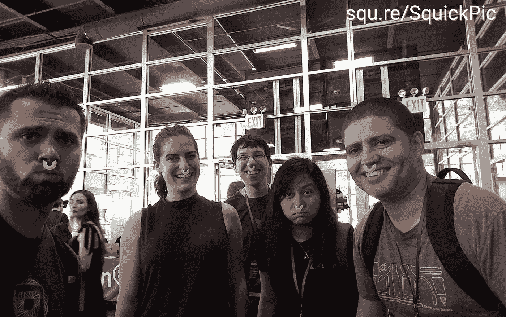
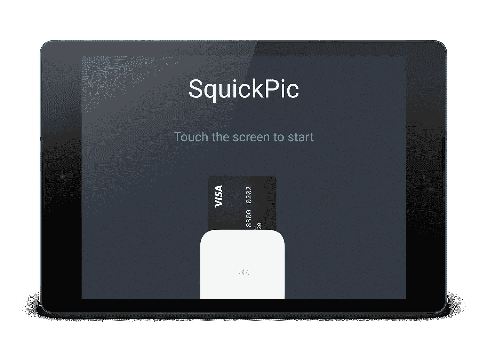
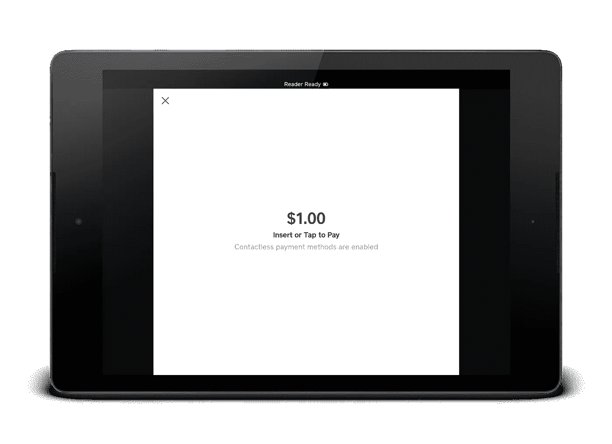
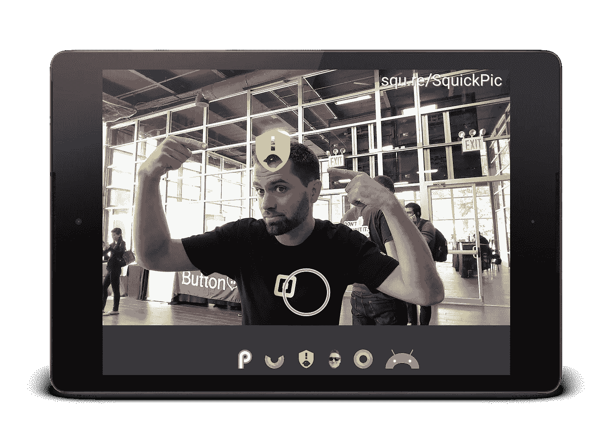
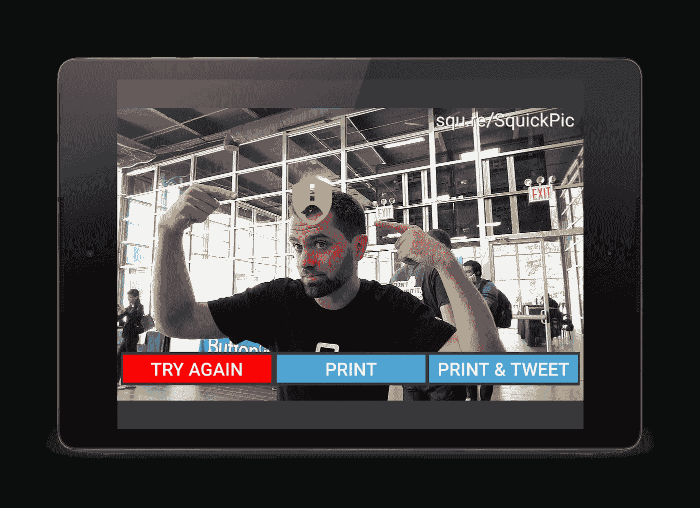
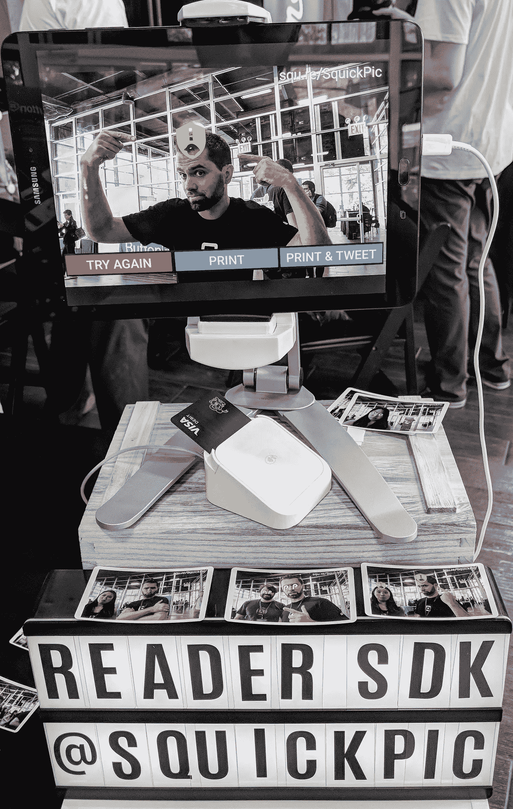

# 为纽约市的 Droidcon 建立一个照相亭

> 原文：<https://medium.com/square-corner-blog/building-a-photo-booth-for-droidcon-nyc-870425f47b00?source=collection_archive---------3----------------------->

> 注意，我们已经行动了！如果您想继续了解 Square 的最新技术内容，请访问我们的新家[https://developer.squareup.com/blog](https://developer.squareup.com/blog)

一个月前，我在 Square 的团队发布了[阅读器 SDK](http://squ.re/reader-sdk) 。我们有机会在纽约 Droidcon 展会上展示了一个演示。我们如何让支付变得更酷？

我们开始建造 SquickPic，一个有趣的 Android 照相亭:支付一美元💳，选择滤镜，微笑，快照！📸照相亭打印照片，并在推特上发布🐦( [@SquickPic](https://twitter.com/squickpic) )。

Android engineers Christina, Mike, Zarah and John joined me in sporting an Oreo Nose Ring

我们决定开放源代码 SquickPic(GitHub 上的[源代码](https://github.com/square/squickpic))。在这篇博客中，我们将讨论代码中最有趣的部分:

*   人脸检测
*   Kiosk 体验
*   接受付款
*   使用 Google Cloud Print 打印
*   （小鸟）鸣叫🐦

# App 流量

Idle screen, waiting for a new customer

💳Ready to take a card payment!

Filter selection. Best filter is obviously LeakCanary 😅

🖨Ready to print!

# 人脸检测

第一步是建立人脸检测。我们使用了 Google [移动视觉 API](https://developers.google.com/vision/) ，并检查了 [FaceTracker 示例应用程序](https://github.com/googlesamples/android-vision/tree/master/visionSamples/FaceTracker)。没有什么比复制粘贴和删除你不需要的东西更能快速获得工作代码了！

最棘手的部分是弄清楚缩放和反转:人脸检测在相机位图上运行，并提供参考坐标。相机位图被放大到显示器，所以我们必须放大我们的过滤器:

Drawing the Android Pie logo on people’s eyes

# Kiosk 体验

photobooth 设置在公共空间，因此我们使用 [startLockTask()](https://developer.android.com/reference/android/app/Activity#startLockTask()) 锁定了 photobooth 应用程序上的平板电脑:

我们还将相关活动设置为全屏:

# 接受付款

这对我们来说是最重要的部分！也是最简单的，只有几行代码💪。

Yes, the note field supports emojis 🕺

# 使用 Google Cloud Print 打印

[PrinterHelper](https://developer.android.com/reference/android/support/v4/print/PrintHelper) 通过显示系统用户界面来选择打印机、配置属性，然后发送打印作业，从而简化位图打印。这对于消费类设备来说很棒，但对于我们希望自动打印照片的照相亭来说就不那么好了。

我们买了一个 [Selphy CP1300](https://www.usa.canon.com/internet/portal/us/home/products/details/printers/mobile-compact-printer/cp1300-bkn) 并将其连接到[谷歌云打印](https://developers.google.com/cloud-print/docs/sendJobs)。不幸的是，云打印 Android API 也显示了一个 UI，HTTP API 文档遗漏了我们必须解决的细节。

我们的第一步是获得 OAuth 令牌。我们使用 [AccountManager](https://developer.android.com/training/id-auth/identify) 来请求 OAuth 令牌:

接下来，我们定义了一个改进接口来列出打印机并发送打印作业:

改型得到 OkHttp 的支持，因此我们设置了一个 [OkHttp 拦截器](https://github.com/square/okhttp/wiki/Interceptors)来将云打印 OAuth 令牌添加到我们的请求中:

我们将位图转换成 JPEG 字节数组，并作为多部分消息发送:

# （小鸟）鸣叫🐦

我们设置了 [Twitter 核心](https://docs.fabric.io/android/twitter/twitter-core.html)，并使用 TwitterLoginButton 通过 Twitter 应用程序进行身份验证。在推特上发布图片需要先上传，然后将其作为媒体附加到状态更新:

Twitter still call tweeting a “status updat‍e”

就是这样！我们非常开心地建造了这个，并和纽约 Droidcon 的参加者一起自拍。不要犹豫，在 GitHub 上查看[源！](https://github.com/square/squickpic)

SquickPic at Droidcon NYC