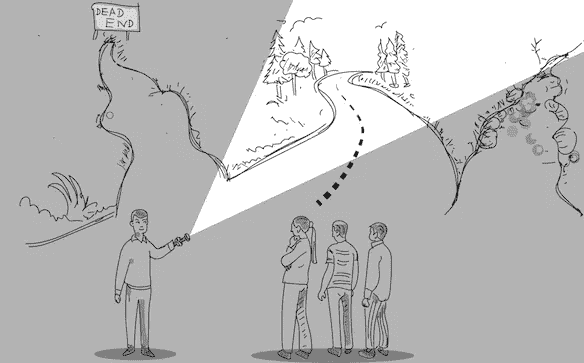

# 建立平台团队—奠定基础

> 原文：<https://medium.com/walmartglobaltech/building-a-platform-team-d915221d5654?source=collection_archive---------0----------------------->

每一个软件都从一行代码开始，并从那里成长。Walmart.com 也不例外。在过去的几年里，我们推出了一系列功能，我们的销售额以惊人的速度增长。仅对于用户交易流(购物车&结账)——我们的工程团队规模翻倍，我们的代码库也是如此。

随着成长的烦恼，[软件熵](https://en.wikipedia.org/wiki/Software_entropy)开始出现，产品开发人员必须管理几个横切关注点以及他们的功能工作和时间表。为了提高效率——需要构建通用抽象，与其他内部平台接口，解决常见问题，并且[不打破任何窗口](https://blog.codinghorror.com/the-broken-window-theory/)。为此，**我们需要整体解决问题，以处理多个团队和应用程序，而不仅仅是手头的项目**。为了更有针对性地解决这个问题，我们组建了一个专门的团队来帮助改进我们的平台。

> 关键是为我们的开发者和最终用户扩展我们的平台。

但是改善平台到底意味着什么呢？

这条路太宽了，不值得追逐，我们需要的是方向和专注。为了帮助回答这个问题，从这三个简单的问题开始

# 定义团队的 3 个问题

## **为什么？—我们的使命(目的)**

引用西蒙·西内克的话——从“为什么”开始

**“为什么**我们的团队存在？”—这似乎是一个基本问题，也是一个显而易见的问题，对吗？

然而，深入挖掘并明确定义你的核心目标和使命是弄清楚你在团队中做什么和不做什么的基础。每个团队成员都必须明确自己的角色，这是他们存在的理由，从而找到他们工作的真正意义。

## **什么？—我们的目标(重点)**

一旦我们知道了“为什么？”—下一步是进一步分解它，并确定“什么？”

"T18 我们的重点关注领域是什么？"

据此，我们列出了有助于实现我们总体使命的关键目标。这些**目标有助于提供急需的焦点，这反过来又转化为确定正确的解决途径。**

## **如何？—我们的原则(价值观)**

既然我们知道了“为什么”和“做什么”——指导我们执行的一个关键因素是知道“如何做？”

"我们如何运作？"

我们现在定义了我们的核心价值观和**运营原则，帮助我们在团队中建立正确的文化和心态。**

现在让我们看看我们如何使用**“为什么？什么？怎么会？”**为我们的平台团队奠定基础的问题。

# 为什么？

> **我们的使命**——**为什么**我们的团队存在？

> ****“使开发者能够构建高速、高质量、高性能的可扩展应用”****

****

# **什么？**

> ****目标**—“**我们的重点关注领域是什么****

****

# ****1。优化迭代速度****

> **"一个公司创新的速度受限于它的迭代速度."埃里克·伯恩哈德松**

**这一理念的核心原则是，快速行动，为用户提供产品，然后基于学习进行迭代，这一点非常重要。对于开发人员来说，这意味着**能够更快更自信地交付特性。****

****

## *****开发者生产力*****

**为开发人员加速软件交付的不同阶段。**

****

**Development + Release workflow**

**我们的关注点在这里可以分为两个部分:
**开发工作流** —这里的目标是使本地开发和测试尽可能地快速和无痛。
这需要团队/平台之间的强大协作。**

## ****降低进入壁垒****

**新员工并不难，但影响很大。如果做得好，它将改善团队合作，给员工一种归属感，并减少流动。**

**重要的是通过构建合适的工具和文档来降低新开发人员的准入门槛，使我们能够更快地加入，并对部落知识说不。**

# ****2。解决常见问题****

**平台**通过解决常见问题**防止团队重新发明轮子，并使我们整体更有效率。**

****

**要找出常见的问题，首先要了解开发人员的痛点和导致开发速度变慢的摩擦区域。我们可以通过收集反馈定性地获得这些信息，也可以通过工程 KPI 定量地获得这些信息。这与对产品未来方向的理解相结合，可以帮助形成一个伟大的路线图，并选择正确的战斗。**

# ****3。鼓励最佳实践****

****

## ****性能问题****

**默认情况下使**更快**——性能优化应该在应用程序中得到体现。这里的目标是给开发人员适当的能力，以最少的努力实现他们的特性。**

## ****定义指导方针****

**共同定义**最佳实践和架构指南**。通过**工具、审查、文档来倡导和鼓励他们。提供指导，参与讨论，帮助工程师交付高质量的代码。****

## ****及早发现问题****

**确保我们有合适的工具/流程来**授权开发人员验证和检查常见缺陷**，如代码气味、bug 和性能下降，如回归检查、CI 挂钩、机器人和性能综合测试。**

# ****4。教育和授权团队****

> **“成为 **10x** **工程师**的秘诀就是帮助你身边的 10 个工程师成为两次******高产**。”******

************

## ********分享知识********

******通过**技术讲座和文档**分享您的知识、经验和最佳实践是激发和提升我们团队集体专业知识的好方法。******

## ********代码治理********

******定义**最佳实践和架构指南**。通过**工具、审查、文档来倡导和执行这些措施。**提供辅导，参与 slack 讨论，帮助工程师交付高质量的代码。******

## ********建筑设计评审********

********参与新功能项目的架构设计评审**并提出跨团队的最佳实践/通用开发方法。******

# ********5。不断实验********

> ******“没有一个想法是真的，只是因为有人这么说。通过观察和实验获得的证据来检验想法。如果一个喜欢的想法没有通过精心设计的测试，那它就是错的！”******
> 
> ******-理查德·费曼教授******

************

## ********对照实验********

******作为一个平台团队，尝试不同的解决方案、采用更新的技术和跳出框框思考以不断改进和开拓新领域非常重要。**每当我们发现有希望解决任何问题的方法时，我们都鼓励通过概念验证来尝试这些方法，事后审查结果并做出相应的选择。**在完成展示之前，应始终对关键特性进行 AB 测试和分析。******

## ********质疑你的选择********

******用户在进化，代码也在进化。一年前的模式可能会成为未来的反模式。随着产品的发展，新的需求不断出现，早期很好的架构很可能成为满足新需求的限制因素。为了找到问题的最佳解决方案，能够质疑现有的选择是实验思维中必不可少的关键部分。******

# ******怎么会？******

> ********原则**——“**我们如何**运作？”******

************

# ********1。拥抱所有权&责任********

## ********像领导者一样思考********

> ******“这是关于从任何位置和任何方向进行领导。当今组织的整个结构要求人们进入领导思维模式，从任何级别推动想法、项目和倡议——不同的是规模。”******

************

## ********通过问责制建立信任********

******责任感是让你自己对你说过要做的事情负责。它是关于贯彻和实现你所拥有的东西。这样做会让你感到被信任，因为团队知道你会兑现你的承诺。**这建立了信任链，这是任何成功团队的基础。********

# ********2。无情地区分优先顺序********

> ******“很多时候，我们有非常好的想法。但是它们没有我们能为客户做的最重要的事情好。我们必须做出艰难的选择。”******
> 
> ******~雪莉·桑德伯格******

************

## ********与愿景和目标保持一致********

******了解*为什么*我们正在做我们正在做的事情，以及它给我们的开发者带来的影响。现在**无情地优先考虑我们的短期目标**和活动，以便它们**支持我们的长期愿景。********

## ********养成无情的心态********

******因[雪莉·桑德伯格](https://www.youtube.com/watch?v=r2japGzKATg)而广为人知——总是问，**“这绝对有必要做吗？”这种心态有助于我们分清轻重缓急，关注最重要的工作。了解你的约束条件(时间表、依赖关系等)。)并在接任何任务之前估算投资回报率。********

# ********3。关注影响********

************

## ********帕累托原理(80/20 法则)********

> ******你倾向于从 20%的工作中获得 80%的影响力。******

******80/20 法则有助于将你的注意力集中在对我们的目标有最大影响的事情上。通过关注那些事情，你可以有更好的影响力。******

## ******完美之上的迭代******

******对开发者/用户来说，把东西拿出来，从中学习，并在此基础上迭代，这真的很重要。这有助于我们更快地验证想法，根据需要采取正确的措施，并最终随着时间的推移不断改进。******

## ********关注你能控制的。********

********明智地选择你的战斗。**老生常谈，但确实如此。抱怨你不能完全控制的事情只会导致消极和怨恨。当我们不再担心那些因素，而是把注意力集中在我们能控制的事情上时，成功就来了。******

# ********4。开放和数据驱动********

************

## ********公开合作********

********我们搭建的平台是我们的产品，我们支持的团队是我们的用户。我们像内部开源团队一样合作。**我们不希望任何一个人或团队决定我们如何为所有团队解决问题。关键是与队友分享你的计划，并鼓励通过设计评审或其他沟通渠道公开反馈和建议。******

## ********帮助团队完成平台变更********

********通过支持团队来减少变革的痛苦。**平台级别的变更严重依赖于发布新功能和重大变更的沟通。对于任何可能影响多个团队的大的变更，总是要寻找渐进迁移路径的方法。******

## ********数据驱动的思维模式********

> ******“没有数据，我们只有观点”~爱德华·戴明******

******强大的团队是数据驱动的。获取数据并制定衡量标准，以推动决策、优先级和权衡评估。重视数据和事实，而不是假设和观点。******

# ********5。保持好奇，不断学习********

************

## ******问题和答案一样受人尊敬******

******没有问题是不可行的，没有问题是坏问题。团队达成共识的唯一方法是提出问题，区分事实和假设。这种对话是至关重要的，以便更好地理解做什么和如何做事情，并帮助开发更好的产品。******

## ********强有力的观点，弱有力的观点********

> ******“让你的直觉引导你得出一个结论，不管它有多不完美——这是‘强烈意见’的部分。然后——这也是“薄弱环节”——证明你是错的。进行创造性的怀疑。寻找不合适的信息，或者指向完全不同方向的迹象。最终你的直觉会发挥作用，一个新的假设会从废墟中出现，准备再次被无情地撕裂。你会惊讶地发现，一系列错误的预测会多么迅速地让你得到一个有用的结果。”~保罗·萨佛******

******能够**拥有强烈的观点，同时对改变**持开放态度——鼓励不同的观点，提出可能会戳到我们当前选项漏洞的冲突观点，并使我们能够更快地学习和迭代。******

## ********失败得快，学习得更快********

******这是**不仅仅是“快速失败”，同样也是“快速取胜”**。目标是进行快速、廉价的实验，以获得宝贵的见解，并在将新知识整合到系统中的基础上改变路线。******

## ********继续学习********

******重要的是，要把我们的技能视为动态的东西，需要不断的维护和更新。关键是要不断学习和进化，以适应新的情况。简而言之— **阅读，倾听，接受你不知道的，做事，教导。********

# ********6。同情和尊重********

************

## ********移情********

******我们是一个团队。我们应该不断地设身处地为其他开发者着想。提问在这里很有帮助，例如-******

*   ******这个技术决策如何影响我们的开发人员？******
*   ******我们怎样才能使这种改变更容易被其他团队采用？******

******建立一个多元化的团队使我们能够从不同的角度提出问题，更好地理解并帮助我们的开发人员做出正确的选择。******

## ******尊重人类而不仅仅是代码******

******说到底，我们只是一群一起工作的人，制造出一种计算机可以理解的 0 和 1 的模式。重要的是看到人们人性的一面，欣赏不同的观点，尊重彼此的差异。最好的产品总是由伟大的团队打造，而不仅仅是伟大的个人。******

************

# ******结论******

******在组建平台团队的过去几年里，**我们所做的一切都受到我们的使命、目标和原则的指导。**这确实有助于为我们提供清晰的焦点和方向，无论组织层面的优先事项如何变化。将网站速度提高 50%以上是我们的主要成就之一。我们这样做没有影响现有的功能，也没有做任何影响其他项目的大规模重写。你可以在这次谈话中了解到所有的情况。其他几项重要贡献包括:通过新的 mono repo 设置实现更快的本地开发、故事书集成、自动化性能 a11y 检查、简化跨 web 应用程序的日志记录/监控以在 10 分钟内找到问题的根本原因，以及改进的工具。******

******我想给大家留下最后一个提示——平台和软件在不断发展，我们今天构建的东西肯定会随着时间的推移而改变和过时。这只是进步。我们最终随身携带的东西是我们的知识、友谊和记忆。重要的是在团队中培养正确的文化，让工程师快乐，为他们所做的事情感到自豪，并作为一个团队一起成长。 *努力工作，但一定要记得玩乐。干杯！*******

************

******Our daily standup — Halloween edition******

******非常感谢你的阅读。如果你想了解某个特定领域的更多信息，或者分享你组建团队的经验，请在下面发表评论，或者通过 [twitter](https://twitter.com/vasanth_k) 联系我。******