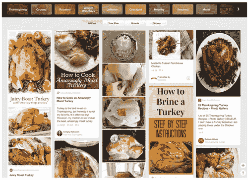
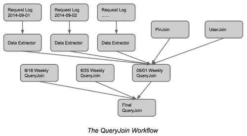

# 构建一个平台来理解搜索查询

> 原文：<https://medium.com/pinterest-engineering/building-a-platform-to-understand-search-queries-7138e923c06a?source=collection_archive---------3----------------------->

王栋|发现网站 Pinterest 工程师

每天有数百万人使用 Pinterest 作为视觉发现工具。搜索是推动网站和应用发现的主要工具之一。为了帮助 Pinners 以最有效的方式找到他们正在搜索的内容，我们必须了解他们在搜索查询背后的意图。

去年四月，我们用[引导搜索](https://blog.pinterest.com/post/83772264616/guided-search-a-new-way-to-find-what-youre)彻底改革了搜索。自那以后，人均搜索次数增加了 25%。让我们看看正在进行的工作，以改善搜索体验，帮助人们发现与他们最相关的结果。

例如，当一个人搜索“火鸡”时，他或她是否正在寻找“火鸡”食谱或“火鸡”旅行或“火鸡”动物并不立即清楚。在 Pinner 浏览搜索结果并发出另一个查询，例如“火鸡食谱”之后，我们开始理解搜索的方向。如果这个人正在搜索食谱，我们可以显示更多关于火鸡和食物的结果，比如“烤火鸡”和“感恩节火鸡”等。

## 围绕查询的数据

搜索的人越多，我们提供的结果就越好。从前面的例子中，我们可以猜测下一个发出查询“turkey”的人可能也对“turkey recipes”感兴趣。从以前的查询日志中提取的信息已经被证明在理解用户的搜索意图方面是有效的。搜索上下文，如同一搜索会话中的相邻查询和提交搜索查询后点击的大头针，可以帮助我们改善未来搜索的发现体验。

为了捕获有关搜索查询的信息，并使其可供其他应用程序处理、获取信号并在此基础上构建功能，我们设计了一个名为 QueryJoin 的数据集合，其中包含以下数据:

*   搜索查询，它也是 QueryJoin 的标识符。
*   性别、国家或语言等人口统计数据。
*   相邻查询，我们存储在同一会话中出现的查询，以了解用户如何优化他们的搜索查询来找到他们正在寻找的东西。
*   pin，因为我们存储了一组为搜索查询返回的 pin。对于每个图钉，我们从[图钉连接](https://engineering.pinterest.com/post/78859607506/creating-serving-storing-data-for-discovery)(具有相同图像签名的图钉集群的数据收集和关于这些图钉的信息)以及一些参与度统计数据(如点击、回复和喜欢的数量)中收集数据。

## QueryJoin 的数据管道

我们每天从会话日志中提取搜索活动。对于每个搜索活动，我们提取构建查询连接所需的信息，并按照日期存储它们。

每周，我们通过将每天的搜索活动聚集在一起来创建部分 QueryJoin。对于 QueryJoin 中的 pin，我们通过图像签名用 PinJoins 将它们连接起来。对于每个查询，我们找到一组与该查询相关的 pin 连接，然后计算最相关的 pin 并将查询分类。我们还通过标识符连接 QueryJoin 和 [UserJoin](https://engineering.pinterest.com/post/78859607506/creating-serving-storing-data-for-discovery) (收集用户的信息，比如他们的电路板和引脚)并计算性别和国家统计数据。

最后，我们合并了部分 QueryJoin，最近构建成一个 query join，作为我们搜索和其他发现特性的知识平台。

## 将知识平台付诸实施

作为一个数据平台，目前我们将来自 QueryJoin 的数据用于许多功能。

*   [搜索自动完成](https://blog.pinterest.com/post/49467580238/find-what-youre-searching-for) : QueryJoin 是我们搜索自动完成特性的主要数据源之一。我们基于 QueryJoin 的垂直统计信息提取流行的查询，并在我们的自动完成索引中索引这些查询。
*   [引导搜索](https://blog.pinterest.com/post/83772264616/guided-search-a-new-way-to-find-what-youre) : Queryjoin 是 Pinterest 上生成搜索指南和改进发现的重要来源。
*   搜索相关性:我们基于 QueryJoin 中的相关 pin 预测搜索查询的类别，然后使用该类别进行更好的搜索相关性调整。

## 还会有更多

这是一项具有挑战性的工作，不仅要准确理解品纳人的兴趣，还要帮助他们发现他们喜欢的东西，并给予他们在现实世界中做事的灵感。我们刚刚开始创造新的探索体验。我们有很多机会来提高数据质量，更好地理解用户查询并改善用户发现体验。

鸣谢:这个项目是 Pinterest 整个探索团队的共同努力。如果你有兴趣成为其中的一员， [*加入我们的团队*](https://about.pinterest.com/en/careers/engineering-product) *！*

王栋是 Pinterest 的一名软件工程师。

*获取 Pinterest 工程新闻和更新，关注我们的工程*[*Pinterest*](https://www.pinterest.com/malorie/pinterest-engineering-news/)*，* [*脸书*](https://www.facebook.com/pinterestengineering) *和*[*Twitter*](https://twitter.com/PinterestEng)*。有兴趣加入团队吗？查看我们的* [*招聘网站*](https://about.pinterest.com/en/careers/engineering-product) *。*