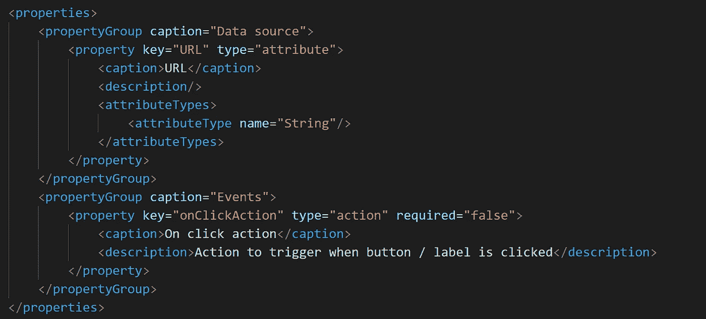
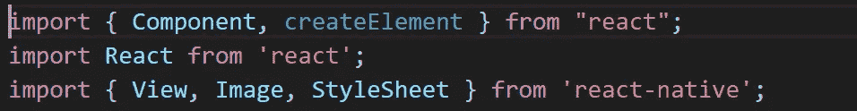
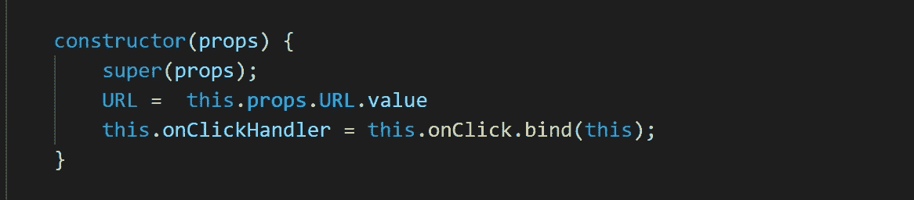
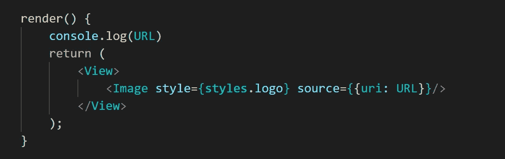
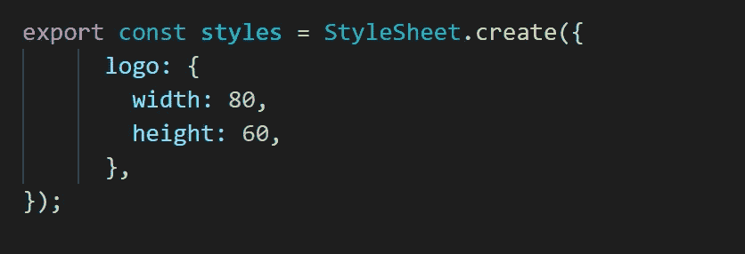

# 构建可插入的小部件— URL 图像查看器

> 原文：<https://medium.com/mendix/building-a-pluggable-widget-url-image-viewer-6fd423858137?source=collection_archive---------0----------------------->


Building a pluggable widget URL Image Viewer

## 一篇关于如何使用 Mendix 和 React.js 为本地移动设备制作 URL 图像查看器插件的短文

# 在开始之前

虽然本教程不要求您是高级 JavaScript 开发人员，但建议您至少具备一些 JavaScript 或 React.js 技能或经验。此外，您应该熟悉 Mendix 以及如何在 Mendix studio pro 中为原生移动设备开发应用程序。

最后，您应该对开发小部件有一些了解，但是如果您没有，这里有一个简短的教程，您可以在继续之前完成，它将帮助您快速了解基础知识([构建可插拔的 Web 小部件:第 1 部分](https://docs.mendix.com/howto/extensibility/create-a-pluggable-widget-one)

# 步骤 1 —使用小部件生成器创建小部件

打开终端或命令行，导航到应用程序项目的目录，输入创建文件夹 CustomWidgets 所需的命令，然后在其中创建 widget 文件夹结构

```
$ mkdir CustomWidgets
$ cd CustomWidgets
$ yo @mendix/widget URLImageViewer
```

小部件构建器将引导您创建小部件，只需输入您的详细信息。对于编程语言，我选择了 Javascript，并选择使用小部件模板。您可以决定是否要添加单元测试和端到端测试，但这不是必需的，我没有这样做。

# 步骤 2 —更改小部件 XML 结构

为了访问字符串 URL，我们希望将其作为参数传递，我们需要更改 XML，以便将其作为属性添加到小部件中。

导航到文件 UrlImageViewer.xml 并创建您的属性，下面是我如何创建属性类型为 String 的变量 URL。



# 步骤 3 —添加您的导入

现在我们需要导入一些 react-native 库。导航到 UrlImageViewer.jsx，并从 react native 为视图、图像和样式表添加以下导入。



Javascript imports

# 步骤 4 —将参数数据绑定/连接到变量

仍然在 URLimageViewer.jsx 中，我们需要绑定创建变量 URL 并将其绑定到我们的参数属性。

这是通过将下面一行添加到小部件的构造函数中来实现的:

URL = this.props.URL.value

因此构造函数看起来像这样:



The widget’s constructor function

注意，我还在 ClickHandler 上保留了小部件模板，以便小部件在被单击时仍然可以触发 nanoflow。

# 步骤 5 —创建 render()方法

最后，我们必须创建小部件的渲染功能。render()函数有一个包含一些 JSX 标记的返回语句。这是一个非常简单的小工具，它只是渲染图像。但是，不能只返回图像，React 抛出一个错误并建议将多个 DOM 元素包装成一个根 DOM 元素。

这就是我们从 react-native 添加视图导入的原因。



The widget’s render function

# 步骤 6-添加一些样式

在这一点上，您几乎可以尝试测试小部件了，但是在此之前，让我们向组件添加一些样式。我们之前已经添加了样式表的导入，所以在类外的同一个文件(URLimageViewer.jsx)中，URLImageViewer 创建了一个名为 styles 的常量。

我们可以添加一个类。徽标到样式，并设置图像的宽度和高度。



Stylesheet

# 步骤 7 —测试小部件

回到您的终端或命令提示符，输入命令 npm start。这将启动构建过程，该过程将捆绑您的代码，并在您的 Widgets 文件夹中创建一个小部件的副本。注意任何阻止您的小部件被捆绑的构建错误。

现在在 Mendix Studio Pro 中，转到项目并单击同步目录(或按下 F4)。

小部件现在应该可以在您的工具箱中用于本地移动页面。

您需要将小部件放在一个数据视图或列表视图中，该视图连接到一个包含要加载的字符串 URL 属性的实体。

在 Mendix studio pro 中本地运行它，然后使用 [Make it Native](https://docs.mendix.com/refguide/getting-the-make-it-native-app) 应用程序登录并测试小部件。

# 第八步——感到惊讶

如果当您导航到页面时图像被加载，并且控制台中没有错误，那么您已经完成了。如果这是你的第一个插件，那么做得很好。

您可以通过添加设计属性和更多内容来进一步开发这个小部件。

*你下一步想看什么小工具？在* [*LinkedIn*](https://www.linkedin.com/in/ryan-mocke-43328093/) *或* [*Mendix 社区 slack 频道*](https://join.slack.com/t/mendixcommunity/shared_invite/zt-8g6ecnz8-v2YXGYjVn07Xw1RmXeKNIA) 上向我提交您对可插拔小部件的想法

## 完整的小部件代码

```
import { Component, createElement } from "react";import React from 'react';import { View, Image, StyleSheet } from 'react-native';export class UrlImageViewer extends Component {constructor(props) {super(props);URL =  this.props.URL.valuethis.onClickHandler = this.onClick.bind(this);}render() {return (<View><Image style={styles.logo} source={{uri: URL}}/></View>);}onClick() {if (this.props.onClickAction) {this.props.onClickAction.execute();}}}export const styles = StyleSheet.create({logo: {width: 80,height: 60,},});
```

# 参考

[](https://reactnative.dev/docs/image) [## 图像反应自然

### 一个 React 组件，用于显示不同类型的图像，包括网络图像、静态资源、临时本地…

反应性发展](https://reactnative.dev/docs/image)  [## 可插拔小部件 API-API & SDK | Mendix 文档

### 理解插件的指南。

docs.mendix.com](https://docs.mendix.com/apidocs-mxsdk/apidocs/pluggable-widgets) [](https://docs.mendix.com/howto/extensibility/create-a-pluggable-widget-one) [## 构建可插入的 Web 小部件:第 1 部分- Studio Pro 8 操作指南| Mendix 文档

### 可插拔 web 小部件是新一代的定制小部件。这些小部件基于 React 并使用了…

docs.mendix.com](https://docs.mendix.com/howto/extensibility/create-a-pluggable-widget-one)  [## 构建可插入的 Web 小部件:第 2 部分(高级)- Studio Pro 8 操作指南| Mendix 文档

### 新的可插拔小部件 API 使得构建功能完整的小部件变得更加容易。本指南将超越如何…

docs.mendix.com](https://docs.mendix.com/howto/extensibility/create-a-pluggable-widget-two)