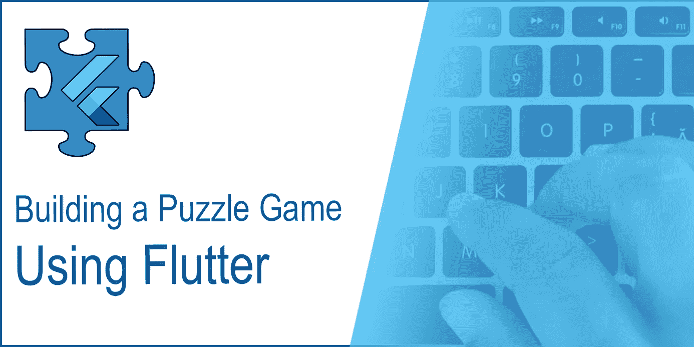
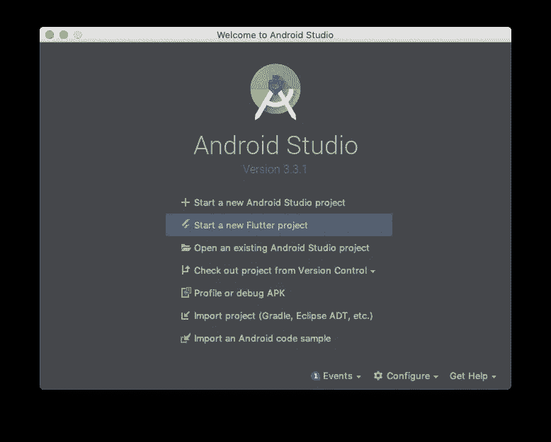
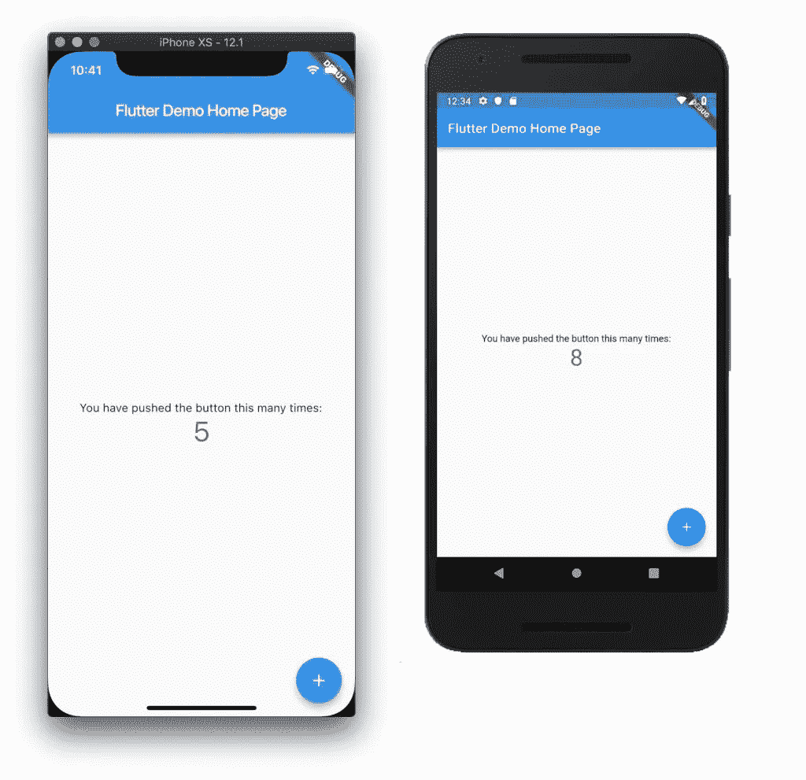
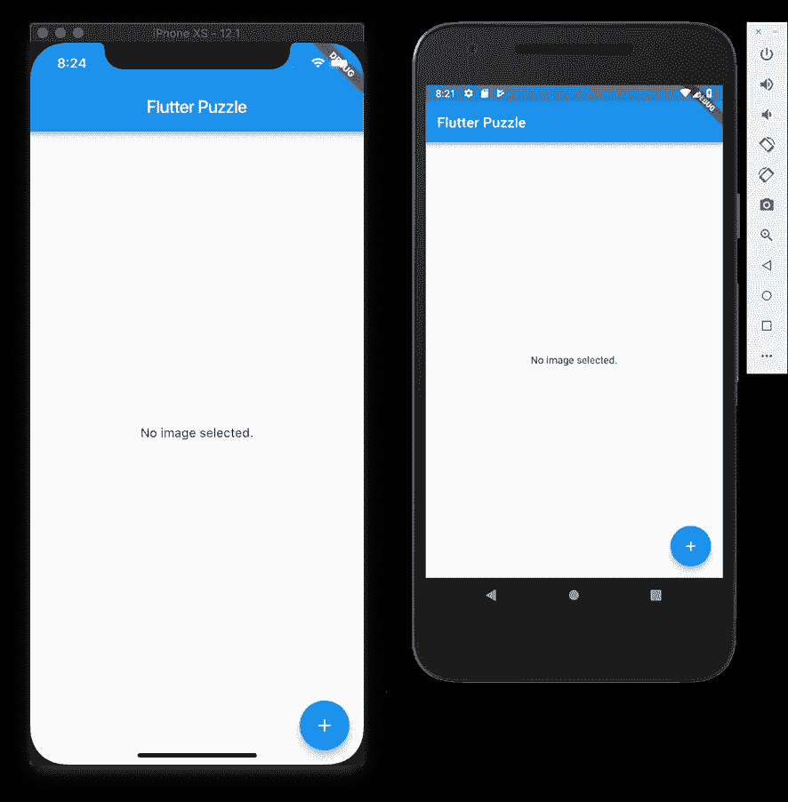
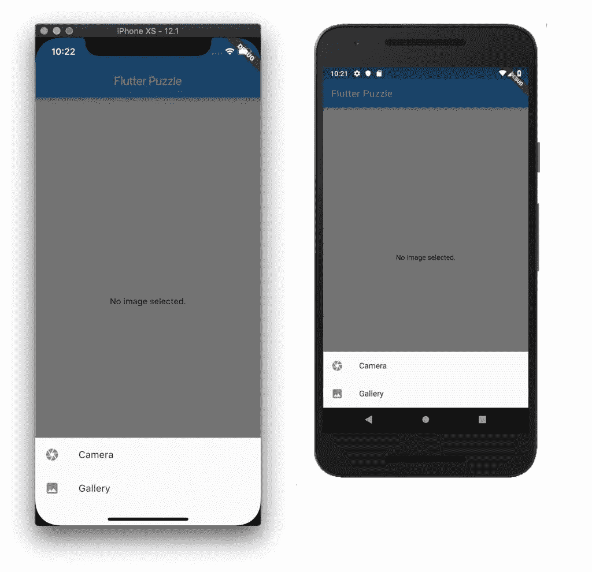
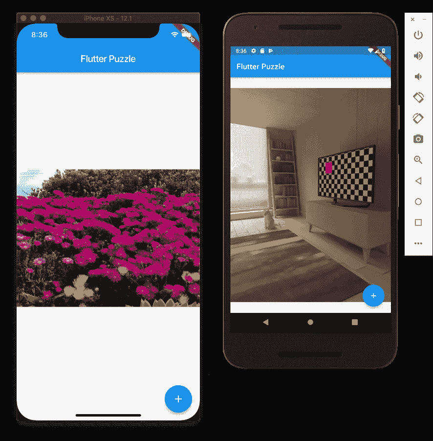
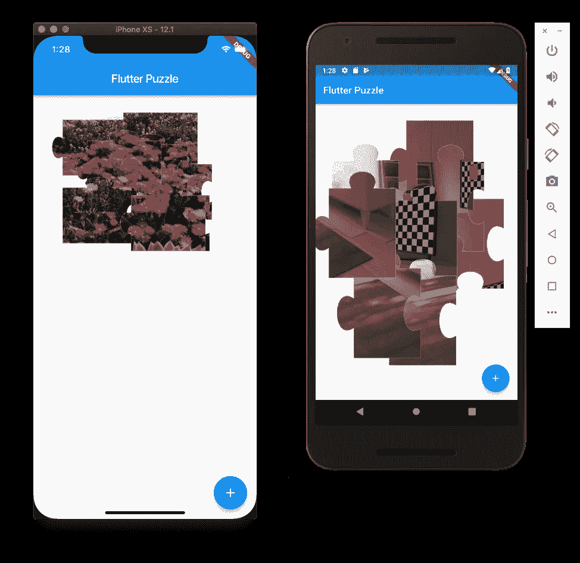
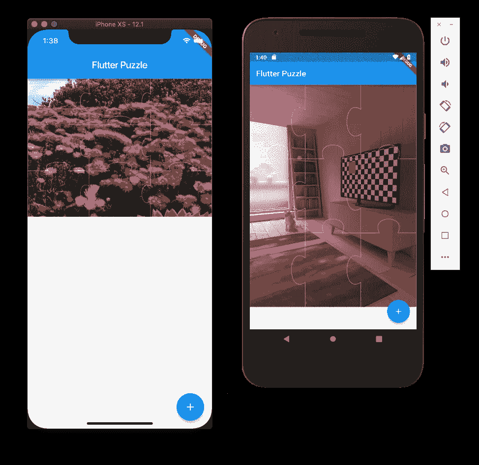

# 使用 Flutter 构建一个益智游戏

> 原文：<https://medium.com/quick-code/building-a-puzzle-game-using-flutter-6f629873102d?source=collection_archive---------1----------------------->



你好。今天我想向你展示如何使用 Flutter 构建一个益智游戏。这在 iOS 和 Android 设备上都可以使用。我们过去已经在 Android 中开发了一个益智游戏，你可以在这里查看。

如果你还没有安装 Flutter，请从这里开始。你可以从 [Flutter 网站](https://flutter.io/docs/get-started/install)找到如何安装。

# 项目设置

一旦你做好了一切准备，开始在 Android Studio 中创建一个新的 Flutter 项目:



在下一个屏幕中，选择创建一个 **Flutter 应用程序**，然后将新项目命名为`flutter_puzzle`，并使用自己的公司或个人域名进行包名生成。我将使用`dragosholban.com`，所以包名将最终是`com.dragosholban.flutterpuzzle`。如果我们选择包含 Kotlin 或 Swift 支持，这并不重要，因为我们不需要为这个应用程序编写任何原生的 Android 或 iOS 代码。

新项目生成后，在模拟器或真实设备上运行它，以确保一切正常。



为了完成我们的设置，打开`lib/main.dart`文件并用下面的内容替换它。我们将删除 Flutter 生成的示例功能，并将其替换为我们应用程序的起点:

```
import 'package:flutter/material.dart';

void main() => runApp(MyApp());

class MyApp extends StatelessWidget {
  @override
  Widget build(BuildContext context) {
    return MaterialApp(
      title: 'Flutter Puzzle',
      theme: ThemeData(
        primarySwatch: Colors.*blue*,
      ),
      home: MyHomePage(title: 'Flutter Puzzle'),
    );
  }
}

class MyHomePage extends StatefulWidget {
  final String title;

  MyHomePage({Key key, this.title}) : super(key: key);

  @override
  _MyHomePageState createState() => _MyHomePageState();
}

class _MyHomePageState extends State<MyHomePage> {

  @override
  Widget build(BuildContext context) {
    return Scaffold(
      appBar: AppBar(
        title: Text(widget.title),
      ),
      body: SafeArea(
        child: new Center(
          child: new Text('No image selected.'),
        ),
      ),
      floatingActionButton: FloatingActionButton(
        onPressed: () => null,
        tooltip: 'New Image',
        child: Icon(Icons.*add*),
      ),
    );
  }
}
```

如您所见，这只是一个空屏幕，中间有一个“*未选择图像*”文本，以及一个我们稍后将使用的浮动按钮:



# 从相机或图库获取图像

现在我们已经准备好了一切，让我们开始让我们的应用程序能够从手机的内部存储中加载图像或直接使用相机捕捉图像。为此，我们将使用一个名为 [image_picker](https://pub.dartlang.org/packages/image_picker) 的 Flutter 插件。

在 Flutter 中安装新插件非常简单，只需将它们添加到`pubspec.yaml`文件中，然后从控制台或直接从 Android Studio 运行`flutter get`。

```
...
dependencies:
  flutter:
    sdk: flutter

  # The following adds the Cupertino Icons font to your application.
  # Use with the CupertinoIcons class for iOS style icons.
  cupertino_icons: ^0.1.2

  **image_picker: ^0.4.10**
...
```

因为我们已经添加了一个浮动按钮，让用户选择一个新的图像，让我们只做必要的修改，所以它只是这样做。首先，我们将为用户提供选择图像源的选项:*相机*或*图库*。对`main.dart`文件进行如下更改:

```
// ...

class _MyHomePageState extends State<MyHomePage> {
 @override
   Widget build(BuildContext context) {
     return Scaffold(
       appBar: AppBar(
         title: Text(widget.title),
       ),
       body: SafeArea(
         child: new Center(
           child: new Text('No image selected.'),
         ),
       ),
       floatingActionButton: FloatingActionButton(
         onPressed: () **{
           showModalBottomSheet(context: context,
               builder: (BuildContext context) {
                 return SafeArea(
                   child: new Column(
                     mainAxisSize: MainAxisSize.min,
                     children: [
                       new ListTile(
                         leading: new Icon(Icons.camera),
                         title: new Text('Camera'),
                         onTap: () => null,
                       ),
                       new ListTile(
                         leading: new Icon(Icons.image),
                         title: new Text('Gallery'),
                         onTap: () => null,
                       ),
                     ],
                   ),
                 );
               }
           );
         },**
         tooltip: 'New Image',
         child: Icon(Icons.add),
       ),
     );
   }
 }
```

现在，当你点击浮动按钮时，底部的菜单会出现，询问你想要的图片来源。确保一切顺利进行:



为了实际获取图像，我们将创建一个新方法，当用户从上面选择*相机*或*图库*时，将调用该方法。我们将通过改变应用程序的状态，在图像加载时向用户显示图像。另外，请注意我们必须导入一些 dart 库和我们之前安装的`image_picker` Flutter 插件:

```
**import 'dart:async';
import 'dart:io';**

import 'package:flutter/material.dart';
**import 'package:image_picker/image_picker.dart';**

void main() => runApp(MyApp());

// ...

class _MyHomePageState extends State<MyHomePage> {
  **File _image;

  Future getImage(ImageSource source) async {
    var image = await ImagePicker.*pickImage*(source: source);

    if (image != null) {
      setState(() {
        _image = image;
      });
    }
  }** 
  @override
  Widget build(BuildContext context) {
    return Scaffold(
      appBar: AppBar(
        title: Text(widget.title),
      ),
      body: SafeArea(
        child: new Center(
          child: **_image == null
            ? new Text('No image selected.')
            : Image.file(_image)**
        ),
      ),
      floatingActionButton: FloatingActionButton(
        onPressed: () {
          showModalBottomSheet<void>(context: context,
              builder: (BuildContext context) {
                return SafeArea(
                  child: new Column(
                    mainAxisSize: MainAxisSize.min,
                    children: <Widget>[
                      new ListTile(
                        leading: new Icon(Icons.*camera*),
                        title: new Text('Camera'),
                        onTap: () {
                          **getImage(ImageSource.camera);
                          // this is how you dismiss the modal bottom sheet after making a choice
                          Navigator.*pop*(context);**
                        },
                      ),
                      new ListTile(
                        leading: new Icon(Icons.*image*),
                        title: new Text('Gallery'),
                        onTap: () {
                          **getImage(ImageSource.gallery);
                          // dismiss the modal sheet
                          Navigator.*pop*(context);**
                        },
                      ),
                    ],
                  ),
                );
              }
          );
        },
        tooltip: 'New Image',
        child: Icon(Icons.*add*),
      ),
    );
  }
}
```

我们需要做的最后一件事是添加一些 iOS 特定的权限细节。打开`ios/Runner/Info.plist`文件，在其中添加两行，如下所示:

```
<?xml version="1.0" encoding="UTF-8"?>
<!DOCTYPE plist PUBLIC "-//Apple//DTD PLIST 1.0//EN" "http://www.apple.com/DTDs/PropertyList-1.0.dtd">
<plist version="1.0">
<dict>
    <key>CFBundleDevelopmentRegion</key>
    <string>en</string>
    ...
    **<key>NSPhotoLibraryUsageDescription</key>
    <string>The app needs to access the Photo Library in order to be able to load images from it.</string>
    <key>NSCameraUsageDescription</key>
    <string>The app needs to access the Camera in order to be able to get images from it.</string>**
</dict>
</plist>
```

你现在可以测试应用程序，你应该能够在两个平台上加载图像或捕捉新的。完成检查后，转到下一部分。



# 将图像分割成拼图块

对于拼图的各个部分，我们将创建一个新的 flutter 小部件`PuzzlePiece`。在`lib`文件夹中创建一个新的`PuzzlePiece.dart`文件。

这个小部件将获取一个`image`并将其剪辑到一个`path`上，后者定义了我们的拼图块。它还需要知道它正在绘制的那块拼图的`row`和`column`以及整个拼图的最大行数/列数(`maxRow`和`maxCol`)。

```
import 'dart:math';

import 'package:flutter/material.dart';

class PuzzlePiece extends StatefulWidget {
  final Image image;
  final Size imageSize;
  final int row;
  final int col;
  final int maxRow;
  final int maxCol;

  PuzzlePiece(
      {Key key,
        @required this.image,
        @required this.imageSize,
        @required this.row,
        @required this.col,
        @required this.maxRow,
        @required this.maxCol})
      : super(key: key);

  @override
  PuzzlePieceState createState() {
    return new PuzzlePieceState();
  }
}

class PuzzlePieceState extends State<PuzzlePiece> {
  double top;
  double left;

  @override
  Widget build(BuildContext context) {
    final imageWidth = MediaQuery.*of*(context).size.width;
    final imageHeight = MediaQuery.*of*(context).size.height * MediaQuery.*of*(context).size.width / widget.imageSize.width;
    final pieceWidth = imageWidth / widget.maxCol;
    final pieceHeight = imageHeight / widget.maxRow;

    if (top == null) {
      top = Random().nextInt((imageHeight - pieceHeight).ceil()).toDouble();
      top -= widget.row * pieceHeight;
    }
    if (left == null) {
      left = Random().nextInt((imageWidth - pieceWidth).ceil()).toDouble();
      left -= widget.col * pieceWidth;
    }

    return Positioned(
        top: top,
        left: left,
        width: imageWidth,
        child: ClipPath(
          child: CustomPaint(
            foregroundPainter: PuzzlePiecePainter(widget.row, widget.col, widget.maxRow, widget.maxCol),
            child: widget.image
          ),
        clipper: PuzzlePieceClipper(widget.row, widget.col, widget.maxRow, widget.maxCol),
      ),
    );
  }
}

// this class is used to clip the image to the puzzle piece path
class PuzzlePieceClipper extends CustomClipper<Path> {
  final int row;
  final int col;
  final int maxRow;
  final int maxCol;

  PuzzlePieceClipper(this.row, this.col, this.maxRow, this.maxCol);

  @override
  Path getClip(Size size) {
    return getPiecePath(size, row, col, maxRow, maxCol);
  }

  @override
  bool shouldReclip(CustomClipper<Path> oldClipper) => false;
}

// this class is used to draw a border around the clipped image
class PuzzlePiecePainter extends CustomPainter {
  final int row;
  final int col;
  final int maxRow;
  final int maxCol;

  PuzzlePiecePainter(this.row, this.col, this.maxRow, this.maxCol);

  @override
  void paint(Canvas canvas, Size size) {
    final Paint paint = Paint()
      ..color = Color(0x80FFFFFF)
      ..style = PaintingStyle.stroke
      ..strokeWidth = 1.0;

    canvas.drawPath(getPiecePath(size, row, col, maxRow, maxCol), paint);
  }

  @override
  bool shouldRepaint(CustomPainter oldDelegate) {
    return false;
  }
}

// this is the path used to clip the image and, then, to draw a border around it; here we actually draw the puzzle piece
Path getPiecePath(Size size, int row, int col, int maxRow, int maxCol) {
  final width = size.width / maxCol;
  final height = size.height / maxRow;
  final offsetX = col * width;
  final offsetY = row * height;
  final bumpSize = height / 4;

  var path = Path();
  path.moveTo(offsetX, offsetY);

  if (row == 0) {
    // top side piece
    path.lineTo(offsetX + width, offsetY);
  } else {
    // top bump
    path.lineTo(offsetX + width / 3, offsetY);
    path.cubicTo(offsetX + width / 6, offsetY - bumpSize, offsetX + width / 6 * 5, offsetY - bumpSize, offsetX + width / 3 * 2, offsetY);
    path.lineTo(offsetX + width, offsetY);
  }

  if (col == maxCol - 1) {
    // right side piece
    path.lineTo(offsetX + width, offsetY + height);
  } else {
    // right bump
    path.lineTo(offsetX + width, offsetY + height / 3);
    path.cubicTo(offsetX + width - bumpSize, offsetY + height / 6, offsetX + width - bumpSize, offsetY + height / 6 * 5, offsetX + width, offsetY + height / 3 * 2);
    path.lineTo(offsetX + width, offsetY + height);
  }

  if (row == maxRow - 1) {
    // bottom side piece
    path.lineTo(offsetX, offsetY + height);
  } else {
    // bottom bump
    path.lineTo(offsetX + width / 3 * 2, offsetY + height);
    path.cubicTo(offsetX + width / 6 * 5, offsetY + height - bumpSize, offsetX + width / 6, offsetY + height - bumpSize, offsetX + width / 3, offsetY + height);
    path.lineTo(offsetX, offsetY + height);
  }

  if (col == 0) {
    // left side piece
    path.close();
  } else {
    // left bump
    path.lineTo(offsetX, offsetY + height / 3 * 2);
    path.cubicTo(offsetX - bumpSize, offsetY + height / 6 * 5, offsetX - bumpSize, offsetY + height / 6, offsetX, offsetY + height / 3);
    path.close();
  }

  return path;
}
```

回到`main.dart`文件，添加以下内容开始使用这个新的小部件:

```
import 'dart:async';
import 'dart:io';

import 'package:flutter/material.dart';
import 'package:image_picker/image_picker.dart';

**import 'package:flutter_puzzle/PuzzlePiece.dart';**

void main() => runApp(MyApp());

class MyApp extends StatelessWidget {
  @override
  Widget build(BuildContext context) {
    return MaterialApp(
      title: 'Flutter Puzzle',
      theme: ThemeData(
        primarySwatch: Colors.*blue*,
      ),
      home: MyHomePage(title: 'Flutter Puzzle'),
    );
  }
}

class MyHomePage extends StatefulWidget {
  final String title;
  **final int rows = 3;
  final int cols = 3;**

  MyHomePage({Key key, this.title}) : super(key: key);

  @override
  _MyHomePageState createState() => _MyHomePageState();
}

class _MyHomePageState extends State<MyHomePage> {
  File _image;
  **List<Widget> pieces = [];**

  Future getImage(ImageSource source) async {
    var image = await ImagePicker.*pickImage*(source: source);

    if (image != null) {
      setState(() {
        _image = image;
        **pieces.clear();**
      });

      **splitImage(Image.file(image));**
    }
  }

  **// we need to find out the image size, to be used in the PuzzlePiece widget
  Future<Size> getImageSize(Image image) async {
    final Completer<Size> completer = Completer<Size>();

    image.image.resolve(const ImageConfiguration()).addListener(
          (ImageInfo info, bool _) {
        completer.complete(Size(
          info.image.width.toDouble(),
          info.image.height.toDouble(),
        ));
      },
    );

    final Size imageSize = await completer.future;

    return imageSize;
  }**

  **// here we will split the image into small pieces using the rows and columns defined above; each piece will be added to a stack
  void splitImage(Image image) async {
    Size imageSize = await getImageSize(image);

    for (int x = 0; x < widget.rows; x++) {
      for (int y = 0; y < widget.cols; y++) {
        setState(() {
          pieces.add(PuzzlePiece(key: GlobalKey(),
              image: image,
              imageSize: imageSize,
              row: x,
              col: y,
              maxRow: widget.rows,
              maxCol: widget.cols));
        });
      }
    }
  }**

  @override
  Widget build(BuildContext context) {
    return Scaffold(
      appBar: AppBar(
        title: Text(widget.title),
      ),
      body: SafeArea(
        child: new Center(
          child: _image == null
            ? new Text('No image selected.')
            : **Stack(children: pieces)**
        ),
      ),
      floatingActionButton: FloatingActionButton(
        onPressed: () {
          showModalBottomSheet<void>(context: context,
              builder: (BuildContext context) {
                return SafeArea(
                  child: new Column(
                    mainAxisSize: MainAxisSize.min,
                    children: <Widget>[
                      new ListTile(
                        leading: new Icon(Icons.*camera*),
                        title: new Text('Camera'),
                        onTap: () {
                          getImage(ImageSource.camera);
                          Navigator.*pop*(context);
                        },
                      ),
                      new ListTile(
                        leading: new Icon(Icons.*image*),
                        title: new Text('Gallery'),
                        onTap: () {
                          getImage(ImageSource.gallery);
                          Navigator.*pop*(context);
                        },
                      ),
                    ],
                  ),
                );
              }
          );
        },
        tooltip: 'New Image',
        child: Icon(Icons.*add*),
      ),
    );
  }
}
```

如果你现在运行应用程序并加载一张图片，你会看到它被转换成多个拼图块，随机放置在屏幕上。



# 四处移动拼图块，并咬合到位

接下来，我们将添加一个[颤动手势检测器](https://docs.flutter.io/flutter/widgets/GestureDetector-class.html)来允许用户在屏幕上移动(平移)棋子。当一个棋子接近它的最终位置时，我们将把它扣到位，并禁止移动。将突出显示的代码添加到`PuzzlePiece`小部件中，这样做:

```
class PuzzlePiece extends StatefulWidget {
  final Image image;
  final Size imageSize;
  final int row;
  final int col;
  final int maxRow;
  final int maxCol;
  **final Function bringToTop;
  final Function sendToBack;**

  PuzzlePiece(
      {Key key,
        @required this.image,
        @required this.imageSize,
        @required this.row,
        @required this.col,
        @required this.maxRow,
        @required this.maxCol,
        **@required this.bringToTop,
        @required this.sendToBack**})
      : super(key: key);

  @override
  PuzzlePieceState createState() {
    return new PuzzlePieceState();
  }
}

class PuzzlePieceState extends State<PuzzlePiece> {
  double top;
  double left;
  **bool isMovable = true;**

  @override
  Widget build(BuildContext context) {
    final imageWidth = MediaQuery.*of*(context).size.width;
    final imageHeight = MediaQuery.*of*(context).size.height * MediaQuery.*of*(context).size.width / widget.imageSize.width;
    final pieceWidth = imageWidth / widget.maxCol;
    final pieceHeight = imageHeight / widget.maxRow;

    if (top == null) {
      top = Random().nextInt((imageHeight - pieceHeight).ceil()).toDouble();
      top -= widget.row * pieceHeight;
    }
    if (left == null) {
      left = Random().nextInt((imageWidth - pieceWidth).ceil()).toDouble();
      left -= widget.col * pieceWidth;
    }

    return Positioned(
        top: top,
        left: left,
        width: imageWidth,
        child: **GestureDetector(
          onTap: () {
            if (isMovable) {
              widget.bringToTop(widget);
            }
          },
          onPanStart: (_) {
            if (isMovable) {
              widget.bringToTop(widget);
            }
          },
          onPanUpdate: (dragUpdateDetails) {
            if (isMovable) {
              setState(() {
                top += dragUpdateDetails.delta.dy;
                left += dragUpdateDetails.delta.dx;

                if(-10 < top && top < 10 && -10 < left && left < 10) {
                  top = 0;
                  left = 0;
                  isMovable = false;
                  widget.sendToBack(widget);
                }
              });
            }
          },
          child:** ClipPath(
            child: widget.image,
            clipper: PuzzlePieceClipper(widget.row, widget.col, widget.maxRow, widget.maxCol),
          ),
        **),**
    );
  }
}
```

最后，将以下内容添加到`main.dart`文件中:

```
void splitImage(Image image) async {
  Size imageSize = await getImageSize(image);

  for (int x = 0; x < widget.rows; x++) {
    for (int y = 0; y < widget.cols; y++) {
      setState(() {
        pieces.add(PuzzlePiece(key: GlobalKey(),
            image: image,
            imageSize: imageSize,
            row: x,
            col: y,
            maxRow: widget.rows,
            maxCol: widget.cols,
            **bringToTop: this.bringToTop,
            sendToBack: this.sendToBack**));
      });
    }
  }
}

**// when the pan of a piece starts, we need to bring it to the front of the stack
void bringToTop(Widget widget) {
  setState(() {
    pieces.remove(widget);
    pieces.add(widget);
  });
}**

**// when a piece reaches its final position, it will be sent to the back of the stack to not get in the way of other, still movable, pieces
void sendToBack(Widget widget) {
  setState(() {
    pieces.remove(widget);
    pieces.insert(0, widget);
  });
}**
```

再次运行应用程序，选择一个图像，并尝试完成拼图！一切都应该运行良好，你可以祝贺自己制作了这么棒的应用程序…

但是你可以自己做更多的事情来改进这个游戏！一件显而易见的事情，就是**检查所有的部分是否到位，然后重启游戏**。另一个是**将 app 限制在纵向模式**。但是我会让你自己发现如何做到这一点。(提示:对于后者，你必须分别配置 iOS 和 Android 的每个原生应用程序)。



我希望你喜欢这个关于在 Flutter 中构建一个益智游戏的教程。请在评论中让我知道它是如何为你工作的，如果你有任何问题或建议，我可以用来改进它。你可以从 [GitHub](https://github.com/dragosholban/flutter_puzzle) 获得最终代码，随心所欲地使用。谢谢！

*原载于 2019 年 2 月 16 日*[*【dragosholban.com*](https://dragosholban.com/2019/02/16/building-a-puzzle-game-using-flutter/)*。*