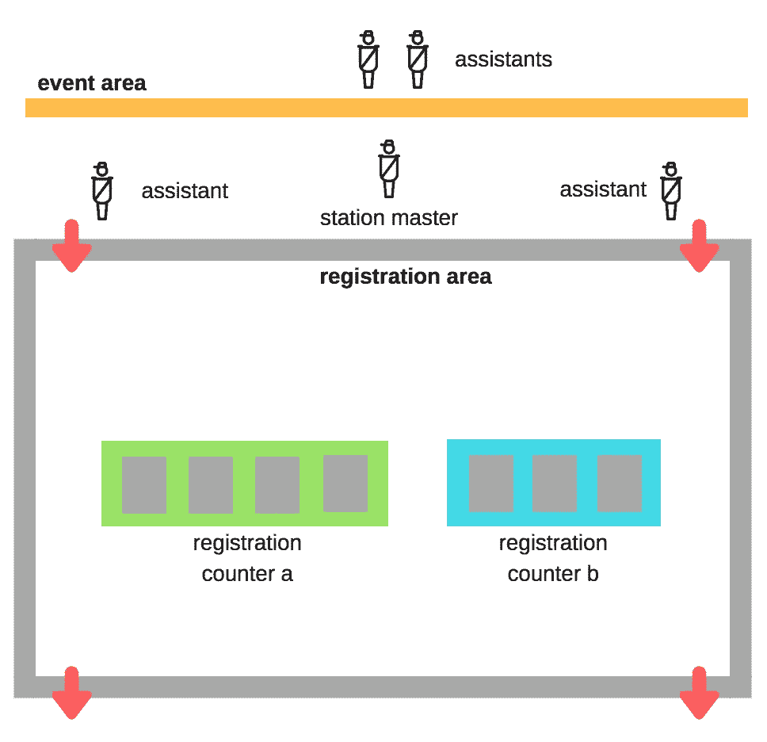

# 在 3 天内构建 PWA 会议管理应用程序[第 1/2 部分]

> 原文：<https://medium.com/google-developer-experts/building-a-pwa-conference-management-app-in-3-days-part-1-2-c08f269dc72c?source=collection_archive---------2----------------------->

这是一个期待已久的帖子😛！7 月 15 日(周日)，我们成功举办了一场大会 [Google I/O Extended KL 2018](https://events.gdgkl.org/io/) ，汇集了 400 多位本地开发者、3 个赛道和 18 位演讲人，共同了解最新的 Google 技术。该活动由 4 名核心成员在 50 名志愿者的帮助下策划和运作。

在这个系列中(这个系列只有 2 篇文章)，我将分享以下内容:

*   第 1 部分:我们如何计划和管理**实际的一天活动流程**——让你在进入应用程序之前了解事情是如何运作的(如果你是组织会议的新手，这可能会有帮助！)
*   [第二部分](/@jecelynyeen/building-a-pwa-conference-management-app-in-3-days-part-2-2-95f25b1cb20d):会议管理应用&如何使用 **Angular、Firebase、Google Sheets API 和 Chart.js 在 3 天内构建该应用，零成本运行**(感谢谷歌❤慷慨的免费配额！)

 [## 在 3 天内构建 PWA 会议管理应用程序[第 2/2 部分]

### 如果你想了解会议和活动管理流程的背景，请查看本的第一部分…

medium.com](/@jecelynyeen/building-a-pwa-conference-management-app-in-3-days-part-2-2-95f25b1cb20d) 

Bring together 400+ developers to the party!

4 个核心组织者的一些背景，我们每个人都有活动组织(聚会、研讨会)的经验，但我们没有人主持过这种规模的技术会议(400 对我们来说是一个很大的数字！).好吧，接受挑战，我们能做到！😎💪

the 4 core organizers , from the left— Shang Yi, me , Eric, Henry

顺便说一下，我们为我们的与会者准备了一个不同的 PWA 应用程序，它是由 [@limhenry](http://twitter.com/limhenry) 创建的，你可以在这里[阅读](/@limhenry/introducing-i-o-extended-2018-kuala-lumpur-progressive-web-app-7b5bb8a45fc5)，它是使用 [Preact](https://preactjs.com/) 创建的。

# 当天要管理什么？

在活动中，我们有 3 个主要的检查点:

*   **注册**(上午 8-9.30):注册过程中有两项任务——*验证用户 id* (身份证或护照)& *徽章发放。*
*   **礼品分发**(上午 8-9.30，下午 4-5 点):向与会者分发包、瓶子、t 恤等礼品(根据他们预先选择的尺寸)，确保每个人只领取一次。
*   **抽奖 dropbox** (下午 3-5 点):根据*贴纸数量*(通过参观合作伙伴展位收集 3 张)和*调查* *完成状态* (Google 表单)的抽奖资格，确保每个人只能参加一次抽奖。

此外，核心团队需要**跟踪每个检查点的实时状态**，监控&并在必要时调整资源。

# 我们如何快速处理检查站？

团队有时会花很多时间讨论如何加快上述检查点的速度。

以下是我们问自己的问题以及我们对每个问题的决定

## **如何处理报名流程&胸卡领取？**

主要讨论的是如何分割和管理注册队列。我们应该按照与会者姓名的第一个字母来排队吗？如果有 100 个人的名字以“A”开头，只有 2 个人的名字以“X”开头会怎样？

毕竟，我们决定为每位与会者预先分配一个 **4 位数的工卡 id** 。

徽章 id 的格式应该是这样的**XXX–X**(例如 123–4):

*   第一个数字表示门票类型(普通票、志愿者票、赞助商票、展览票等)
*   最后一个数字是验证票证的校验和

与会者必须在注册时提供以下信息:

*   身份证件上的全名(身份证、护照)
*   电子邮件
*   t 恤尺寸

注册后，他们将通过电子邮件收到他们的徽章 id。通过 [mailchimp](https://mailchimp.com/) 批量发送电子邮件。

example of email with badge id

通过这样做，与会者流量变得可预测。我们按照票的类型分割登记柜台，然后进一步分割成多行。

example of splitting registration counters and lines

我们还在活动前一天讨论是否允许领取徽章，答案是**不**，因为:

*   我们希望验证真正的与会者-没有代表出席(因为我们有一个很长的等候名单)
*   活动场地仅在当天开放，在其他地方设立接送站需要额外的批准和许可

## 需要多少志愿者来处理注册？

我们应该有多少条登记线？一名志愿者足够处理每条线路吗？一次注册需要多长时间？

与会者注册的最佳途径是:

*   与会者出示身份证件和徽章 id 电子邮件
*   志愿者验证姓名和身份证件的最后 4 位数字
*   志愿者从大量徽章中找到徽章
*   与会者离开队伍

可能会发生意外情况，其中:

*   与会者不知道他们的工卡 id(例如，错过了电子邮件)
*   与会者姓名、身份证件和徽章 id 不匹配
*   未找到与会者记录

此外，马来西亚参加活动的文化是“最后 10 分钟”🤷‍ 🤦‍，当[声明](https://events.gdgkl.org/io/schedule)主题演讲在上午 9 点开始时，与会者可能会在上午 8 点 50 分到达，如果处理不当，队列可能会在最后 10 分钟超载。上午 9 点以后，我们预计报名速度会变慢，报名队伍&志愿者的数量应该会减少&重新安排其他任务。

为了减少花在意外情况上的时间，我们处理上述情况的安排是:

*   活动开始前，向志愿者简要介绍**可接受/不可接受的误差**。例如，较小的姓名拼写错误、较小的身份 id 错误是可以接受的。
*   **登记柜台将只处理快乐之路**。在与会者排队登记之前，确保他们准备好所有必要的物品(胸卡 id、身份证明文件)。我们在该区域有志愿者(助理)帮助他们(例如，帮助他们搜索胸卡 id)。
*   所有剩余的意外情况都将交由“**站长**处理，我们预计这些情况很少(事实上，真的很少，不到 5 例)

注册线路肯定会运行得更顺畅，意外情况更少，但每个注册线路仍有相当多的任务要处理，我们如何才能加快速度？这是我们的解决方案:

*   每条线处理大约 50 个登记(总共 7 条线)
*   所有徽章按顺序排列，这样我们可以更快地找到徽章
*   每条线路将由两名志愿者在高峰时段(上午 8-9 点)处理，一名志愿者验证参加者身份，一名志愿者寻找徽章
*   高峰时间过后，线路将减少到 4 条。每条线路仅由一名志愿者负责。(事实上，我们在上午 9 点后减少到只有 2 行)

registration area and volunteers arrangement

## 徽章上应该印什么？

讨论主要围绕如何打印胸卡 id？我们缩小到 3 个选项:

*   NFC 卡:最简单的扫描和登记方式，但我们放弃了这个选项，因为 NFC 卡超出了我们的预算。
*   二维码:可扫描，替代 NFC，但我们也放弃了这个选项，因为我们认为我们不需要它。
*   4 位数 ID:简单，易于查看和识别，我们选择这个

我们还在徽章上印上了**的全名、t 恤尺寸和票种**。我们也使用不同的背景颜色来描述票种，因为:

*   带黄色标签的志愿者——当参与者需要帮助时，轻松识别他们
*   带橙色标签的参展商——参展商通行证不允许进入活动大厅参加讲座

example of badge

## 我们应该在注册时分发糖果吗？

通过这样做，我们可以减少一个检查站和志愿者的数量。然而，我们**决定拆分**它，因为:

*   我们允许与会者挑选礼品(例如挑选最喜欢的瓶子颜色)，我们有不同的 t 恤尺寸，这些活动肯定会减慢注册速度
*   注册是至关重要的，放慢注册意味着会议主题可能会延迟。

然后，我们决定在一个有两个队列的房间里分发糖果，队列按衬衫尺寸划分。糖果大厅前有一个检查站，志愿者需要确保每个参与者只能进入大厅一次。

goodies distribution hall

## 我们如何确保与会者在整个活动期间留下来？

好的会议无疑是人们留下来参加活动的主要原因。然而，除了好的会议，我们也希望与会者感到兴奋。我们有 6 个合作伙伴展位(更多商品！)，我们希望鼓励与会者参观展位。

除此之外，我们还想收集与会者的反馈。反馈对于我们更好地组织下一次活动非常重要。

通过结合这四个目标:

*   确保与会者呆到活动结束
*   鼓励与会者参观合作伙伴展位
*   收集与会者的反馈
*   让活动变得激动人心

我们想出了一个解决方案——**抽奖*** ！

在幸运抽奖后认识*符号吗？这意味着条款和条件适用，哈哈😆。

每位赞助商将获得他们公司的徽标贴纸，并分发给展位参观者。

我们设置了两个非常简单的抽奖规则。要获得幸运抽奖资格，参加者需要完成以下任务

*   从赞助商展位收集 3 种不同的贴纸
*   下午 3 点完成调查/反馈谷歌表格
*   志愿者验证后，将抽奖选票放入抽奖台

sample of lucky draw ballot

以下是幸运抽奖关卡的排列方式:

lucky draw checkpoint — ballot verified & dropped by volunteers

# 下一个

现在，您可以看到我们是如何规划每个检查点和事件流的。你可能会看到构建一个应用程序可以进一步简化流程。接下来，让我们看看我们如何构建应用程序来帮助管理活动&获得我们想要的东西。

 [## 在 3 天内构建 PWA 会议管理应用程序[第 2/2 部分]

### 如果你想了解会议和活动管理流程的背景，请查看本的第一部分…

medium.com](/@jecelynyeen/building-a-pwa-conference-management-app-in-3-days-part-2-2-95f25b1cb20d)