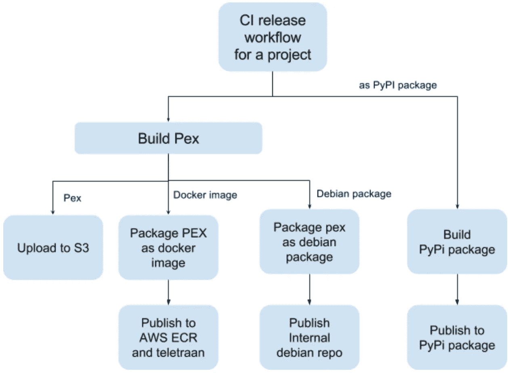

# 为快速、可靠的开发构建 Python monorepo

> 原文：<https://medium.com/pinterest-engineering/building-a-python-monorepo-for-fast-reliable-development-be763781f67?source=collection_archive---------0----------------------->

苏曼·卡鲁穆里| Pinterest 技术主管，可视性&露丝·王君馨| Pinterest 工程师，核心网站可靠性

每月有超过 2 亿人在 Pinterest 上发现并做他们喜欢的事情。我们依靠数百种 Python 服务和工具来增强这些体验。这些服务的代码存在于 100 多个 Git 存储库中(除了我们的 Python 前端 monolith)。随着时间的推移，我们发现在越来越多的回购上开发 Python 应用程序会引起摩擦，并减慢我们开发人员的速度。我们构建 Python commons 是为了给我们的 Python 开发者提供无缝体验。在本帖中，我们将分享我们在大规模管理 Python 代码时遇到的一些挑战，以及 Python commons 如何提供快速可靠的代码开发环境。

# 大规模管理 Python 代码的挑战

虽然 Python 工具非常适合管理单个回购中的代码，但这些工具并不是为管理跨回购的代码而设计的。即使在单个 repo 中，也有一个陡峭的学习曲线来正确设置和使用工具和实用程序，如 requirements、setup.py 和 tox，以实现可重现的构建和测试环境。考虑到所涉及的复杂性，很少有开发人员会花时间去做正确的事情。下面，我们将解释我们的开发人员在 100 多个回购中构建、测试和部署 Python 代码时面临的一些问题。

**管理虚拟环境:**每个 Python 项目都有自己的 [virtualenv](https://virtualenv.pypa.io/en/stable/) ，开发者在项目和分支工作时需要注意使用正确的 virtualenv。使用错误的虚拟会导致开发、构建和部署过程中难以跟踪的错误。

**使用 tox 运行单元测试:**为了测试的完整性，开发人员被建议使用 tox 在 virtualenv 中运行他们的测试。鉴于管理虚拟 env 和正确设置 tox 的复杂性，实践中很少有项目这样做。(有些开发人员完全跳过编写单元测试。)

**包固定:**如果包没有固定到特定的版本，当它们的依赖关系升级时，它们可能会在生产中中断。即使每个 repo 都固定了其包的版本，跨 repo 重用代码也会导致包版本冲突，并在部署期间破坏包。

**部署安全修复:**升级软件包来修复数百个回购中的安全问题是一个艰难、枯燥和乏味的过程。

**Pip 安装:**我们大部分开发者都是用`*pip install*` *部署 Python 包的。*在实践中，我们发现 pip 安装不是一个健壮的部署机制，原因如下:

*   Pip 安装不是原子的。失败的 pip 安装可能会使一些软件包升级，而另一些软件包是旧版本。这偶尔会导致部署中断。
*   Pip 可能会在生产机器上无声地失败，从而导致生产中断。
*   小版本变更时，Pip 的命令行选项不一致，这可能导致 pip 随着新的操作系统版本一起升级时 pip 安装失败。
*   Pip 递归下载每个依赖项。虽然这在小范围内是无害的，但是每天在数万台机器上多次这样做是低效的。
*   Pip 安装对于部署内部工具并不理想，因为不一致的开发环境变得难以支持。大多数工具都带有定制脚本，用于设置虚拟 env 并在那里部署工具。虽然这样做可行，但这是一个乏味且容易出错的过程。

**一致的开发环境:**由于开发人员建立了他们自己的回购协议，随着时间的推移，开发、构建、测试和部署设置几乎没有一致性。几个项目没有为他们的构建过程建立持续的集成，而编码约定和质量在不同的 repos 之间变化。即使是小问题，如未能正确命名一个包，也会在代码被重用时导致命名空间崩溃问题，从而导致复杂的解决方法。这种额外的复杂性阻碍了代码在 repos 中的重用。

我们的结论是，标准 Python 工具链需要大量前期工作，以便在单个 repo 中创建一致且可重复的构建环境。即使我们小心地设置了工具，标准工具也不能确保跨 repos 的一致构建和部署管道。

# Python commons

当我们设计新的解决方案时，我们有一个主要目标——我们希望在让开发人员快速发布代码的同时，能够轻松地做正确的事情。因此，我们使用 Pants 构建工具构建了一个名为 Python Commons 的 monorepo。为了简化我们的发布过程，我们使用一个 [Python 可执行(PEX)](https://www.pantsbuild.org/pex_design.html) 文件作为我们的发布原语。

# Python commons monorepo

第一个决定是开始对我们工具的所有代码使用 monorepo。这为所有代码提供了一个单一的位置，并允许我们在多回购解决方案上实施健康的开发实践。一致的开发、构建和测试环境也鼓励模块化代码和代码重用。monorepo 对我们来说是更自然的工作流，因为我们有几个特定于语言的 mono repo，并且几个工具共享同一个 repo 是很常见的。

由于我们的前端应用程序代码已经有了一个 Python monorepo，我们的第一反应是将工具的代码移到这个 repo 中，为所有 Python 代码创建一个单一的 repo。然而，这并不奏效，因为开发工作流是为构建我们的整体 Python web 前端而大量定制的。因此，我们决定为我们的工具和服务构建一个名为“Python commons”的独立 monorepo。

# 裤子

虽然决定 monorepo 很容易，但困难的部分是建立一个适合广泛 Python 应用程序的开发工作流，从 web 应用程序到服务、库和命令行工具。为了使管理和使用 monorepo 更容易，我们使用 [Pants](https://www.pantsbuild.org/) 作为我们的构建工具。Pants 有助于在保持我们的配置[干燥](https://en.wikipedia.org/wiki/Don%27t_repeat_yourself)的同时，强制执行构建、测试和打包应用程序的统一开发工作流程。

Figure 2: A snippet of our Python requirements file that lists external dependencies. The versions of packages are pinned for the entire repo, and the package versions are conflict-free, so all code in the repo can be reused.

Figure 3: Each project in our repo contains its own folder. Each folder has a BUILD file, which lists the internal and external dependencies for the projects. In the BUILD file above, _bot target depends on argparse project. The srebot binary depends on _bot target.

Figure 4: A user can run predefined Pants goals on the targets.

我们在回购中使用的代码布局为回购中的每个项目提供了一致的开发工作流。

*   图 1 所示的文件夹结构确保源代码和测试是分离的，所有内部代码都在 Pinterest 名称空间中。这种分离保护了我们免于将测试或它们的依赖项发布到产品中。
*   Pants 附带了一个内置的 Python linter，用于强制执行回购的代码样式。
*   标准构建目标为构建、测试、运行和发布包提供了直观和一致的开发工作流(如图 4 所示)。
*   pants repl 选项提供了一个交互式 repl 来处理代码。
*   Pants 基于构建文件中的依赖项为每次运行创建一个 virtualenv。如果 Git 分支之间的依赖关系发生变化，开发人员不必切换 virtual env 来确保他们的代码正确工作，从而实现无缝的虚拟环境管理。
*   由于测试是在虚拟环境中运行的，开发人员不必学习或使用 tox。
*   Pants 测试目标会自动创建一个测试运行程序，因此不需要单独的脚本来运行测试。

Pants 使用 repo 和版本锁定简化了跨项目的依赖管理。

*   Pants 控制我们从哪个外部仓库下载包。当我们对 PyPi repo 的访问被阻塞时，我们通过对 pants.ini 文件的一行配置更改将 repo 指向一个内部镜像。
*   我们对整个 repo 使用相同的固定依赖集(如图 2 所示)。这是 repo 中定义我们的外部依赖关系并简化我们的依赖关系管理的唯一地方。Pants 为每个构建构建了一个虚拟环境，所以任何依赖冲突都会被立即检测出来。
*   固定依赖项的单一位置允许我们一次升级 repo 中所有项目的包。这大大简化了安全审计和包版本升级。

通过支持快速可复制的构建，Pants 简化了构建和发布管理。

*   构建文件中的 Pants run target 可以用来在本地运行程序，不需要脚本。
*   Pants 为我们的包提供了快速、可重复的构建。Pants 在它的目标上执行增量构建，所以只有改变的模块被重建，这加快了构建过程。在虚拟 envs 中运行所有构建目标确保构建是可重复的。
*   Pants python_library 目标可以包含一个 setup.py 定义(如图 3 所示)。通过使用这个目标，开发者不必学习 setup.py 就可以发布 Python 彩蛋。
*   Pants 二进制目标为项目生成一个独立的 pex 二进制文件。

# 最大运动量

monorepo with pants 简化了我们的开发和测试过程。我们观察到我们的开发人员更喜欢他们自己的 repos，因为这让他们能够控制他们的代码作为 Debian 包、Docker 容器、Python egg 或脚本的分发。为了迎合这些用例并简化我们的包发布和部署过程，我们需要一种机制来轻松地将包导出为各种格式。导出一个鸡蛋很容易，因为 Pants 本身就支持它。为了将我们的代码打包成其他格式，我们使用 [PEX](https://www.pantsbuild.org/pex_design.html) 作为我们代码的基本打包原语。PEX 是一种自包含的、跨平台的 Python 可执行格式，带有打包的依赖项，因此它只需要运行它的机器上有一个 Python 解释器。一个 PEX 可以打包到 Debian 包、Docker 容器或者上传到 S3。最后一个部署选项非常适合内部工具，因为内部工具最难部署和管理。

我们的多格式包发布过程由 Jenkins 脚本提供支持(如图 5 所示)。它使用项目名称和发布类型来生成必要的文件(Dockerfile、Debian package、Python egg、PEX 二进制文件),并通过将它们上传到各自的 repos 来使构建可用于部署。发布过程不仅减轻了我们的开发人员对 Docker、Debian 包管理或 Python egg 格式的理解，而且还实施了最佳卫生和安全的包管理实践。

Figure 5: Jenkins release workflow takes the package name and release type as input and generates a Docker container, Debian package, a Pypi package or a PEX binary.

# 结论

使用这种开发设置，我们可以在开发项目之前处理开发人员编写的所有样板代码。这有助于我们的开发人员专注于代码，而不必担心 setup.py、tox、virtualenv。它还消除了创建脚本来本地设置和运行项目、创建脚本来发布 Docker 或 Debian 包或者创建脚本来本地或在 Jenkins 中测试代码的需要。大约一年前，我们推出了 Python commons，并且已经将 35 个项目移植到它上面。

**鸣谢**:感谢、徐永文和 Nick Zheng 对项目的帮助和反馈。我们还要感谢[裤子社区](https://www.pantsbuild.org/howto_contribute.html)的支持。

