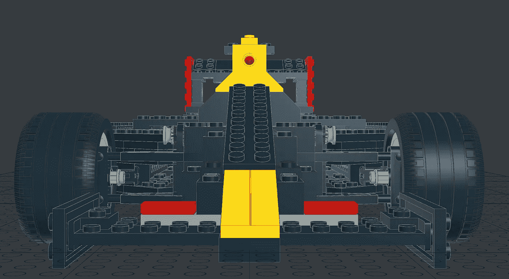
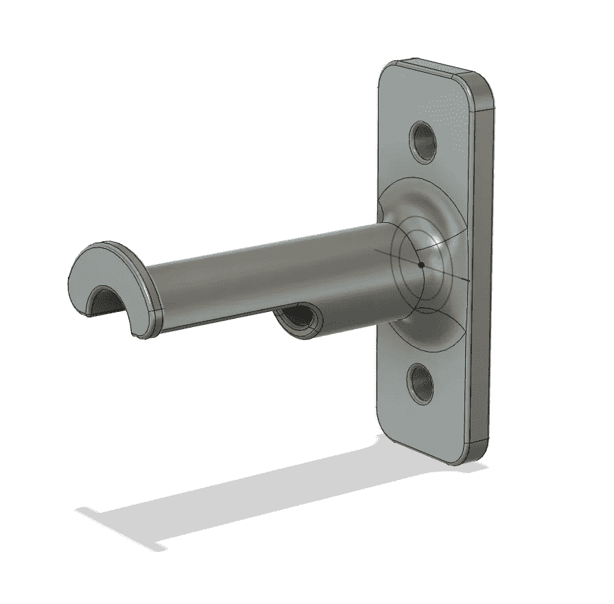

# 用玩具制作赛车框架

> 原文：<https://medium.com/oracledevs/building-a-race-car-frame-out-of-a-toy-c7bec93e53b3?source=collection_archive---------0----------------------->

克里斯·本森

CAD Model of Eff-Uno Racer

注意:如果你想在 GitHub 的 markdown 上阅读这篇文章，请点击 [**这里**](https://github.com/chrisbensen/chris-blogs/blob/main/π-racer/season1/episode3/episode3.md) 。

在我的前两集(本文底部的链接)中，我为 Raspberry Pi 和 Arduino 构建了一个定制的试验板设置。虽然它可以用于任何项目，但我 3D 打印了一个砖块垫，并通过一个非常具体的项目连接了 RC 伺服和 DC 无刷电机:我正在建造一辆赛车！

我很抱歉没有站出来说我在构建什么，而是以某种挑逗性的点击诱饵的方式来展示它。我只是还没准备好揭露它，我的管理层希望我带你们一起经历这个过程，而不是仅仅在一个壁橱里工作 6 个月，最后大揭露。但是现在我们正处于这个过程的关键时刻，是时候透露更多了。就当是把你们都卷进来了。

我正在建造一辆云连接的乐高开放式车轮赛车。那是一口。我把它叫做 **#CloudCar** ，但是听起来太像*小丑车*。我不能合法地说出其中的一些词，比如 eff-uno，所以姑且称之为 **Eff-Uno Racer** ，或者 **FUR** 。而且因为所有东西都需要有版本号，所以姑且称之为 **FUR1** 。请注意，我必须添加“R”以避免名称听起来淫秽。

当我重读最后一段时，我意识到“也许我正在建造一辆小丑车。”嗯，至少它应该是一个令人兴奋的！

我把我的项目建立在乐高 8440 工具箱的基础上，因为它已经存在，零件清单也很容易得到。你会看到很多相似之处。对于乐高建造者来说，有些令人惊讶的事情可能不是每个人都知道的，比如开源的乐高 CAD 工具，叫做 [Bricksmith](https://bricksmith.sourceforge.io) 、 [LDView](https://tcobbs.github.io/ldview/) 和 [LEO CAD](https://www.leocad.org) 。Bricksmith 在最新版本的 macOS 上有一些问题，所以我目前主要使用 LEO CAD。我也在使用 Fusion 360--尽管并不完全满意--来创建我自己的定制部件，以连接 RC 部件和乐高。

## 这个项目的主要部分

1.  乐高框架+用于 RC 零件的定制 3D 打印适配器
2.  电子设备——Raspberry Pi 4、Arduino、Pi 相机、RC 伺服电机和无刷 DC 电机+ ESC(还会有更多，但这已经足够了)
3.  Pi 软件—运行 Oracle Linux、GraalVM 和 Java
4.  云软件—使用[甲骨文云](https://www.oracle.com/cloud/free/?source=:ex:tb:::::&SC=:ex:tb:::::&pcode=WWMK210625P00074)
5.  客户端软件— TBD

汽车是第一个障碍，也可以说是最重要的，因为它是这个系列的主角。如果没有车，没有人会看云开着车到处跑。首先，我要造一辆车。一辆非常非常酷的车。一辆真正的好车。不是一个被黑在一起的破车。这是一辆快速赛车！我在造一辆你们任何人都可以自己造的车，尽可能便宜，有简单易懂的说明。这不是一个简单的壮举。有一些挑战是我没有预见到的，比如定制油漆工作和厕所里的全球供应链。这很难，但我准备接受挑战。这是一个挑战！

我们几乎没有讨论过软件。这里有很多，敬请关注！

## 状态

到目前为止，1 号项目进展顺利。#2 即将到来。我正在构建一个定制的 PCB，希望在一两个月内分享更多相关内容。#3 和#4 已经有了原型，但是还需要更多的工作。在这里完成更多的工作之前，我需要把一辆可以工作的车交到其他工程师的手中。一个人做这样的事情有什么意思？我喜欢合作。如果你有想法或者想做点什么，给我写信吧！

随着项目的进展，我必须务实，创造一些可以节省时间的东西。现在花费的时间和以后花费的时间之间总是有一个权衡。例如，在本周的视频中，我收到了一些 Protopasta 细丝，它们有着惊人的纸板线轴支架，但它们的尺寸与我的 Ultimaker 打印机接受的尺寸略有不同。所以我创建了一个线轴架。[下载](https://www.thingiverse.com/thing:4942247)并打印线轴支架或编辑 3D 模型。

Protopasta Spool Holder

## 从这里去哪里

FUR1 将尽可能多地使用乐高，这样你就可以简单地使用你现有的盒子，里面放着你喜欢的砖块，或者购买你需要的特定砖块。将只制造几个用于 RC 部件和电子设备的接口部件。你可以制定自己的计划。所有 3D 模型将在 [Thingiverse](https://www.thingiverse.com/thing:4940804) 上提供，源代码将在 [GitHub](https://github.com/oracle-devrel/eff-uno-racer) 上提供，你可以在我的[媒体博客](https://chrisbensen.medium.com/)或[个人博客](https://chrisbensen.blogsot.com)、 [YouTube](https://www.youtube.com/c/ChrisBensen) 、[甲骨文开发者网站](http://developer.oracle.com?source=:ex:tb:::::&SC=:ex:tb:::::&pcode=WWMK210625P00074)、[甲骨文开发者 YouTube 频道](https://www.youtube.com/channel/UCdDhYMT2USoLdh4SZIsu_1g)和 [Twitter](https://twitter.com/chrisbensen) 上关注。

## 问/答

问:FUR1 暗示将会有 FUR2？

答:是的！甚至可能是 FUR3。它也将分叉为 FUR1b，可能比乐高©有更多的 RC，因为我们做了测试，发现它在快速驾驶时过早解体！

问:谁在赞助这个了不起的项目？

我很高兴你问了。甲骨文开发者关系赞助了这个项目，因为甲骨文有一些令人惊叹的技术。他们不仅拥有世界上最强大的操作系统和第一的编程语言(是的，你听到了，Java rocks)，以及用 GraalVM 实现的最快的 JVM，他们还有一个真正可靠的云解决方案[作为这个项目的支柱。](https://www.oracle.com/cloud/free/?source=:ex:tb:::::&SC=:ex:tb:::::&pcode=WWMK210625P00074)

问:我不认为你能完成如此疯狂的项目。

答:我还做过其他更疯狂的作品。我建造了[世界上最大的树莓派集群](https://www.youtube.com/watch?v=KbVcRQQ9PNw)(据我们所知)和[世界上最大的乐高电脑](https://www.youtube.com/watch?v=Y5m0R9tTdR0)。所有这些都运行 Raspberry Pi、Oracle Linux、GraalVM 和 Java。

问:我什么时候能看到这个项目的更多内容？

答:推特[https://twitter.com/chrisbensen](https://twitter.com/chrisbensen)目前更新最多。还有一个 YouTube playist 为 [DevRebel 酷项目](https://www.youtube.com/playlist?list=PLPIzp-E1msrZ0WAvm20TkXtm7Hm5JnHxc)服务。

— -

第 1 集—定制树莓 Pi Zero 试验板:

-短:【https://youtu.be/-BF6zZbBVFA
-长:[https://youtu.be/GUiLuG1Drjg](https://youtu.be/GUiLuG1Drjg)
-事:[https://www.thingiverse.com/thing:4868187](https://www.thingiverse.com/thing:4868187)
-博客:[https://chrisbensen . medium . com/starting-a-new-project-pi-zero-custom-bread board-834 df 6414 AC 6](https://chrisbensen.medium.com/starting-a-new-project-pi-zero-custom-breadboard-834df6414ac6)

第 2 集— Pi 控制电机:

-简称:[https://youtu.be/9aLBQ6m8_kI](https://youtu.be/9aLBQ6m8_kI)
-引申:[https://www.youtube.com/watch?v=0F65hw3ntPk](https://www.youtube.com/watch?v=0F65hw3ntPk)
-Oracle devs 博客:[https://medium . com/Oracle devs/pi-controlled-motors-b 5 cf 81 ea 42 f](/oracledevs/pi-controlled-motors-b5cf81eea42f)
-博客:[https://chrisbensen . medium . com/pi-controlled-motors-b 5 cf 81 ea 42 f](https://chrisbensen.medium.com/pi-controlled-motors-b5cf81eea42f)