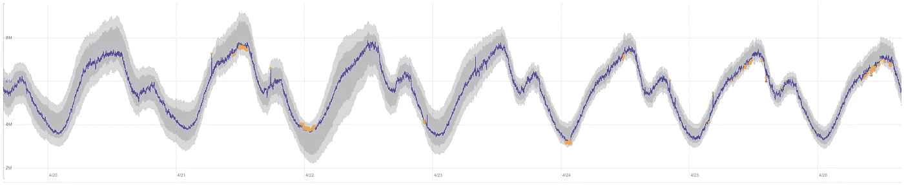
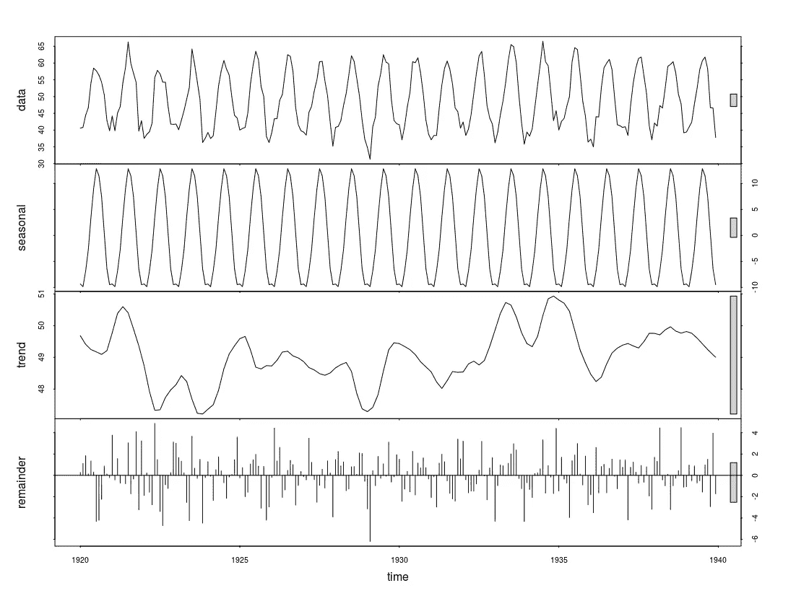
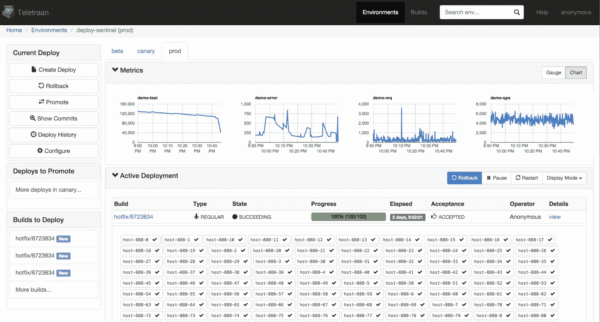
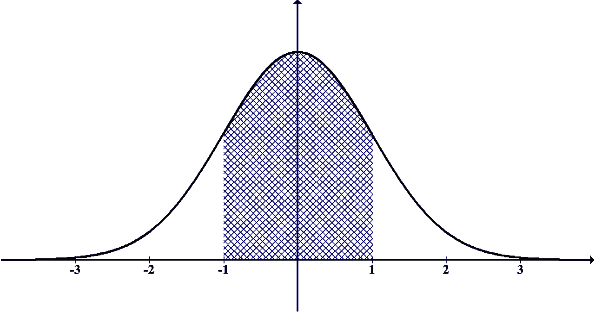
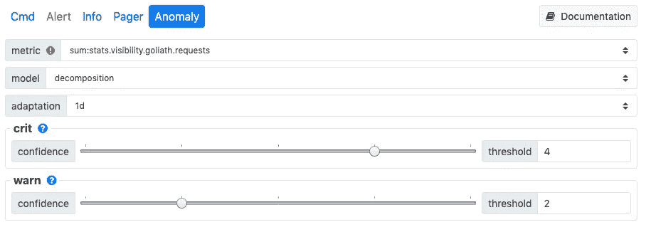
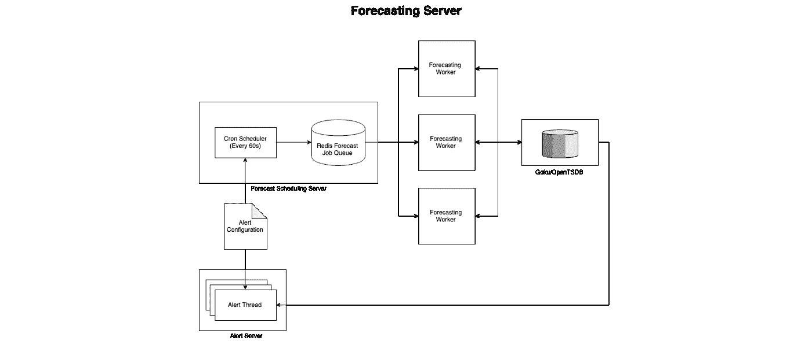

# 在 Pinterest 上构建时间序列实时异常检测系统

> 原文：<https://medium.com/pinterest-engineering/building-a-real-time-anomaly-detection-system-for-time-series-at-pinterest-a833e6856ddd?source=collection_archive---------0----------------------->

凯文·陈|软件工程师实习生，可见度
布莱恩·奥弗斯特里特|软件工程师，可见度

在本帖中，我们将分享我们开发的算法和基础设施，以便为 Pinterest 的关键运营时间序列指标构建一个实时、可扩展的异常检测系统。请继续阅读，了解我们的经验、教训和未来计划。

**背景**

Pinterest 使用一个名为 Statsboard 的内部指标和仪表板系统，允许团队实时了解他们的服务状态。使用 Statsboard，工程师可以使用一种语言来创建警报，这种语言将常见的时间序列操作包装到一个简单的界面中。这些警报包括:

*   **静态阈值:**当系统或服务达到一定水平(例如，95%的 CPU 使用率)时，向用户发出警告的阈值，这表明出现了某种故障。
*   **周与周之间的差异:**季节性警报，表示当前时间的数据点比前一周低一定比例(例如，低 10%)。

然而，Pinterest 的许多顶线增长和流量指标(例如:网站请求、用户登录)显示出动态模式，这使得很难设置基于规则的警报。如果没有能够构建模型来处理这些动态指标的异常检测系统，用户将面临三种不良警报情况:

*   **时间不变性:**静态阈值警报说明了一天中季节性指标(例如 web 流量)的下降，将在晚上导致假阳性，此时这些指标会自然减少。为了捕捉随时间变化的度量生成过程的行为，我们的警报必须以时间为参数。
*   **规则边缘案例:**假设我们创建一个静态阈值，只显示上午 8 点到晚上 8 点的页面。如果事件发生在晚上 8:01，则不会发生寻呼。基于规则的系统中的边缘情况会导致盲点和额外的复杂性。
*   **将异常解释为正常:**如果我们在周三遇到导致站点范围指标下降的事件，我们会在接下来的周三收到一系列周环比上升的警报。我们必须注意不要把异常行为当成正常行为，否则当我们恢复正常时，就会收到错误的警报。

**异常检测的场景**

世界上有大量关于异常检测的文献——从像 Twitter 的[异常检测](https://github.com/twitter/AnomalyDetection?source=post_page---------------------------)或 Linkedin 的[鲁米诺](https://github.com/linkedin/luminol/?source=post_page---------------------------)这样的开源包，到像 Rob Hyndman 关于[基于特征的异常检测](https://robjhyndman.com/publications/oddstream/?source=post_page---------------------------)的论文这样的学术著作。我们可以将这些时间序列异常检测技术中最流行的分为四大类(既不相互排斥也不包罗万象):

1.  **状态空间模型**:指数平滑，霍尔特-温特斯，ARIMA
2.  **分解**:经典分解，STL
3.  **深度学习**:递归神经网络
4.  **降维:** RPCA，SOM，discords，分段线性

在实践中，我们观察到了使用**分解模型**的最佳性能。许多机器学习模型在异常检测方面表现不佳，因为它们倾向于过度拟合训练数据。对于异常检测，我们需要能够区分和提取甚至是我们以前没有见过的异常。分解模型通过从时间序列中明确移除相关成分(季节性、趋势)在这项任务中表现良好，这使我们有机会在保留异常的原始属性的同时，对残差应用高斯假设的统计测试。

Seasonal trend decomposition on the ‘nottem’ dataset

**异常检测对可观测性的要求**

为了构建一个具有可观测性的异常检测系统，我们必须牢记许多要求:

*   **最大限度地减少误报:**误报导致工程师困倦和愤怒，使他们对警报不敏感，导致性能下降，并可能错过未来的事件。为了避免这种情况，我们只对最严重的异常发出警报，并允许用户在需要额外细节时定制警报规则。
*   **几分钟内发出警报:**当事故发生时，应尽快通知待命工程师，以将影响降至最低。我们实时处理每个传入的数据点，并在一分钟内确定它是否是异常。
*   **扩展到数百万个时间序列:**我们的可观测系统每秒处理数亿个时间序列流数据点。与大多数机器学习方法相比，分解算法已经很有效了，但是我们做了一些改变来增加额外的性能。我们还使用 [Teletraan](/@Pinterest_Engineering/open-sourcing-teletraan-a-code-deployment-system-198372cb6dd6?source=post_page---------------------------) 自动调整我们的预测人员，以应对不断增长的需求。

Teletraan, our in-house deploy system

*   **对异常保持稳健:**当异常发生时，我们的系统不应该将这些数据点合并到我们对正常行为的估计中。我们使用稳健的统计数据和长历史数据窗口(长达三周)来避免这种情况。
*   **对缺失数据保持稳健:**有时，指标可能会有缺失的数据点。最常见的分解实现( [R 的 STL](https://www.rdocumentation.org/packages/stats/versions/3.5.3/topics/stl?source=post_page---------------------------) )不支持丢失值，所以我们必须注意在我们的分解方法中允许这种类型的间隙。
*   **考虑可操作性:**有些异常比其他异常重要得多，也更易操作。我们的用户设置规则有助于从噪音中过滤出可操作的异常。

接下来，我们将深入探讨我们在实时部署模型时所面临的挑战。

**我们如何实时更新我们的模型？**

许多关于异常检测的文献涉及在静态数据集中发现*回溯*异常，即使用非线性优化程序(如 LBFGS 或 Nelder-Mead)拟合模型，然后在训练集中识别异常。

然而，如果我们想在*实时*中发现异常，训练一次是不够的——我们必须不断更新我们的模型，以适应我们指标的最新行为。因此，我们必须采取四种方法之一*随着时间的推移更新我们的模型参数*。

1.  **强力更新:**最简单的解决方案是每当新的数据点到达时，简单地在最近的数据窗口上重新计算我们的参数。然而，如果将模型拟合到窗口在计算上太复杂，这可能是不可行的。
2.  **计划更新:**我们可以缓存给定时间段(比如 24 小时)的模型参数，并在每个时间段结束时重新训练新的数据点。但是，如果我们的指标在计划更新之前发生变化，就会出现过多的误报警报。
3.  **事件驱动更新:**如果检测到最近一组数据点的高预测误差，我们可以利用这个机会重新计算我们的模型参数。事件驱动的更新是不可预测的，这可能会导致未来的运营挑战。
4.  **在线更新:**对于一些算法，也可以重新制定它们，以便在在线设置下工作:不断读入新的数据点，并利用每个数据点有效地更新参数。

在我们的案例中，我们发现调试调度或事件驱动系统的操作开销超过了它们的好处。相反，只要有可能，我们就使用在线更新，否则就使用暴力更新。为了将我们的算法重铸到在线设置中，我们使用在线梯度下降作为优化器。

Visualization of gradient descent on a loss surface

**季节性和趋势估计**

目前最常用的分解形式称为 STL，它利用了一种称为黄土的回归过程，这种过程反复地将低次多项式拟合到数据的子集。不幸的是，这个过程对于实时分析是不可扩展的。

代替用迭代黄土估算季节性，我们使用一个简单的有效季节性估算技术的集合(例如傅立叶，历史取样)。我们还用健壮的统计量替换 STL 的趋势分量，即中值，灵感来自 Twitter 的 S-H-ESD 异常检测算法。

**预测区间**

The 68–95–99.7 rule gives a shorthand for the percentage of values around the mean in a normal distribution

一旦我们有了我们的预测，我们就可以使用预测区间来确定一个数据点是否是一个异常，基于它与我们预测的距离。要做到这一点，我们可以利用三西格马规则，该规则规定正态分布中 99.73%的值位于平均值的三个标准偏差之内。如果输入的数据点超过我们预测的残差的三个标准偏差，我们可以合理地将该点归类为异常。

如果残差数据是非正常的(例如，当时间序列包含异常时)，我们可以使用幂变换来尝试恢复正常的数据集。但是，如果这些转换不起作用，我们仍然可以求助于其他措施——比如从以前的误差中取样——来获得不确定性的估计。

一旦我们生成了这些间隔，我们就可以将它们转换成 UI 端的可视带，以便于最终用户进行解释和调整。

Statsboard’s anomaly detection menu UI

现在，让我们来看看支持这些算法的基础设施。

**异常检测架构**

我们有一个预测服务器，负责为 Statsboard 指标实时构建一步到位的预测，并将它们保存到我们的时间序列数据库(TSDB)中。

High level overview of forecasting server design

预测服务器由一组自动缩放工作线程和一个具有作业队列的服务器以及一个每分钟提交一次预测作业的调度程序组成。对于批处理作业，我们预先合并重叠的数据窗口请求，以最大限度地减少网络和 I/O。我们与现有的 Statsboard UI 和警报基础架构相集成，以提供异常检测构建器、警报和仪表板。

**总结**

异常检测在获得指标可见性方面发挥着重要作用，这些指标表现出传统警报无法模拟的复杂模式。未发现的异常会显示在实时仪表盘中，并在出现问题时提醒相关用户。

通过使用健壮、可扩展和可解释的算法，我们的异常检测系统帮助工程师识别事件并在事件发生时做出反应，从而最大限度地减少对 Pinterest 业务和我们 Pinners 的影响。

**致谢**

*戴阮为这个项目建立了用户界面。特别感谢可视性团队的 Naoman Abbas、Humsheen Geo、Colin Probasco 和朱未以及交通团队的 Yegor Gorshkov 提供设计建议和审核。*