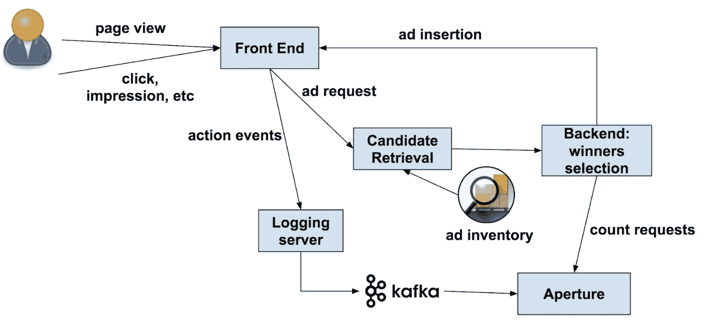
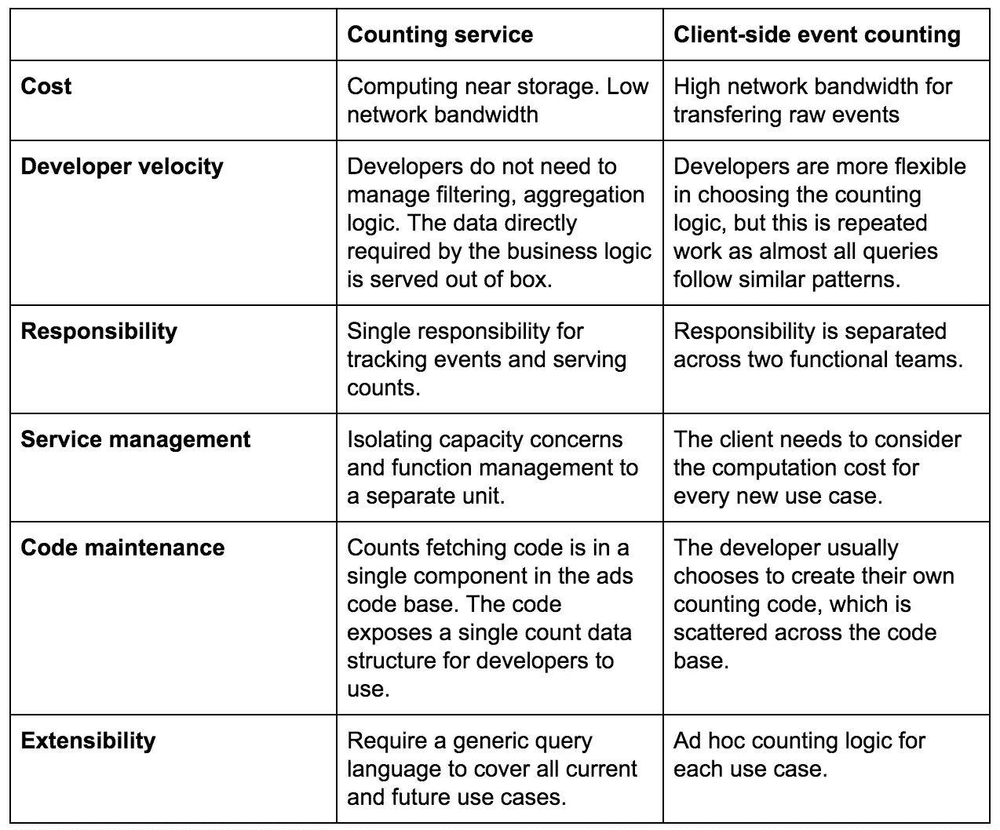
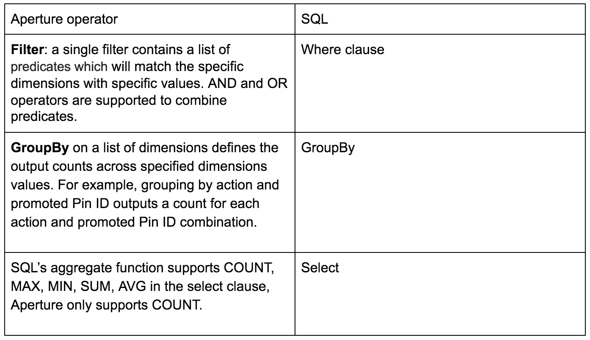

# 为广告构建实时用户行为统计系统

> 原文：<https://medium.com/pinterest-engineering/building-a-real-time-user-action-counting-system-for-ads-88a60d9c9a?source=collection_archive---------1----------------------->

Del Bao，软件工程师，Ads 基础架构
韩和，软件工程师，服务系统

Pinterest 广告团队的使命是为 Pinners 和广告商提供最佳体验。我们的广告系统是一个实时竞价系统，根据各种属性提供有针对性的广告。一个主要的行为属性是用户行为计数，即 Pinner 过去的点击、印象和其他广告行为的计数。用户行为计数的一个重要部分是频率控制，它设置了广告向 Pinner 显示的最大次数(一段时间内的印象计数强制执行该限制)。

因为我们的系统是实时的，我们必须根据请求立即提供用户动作计数。这就是我们建立 Aperture 的原因，Aperture 是一种内部数据存储和在线事件跟踪服务，可以满足 ads 用户行为计数的要求。在本帖中，我们将解释 Aperture 和我们的中央服务的基本原理。

# 用户动作计数问题

## 用例

**频率控制** 频率控制管理广告向 Pinners 的投放。通过控制频率，广告商既可以防止相同广告的过度曝光，也可以提升品牌知名度(即品牌在客户或观众中的认知度的提高)。这个用例需要实时地在不同的时间范围内对促销广告进行多次用户印象计数。

广告的频率被定义为在给定的时间段内广告被浏览的次数。行动是印象，时间窗口可以是一天、七天、三十天。

**疲劳模型** 疲劳发生在一个人厌倦了看同一个广告的时候。这通常会对 CTR(点击率)产生负面影响。我们的 ads 系统有一个 pCTR(预测 CTR)疲劳模型的培训管道。在请求时，为用户疲劳模型提取几个用户计数特征。一个品酒师的疲劳程度是在不同的活动水平上衡量的。我们的活动结构有四个层次:

1.  广告商:账户
2.  活动:广告组的房子
3.  广告组:提升的 pin 的容器
4.  促销大头针:广告

所需的动作是展示和点击。首先，我们的广告服务系统获取一个 Pinner 在一个时间范围内的过去参与计数，用于四个活动级别的广告候选人列表。然后，计数特征被馈送到疲劳模型用于 CTR 预测。

# 查询模式

我们将这些用例中的查询模式概括为在几个维度上查询计数。每个维度都有有限和离散的值。每个计数都基于维度值的每个可能组合。一个查询示例是:

```
What is the Pinner’s impression count of promoted Pins 1,2,3 for the last week?
```

在本例中，活动(印象)、时间范围(过去七天)、促销商品(1，2，3)是查询中的维度。如果计数查询请求必须为维度提供一个或多个值，则维度是必需的。

我们当前跟踪用户操作计数的维度包括:

*   **动作**:点击和印象是使用最广泛的两种动作。该系统还可以扩展到任何动作，如保存一个 Pin。
*   **视图类型**:视图类型是 Pinner 登陆页面类型的术语。其中大部分是首页饲料，搜索和相关的引脚。当页面加载时，为 Pinner 发出一个 ads 请求。我们的大多数用例要么关注所请求的视图类型的动作计数，要么关注所有视图类型的动作计数。在后一种情况下，不指定视图类型。
*   **时间范围**:支持任意天数、小时数或分钟数。
*   **实体维度**:提升引脚上的用户动作事件发生在所有四个级别。例如，当 Pinner 点击广告时，促销 Pin、其广告组、活动和广告商的计数都分别递增。每个实体级别都是一个单独的维度。

# 用户操作计数请求流



当 Pinner 在 Pinterest 上加载视图类型的页面时，带有用户信息的广告请求从 web 服务器发送到广告系统，以便填充广告位(即显示广告的机会)。该系统将从我们的库存中检索候选广告，并随后确定将候选广告中的哪些放在指定位置。这种行为被称为广告插入。

当 Pinner 与提升的 pin 交互时，通过从前端调用跟踪端点来跟踪这些动作。然后，服务器将该事件记录到 Kafka。Kafka 消费者将消费消息并将动作事件写入数据存储(Aperture)。候选人检索后，Ads 后端服务器从 Aperture 请求用户操作计数。

# 两种方法

通过计算每个用户的事件数量来计算用户操作计数。我们考虑两种方法来弥补计数和原始事件之间的差距。

**方法 1** :客户端事件计数

*   Ads 服务器访问数据存储以获取原始事件。
*   业务组件运行特定的逻辑来计算计数。

**方法 2** :独立计数服务

*   事件数据存储有一个计数层来提供计数。
*   该服务公开了一组通用计数 API。

下表详细比较了两种方法的优缺点。



由于计数服务解决方案在大多数标准上超越了客户端计数，我们采用了独立的计数服务方法。

# 其他挑战

计数基于已消除重复的事件数据，原因有两个:

*   ads 日志记录系统不能保证事件消息只发送一次。
*   业务逻辑要求 Pinner 在一个时间范围内对提升的 Pin 的相同操作只计算一次。例如，对于相同的插入，Pinner 的印象在一天内只计算一次。

这要求计数服务跟踪原始事件，以便对它们进行重复数据删除。这也要求计数计算发生在服务时间，而不是事件摄取时间。

而且，对于不同的维度和时间范围，有各种各样的计数情况。对于所有情况，在摄取时预先计算计数是不可扩展的。该服务需要有一个灵活的查询接口，用于各种计数情况。

计数服务的 SLA 应小于 8ms 的 P99 延迟，用于扫描和过滤高峰时间 200k qps 的用户原始事件。

# Aperture 作为计数服务

我们利用 Aperture，这是我们内部开发的一项服务。与其他数据存储服务相比，Aperture 专为时序数据存储和在线事件跟踪和服务而设计。它支持低延迟事件追加、重复数据删除、过滤和聚合。在幕后，该服务使用 RocksDB 作为存储引擎，并由 [Helix](/@Pinterest_Engineering/automated-cluster-management-and-recovery-for-rocksplicator-f1f8fd35c833) 启用的 [Rocksplicator](/@Pinterest_Engineering/open-sourcing-rocksplicator-a-real-time-rocksdb-data-replicator-558cd3847a9d) 提供支持，用于集群管理、恢复和复制。我们的目标是在今年晚些时候开源 Aperture，届时将会展示它与其他系统的比较(我们这篇文章的目标是解释它解决广告计数问题的技术)。

## 存储模式

Aperture 在用户级别为时序事件数据实现数据存储模式和服务功能。它将单个事件抽象为具有预定义长度的字节数组。事件可以是 ID 或字段列表。从逻辑上讲，记录是用户和用户过去所有事件的键值对。由于 RocksDB 在记录级别进行检索和存储，将用户的所有事件存储为单个记录会导致时间范围查询的高成本。理想情况下，只有查询时间范围内的事件应该从磁盘中获取。

为了优化查询性能，Aperture 将用户事件分成单独的记录。

```
{ Key -> [event_id, …, event_id], ... Key -> [event_id, …, event_id]}Key = [User Id] + [Time Bucket Type] + [Time Bucket Id]Time Bucket Types: D(Day), H(Hour), M(Minute)
```

具体来说，属于同一时间范围(由时段 ID 表示)的所有事件都将进入一个记录。因此，RocksDB 键是`[User Id] + [Time Bucket Type] + [Time Bucket Id]`。当 Aperture 接收到事件时，它会计算所需类型(日、小时和/或分钟)下的时段 id，然后写回这三个记录，并使用自定的 RocksDB 的合并运算符将其附加到 DB。

# 查询语言

Aperture 的聚合 API 具有类似 SQL 的语义。这里有一个比较表



*注意:由于时间范围不是事件中的维度，查询语言不支持多个时间范围。单个聚合请求只能支持一个时间范围。*

# 事件模式

Aperture 将事件表示为字节数组，不考虑事件的维度。定义事件模式是客户端的责任。对于 ads 用例，事件是一个接一个排列的维度列表。Aperture 的聚合 API 允许查询中的位掩码将相应的字节表示为运算符应用的维度。

每次将促销 Pin 插入插接板时，ads 系统都会生成一个唯一的插入 ID 来识别它。因此，事件由插入 ID、动作和视图类型来标识。插入 ID 是附加维度。Aperture 根据完整的事件字节对事件进行重复数据删除。

## 客户请求

在客户端，我们确保所有用例的计数都在一个地方获取。这样，我们可以管理对 Aperture 的请求数量。

我们在候选检索之后向 Aperture 发出请求，因为:

*   在候选检索阶段之后，对消费者进行计数。
*   检索之后，我们得到一个提升的 Pin 候选列表。我们只请求这些候选引脚的计数，而不是 Pinner 参与的所有引脚的计数。这减少了内存占用和下游服务器的带宽。

我们为时间范围、实体类型、实体 ID 和计数填充一个嵌套映射，并将其传递给下游。

# 结论

为了投放符合 Pinner 兴趣的相关、有用的广告，准确统计用户在推广的 pin 上采取的行动非常重要。我们的 ads 系统利用 Aperture 的时序存储能力和聚合 API 进行用户动作计数。我们期待着加入更多的用例，并在未来与开源社区分享这项技术。

*鸣谢:非常感谢裴礼泉、扎克·德拉克、、张、邹、、何金如、和为设计和实施提供建议。*