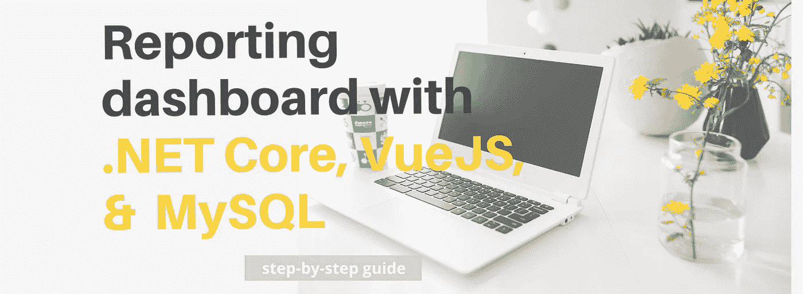
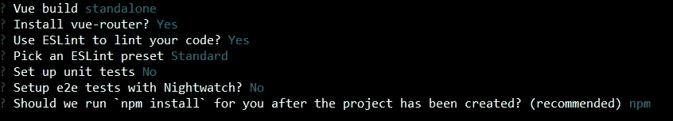
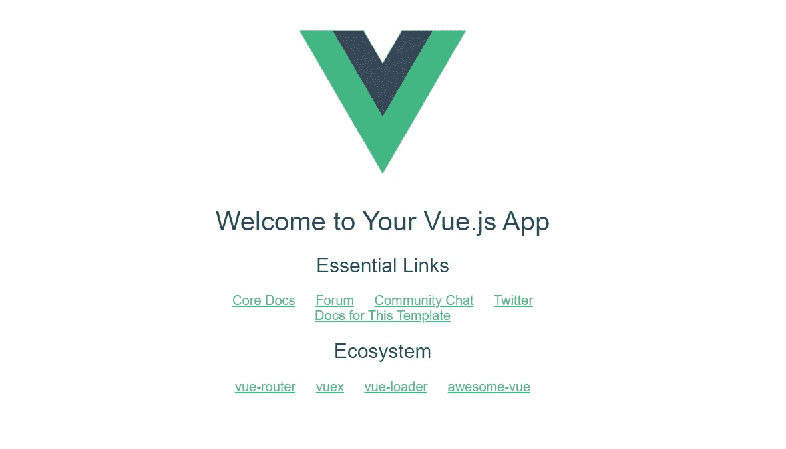
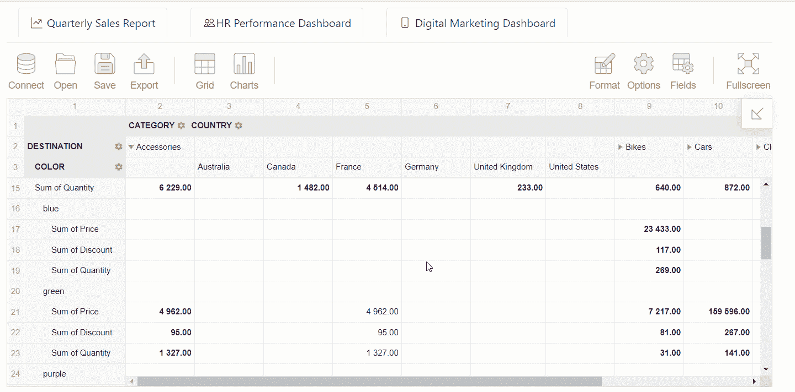
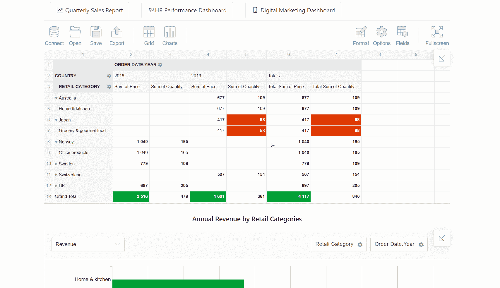

# 使用 ASP.NET 核心、VueJS 和 MySQL 构建报告应用

> 原文：<https://medium.com/quick-code/building-a-reporting-app-with-asp-net-core-vuejs-and-mysql-fbea7ff99794?source=collection_archive---------0----------------------->

今天，我将向您展示如何创建一个全栈应用程序，并为其提供报告功能。作为后端技术，我们将使用**ASP.NET 内核**。对于前端部分，我决定选择**vue . js**——快速、易学、强大的框架。如果您以前使用过 React，那么解决这个框架对您来说也不是问题。

因此，您将获得一个具有报告功能的轻量级应用程序。为了让事情变得漂亮，我们将尝试遵循*的材料设计准则*，给我们的应用程序带来原生外观&的感觉。

我们将通过创建前端 API 客户机和后端 API 服务器在两端实现 web API。

但是为了简单起见，我们将不讨论后端实现的细节。我相信指导你创建 ASP.NET 核心 web API 的最佳教程是微软官方指南。这就是为什么我将**更多地关注前端开发**和 UI 设计。

为了不在后端开发上花太多时间，可以参考专门为本教程准备的工作 web API 的[完整代码。它在](https://github.com/veronikaro/reporting-app-asp-dot-net-core)[http://localhost:5000/API](http://localhost:5000/api)启动。

我希望你能享受过程和结果。

准备好了吗？

让我们开始吧！⭐

# 先决条件

*   HTML、JavaScript 和 CSS 的基础知识
*   熟悉 webpack
*   ASP.NET 核心的基本经验
*   使用 MySQL 或其他 SQL 数据库的经验
*   *耐心和渴望编写令人敬畏的东西*🎉

## 工具和技术

*   **Vue.js** 框架+ **用于 Vue 的 Flexmonster 透视表**
*   **Visual Studio 代码** + Vue.js 扩展包**或您选择的任何其他 IDE**
*   **ASP.NET 核心**
*   **MySQL** + MySQL 工作台
*   测试 API 服务器的邮递员

# 准备数据库

出于演示的目的，我创建了一个包含三个表的测试数据库，并用样本记录填充它们。如果您希望在整个教程中与我保持一致，您可以设置 [**MySQL 服务器**](https://dev.mysql.com/downloads/mysql/) 和 [*运行这个 SQL 脚本*](https://gist.github.com/veronikaro/109100324929465af739b22765705337) 。或者您可以使用自定义数据集。在后一种情况下，您需要*对后端代码*进行一些更改:更改现有的类，使它们与您的数据模型实体相对应，并更改数据传输对象类(d to)、控制器和存储库。我想这对你来说不是一件难事。MySQL 初学者可以从[最佳 MySQL 教程](https://blog.coursesity.com/best-mysql-database-tutorials/)中受益。

# 创建 Vue.js 项目

假设你已经有一个工作的后端，让我们来关注一下未来应用的用户界面。*在最后，我们将让它们都进行通信:前端将向后端发送数据请求，并在获得这些数据后创建可视化。*

*   安装 [Node.js](https://nodejs.org/en/) 和[**NPM**](https://www.npmjs.com/)——一个用于 JavaScript 库管理的 CLI。
*   要使用命令行创建应用程序，您需要安装 Vue CLI:

这里，-g 参数代表全局安装 Vue CLI。

*   使用 [webpack 模板](https://vuejs-templates.github.io/webpack/)创建一个 Vue.js 项目:

我喜欢 webpack 样板文件的一点是，它附带了所有必要的特性，比如*热重装、林挺、测试和 CSS 提取*。

运行该命令后，系统会要求您指定项目的名称(不带大写字母)、描述和作者。在这个阶段，选择路由器是很重要的，因为我们将为不同的页面设置路径。

其他可供选择的特性是 linter 和单元测试。是否使用 [ESLint](https://eslint.org/) 由你决定。但是请记住，它迫使您在代码中遵循一致的风格。你可以在这里阅读更多关于 ESLint [的不同规则。](https://eslint.org/docs/user-guide/configuring)

以下是我选择的最少选项:

**瞧！**我们的项目已经搭好脚手架，随时可以开工。在您最喜欢的 IDE 中打开它，并检查其结构:

*   *src 是一个*目录，包含模块资产、UI 组件和路由器；
*   *App.vue* 是入口点组件；
*   *main.js* 是挂载 App.vue 的入口点文件。

要对每个文件夹的用途有信心，请在这里阅读关于生成项目的结构的更多细节[。](https://vuejs-templates.github.io/webpack/structure.html)

所以，让我们通过运行`*npm run dev*` *来对前端进行一次试驾。*

我们开始吧:

## 引导组件

为了在最短的时间内使我们的用户界面看起来时尚，我们将使用 Vue.js 的 Bootstrap 的预制组件。让我们安装它:

接下来，打开`*main.js*`文件，导入 *BootstrapVue* 及其样式，通过调用*Vue . use()*——一种安装 Vue 插件的方法，让 Vue.js 注册引导组件。

## 安装 Flexmonster 数据透视表和图表

为了在我们的 Vue 项目中使用这个 JavaScript 库，我们需要安装它。逐一运行以下命令:

我们可以在全局或本地注册 *vue-flexmonster* 模块。让我们遵循第一种方法。只需将模块及其样式导入到 *main.js:*

并将其注册为插件:

现在，该模块是全局可访问的。

下面是 *main.js* 现在的样子:

❗注意到，我们将绝对进口置于相对进口之前，这正是埃斯林规则所要求的。

# 创建导航

让我们继续**构建我们的第一个组件**。

它将负责在页面之间导航。

为了允许最终用户在多个报告之间切换，我们将创建一个单独的 UI 元素——一个**导航栏**。它将引导他们查看三种报告:

*   一份**销售**管理**报告**
*   一个 **HR 绩效**仪表板
*   **数字营销**仪表盘

在*组件*文件夹中创建一个 *Navbar.vue* 组件，并向其中添加模板和脚本:

如你所见，我们正在使用自举`<b-nav>`控制。它的主要好处是您可以创建随路由 URL 变化的选项卡式内容。通过[最佳 VueJs 教程](https://blog.coursesity.com/best-vuejs-tutorials/)在线学习 VueJs，以处理大量的用户交互和动态数据。

对于每个选项卡，我们将值分配给`to` —路由器链接属性。通过向该属性传递一个 JSON 对象，我们使选项卡的链接指向指定的组件。

在代码中，您可以看到三个组件的名称。不要担心它们还不存在——这正是我们将在本教程的下一部分中关注的。

# 创建报表组件

*现在开始设计报告！*我们将在每个页面上添加两个 Flexmonster 实例:一个用于数据透视表，另一个用于数据透视表图表。或者，您可以安排任意多的实例:唯一的预防措施是对不同的对象使用不同的引用。

在*组件*目录*，*中创建 *SalesReport.vue* 文件*。*

在`<template>`标签中，创建一个根`
`元素，我们将在它下面放置我们的报告组件。

我们还向数据透视表添加了一个`id`属性，以便以后能够更改其样式。

在同一文件中添加*导出默认*语句:

类似地，在同一个文件夹中创建另外两个组件，名为 *HRReport.vue* 和 *MarketingReport.vue* 。

然而，我们没有组件内部的数据。但是如何在从服务器获取数据之前测试它们呢？我们可以简单地解决:让我们提供一个到示例报告的链接:

看起来不错！

# 按指定路线发送

到目前为止，除了导航栏，我们已经创建了三个 Vue 组件，并在导航栏中添加了指向它们的链接。现在我们需要告诉应用程序在哪里寻找对应于这些组件的页面，即指定它们的 URL。为此，让我们从*路由器目录中打开 *index.js* 文件，*导入组件，并通过将它们添加到路由列表中来将路由器指向页面组件。

现在我们的工具栏工作正常。现在我们可以在选项卡之间切换。

# 从后端显示数据

让我们弄清楚如何将 HTTP 请求从我们的前端定向到后端。我提醒一下，我们服务器的端点位于[http://localhost:5000/API](http://localhost:5000/api)。

# 配置环境文件

打开 *config* 目录，在 *dev.env.js* 文件中添加一个新的环境变量:

要在生产模式下将 HTTP 请求指向后端，相应地修改 *config/prod.env.js* 文件。

对于从 Node.js 发出 HTTP 请求，我们将使用*Axios*——一个基于 Promise 的浏览器和 Node.js 的 HTTP 客户端。在撰写本文时，它[支持所有浏览器的最新版本](https://github.com/axios/axios#browser-support)，包括 IE 11。

运行`*npm i axios*`安装它。将 Axios 导入到 *main.js* 文件中，并使用 API_ENDPOINT 变量作为所有 Axios 请求的基本 URL:

# 创建 API 服务

让我们创建一个 API 服务。在它的帮助下，我们将从后端获取数据。

在 *src* 中，创建一个保存不同 API 服务的文件夹。将其命名为 *api-services。*新建一个文件 *order.service.js* 。在其中，导入 Axios 并实现 *getAll()* 调用:

注意，对于我们的报告目的，我们需要的唯一方法是`getAll()`。您还可以**添加其他** **RESTful 调用**，比如创建、更新、删除。

了解了数据库的设计，相应地，您可以为每个实体创建单独的 API 服务。在我们的例子中，我们还需要添加 *employee.service.js* 和 *marketing.service.js* 。

# 将数据发送到数据透视表和数据透视表图表

现在让我们回到我们的组件。我们如何用数据填充它们？

我们可以使用返回带有键和值的 JSON 的 *data()* 函数为每个组件设置数据。相反，我们将利用 Flexmonster **API 调用**。通过这种方式，我们将学习如何在 Vue 中与他们合作。

使用*[*flex monster . set report()*](https://www.flexmonster.com/api/setreport/?r=qc2)*，*我们将定义一个报表，其中的数据以及所有行、列和度量都在 *mounted()* 钩子内。如果你怀疑不同的场景应该选择哪种挂钩，我鼓励你看一看[这张图](https://vuejs.org/v2/guide/instance.html#Lifecycle-Diagram)。它将帮助您更好地理解 Vue 实例的生命周期。*

*如果只想连接数据而不为透视表设置报表，可以调用[*flex monster . connect to()*](https://www.flexmonster.com/api/connectto/?r=qc2)方法。*

*现在说重点。打开 *SalesReport.vue* 和*导入相应的 API 服务。**

*将*安装()*挂钩添加到导出的组件:*

*如您所见，在这个钩子中，我们通过最近创建的 API 服务从服务器请求数据。在这里，我们还创建了一个报告对象，并使用`setReport()`方法将其设置为组件。*

*同样，您可以为其他组件设置报告: *HRReport* 和 *MarketingReport* 。*

# *集合映射*

*您可能已经注意到，MySQL 表中的字段名称是按照它们在数据库中被指定的方式显示的。我们可以使用报表的 [**映射**](https://www.flexmonster.com/doc/mapping/?r=qc2) 属性来修改它并美化字段名。只需将该对象添加到报表的*数据源*属性中。*

# *设计一个报告工具🎨*

*为了美化我们的仪表板，您可以使用[材料设计调色板生成器](https://material.io/design/color/#tools-for-picking-colors)并为图表选择符合您偏好的颜色。*

# *把所有东西放在一起*

*现在是时候看看后端和前端如何协同工作了。通过运行 IIS 服务器启动您的 ASP.NET 核心应用程序。启动后，您可以运行前端并单击每个选项卡来检查不同的报告。所有这些报告都填充了数据库中的数据。*

# *提高性能*

*注意，我们发送到数据透视表组件的数据是在客户端处理的*。**

*数据处理的速度很大程度上依赖于你的浏览器资源。高达百兆，一般都做的很快。但是，如果您正在处理大量的数据，或者只是希望在数据访问层优化数据处理，那么有一个选项适合您。我鼓励你尝试设置 [**。NET Core server**](https://www.flexmonster.com/doc/pivot-table-with-dot-net-core-server/?r=qc2) 实现[flex monster 公开的 API](https://www.flexmonster.com/doc/introduction-to-custom-data-source-api/?r=qc2) 。这种方法将显著加快服务器端的数据处理，并让您绕过浏览器的限制。你可以在官方指南中找到所有关于如何实施的说明。如果你的服务器运行在 Node.js 上，你也可以试试 [**Node.js 示例服务器**](https://www.flexmonster.com/doc/pivot-table-with-node-js-server/?r=qc2) 或者自己实现服务器-客户端通信。*

# *结果*

*让我们来检查结果！*

**

*这是您到目前为止构建的报告工具。您可以将它用于任何数据和任何业务案例。*

# *结束语*

*今天你已经学会了如何使用 Vue.js、ASP.NET 核心、MySQL 和 Vue 的数据透视表创建一个漂亮的应用程序。我希望你对结果满意。您可以尝试使用其他客户端和服务器端技术构建类似的应用程序。、或其他数据源。*

*您可以轻松地在不同的数据之间切换。*

# *示例代码*

*   *[Vue.js 报表 app](https://github.com/veronikaro/reporting-app-vue)*
*   *【ASP.NET 核心 Web API*

# *反馈*

*我喜欢与社区分享我的技术经验和想法。这样做的好处之一是收到你的反馈。这有助于我提高技能和知识。所以我很想收到你的回信。如果您对改进代码或本教程有任何建议，请与我和其他读者分享您的想法。*