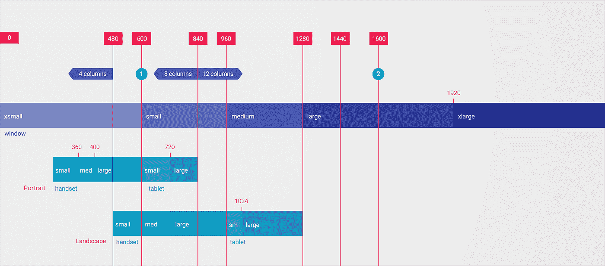
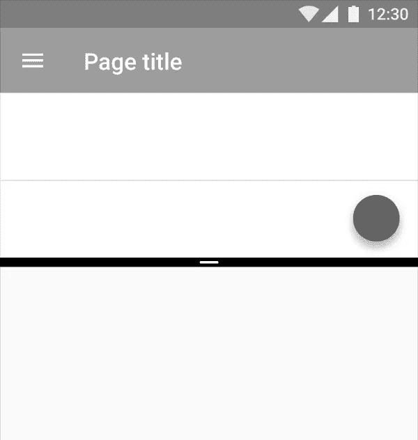
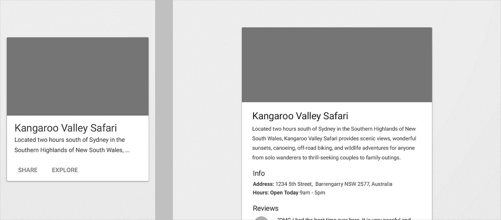
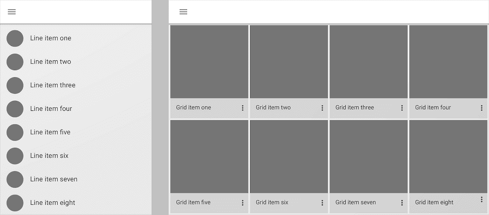
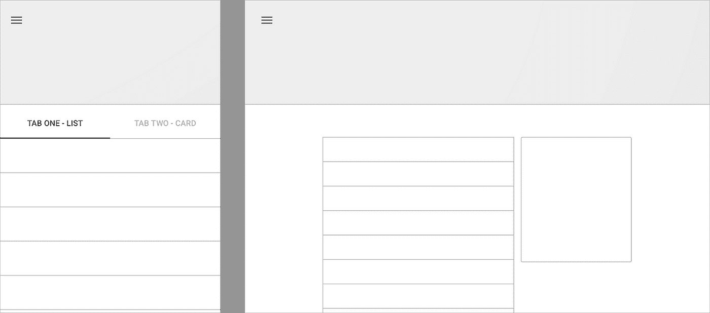
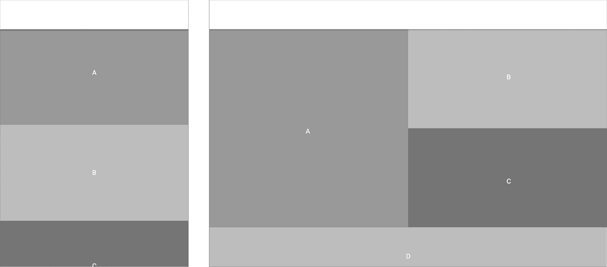
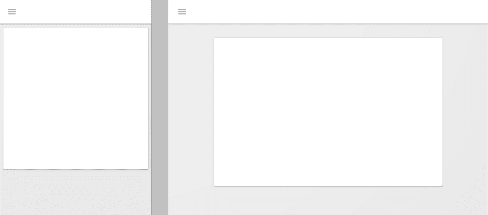
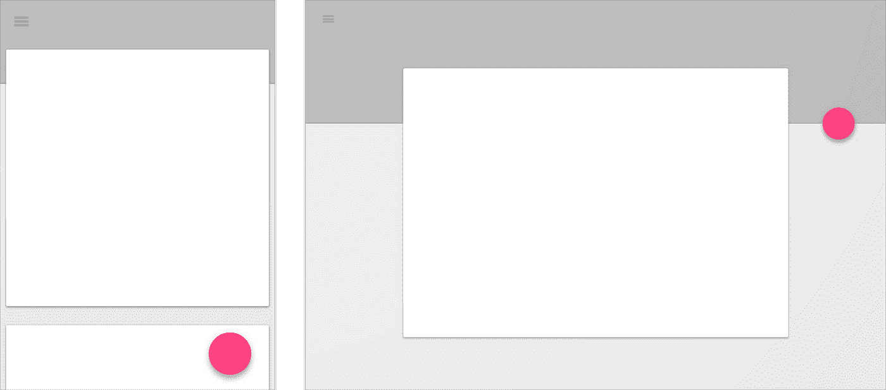

# 在 Android 中构建响应式用户界面

> 原文：<https://medium.com/androiddevelopers/building-a-responsive-ui-in-android-7dc7e4efcbb3?source=collection_archive---------0----------------------->

没有什么比意识到 Google Play 上好看的屏幕截图不能转换到你的设备上更让人恼火的了。我当然不希望每个应用程序都在 11，000 多种 Android 设备上测试他们的 UI，谢天谢地，如果你正在构建一个响应迅速的 UI，你不必这样做。

与 Android 开发的大多数部分相比，构建一个响应式 UI 是一个多学科的行为:每个人都需要决定何时和**如何**改变你的 UI。

# 选择何时改变

响应式 UI 就是对可用空间做出反应的 UI。虽然只考虑你的设备或特定的手机或平板电脑可能很有诱惑力，但 Android 将“*在一起不一样”*这句格言铭记于心:**这是一个连续的设备和大小范围**(这是 web 和桌面开发人员多年来不得不处理的事情！).

Android [资源系统](http://developer.android.com/guide/topics/resources/overview.html?utm_campaign=android_series_responsive_ui_051016&utm_source=medium&utm_medium=blog)为您提供了基于可用**宽度、高度或最小宽度**的工具[来提供替代资源](http://developer.android.com/guide/topics/resources/providing-resources.html?utm_campaign=android_series_responsive_ui_051016&utm_source=medium&utm_medium=blog)——这些重要的测量值是根据可用空间来选择何时改变我们的 UI 的基础。

## 宽度和断点

当选择**改变用户界面时，宽度可能是最重要的因素。这是因为宽度是 [**断点系统**](https://www.google.com/design/spec/layout/responsive-ui.html?utm_campaign=android_series_responsive_ui_051016&utm_source=medium&utm_medium=blog#responsive-ui-breakpoints) 的基础。**

“断点”是一个特定的宽度，你的用户界面可能会有所不同:响应新的额外空间，以更好地利用它。它可能是一个小的差异(略大的利润)或一个大得多的变化——参见下面的“要改变什么”部分的大量例子。

600dp 行就是一个很好的例子:只有在这一点上，您才应该考虑在屏幕上同时显示两个层次的内容(比如主视图和详细视图)。低于这一点，你有一个非常真实的可能性压倒用户。

类似地，1600dp 之后的超大尺寸是为 UI 设置最大宽度的好时机:要么居中对齐并增加边距，要么整个 UI 左对齐。

> **注意**:这并不是说你的布局是完全静态的，每个断点之间的宽度是固定的。认真思考哪些元素真正需要固定的宽度，或者哪些元素应该与更灵活的[网格](https://www.google.com/design/spec/layout/responsive-ui.html?utm_campaign=android_series_responsive_ui_051016&utm_source=medium&utm_medium=blog#responsive-ui-grid)对齐，使用可用空间的固定**百分比**。

为了利用基于宽度的资源，可以使用 **w** 前缀。例如，默认布局是*布局*，宽度为 600dp 或更高的布局在*布局-w600dp* 中。

## 高度

16:9 split screen on mobile

另一方面，高度作为一个高级元素在构建一个响应式 UI 时不太常见，但我不会完全排除它。事实上，高度非常有限的情况是 UI 可以非常壮观地分解的情况之一。

以手机上的 16:9 [分屏窗口](https://www.google.com/design/spec/layout/split-screen.html?utm_campaign=android_series_responsive_ui_051016&utm_source=medium&utm_medium=blog#split-screen-layout)为例:如此小的高度会让传统上易于使用的界面(如垂直滚动的容器)变成一个困难的命题。

使用具有垂直对齐的固定元素的 UI 模式时要特别小心；虽然对话框在大多数情况下可能工作得很好，但小的高度可能会使其无法点击动作并与对话框交互。(一个很好的例子，你可以**将**转换为全屏对话模式)。

类似于通过宽度限定资源，高度恰当地使用了 **h** 前缀，即 *layout-h480dp* 。

## 最小宽度和旋转不敏感的用户界面

人们很自然地会根据设备的总体尺寸来考虑“可用空间”(这就是为什么很容易陷入“让我们构建一个平板电脑用户界面吧！”思考)。但是宽度和高度实际上都没有涵盖所有尺寸的考虑——它们都只测量了一个维度。但是不要担心！还有一种替代*布局-w600dp-h600dp* :最小宽度**和*布局-sw600dp* 。**

通过取宽度和高度中较小的一个来计算最小宽度。例如，如果您的应用程序是纵向的，最小宽度就是当前宽度。**旋转时，最小宽度不会改变**，即使宽度已经与高度交换。

这使得最小宽度成为可用空间大小的最佳总体表示。在构建一个对旋转不敏感的 UI 时，这也非常重要。这意味着确保操作在每个方向都可用，并且基本使用模式在轮换中保持一致。

这一点在 [**准备 Android N**](/google-developers/5-tips-for-preparing-for-multi-window-in-android-n-7bed803dda64?utm_campaign=android_series_responsive_ui_051016&utm_source=medium&utm_medium=blog#a377) 多窗口时尤为重要:

> 没错:即使设备是横向的，你的应用也可能是纵向的。结果是:“纵向”实际上意味着高度大于宽度，“横向”意味着宽度大于高度…你的应用程序可以在调整大小时从一个过渡到另一个。

如果你依靠纵向或横向来改变你的用户界面，当你和你的用户调整你的应用程序的大小，并达到纵向和横向之间的神奇交叉点时，他们会非常惊讶。确保他们不会感到惊讶。

当然，这并不意味着方位之间什么都不能改变(毕竟宽度差别很大！)，但是如果确实需要这种大范围的改变，你应该保持更大的结构/导航改变以最小的宽度为基础。

# 选择改变什么

“何时”改变只是等式的一半。知道改变什么(以及如何改变)同样重要。

有许多[响应用户界面模式](https://www.google.com/design/spec/layout/responsive-ui.html?utm_campaign=android_series_responsive_ui_051016&utm_source=medium&utm_medium=blog#responsive-ui-patterns)，探索你如何适应你拥有的空间量的变化。

## 揭示

第一种模式涉及到当你获得额外的空间时**显示**隐藏的内容。这种模式体现了小屏幕需求之间的平衡(有时并非所有东西都适合！)大屏幕的需求，减少点击次数或对隐藏信息的依赖可以极大地改善用户体验。

当涉及到布局时，这尤其常见。在较小的屏幕上，可能需要特定的用户交互(如点击按钮)来扩展较少使用的字段。

不过，在更大的屏幕上，默认情况下可能会显示所有字段。

**如何:**创建两个同名的布局，一个在*布局*目录，一个在*布局-w600dp* 。确保任何 *findById()* 调用检查只出现在一个布局中的视图的空值。

## 改变

**转换**不涉及改变正在显示的元素，而是改变它们使用的格式或样式。最简单的例子是一个菜单，其中有带 *showAsAction="ifRoom"* 的元素——当有额外的空间时，元素会从溢出菜单升级到工具栏项目——在风格上从文本转换到图标。

另一个例子是改变你显示数据集合的方式。

一个简单可扫描列表可能在有限的宽度下工作得很好，但是将样式扩展到更大的宽度可能会很困难。将相同的集合转换成网格可以有效地利用空间，将内容放在第一位。

**如何:**利用 [*RecyclerView*](https://developer.android.com/reference/android/support/v7/widget/RecyclerView.html?utm_campaign=android_series_responsive_ui_051016&utm_source=medium&utm_medium=blog) 的[*layout manager*](https://developer.android.com/reference/android/support/v7/widget/RecyclerView.html?utm_campaign=android_series_responsive_ui_051016&utm_source=medium&utm_medium=blog#attr_android.support.v7.recyclerview:layoutManager)属性从[*LinearLayoutManager*](https://developer.android.com/reference/android/support/v7/widget/LinearLayoutManager.html?utm_campaign=android_series_responsive_ui_051016&utm_source=medium&utm_medium=blog)更改为[*GridLayoutManager*](https://developer.android.com/reference/android/support/v7/widget/GridLayoutManager.html?utm_campaign=android_series_responsive_ui_051016&utm_source=medium&utm_medium=blog)而无需更改任何代码。确保在[*onCreateViewHolder()*](https://developer.android.com/reference/android/support/v7/widget/RecyclerView.Adapter.html?utm_campaign=android_series_responsive_ui_051016&utm_source=medium&utm_medium=blog#onCreateViewHolder(android.view.ViewGroup,%20int))中创建的视图也在与您的 *layoutManager* 相同的断点处发生变化。

## 划分

当你分割你的屏幕时，你使用了额外的空间来同时显示多个用户界面。这是 reveal 模式的近亲，但更侧重于*改变*高级元素和导航以分割屏幕，而不是只显示现有容器中的元素。

使用这种模式的一个很好的地方是当你有多个标签时，这些标签本身相当简单。

您可以划分屏幕，完整地显示每个内容，而不是对每个(现在大得多的)单独的选项卡应用不同的模式。

**如何实现:**在较小的设备上，你可以使用[标签和 ViewPager](https://www.youtube.com/watch?v=zQekzaAgIlQ&utm_campaign=android_series_responsive_ui_051016&utm_source=medium&utm_medium=blog) 来构建你的 UI，最好每个页面都有一个片段。最好基于最小的宽度(记住你希望它在旋转中保持一致)，使用直接添加每个单独片段的布局。

## 回流

**重排**依赖于用户界面底层的灵活性，可以在微观或宏观层面上完成。例如，当宽度非常重要时，单个视图可能会垂直堆叠其内容，但如果有更多的宽度可用，则水平堆叠。

同样的概念也适用于您的整个 UI:重新排列所有视图以填充所有可用空间可能是有意义的。

在较小设备上排列在一列中的视图可能会重排以填充多列。

**如何实现:**如果您有动态内容，可以考虑使用一个[StaggeredGridLayoutManager](http://developer.android.com/reference/android/support/v7/widget/StaggeredGridLayoutManager.html?utm_campaign=android_series_responsive_ui_051016&utm_source=medium&utm_medium=blog)并在您的 XML 中使用 *app:spanCount* 或 [setSpanCount()](http://developer.android.com/reference/android/support/v7/widget/StaggeredGridLayoutManager.html?utm_campaign=android_series_responsive_ui_051016&utm_source=medium&utm_medium=blog#setSpanCount(int)) 来动态改变列数。

> **注意:**我们已经谈论了很多关于使用宽度、高度和最小宽度来使布局具有响应性的内容，但是**同样的技术也适用于所有的资源类型**。与其构建单独的 XML 文件只是为了更改 *spanCount* ，不如让它成为一个[整数资源](http://developer.android.com/guide/topics/resources/more-resources.html?utm_campaign=android_series_responsive_ui_051016&utm_source=medium&utm_medium=blog#Integer)，并在 *values-w600dp* 资源文件夹中提供一个替代值。

## 发展

并不是每一个改变都需要大范围的改变:有时候小的改变就足够了。简单地扩展你的用户界面的可用空间(或者增加一些额外的空白)可以成为改变你的用户界面的有效方法。

**如何:**如上所述，任何资源都可以响应宽度、高度和最小宽度的变化。这种扩展实际上更容易通过增加边距来实现:你可以想象小屏幕的边距为 *0dp* ，大设备的边距为 *24dp* 。另一个解决方案是使用[百分比支持库](https://plus.google.com/+AndroidDevelopers/posts/C8oaLunpEEj?utm_campaign=android_series_responsive_ui_051016&utm_source=medium&utm_medium=blog)，例如，将您的 *layout_widthPercent* 从 100%更改为 80%。如果你想在整个视图上设置一个最大宽度，可以考虑阅读[这篇关于优化线长度的提示](https://plus.google.com/+AndroidDevelopers/posts/JrKDLpwhqBy?utm_campaign=android_series_responsive_ui_051016&utm_source=medium&utm_medium=blog)及其包含的 *MaxWidthLinearLayout* 。

## 位置

最后但同样重要的一点是，改变重要视图的**位置**可以让用户界面变得平易近人。

考虑一下 [*浮动动作按钮*](http://developer.android.com/reference/android/support/design/widget/FloatingActionButton.html?utm_campaign=android_series_responsive_ui_051016&utm_source=medium&utm_medium=blog) (FAB)。根据定义，这应该与用户想要采取的主要行动之一相关联。特别是如果你正在改变其他元素，考虑使用大屏幕上的浮动操作按钮来遵循[的指导方针。](https://www.google.com/design/spec/components/buttons-floating-action-button.html?utm_campaign=android_series_responsive_ui_051016&utm_source=medium&utm_medium=blog#buttons-floating-action-button-large-screens)

这可能意味着将浮动操作按钮从右下角的“默认”位置移动到一个扩展的应用程序栏或布局本身的工具栏或工作表。

**如何操作:**假设您正在使用一个带有[*coordinator layout*](http://developer.android.com/reference/android/support/design/widget/CoordinatorLayout.html?utm_campaign=android_series_responsive_ui_051016&utm_source=medium&utm_medium=blog)的*浮动操作按钮*，右下角带有*layout _ gravity = " bottom | end "*，而您将使用带有扩展高度 [*AppBarLayout*](http://developer.android.com/reference/android/support/design/widget/AppBarLayout.html?utm_campaign=android_series_responsive_ui_051016&utm_source=medium&utm_medium=blog) 的*layout _ anchor gravity = " bottom | end "*将 FAB 连接到

# 勇往直前，积极建设

响应式设计的目标是构建一个处处都好看的 UI。但这是最终目标:这些模式中的许多可以非常渐进地引入，所以不要等待。(一点点的余量走很长的路！)

# BuildBetterApps

关注 [Android 开发模式集](https://plus.google.com/collection/sLR0p?utm_campaign=android_series_responsive_ui_051016&utm_source=medium&utm_medium=blog)了解更多！

