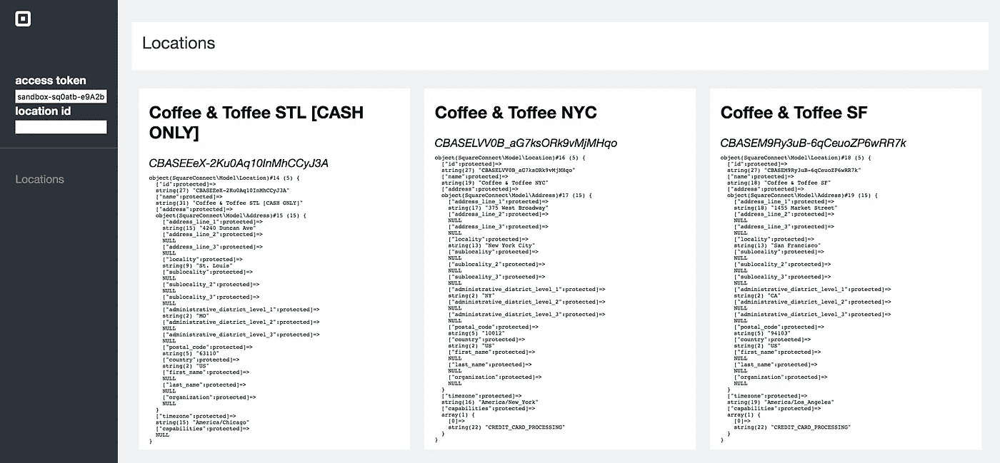
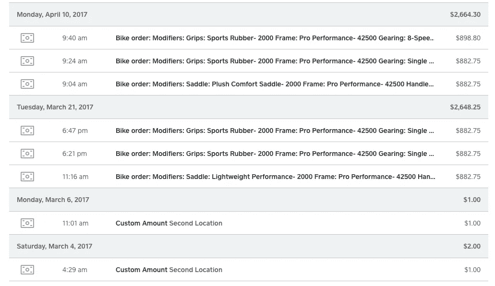
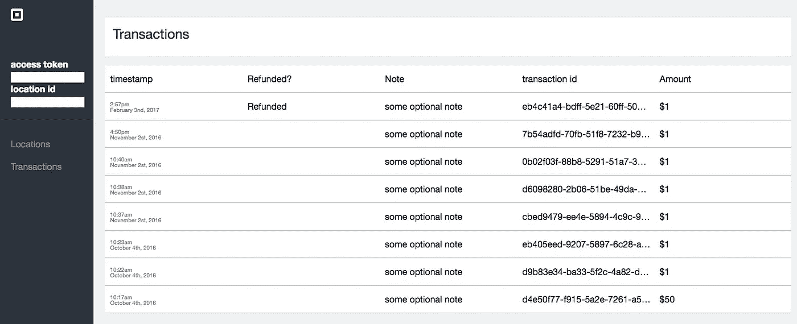

# 建立一个沙盒仪表板 Pt。2:添加交易列表

> 原文：<https://medium.com/square-corner-blog/building-a-sandbox-dashboard-pt-2-adding-a-transactions-list-49fd754e659b?source=collection_archive---------4----------------------->

## **继** [**构建沙盒仪表板系列的第 1 部分**](/square-corner-blog/using-squares-rest-apis-to-build-a-sandbox-dashboard-part-1-authentication-locations-3e5b5a551cc7) **之后，我们将向您展示如何添加事务报告功能。**

> 注意，我们已经行动了！如果您想继续了解 Square 的最新技术内容，请访问我们的新家[https://developer.squareup.com/blog](https://developer.squareup.com/blog)

在上一篇文章的最后，我们创建了一个正方形仪表板的基本副本，它能够检索您的位置信息。在本文中，我们将使用 Square 的交易报告 API 来列出沙盒帐户中已完成的交易。让我们来看看迄今为止我们所做的工作:



我们有一个页面的布局类似于仪表板，只有一个标签:位置。我们还有几个输入字段要添加到您选择的`access token`和`location id`中。*请记住，这些仅用于教程目的！您不希望在生产环境中的客户端公开访问令牌。*



Square Dashboard view of transaction history. We want to replicate this for a sandbox dashboard.

## 添加交易

构建事务显示页面的第一步是添加一些导航来访问它。让我们给导航条添加一些代码:

```
<div class=”nav-item”>
  <a href=”/locations.php”>Locations</a>
 **<a href="/transactions.php">Transactions</a>** </div>
```

并添加一个新的`transactions.php`文件。我们将使用与第一部分中列出位置的代码相同的结构，比如使用共享的`header.php`并显示缺少参数的错误消息。我们将把交易信息打印成行，类似于方形仪表板，而不是像我们对位置那样用交易制作大块。

首先，从存储在会话中的令牌配置您的访问令牌，并创建一个新对象来与 API 交互。

```
SquareConnect\Configuration::getDefaultConfiguration()->setAccessToken($_SESSION['at']);$transactionApi = new SquareConnect\Api\TransactionsAPI();
```

然后，我们将调用 List Transactions 端点，遍历结果，为每个交易显示一个新行及其`timestamp`、`amount`和`transaction id`，并指示付款是否已被退款。

```
<?php
 $result = $transactionApi->listTransactions($_SESSION['location']);
 ?>

   <div style="display:flex;flex-direction:column;">
    <div class="row">
     <div>timestamp</div>
     <div>Refunded?</div>
     <div>Note</div>
     <div>transaction id</div>
     <div>Amount</div>
    </div>
    <?php foreach ($result->getTransactions() as $transaction) {?>
    <div class="row">
     <div class="timestamp">
      <?php echo date("g:ia \<\b\\r\> F NS, Y",strtotime($transaction->getCreatedAt()));?>
     </div> <div>
      <?
      //Display a notice if the transaction was refunded.
      if ($transaction->getRefunds()) {
       echo "Refunded" ;
      }
      ?>
     </div> <div>
      <?php echo $transaction->getTenders()[0]->getNote();?>
     </div>
     <div>
      <?php echo $transaction->getId(); ?>
     </div>
     <div>
      <?php echo '$'.$transaction->getTenders()[0]->getAmountMoney()->getAmount()/100 ?>
     </div>
    </div>
```

现在，我们有了一个包含所提供的沙盒帐户凭证的所有事务的表:



A list of my sandbox transactions!

在这里，我选择只显示所提供信息的快照，但这应该是展示您的沙盒帐户的交易信息的良好起点。请记住，您也可以使用类似于 [Postman](/square-corner-blog/getting-started-with-postman-and-squares-apis-e6bd0f2a8a75) 的工具来轻松查看您的沙盒帐户详情。关注这个博客，并在 Twitter 上关注 [@SquareDev](https://twitter.com/SquareDev) 来了解这个系列的第三部分！在这里重温第一部。