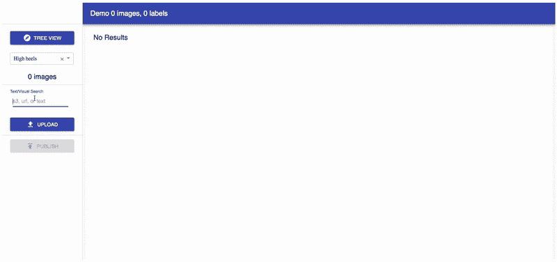
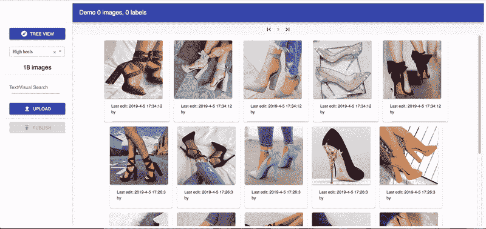
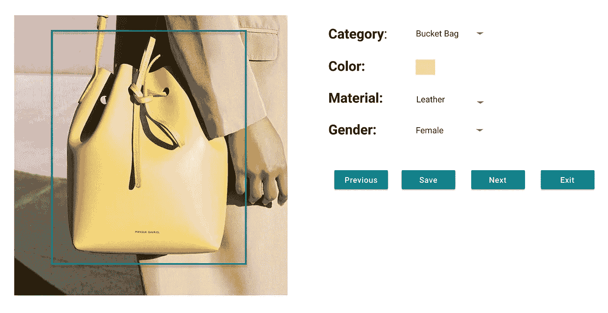
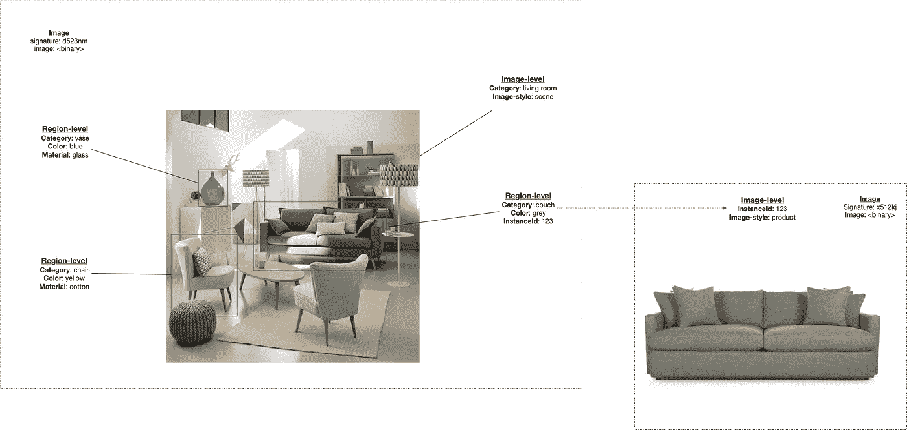
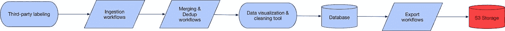
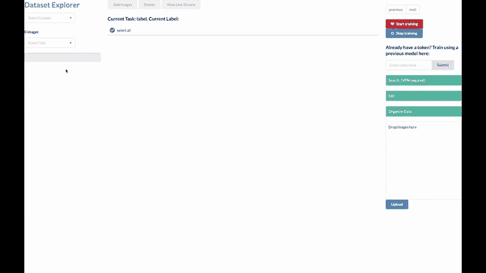

# 为计算机视觉任务建立一个可扩展的数据管理系统

> 原文：<https://medium.com/pinterest-engineering/building-a-scalable-data-management-system-for-computer-vision-tasks-a6dee8f1c580?source=collection_archive---------1----------------------->

作者 Shirley Du | Discovery 工程师

在 Pinterest 上，计算机视觉在搜索和发现每一个图钉和图钉中的每一张图片方面发挥着核心作用。我们训练视觉模型不仅识别对象，还预测属性、相关想法和准确的产品匹配。随着人们每月在 Pinterest 上进行数以亿计的视觉搜索，这些模型变得越来越强大，结果通过跨平台的[镜头相机搜索](/@Pinterest_Engineering/building-pinterest-lens-a-real-world-visual-discovery-system-59812d8cbfbc)、[自动化商店外观](/@Pinterest_Engineering/automating-shop-the-look-on-pinterest-a17aeff0eae2)和[视觉搜索](/@Pinterest_Engineering/introducing-automatic-object-detection-to-visual-search-e57c29191c30)等技术浮出水面。

机器学习模型，尤其是深度学习模型的成功训练，通常依赖于大规模收集高质量的训练数据。此外，在生产应用程序中，许多辅助任务通常需要比模型设计本身更多的工程工作:数据收集、标签清理、质量控制、众包、版本控制、数据集存储、分类管理等。作为帮助完成这些任务的解决方案，我们设计了一个集中式的、可伸缩的、灵活的数据管理工具，名为 Voyager。

# 概观

Voyager 是 Pinterest 存储计算机视觉训练数据的中心。深度学习模型的训练和评估需要各种标签、格式和大小的数据集，而 Voyager 允许我们从零开始轻松创建这样的数据集。这个特性在探索性应用程序中特别有用，因为我们只需要一个小的数据集就可以开始实验，当我们可以自己引导一个数据集时，这是最方便的。

假设我们想要引导一个包含 100 张高跟鞋图片的数据集。在 Voyager 中，有几种方法可以快速定义分类并添加图像:

*   通过执行文本搜索添加图像。只需通过搜索关键词*(例如，“高跟鞋”)*，选择要添加到您的类别中的结果图片。

*   通过执行视觉搜索来添加图像。选择一个现有的图像，我们的视觉搜索后端将找到视觉上相似的图像。

*   从本地桌面拖放。
*   使用我们的统一计算机视觉数据集模式(如下所述)从 Pinterest 数据库导入

尽管 100 张图片可能看起来不多，但当微调现有模型时，这可能足以启动一个新的类别。让 Voyager 更加强大的是，它还支持动态分类管理，这模仿了文件系统的分类管理。用户可以像管理笔记本电脑上的文件和文件夹一样管理他们的数据。在数据收集方面，该功能在深度学习应用中尤其有用。例如，为了训练我们的[镜头](https://about.pinterest.com/en/lens)模型，我们需要类似于用户输入图像的质量分布的训练图像，其中这些图像通常具有低分辨率、低光照条件等属性，并且有时是在非常规角度拍摄的。因此，拥有类似文件系统的工具的便利性使得收集满足上述要求的图像变得又快又容易。

此外，为了进一步改善用户体验和视觉搜索结果的多样性，我们还关注图像的属性，如颜色、材质、性别和其他与图像相关的有用信息。为了收集这种数据，Voyager 允许我们的内部产品专家实时标记多个属性。

Figure 1\. In Voyager, a dataset is defined by tasks and their associated taxonomies. For example, in this Fashion Detection dataset, we define four tasks (Semantic Category, Color, Material, and Apparel Gender)

旅行者不仅仅是一个网络工具。它也是一个处理数据收集、清理、可视化和深度视觉模型训练的系统。该系统由底层的统一数据标记模式支持。

# 统一数据标记模式

我们从开发数据管理工具链中学到的一个重要经验是，我们需要为 Pinterest 的所有计算机视觉任务定义一个统一的优化模式。如果没有统一的模式，我们经常会遇到困难的数据可视化、不兼容的数据集格式、视觉数据集消费者中脆弱的类型和模式推断等问题，以及许多其他问题。

因此，我们的模式满足以下要求:

1.  每个图像可以有图像级标签(*例如* *这个图像是客厅场景*)和区域级标签(*例如这个图像中的这个区域是床*)。一个区域可以被定义为一个盒子、一个遮罩、一个多边形等等。
2.  任何区域(包括完整图像)都可以有一个来自几个独立分类法的标签集*(例如，语义类别、调色板、材料、图案等)*。事实证明，跨多个分类法描述同一个区域对于我们的多任务学习工作非常重要，我们将在未来的博客文章中介绍这一点。
3.  应该可以将一个区域与其他图像中的区域相关联(*例如，这个起居室场景中的这张沙发与另一个起居室场景中的那张沙发相似*)。
4.  我们应该能够记录图像中没有空间关联的分类的标签(*例如，这个图像是黑白的*
5.  图像需要作为原始字节与元数据放在一起，而不是链接在一起，以防止图像被重新定位或修改(使用安全机制从已删除的图像中删除训练示例)。

这种模式的优势在于，在数据标注端(web 工具)，我们可以轻松地呈现图像级和区域级信息，并写回数据库进行修改。在深度学习模型训练端(训练框架)，训练者可以一次快速反序列化并提取图像元数据。通过在这个统一的数据结构中存储图像原始字节，我们还确保了所有图像的完整性，这进一步保证了性能的可靠性，并提高了模型再现和再训练的可行性。

当事情大规模进行时，模块化数据管理系统变得越来越重要。职责分离也正在成为我们系统的一项重要任务。因此，拥有一个一致的、统一的、向后兼容的模式是将模块连接在一起并实现这些目标的重要的第一步。

# 数据集版本化

有了可靠的统一模式，我们现在可以在 Voyager 中执行数据清理了。然而，由于数百名产品专家同时清理我们的数据，我们的数据集不断发展。在工业应用中，每天都会产生大量数据并输入到机器学习模型中，对数据集进行连续管理甚至更为常见。原因是模型的维护和迭代需要容易地访问现有的数据条目，以便可以方便地存储和跟踪历史性能和分析，并且因此可以可靠地再现模型性能。再现性对于工业模型开发至关重要。如果没有它，我们可能会声称通过修改深度学习模型获得了收益，而没有意识到改进的真正来源是随机的。为了解决这个问题，我们实现了一个自动版本控制系统来跟踪数据。

为了实现自动版本控制，我们开发了在 Voyager 下运行的管道，实时发布数据集。这些管道获取数据集的最新快照，并将它们转储到数据库中。这样，它确保了组织内的可重用性和团队内模型性能的可再现性。

# 可扩展的培训数据收集管道

众包是大规模收集数据的最有效方式。然而，确保数据完整性和一致性并非易事，因为场景图像各不相同，不同的众包贴标机和 QA 人员可能对对象有不同的定义，以及如何为对象绘制边界框的标准。因此，确保数据质量可能是一件令人头疼的事情。

以收集检测任务的边界框为例:为了在 [automated Shop 中训练我们的检测模型，让 Pinners 获得探索和购买场景中包含的对象的最佳体验，我们需要训练图像，这些图像在所有突出的对象周围具有绘制良好的边界框，遵循一致但复杂的标记指南。我们要求贴标签机一次给一个类别贴标签*(例如，给场景中的所有椅子贴标签)*以确保边界框的绘制速度符合我们的训练指南。然后，我们要求贴标机验证每个盒子是否绘制正确*(例如，盒子是否足够紧)*。在盒子被验证后，我们发送它们让贴标机验证在完全召回时是否每个图像都被贴上标签*(例如，场景中所有的椅子都被正确贴上标签)*。我们重复这个过程，直到我们得到符合我们标准的质量。这个过程被概括为“有针对性的”数据收集管道，因为我们一次收集一个类别。这种管道收集检测数据的速度非常快，可伸缩性也非常好，在 Pinterest 上被广泛采用。](/@Pinterest_Engineering/automating-shop-the-look-on-pinterest-a17aeff0eae2)

从这个管道中收集目标数据后，我们将这些结果输入到我们的可视化和清理工具中，以执行内部 QA。当然，当与我们现有的图像数据集和来自我们测试数据集的重复数据删除图像发生冲突时，该工作流也会执行合并。如果质量没有通过我们的标准，我们会要求贴标机重做任务，重复这个过程；否则，将启动导出工作流，将清理后的数据转储到我们的真实信息来源位置。

# 未来可扩展

我们认为，随着视觉任务变得越来越复杂，拥有可靠、可扩展和可维护的数据管理系统对于深度学习模型训练至关重要。我们的数据管理系统通过减少数据收集、模型训练、调试和更多数据收集过程的周转时间，显著简化了常见的深度学习任务。展望未来，我们期待着一个更强大的系统，它可以让我们进行即时训练——一个即时反馈循环，以调试到模型中。敬请关注！

*鸣谢:我们的数据管理工具是 Pinterest 的合作成果。特别感谢 Dmitry Kislyuk，Michael Feng，Andrew Zhai，Jeff Harris，Chuck Rosenberg 在本项目中的合作。*