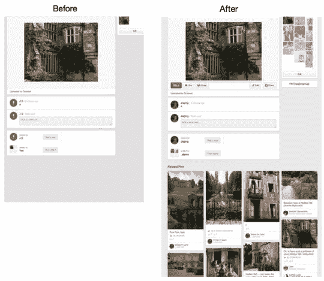

# 构建可扩展的机器视觉管道

> 原文：<https://medium.com/pinterest-engineering/building-a-scalable-machine-vision-pipeline-60dd7bac73e7?source=collection_archive---------1----------------------->

Kevin Jing | Pinterest 工程经理，视觉探索

Pinterest 上的发现就是找到你喜欢的东西，即使你一开始不知道你在找什么。Pinterest 的视觉发现工程团队的任务是建立技术，帮助人们继续这样做，通过建立技术来理解 Pin 图像中的对象，以了解 Pinner 正在寻找什么。

在过去的一年里，我们一直在用广泛可用的工具和几个工程师构建一个大规模、经济高效的机器视觉管道和堆栈。我们在 Pinterest 部署商业视觉搜索系统时面临两大挑战:

*   作为一家初创公司，我们需要控制人力和计算资源方面的开发成本。随着大量且持续增长的图像集合，特征计算可能会变得非常昂贵，并且随着工程师不断尝试部署新的特征，我们的系统必须既可扩展又经济高效。
*   商业应用的成功是通过它给用户带来的好处(例如，提高用户参与度)相对于开发和维护成本来衡量的。因此，我们的开发进度需要经常通过实时用户流量的 A/B 实验来验证。

今天，我们将分享一些我们正在试验的新技术，以及一份[白皮书](http://arxiv.org/abs/1505.07647)，该白皮书已被接受在 2015 年[KDD](http://www.kdd.org/kdd2015/)大会上发布，其中详细介绍了我们的系统架构和从这些试验中获得的见解，并做出了以下贡献:

*   我们提出了一个商业部署的可视化搜索引擎的可扩展和经济高效的实现，主要使用开源工具。性能和开发成本之间的权衡使得我们的架构更适合中小型企业。
*   我们在两个 Pinterest 应用程序上使用基准数据集和 A/B 测试的组合进行了一系列全面的实验，相关的 pin 和一个具有相似外观的实验，详情如下。

## 实验 1:相关引脚推荐

过去，如果 Pinterest 上从未保存过某个 Pin，我们就无法提供相关的 Pin 推荐。这是因为相关的 pin 主要是通过遍历本地的“策展图”生成的，这个三方用户-公告板-图像图是通过人工策展有机发展的。结果，“长尾”图钉，或者位于该策展图外围的图钉，具有如此少的邻居，以至于基于图的方法不能产生足够的相关推荐。通过增强推荐系统，我们现在能够为 Pinterest 上的几乎所有 pin 推荐 pin，如下所示。

*图一。将视觉搜索添加到相关 Pin 建议之前和之后。*

## 实验 2:通过对象识别增强产品推荐

这个实验允许我们根据大头针图像中的特定对象显示视觉上相似的大头针建议。我们首先尝试使用表面对象识别的方法，这将使 Pinners 能够点击对象(例如，包、鞋等)。)如下图。我们可以使用对象识别从大头针的图像中检测出包、鞋和裙子等产品。从这些检测到的对象中，我们提取视觉特征来生成产品推荐(“相似外观”)。在最初的实验中，如果大头针中的物体上有一个红点，Pinner 就会发现建议(见下文)。点击红点会载入一系列视觉上相似的物品。我们已经发展了红点实验，尝试其他方式来为特定对象提供视觉上类似的建议，并将在今年晚些时候分享更多内容。

*图二。我们应用对象检测来定位诸如包和鞋之类的产品。在这个原型中，Pinners 点击感兴趣的对象来查看相似的产品。*

通过分享我们的实现细节和推出产品的经验，我们希望视觉搜索能够更广泛地融入到当今的商业应用中。

系统中有数十亿个由个人管理的 pin，我们有一个最大、注释最丰富的在线数据集，这些实验是 Pinterest 可能实现的一小部分。我们正在建立一个世界级的深度学习团队，并与[伯克利视觉和学习中心](http://bvlc.eecs.berkeley.edu/)的成员密切合作。在过去的几个月里，我们有幸邀请到了他们中的一些人。

如果您有兴趣探索这些数据集并帮助我们建立可视化发现和搜索技术，[加入我们的团队](https://about.pinterest.com/en/careers)！

*Kevin Jing 是视觉探索团队的工程经理。他之前创建了 Visual Graph，该公司于 2014 年 1 月被 Pinterest 收购。*

*鸣谢:本作品由视觉探索团队成员刘中达、徐佳婧、德米特里·基斯柳克、安德鲁·翟、杰夫·多纳休和我们的产品经理莎拉·塔维尔共同完成。我们要感谢其他几个团队的工程师在开发可扩展搜索解决方案方面给予的帮助。我们还要感谢来自伯克利咖啡馆团队的杰夫·多纳休、特雷弗·达雷尔和埃里克·曾。*

*获取 Pinterest 工程新闻和更新，关注我们的工程*[*Pinterest*](https://www.pinterest.com/malorie/pinterest-engineering-news/)*，* [*脸书*](https://www.facebook.com/pinterestengineering) *和*[*Twitter*](https://twitter.com/PinterestEng)*。有兴趣加入团队吗？查看我们的* [*招聘网站*](https://about.pinterest.com/en/careers/engineering-product) *。*