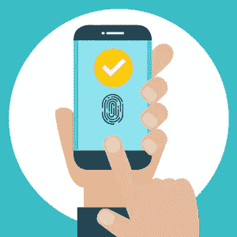

# 使用 Mendix Native Mobile 构建安全的生物认证

> 原文：<https://medium.com/mendix/building-a-secure-biometric-authentication-with-mendix-native-mobile-8219f7eff1b?source=collection_archive---------1----------------------->

## 移动应用总是不同于其他类型的应用。这是因为客户端生活在一个你无法控制的设备上。在本文中，我们将介绍如何以正确的方式在 Mendix Native Mobile 中构建安全的端到端生物认证。

Building a Secure Biometric Authentication with Mendix Native Mobile

> 本指南适用于 Mendix Studio Pro 9 及以上版本。

首先，我们将详细介绍开发人员正在使用的一些常见模式。然后，我们将更深入地探讨如何以最安全的方式做到这一点。

Mendix Native 功能强大，可扩展。它是使用最流行的移动平台之一 React Native 构建的。下面的所有代码都是 JavaScript，应该在使用自定义 JavaScript 操作的 nanoflow 中使用。

我强烈建议在完成这篇文章之前阅读下面的文档链接。

 [## 为本地移动设备构建 JavaScript 操作

### 本教程将教你为本地移动应用程序构建一个 JavaScript 动作。

docs.mendix.com](https://docs.mendix.com/howto/extensibility/create-native-javascript-action/) 

# 最简单的方法(极其糟糕的做法)

**这个流程中最弱也是最危险的一点是在设备上缓存凭证**。例如，使用像 localStorage 或 SQLite 这样的不安全存储看起来总是很容易，因为它有开箱即用的所有操作，但它完全不是。

**这是极其危险的！**

# 使用钥匙串/密钥库(良好的实践)

为了确保我们的凭证被安全地存储，我们需要利用一个本地组件，在 IOS 上称为“Keychain ”,在 Android 上称为“Keystore”。其主要目的是**以安全的方式提供对凭证、私有密钥及其相应证书链的访问和存储**。

您会发现一些结构良好的 React 本地库可以做到这一点。我喜欢用“**react-native-sensitive-info**”。

`react-native-sensitive-info` **管理储存在 Android 共享偏好设置、iOS 钥匙串和 Windows 凭证中的所有数据**。您可以使用简单的方法设置和获取所有的键/值对。

 [## react-native-sensitive-info

### react-native-sensitive-info 管理存储在 Android 共享偏好设置和 iOS 钥匙串中的所有数据。您可以设置、获取…

www.npmjs.com](https://www.npmjs.com/package/react-native-sensitive-info) 

> **快速提示:**
> 
> 您需要**在您创建动作的模块内的 javascriptsource 文件夹**中安装 NPM 模块，使用:
> 
> `npm i react-native-sensitive-info`
> 
> 此外，每当您使用需要本机代码的 NPM 模块时，请确保通过克隆 repo 安装并链接它，然后将更改推送到 github，将它安装在您的构建包中。“主分支”是你的普通构建,“开发分支”是你的定制开发构建。

我真正喜欢这个模块的是，它可以在 Android 和 IOS 上工作。它还自动在 FaceID 和 TouchID 之间切换，并提供检测硬件和生物识别注册的方法，所有这些都有助于您建立一个稳定的流程。

**该流最终将看起来像这样:**

# 移动生物特征触发所有权(完美)

**最强的设计是使用钥匙链来触发生物认证，如果成功，就发布证书**。我们可以使用同一个 React 本机模块来实现这一点。

最棒的是，当设备被根化并且应用程序被重新编译时，它不能被跳过，因为触发生物特征的动作不是一个单独的功能——它是检索/保存动作本身。

我们在这里通过**将 TouchID 设置为“真”并显示模态**来启用生物特征检索。

阅读更多关于 IOS 和 Android 中的**访问控制**的信息。它可以帮助您定义规则，如如果有人从备份中恢复设备，则限制每个设备的访问权限等。

**IOS** :

 [## Apple 开发者文档

### 安全访问控制 d

developer.apple.com](https://developer.apple.com/documentation/security/secaccesscontrol) 

**安卓**:

 [## 指纹管理员| Android 开发者

### AccessibilityServiceMagnificationController . OnMagnificationChangedListener

developer.android.com](https://developer.android.com/reference/android/hardware/fingerprint/FingerprintManager.html) 

## 最后的想法

虽然有许多方法可以实现相同的结果，但有些方法可能比其他方法更好。始终寻找所有选项的利弊，并决定哪一个是最适合您的实现。如果您对此有其他方法，请联系我们，在这里留下您的建议和评论。

## 阅读更多

 [## 构建 JavaScript 动作:第 1 部分(基础)

### 这篇操作指南将教你创建一个 JavaScript 动作。

docs.mendix.com](https://docs.mendix.com/howto/extensibility/write-javascript-actions/)  [## 构建 JavaScript 动作:第 2 部分(高级)

### 这个高级的 how-to 将教你做一个可以搜索 GitHub 用户的 JavaScript 动作。

docs.mendix.com](https://docs.mendix.com/howto/extensibility/write-javascript-github/)  [## JavaScript 动作调用

### 该参考解释了 JavaScript 动作调用活动的属性。

docs.mendix.com](https://docs.mendix.com/refguide/javascript-action-call/) 

*来自发布者-*

*如果你喜欢这篇文章，你可以在我们的* [*中页*](https://medium.com/mendix) *找到更多喜欢的。对于精彩的视频和直播会话，您可以前往*[*MxLive*](https://www.mendix.com/live/)*或我们的社区*[*Youtube PAG*](https://www.youtube.com/c/MendixCommunity/community)*e .*

*对于希望入门的创客，您可以注册一个* [*免费账户*](https://signup.mendix.com/link/signup/?source=direct) *，并通过我们的* [*学院*](https://academy.mendix.com/link/home) *获得即时学习。*

*有兴趣加入我们的社区吗？加入我们的* [*松弛社区频道*](https://join.slack.com/t/mendixcommunity/shared_invite/zt-hwhwkcxu-~59ywyjqHlUHXmrw5heqpQ) *。*