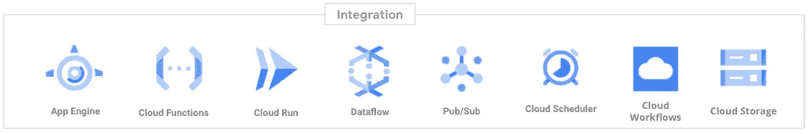
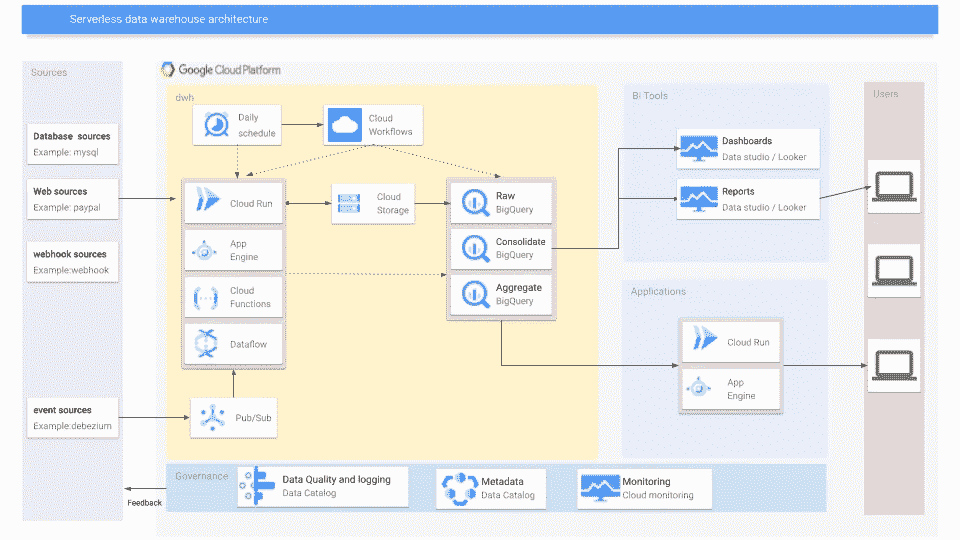

# 使用 GCP 构建无服务器数据仓库管道

> 原文：<https://medium.com/compendium/building-a-serverless-datawarehouse-pipeline-using-gcp-269c13457b1a?source=collection_archive---------0----------------------->

传统上，构建数据仓库需要在基础设施、工具和许可证方面进行大量资本投资，以深入了解您的数据。随着它们的存在和发展，这些解决方案往往会变得维护耗时、复杂，或者在响应新的业务需求时变化缓慢。

BigQuery 是 Google 云平台提供的无服务器数据仓库解决方案。没有数据，数据仓库就什么都不是，数据通常由连接到数据源的管道提供。

在这篇博文*中，我将只关注 GCP 提供的无服务器集成*。这意味着像 [Cloud Composer](/grensesnittet/copy-data-from-cloud-sql-to-bigquery-using-apache-airflow-cloud-composer-part-2-33aa02bf456a) 和数据融合这样的流行组件不是解决方案的一部分，尽管它们适合整体架构。

在无服务器模式下，你不必担心运行服务的基础设施，一切都由平台管理。

其中一个吸引人的部分是运营支出从 0 美元开始，您只需为您使用的东西付费(通常有一个慷慨的免费层)。如果您的规模很大，无服务器集成可能不是最具成本效益的，也应该探索其他选项。

[如果你需要专家意见，请随时联系我们！](https://computas.com/om/kontakt/)

# 数据源和集成

数据源和集成是一个谈论变化的话题。源可以基于 api 访问或直接访问数据库，以及两者之间的所有选择。有时您集成的系统有明确定义的服务契约(它有哪种类型的数据)，而一些系统(特别是遗留的或定制的)不支持这一点，您必须花时间发现系统内部。

数据源的摄取通常是以批处理或流式方式完成的。

将*批处理*数据接收到 GCP 的一个好模式是，调用一个程序定期从数据源读取数据，并以可以加载到 BigQuery 的格式将其存储到云存储中。例如，每日批处理作业可以用以下格式编写对象:SOURCE _ SYSTEM/batch/YEAR/MONTH/day . JSON

如果您有*流*数据，那么将消息放入队列是一个很好的模式。这使得您可以轻松地升级服务，同时在升级集成层时不会丢失数据。队列还充当多路复用，允许您使用不同的管道处理相同的数据。根据流频率和有效负载，还可以考虑将对象存储在云存储中，以便在需要时方便地重新处理。它确实帮助了我好几次，只是从云存储中重新创建一个 BQ 表，而不是处理一个缓慢的第三方来源。

假设您已经准备好了数据源，并且已经选择了集成组件，那么您需要解决调度工作流的问题。GCP 为调度和工作流提供了无服务器的替代方案:云调度器和云工作流。

云调度器基本上是一个 crontab，能够调用 http 端点，而云工作流可以在做参数和状态的同时调用多个端点。

> 使用所有这些组件有一个注意事项。他们中的一些人在被 GCP 的统治者杀死之前被限制了奔跑的时间。往积极的方面想。它将迫使你编写可伸缩的代码。使用扇出模式，在几个小时内回填数十亿个数据点是一种美事，当然前提是你不要让源系统过载；)

# 建筑

这是一个架构外观的例子，展示了所有集成组件如何协同工作。

在这种体系结构中，数据从左向右流动。前面描述的集成组件获取数据，并最终将它们存储在 BigQuery 中。

就我个人而言，我喜欢在 BigQuery 中有几个层，其中一层是原始的、未修改的层，它只是源系统的副本，添加了一些元数据，例如——提取时间/加载时间。下一层应该是原始数据集的整合层，您应该创建一个满足业务需求的数据模型。

对数据进行处理后，是时候将数据导入商业智能工具或定制应用程序了。Data studio 是基于网络的免费软件，是一个很好的起点。然而，它是缺乏的，尤其是当您想要部署仪表板、所有权等时

考虑到 GDPR，使用数据目录来标记您的 PII(个人可识别信息)数据是一个非常好的主意，这样您就可以对这些数据的位置有一个总体的了解，以便您可以适当地处理它们。

# 关于这个主题的进一步阅读

[我工作的公司刚刚发布了一份白皮书，描述了这个](https://computas.com/tjenester/dataanalyse/datavarehus-i-skyen/)的解决方案架构，由我和我的好同事 Per Axel 签署。如果你觉得这篇博客很有趣，并且想在 google cloud 上阅读更多关于 dwh 的内容，我建议你去看看！它在数据仓库层和业务方面有更多的深度，而*这篇博文只关注集成层。*

如果你需要一个完整的谷歌云企业数据仓库解决方案，我建议看看[shark cell](https://www.sharkcell-suite.com/)——它是一个具有一些独特想法的云原生解决方案！