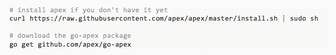

# 在 Go 中构建无服务器 REST API

> 原文：<https://medium.com/capital-one-tech/building-a-serverless-rest-api-in-go-3ffcb549ef2?source=collection_archive---------2----------------------->

无服务器，或 FaaS(功能即服务)，正在成为软件架构世界的一个重要趋势。在 AWS re:Invent 2016 大会上，有超过 40 场会议计划讨论无服务器架构，而一年前还不到 10 场。正如 [Mike Roberts](http://martinfowler.com/articles/serverless.html#benefits) 总结的那样，人们迅速采用无服务器架构的明显原因包括:

*   降低开发和运营成本
*   能够适应各种流量模式的自动扩展
*   更轻松的运营管理

那么什么是无服务器架构呢？根据 [ThoughtWorks](https://www.thoughtworks.com/radar/techniques/serverless-architecture) 、*的说法，“无服务器架构用短暂的计算能力取代了长期运行的虚拟机，这种计算能力根据请求而存在，并在使用后立即消失。”基于这个定义，REST APIs 非常适合使用无服务器架构，因为任何正在运行的代码都需要是无状态的，而且执行速度非常快。*

在这篇文章中，我们将描述如何在 Go (Golang)中开发一个无服务器的 REST API。更具体地说，我们将展示如何在 Go 中开发 REST API，将其部署为 [AWS Lambda](https://aws.amazon.com/lambda/) 函数，并最终通过 [Amazon API Gateway](https://aws.amazon.com/api-gateway/) 发布。

因为 AWS Lambda 本身不支持 Go，我们将使用一个名为 [Apex](http://apex.run/) 的框架来支持我们对语言的选择*(你可以使用自己选择的框架，甚至在这个实例中不使用框架)*。Apex 通过为 Amazon 的服务器架构构建 Go 二进制文件(GOOS=linux GOARCH=amd64)并在 Node.js Lambda 函数的子进程中运行它来实现这一点。Apex 还提供了各种与工作流相关的工具，用于构建、部署和测试 Lambda 函数、回滚部署、查看指标、跟踪日志等。我们将展示 Apex 如何简化大多数与 Lambda 相关的工作，并让我们专注于开发 Go 代码。

*提示:虽然 Apex 支持使用 Go 开发 Lambda 函数，但它也支持那些本地语言，包括 Node.js、Python 和 Java。当使用本地语言开发 Lambda 函数时，你可能会考虑的另一个流行框架是* [*无服务器框架*](https://serverless.com/) *。*

## 入门指南

首先，安装 apex 工具和相应的 Go 包，如下所示:

然后按照 [Apex 文档](http://apex.run/#aws-credentials)中的说明，设置使用 Apex 部署 Lambda 函数所需的 AWS 凭证。

## 创建 Lambda 函数

*提示:对于那些没有耐心的人，你可以查看我的 golang-serverless-restapi 开源项目的完整源代码。*

创建 Go 项目文件夹。根据 Apex 的要求，在项目文件夹下创建如下所示的文件夹结构。您也可以使用命令 apex init 来完成这项初始化工作。

Apex 项目可能有一个或多个 Lambda 函数，每个函数都被组织为 functions 文件夹的子文件夹。对于我们的演示项目，我们只需要一个名为 API 的 Lambda 函数。该函数通过名为 project.json 的项目级配置文件和名为 function.json 的特定于函数的配置文件进行配置。在这些文件中，我们指定参数，如内存限制、超时，Apex 在将 Lambda 函数部署到 AWS 时会使用这些参数。

project.json 文件应该包含以下内容:

function.json 文件可能包含:

上面的配置文件读到项目命名为 rest，名为 apis 的 Lambda 函数要保留 128MB 内存，运行时耗时不超过 10 秒。

的。apexignore 文件包含如下单行，通知 Apex 不应将任何 Go 源文件包含在部署分发中:

最后，main.go 文件是 go 源文件，包含我们的 REST API 实现和与 Apex 框架的连接。

在上面的代码中，我们首先创建了一个 HTTP 处理程序，它实现了 [http。Handler](https://golang.org/pkg/net/http/#Handler) 接口，就像我们在开发 REST API 时通常做的那样。这个处理程序负责接受各种 HTTP 请求并相应地处理它们。虽然在这个例子中我们使用标准的 http。ServerMux handler，如果您使用第三方 HTTP 路由框架，如 Echo 或 Gin，您应该仍然可以使用，因为它们都应该提供一个处理程序。

我们称之为顶点。HandleFunc 注册一个每次调用 Lambda 时都会调用的函数。该函数有两个参数:

*   第一个参数事件是一个 JSON 格式的字节数组，表示调用 Lambda 函数时使用的输入参数
*   第二个参数 ctx 包含函数调用的上下文信息(例如请求 ID、函数名)。

该函数返回的数据将由 Apex 以 JSON 格式整理，并设置为 Lambda 的输出。可能会返回指示 Lambda 调用失败的错误。

在 apex 注册的函数内。HandleFunc，我们首先将 Lambda 事件解析成标准的 [http。请求](https://golang.org/pkg/net/http/#Request)。然后，我们调用 HTTP 处理程序的 ServeHTTP 方法来处理请求。*注意，我们使用了一个* [*httptest。ResponseRecorder*](https://golang.org/pkg/net/http/httptest/#ResponseRecorder) *记录处理程序的响应。*最后我们将响应转换成 Lambda 所期望的格式。

当 Lambda 函数与 Amazon API Gateway 挂钩时(稍后描述)，其输入和输出的格式可以描述为以下结构:

所以在前面描述的 main 函数中，ParseRequest 函数应该将 LambdaInput 转换成 http。请求，而 FormatResponse 转换 httptest。ResponseRecorder 到 LambdaOutput，并 format error 从错误构建 LambdaOutput。

如果您已经有了一个想要转换成无服务器的 REST API，这是您应该做的主要调整工作。

由于数据转换工作非常简单，我们在这里不会展示实现。如果你想了解更多，请在我的[golang-server less-restapi](https://github.com/qiangxue/golang-serverless-restapi)开源项目中找到完整的源代码。

## 部署 Lambda 函数

在 Apex 的帮助下，部署 Lambda 函数就像运行一个命令一样简单，如下所示:

上面的命令将在 functions 文件夹下构建每个 Lambda 函数，并将它们部署到 AWS 区域 us-east-1。我们可以多次运行同一个命令。如果 Apex 检测到二进制文件的任何更改，它将创建新版本，并将其命名为最新版本。

我们可以使用 Apex 或通过 AWS 控制台测试部署的 Lambda。例如:

## 配置 Amazon API 网关

尽管我们已经在 AWS 上部署了 Lambda 功能，但它目前还不能被互联网用户访问。我们需要使用 Amazon API Gateway 将来自互联网用户的 HTTP 请求委托给 Lambda 函数。为了实现这个目标，我们将利用 Amazon API Gateway 的代理特性。

采取以下步骤来配置 Amazon API Gateway:

1.  登录 AWS 控制台并切换到 API 网关页面。在该页面上，选择“Create new API”并输入 API 名称“hello”(或者您喜欢的任何其他名称)。
2.  在“hello”API 的“Resources”选项卡中，单击“Actions”下拉按钮并选择“Create Resource”。在“新建子资源”页面中，选择“配置为代理资源”，然后单击“创建资源”按钮。见下面截图作为参考。

1.  在“/{proxy+} — ANY — Setup”页面中，选择“Lambda Region”作为 us-east-1(或您用来部署 Lambda 函数的实际 AWS 区域)，并输入“Lambda 函数”名称作为 rest_apis。单击“保存”按钮完成代理资源设置。见下面截图作为参考。

1.  单击“操作”下拉按钮，然后选择“部署 API”。在弹出窗口中，在“部署阶段”下拉列表中选择[新阶段]，并在“阶段名称”输入字段中输入 prod。单击“部署”按钮完成部署。
2.  此时，您应该被重定向到一个页面，该页面显示了关于“hello”API 的部署信息。你应该在页面上看到一个类似于[https://xxxxxxxxx.execute-api.us-east-1.amazonaws.com/prod.](https://xxxxxxxxx.execute-api.us-east-1.amazonaws.com/prod.)的“调用 URL ”,这是一个根 URL，每个人都可以用它来访问我们的 REST API。

如果您更喜欢使用 AWS CLI，也可以运行以下命令来实现上述步骤:

## 尝试一下

运行以下命令来验证 REST API 是否可访问并按预期工作:

在 AWS 控制台中，找到名为 rest_apis 的 Lambda 函数，并检查其监控结果，以验证 Lambda 确实被调用了。

最后，记住我们的 REST API 的默认根 URL 不是用户友好的。Amazon API Gateway 允许我们设置一个自定义域名(例如 api.example.com ),这样 URL 看起来更简单、更直观。有关如何实现这一目标的更多信息，请参阅 AWS 文档。

## 最终注释

在上面，我们已经展示了如何从头开始开发一个无服务器 REST API。然而，同样的过程也可以用来将现有的 REST API 转换成无服务器的。要做到这一点，唯一需要的改变是修改 NewHTTPHandler 函数，以使用现有的 HTTP 路由代码。

亚马逊 API 网关的代理功能非常容易使用。然而，使用它也意味着我们不能利用网关提供的许多其他高级功能；包括认证、错误处理、速率限制等。对于现有的 REST API 来说，这可能不是问题，因为这些特性很可能已经在 API 层实现了。如果您正在开发一个 REST API，您可能想要考虑网关的更高级的用法。但是，要注意的是，网关的配置不是一项简单的任务，尤其是当 API 处于频繁变化的活跃开发阶段时。

*最初发表于*[T5【developer.capitalone.com】](https://developer.capitalone.com/blog-post/building-a-serverless-rest-api-in-go/)*。*

要了解更多关于 Capital One 的 API、开源、社区活动和开发人员文化的信息，请访问我们的一站式开发人员门户网站 DevExchange。