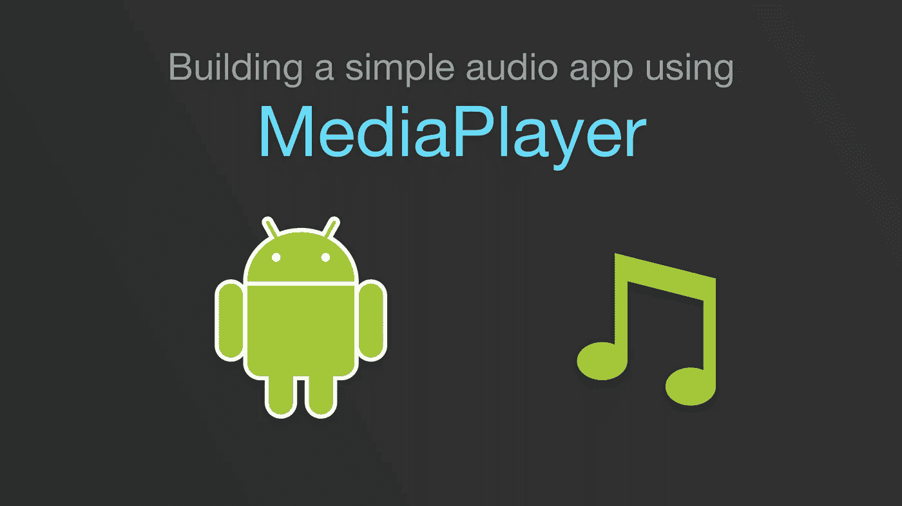

# 在 Android 中构建简单的音频应用程序(第 1/3 部分)

> 原文：<https://medium.com/androiddevelopers/building-a-simple-audio-app-in-android-part-1-3-c14d1a66e0f1?source=collection_archive---------0----------------------->

## 媒体播放器游戏攻略

# 介绍

Android 媒体 API 包含许多高级功能，允许开发人员创建丰富的媒体体验。它们包括像`ExoPlayer`、`[MediaSession](/google-developers/understanding-mediasession-part-1-3-e4d2725f18e4)`、音频聚焦、音量调整和许多其他围绕媒体播放和控制的惊人功能。

这一系列文章的目标是通过创建一个叫做“简单媒体播放器”的非常基本的音频播放应用程序，让你开始使用 Android `[MediaPlayer](https://developer.android.com/reference/android/media/MediaPlayer.html)` API。这是 3 部分系列的第一部分，包括:

1.  **MediaPlayer 简介** ( *本文*)
2.  [构建应用](/@nazmul/building-a-simple-audio-app-in-android-part-2-3-a514f6224b83)
3.  [与滚动条同步](/@nazmul/building-a-simple-audio-app-in-android-part-3-3-ead4a0e10673)

# 第 1/3 部分— MediaPlayer 简介

本文将涵盖以下内容:

*   通过考虑一些简单的音频回放任务以及它们如何映射到`MediaPlayer`状态机，`MediaPlayer`是如何工作的。

# 基本 MediaPlayer 任务

以下是`MediaPlayer`需要处理的基本任务:

*   **加载媒体文件进行播放**。这是通过方法`[setDataSource()](https://developer.android.com/reference/android/media/MediaPlayer.html#setDataSource(android.content.res.AssetFileDescriptor))`、`[prepare()](https://developer.android.com/reference/android/media/MediaPlayer.html#prepare())`和`[prepareAsync()](https://developer.android.com/reference/android/media/MediaPlayer.html#prepareAsync())`完成的。
*   **开始回放/播放音频**。这个由`[start()](https://developer.android.com/reference/android/media/MediaPlayer.html#StateDiagram)`处理。
*   **暂停播放(一旦开始播放)**。这个由`[pause()](https://developer.android.com/reference/android/media/MediaPlayer.html#StateDiagram)`处理。
*   **停止播放并重置 MediaPlayer，以便您可以向其加载另一个媒体文件**。这个由`[reset()](https://developer.android.com/reference/android/media/MediaPlayer.html#StateDiagram)`处理。
*   **求一首歌的长度(毫秒)**。此事由`[getDuration()](https://developer.android.com/reference/android/media/MediaPlayer.html#StateDiagram)`处理。
*   **查找歌曲正在播放的部分**。这个由`[getCurrentPosition()](https://developer.android.com/reference/android/media/MediaPlayer.html#StateDiagram)`处理。
*   **跳到歌曲中的特定时间位置(毫秒),并从该位置开始播放**。此事由`[seekTo(position)](https://developer.android.com/reference/android/media/MediaPlayer.html#StateDiagram)`处理。
*   **检查音频是否正在播放**。这是由`[isPlaying()](https://developer.android.com/reference/android/media/MediaPlayer.html#StateDiagram)`处理的。
*   **找出一首歌曲何时播放完毕**。这通过附加一个`[MediaPlayer.OnCompletionListener](https://developer.android.com/reference/android/media/MediaPlayer.html#setOnCompletionListener(android.media.MediaPlayer.OnCompletionListener))`来处理。您的代码将从监听器获得一个`[onCompletion()](https://developer.android.com/reference/android/media/MediaPlayer.OnCompletionListener.html#onCompletion(android.media.MediaPlayer))`回调。
*   **解除分配玩家使用的资源**。这是由`[release()](https://developer.android.com/reference/android/media/MediaPlayer.html#release())`处理的，它会释放所有附属于播放器的资源。释放后，播放器不再可用。

此列表涵盖了音频内容的基本回放任务，但并不详尽。对于流媒体等复杂的音频应用程序，还有更复杂的功能，处理音频聚焦、音量整形和使用`[MediaSession](/google-developers/understanding-mediasession-part-1-3-e4d2725f18e4)`。有关这些高级主题的更多信息，请参考`MediaPlayer` [API 指南](https://developer.android.com/reference/android/media/MediaPlayer.html)。

# 简化状态机

下面是对用于音频回放的`MediaPlayer’s`状态机的简化描述:

首先创建一个`MediaPlayer`的实例。

1.  然后将您想要的媒体文件加载到播放器中。这意味着使用带有描述媒体文件来源的参数的`setDataSource()`方法。
2.  现在您需要准备您的数据源。有两种方法可以做到这一点:

*   使用`prepare()`。此方法将阻塞调用线程，因此应该只用于本地存储在设备上的数据源。
*   使用`prepareAsync()`。此方法将异步准备数据源，应该用于远程或大型数据源。使用这种方法，当您的媒体准备好播放时，您会收到一个回调，此时您可以在应用程序的 UI 中启用媒体播放控件。您可以使用`[MediaPlayer.OnPreparedListener](https://developer.android.com/reference/android/media/MediaPlayer.OnPreparedListener.html)`在播放器为您加载内容并开始播放时获得通知。您可以使用`[setOnPreparedListener(listener)](https://developer.android.com/reference/android/media/MediaPlayer.html#setOnPreparedListener(android.media.MediaPlayer.OnPreparedListener))`将该监听器连接到您的播放器。

现在您的音频已经加载，您可以播放和暂停您的音频。您可以停止和重新开始播放。

1.  **播放** —使用`start()`告诉播放器开始播放。您可以使用`isPlaying()`询问播放器是否正在播放。
2.  **暂停** —只有当`isPlaying()`为真时才能暂停，因此在调用`pause()`之前，请务必检查这一点。
3.  **停止** —使用`reset()`方法来完成。它将停止播放并重置播放器，以便您可以将其他媒体文件加载到其中。
4.  **Seek** —使用带有时间偏移的`seekTo()`方法将音频回放移动到所需位置。当您允许用户将回放移动到当前加载的媒体中的任何位置时，这是必需的。

当你完成 MediaPlayer 的实例时，一定要`release()`它。一旦释放，您必须创建一个新的`MediaPlayer`对象，并从步骤 1 开始，以便播放另一个媒体文件。

要开始构建应用程序，请查看本系列的第 2/3 部分[构建应用程序](/@nazmul/introduction-to-mediaplayer-part-2-3-a514f6224b83)。

 [## 在 Android 中构建一个简单的音频应用程序(第 2/3 部分)

### 构建应用程序

medium.com](/@nazmul/building-a-simple-audio-app-in-android-part-2-3-a514f6224b83) 

# Android 媒体资源

*   [了解媒体会话](/google-developers/understanding-mediasession-part-1-3-e4d2725f18e4)
*   [Android 媒体 API 指南—媒体应用概述](https://developer.android.com/guide/topics/media-apps/media-apps-overview.html)
*   [Android 媒体 API 指南—使用媒体会话](https://developer.android.com/guide/topics/media-apps/working-with-a-media-session.html)