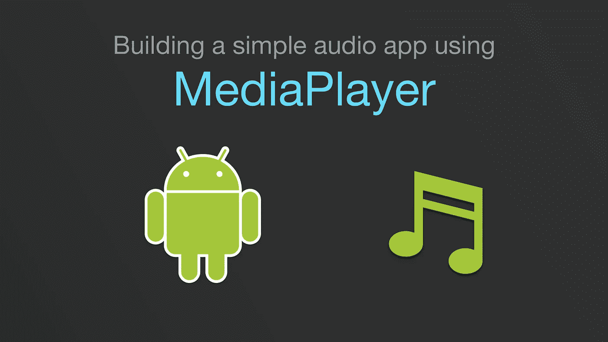
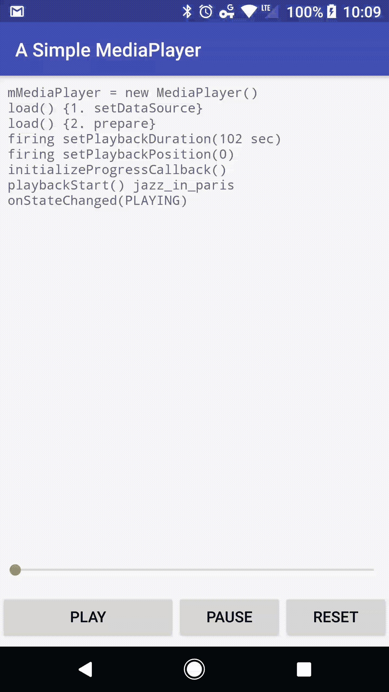

# 在 Android 中构建一个简单的音频应用程序(第 2/3 部分)

> 原文：<https://medium.com/androiddevelopers/building-a-simple-audio-app-in-android-part-2-3-a514f6224b83?source=collection_archive---------2----------------------->

## 构建应用程序

# 介绍

本系列文章的目标是通过创建一个名为“简单的 MediaPlayer”的非常基本的音频播放应用程序，让您开始使用 Android `MediaPlayer` API。这是 3 部分系列的第二部分，包括:

1.  [MediaPlayer 简介](/@nazmul/building-a-simple-audio-app-in-android-part-1-3-c14d1a66e0f1)
2.  **构建 app** ( *本文*)
3.  [与滚动条同步](/@nazmul/building-a-simple-audio-app-in-android-part-3-3-ead4a0e10673)

# 第 2/3 部分—构建应用程序

本文将涵盖以下内容:

*   如何使用`MediaPlayer`类(创建、准备、启动、重置、搜索)并对其状态机有一个工作理解。

# app 长什么样？

# 源代码在哪里？

 [## Google samples/Android-简单媒体播放器

### 在 GitHub 上创建一个帐户，为 android-SimpleMediaPlayer 开发做出贡献。

github.com](https://github.com/googlesamples/android-SimpleMediaPlayer) 

示例应用程序的源代码可在 [GitHub](https://github.com/googlesamples/android-SimpleMediaPlayer) 上获得。这个应用程序允许你播放来自`res/raw`文件夹的 MP3 文件，而不需要从网络音频源播放。它使用了`MediaPlayer` API，因此你可以通过与应用程序交互来清楚地了解状态和转换。

# 构建应用程序

该应用程序使用系列第 1/3 部分[中描述的状态机部分。您可以查看示例应用程序的](/@nazmul/introduction-to-mediaplayer-part-1-3-c14d1a66e0f1)`[MediaPlayerHolder](https://github.com/googlesamples/android-SimpleMediaPlayer/blob/53fbbbafc9ab14d51041fc52ced2a6926484c274/app/src/main/java/com/example/android/mediaplayersample/MediaPlayerHolder.java)`类来了解这一点。

1.  `MediaPlayerHolder`实现了一个名为`[PlayerAdapter](https://github.com/googlesamples/android-SimpleMediaPlayer/blob/53fbbbafc9ab14d51041fc52ced2a6926484c274/app/src/main/java/com/example/android/mediaplayersample/PlayerAdapter.java)`的接口，该接口允许`[MainActivity](https://github.com/googlesamples/android-SimpleMediaPlayer/blob/53fbbbafc9ab14d51041fc52ced2a6926484c274/app/src/main/java/com/example/android/mediaplayersample/MainActivity.java)`控制回放功能。
2.  `MainActivity`创建一个 UI，允许用户播放、暂停和停止媒体播放。它创建了一个`MediaPlayerHolder`对象。
3.  `MainActivity`实现了一个名为`[PlaybackInfoListener](https://github.com/googlesamples/android-SimpleMediaPlayer/blob/53fbbbafc9ab14d51041fc52ced2a6926484c274/app/src/main/java/com/example/android/mediaplayersample/PlaybackInfoListener.java)`的接口，允许`MediaPlayerHolder`在媒体持续时间和进度改变时更新它。

# 正在加载媒体(准备，prepareAsync)

为了简单起见，音频文件是从这个项目的`res/raw`文件夹中加载的。此文件夹中有一个文件:`jazz_in_paris.mp3`。

# 播放控制(开始、复位、停止、查看)

在示例应用程序的 UI 中只有 3 个按钮——播放、暂停和重置。下面是`MainActivity`中与此相关的代码。注意:`mPlayerAdapter`实现了`PlayerAdapter`，这也是`MediaPlayerHolder`功能暴露给`MainActivity`的方式。

下面是`MediaPlayerHolder`(实现了`PlayerAdapter`)中实际管理`MediaPlayer`的几个方法。

# 媒体播放器生命周期

当您播放音频并更改屏幕方向时，回放可能会出现问题。这篇文章仅仅关注于`MediaPlayer`，并没有深入到你需要实现的客户端服务器架构中，即使当你的应用程序的活动不运行或者不在前台时，你也可以在后台处理音频播放。

当屏幕方向改变时，Android 会破坏活动并重新创建它。在我们的示例代码中，我们创建了`MediaPlayer`，并在`MainActivity`的生命周期中保留它。为了简单起见，我们将覆盖 Activity 的默认行为来销毁自身，并自己处理屏幕配置更改。

我们通过向应用程序的`AndroidManfiest.xml`添加以下内容来实现这一点。你可以在 developers.android.com 了解更多。

当没有播放音频时，不要紧抓`MediaPlayer’s`资源，这一点很重要。`MediaPlayer`拥有大量由 Android 操作系统提供的共享资源(比如编解码器)。在不使用时释放这些资源非常重要。`MediaPlayerHolder`类有一个`release()`方法，它最终释放了`MediaPlayer`。这由`MainActivity`的`onStop()`方法调用。

一旦一个`MediaPlayer`被释放，就不能再被使用。所以必须创造一个新的。当调用`loadMedia(int)`方法时,`MediaPlayerHolder`负责此事，以便加载和准备要从 APK 播放的 MP3 文件。

当应用移至后台时，`MainActivity`不支持媒体播放。在`onStop()`方法中，停止播放，并释放`MediaPlayer`。

为了支持后台回放，您应该使用绑定并启动的服务，或者使用`[MediaSession](/google-developers/understanding-mediasession-part-1-3-e4d2725f18e4)`。我们将在其他文章中讨论这些内容。

要继续构建应用程序并集成`SeekBar`以持续同步播放进度和清除器，请查看本系列的[第 3/3 部分-与 SeekBar](/@nazmul/building-a-simple-audio-app-in-android-part-3-3-ead4a0e10673) 同步。

 [## 在 Android 中构建一个简单的音频应用程序(第 3/3 部分)

### 与搜索栏同步

medium.com](/@nazmul/building-a-simple-audio-app-in-android-part-3-3-ead4a0e10673) 

# Android 媒体资源

*   [了解媒体会话](/google-developers/understanding-mediasession-part-1-3-e4d2725f18e4)
*   [Android 媒体 API 指南—媒体应用概述](https://developer.android.com/guide/topics/media-apps/media-apps-overview.html)
*   [Android 媒体应用编程接口指南—使用媒体会话](https://developer.android.com/guide/topics/media-apps/working-with-a-media-session.html)