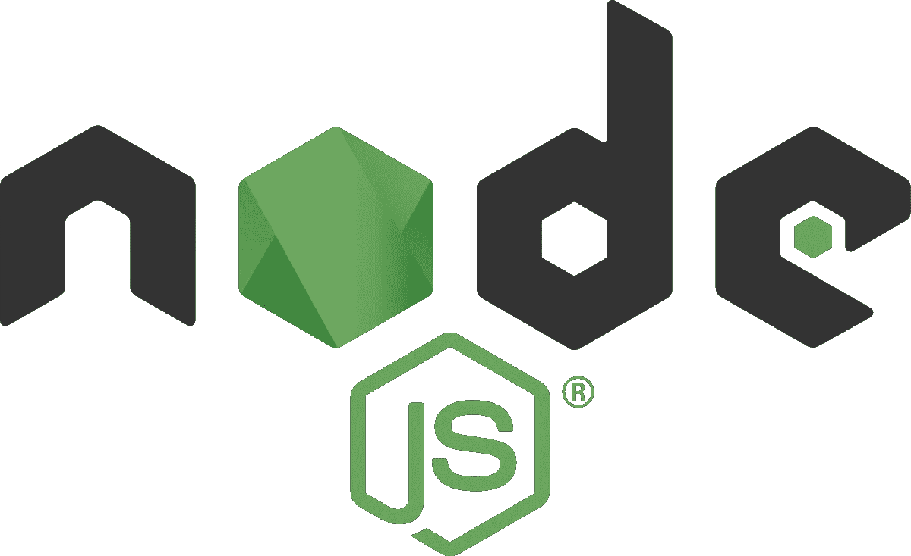

# 如何构建一个简单的 REST API:NodeJS 和 Express 简介？

> 原文：<https://medium.com/quick-code/building-a-simple-rest-api-introduction-to-nodejs-and-express-fc25daf57baf?source=collection_archive---------2----------------------->



The image is taken from Wikipedia.

你曾经想了解更多关于后端开发过程的知识吗？如果你有构建前端应用的经验，这里是一个很好的起点。您将发现如何使用相同的技术堆栈来构建服务器。如果您已经有了使用其他框架开发 API 的经验，您将在这里了解到使用 NodeJS 和 Express 开发**和部署**有多快多容易。****

**本质上，Node 是一个 Javascript 运行时环境，与 Chrome engine(迄今最快的 JS 引擎)构建在同一引擎上。Node 的非阻塞或异步特性使其成为构建 I/O 密集型应用程序的理想选择。**

# **入门指南**

**首先，前往 https://nodejs.org/en/[下载 NodeJS 的最新稳定版本。在计算机上安装了应用程序后，请检查安装的版本:](https://nodejs.org/en/)**

```
node -vnpm -v
```

# **初始化应用程序**

**有多种方法来初始化一个应用程序，但是在本教程中，我将使用最简单的方法。
我们先新建一个文件夹 myapp，新建一个文件 index.js:**

```
$ mkdir myapp
$ cd myapp
$ touch index.js
```

**要进行初始化，请运行以下命令:**

```
$ npm init --yes
```

**`yes`标志用于输入所有问题的默认值。命令输出将如下所示:**

```
{"name": "myapp","version": "1.0.0","description": "","main": "index.js","scripts": {"test": "echo \"Error: no test specified\" && exit 1"},"keywords": [],"author": "","license": "ISC"}
```

**从输出中可以看到，主要的入口点是`index.js`。这些只是名字，你不应该太在意。**

# **安装依赖项**

**让我们安装 express 和一些我通常使用的有用模块。**

```
npm i express morgan debug multer serve-index
```

***还有其他有用的模块在本教程中不会用到，但我会在下面列出来供您参考。一些安装的模块在本教程中没有用到，但是 GitHub gist 提供了参考。包括它们以避免编译错误。***

**让我们打开我们创建的`index.js`文件，并添加以下代码:**

```
*const* express = require('express');
*const* app = express();
*const* port = process.env.PORT || 3000;app.listen(port, () *=>* {
 *console*.log('Server is up and running on port ', port);
})
```

# **运行和配置应用程序**

**恭喜你。您已经创建了您的第一个 express 服务器！它将从环境变量(如果可用)或 3000 监听端口。让我们像这样运行应用程序:**

```
$ node index.js
Server is up and running on port 3000
```

## **调试模块**

**现在，让我们介绍一个`debug`模块。正如你所看到的，当前的`console.log`只是打印了一个简单的行。对于简单的应用程序来说，这可能是可以接受的，但是当您的应用程序扩展时，在各种日志之间进行一些区分是有好处的。
编辑`index.js`:**

```
*const* express = require('express');
*const* app = express();
*const* debug = require('debug')('myapp:server');*const* port = process.env.PORT || 3000;app.listen(port, () *=>* {
 debug('Server is up and running on port ', port);
})
```

**它的作用是我们获得调试函数并传入模块名`myapp:server`。`DEBUG`然后使用环境变量来切换不同的名称空间。让我们试一试:**

********

**你可以在这里看到，你得到了更多的视觉输出。这在查看日志时非常有用。您可以设置显示所有日志或仅显示某些命名空间。**

**该应用程序现在可以在 [http://localhost:3000](http://localhost:3000) 访问，但当你试图访问它时，你会得到`Cannot GET /`。这是因为我们没有在服务器上设置任何事件监听器。因此，让我们创建一些事件侦听器。**

**服务器将接收请求，处理请求并返回响应。请求有 4 种主要类型:GET 用于检索数据，POST 通常用于创建实体，PUT 通常用于更新实体，DELETE 通常用于删除实体。让我们创建一个简单的 get 请求:**

```
app.get('/', *function*(*req*,*res*) {
 return res.send("hello from my app express server!")
})
```

**如果你访问 [http://localhost:3000](http://localhost:3000) ，你现在会得到一个响应！**

**现在让我们实现一些额外的功能，以便我们可以测试它。**

**因此，我们已经实现了所有 4 个主要方法。我已经在注释中给出了每种方法的作用。现在我们可以使用 Postman 来检查所有这些方法的工作情况。**

# ****代码重构****

**这就完成了工作，我们现在可以获得用户，更新他们的数据或删除他们。然而，这是完全不可伸缩的。在实际应用中，有多条路线，将所有这些放在单个`index.js`文件中并不理想。让我们做一些重构，让我们所有人的生活更轻松。**

**返回主文件夹，执行以下操作:**

```
$ mkdir routes
$ cd routes
$ touch user.route.js
```

**将以下代码复制到新创建的文件中。在这里，我们创建一个路由器(迷你应用程序)，定义事件并将其导出以供其他地方使用。**

**然后`index.js`简化成上面的代码。这使得组织和维护代码库变得更加简单。虽然看起来不重要，但从长远来看，考虑可伸缩性或可维护性总是好的。**

## **HTTP 日志模块**

**在我们结束本教程之前，还记得我们安装了`morgan`？这是一个用于 NodeJS 的 HTTP 日志中间件。本质上，它帮助我们记录所有的请求。我已经在上面的代码预览中包含了它。让我们运行应用程序并发出一些请求，您应该会看到类似这样的内容:**

```
node index.js
GET /users/ 200 57 - 16.789 ms
POST /users/ 200 85 - 0.739 ms
PUT /users/1 200 85 - 0.590 ms
DELETE /users/last 200 27 - 0.412 ms
```

**关于您希望如何完成日志记录，有更多的选项。请随意查看完整的文档。**

**我写下这个简单的教程是为了巩固我自己的学习，也是为了在这个过程中帮助别人。如果有人觉得这些有用，请随意分享或者让我知道是否有错误/不好的实践/实现。**

**我将在 NodeJS 上创建另一个教程，包括认证、授权、将我们的服务器连接到 MySQL / MongoDB、单元/集成测试以及最终部署。**

**祝编码愉快！**