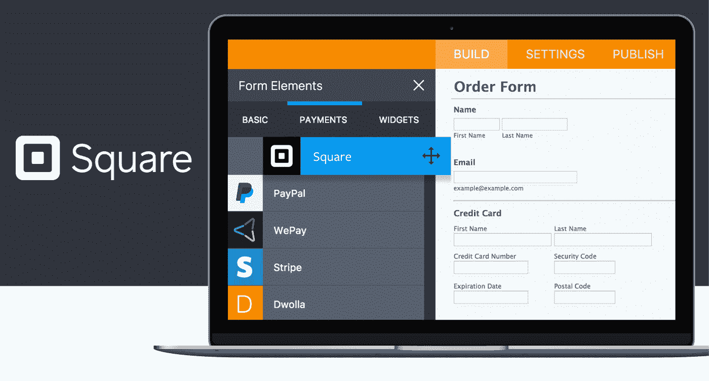
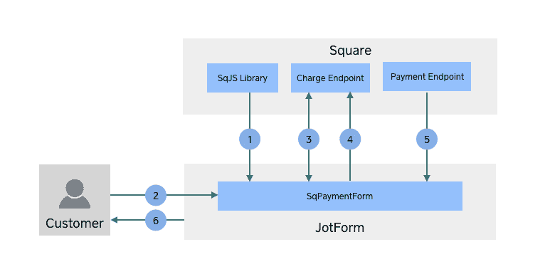
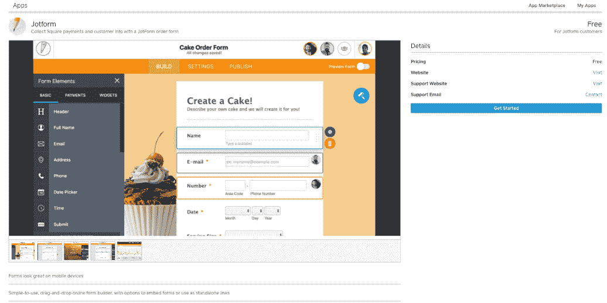

# 帮助商家轻松地将在线表单集成到他们的电子商务网站中

> 原文：<https://medium.com/square-corner-blog/building-a-successful-business-by-helping-merchants-easily-integrate-online-forms-into-their-e-d7f56a21e168?source=collection_archive---------0----------------------->

> 注意，我们已经行动了！如果您想继续了解 Square 的最新技术内容，请访问我们的新家[https://developer.squareup.com/blog](https://developer.squareup.com/blog)

*一个拖放式表单生成器，旨在让任何人——技术恐惧者的熟练开发者——点击几下就能创建在线表单。*

[Jotform](https://www.jotform.com/) 最初是一种任何人都可以发布在线表格的方式，可以记录联系信息和在线申请。在建立了强大的基础后，JotForm 意识到 Square 是他们现有客户的一个受欢迎的支付平台。

集成开发人员 Neil Acero 表示:“许多 JotForm 用户可以通过 Square 轻松收款，但也需要一种在线处理 Square 付款的方式。

添加与 Square 的集成使 JotForm 成为各种规模的商家的超级吸引人的选择。它使他们能够同时收集客户信息和付款，将 JotForm 变成处理订单、活动注册和捐赠的强大工具。

**与 Square 的 API 集成**

正如 JotForm 的许多重要决定一样，与 Square 集成的决定始于一个 JotForm 用户的请求——这个请求他们听到了很多。由于使用 JotForm 创建支付表单非常简单，所以与 Square 集成非常有意义，因为在 Square 中，在线支付收集部分就像亲自收集支付一样无缝。

JotForm 的集成开发人员 Neil Acero 说:“我们的客户甚至在他们的电子商务 API 发布之前就要求我们与 Square 集成。

受 Square 作为企业主获得报酬的一种方式如此受欢迎的激励，JotForm 一听说有可能集成就开始了工作。Jotform 希望成为第一个与 Square 集成的表单构建器，因为他们觉得它会为使用 Jotform 的任何人增加很多价值，事实也确实如此。

为了使集成成为可能，JotForm 使用 Square 支付形式作为前端，同时利用 Square Connect [v1](https://docs.connect.squareup.com/api/connect/v1/) 和 [v2](https://docs.connect.squareup.com/api/connect/v2) 。集成连接到 4 个端点:[交易](https://docs.connect.squareup.com/api/connect/v2#navsection-transactions)、[地点](https://docs.connect.squareup.com/api/connect/v2#navsection-locations)、[支付(v1)](https://docs.connect.squareup.com/api/connect/v1/#navsection-payments) 、 [OAuth2](https://docs.connect.squareup.com/api/connect/v2#usingoauth) 。

它们的实现非常简单:

1.  SqPaymentForm 在 JotForm 中呈现。
2.  客户输入他们的卡信息。
3.  JotForm 请求一个 card nonce，然后将它包含在表单请求中。
4.  通过连接到交易端点来处理支付交易。如果发现访问令牌已过期，他们会尝试更新它；如果尝试失败，他们会显示一条错误消息，并向 JotForm 所有者发送一个警告，要求他们将 JotForm 重新连接到 Square。
5.  当交易成功时，JotForm 从支付端点(v1)获得支付细节。
6.  然后，收据链接通过电子邮件发送给付款人。

他们还运行一个计划任务，查找过期的令牌并尝试更新它们，以最大限度地减少客户在交易过程中更新令牌的需求。

到目前为止，JotForm 对 Square API 的体验相当完美。他们能够很快测试 API 并进行模拟支付。“入门”页面和 API 参考使编写实现变得轻而易举。Square 的开发人员支持也非常及时，能够准确及时地回答问题。

“到目前为止，一切都令人惊讶。文档是顶级的！”尼尔·阿塞罗说。

**Square 对该开发商的业务产生了怎样的影响，未来会有什么样的发展**

由于与 Square 的集成，JotForm 能够进入小型企业的巨大市场，这些企业希望使用相同的支付处理器进行在线支付和面对面支付。与 Square 的整合带来了许多新业务，这也是 JotForm 的一个强大卖点。JotForm 在使用 Square 平台方面非常成功，以至于我们的团队与他们合作，在 [Square 应用市场](https://squareup.com/app-marketplace)上发布了他们的解决方案，这为他们提供了一个新的强大渠道，与数百万使用 Square 的企业分享他们的解决方案。

JotForm 是一家非常有活力的公司，渴望创新，不断为用户带来新功能。2017 年春天，他们推出了 JotForm 4.0，这是他们传统表单生成器的重新想象版本，允许用户使用任何设备创建表单。它还允许用户与其团队成员实时协作处理表单。

他们接下来将推出一种新的表单样式，它真正关注的是填写表单的人的体验，而不仅仅是表单创建者。这可能意味着更高的转换率，这意味着使用 JotForm/Square-powered 订单销售产品的用户将获得更多收入。

“我们看到 Square 的增长相当稳定。集成开发人员 Neil Acero 说:“Square 是我们发展最快的集成之一，到目前为止，我们收到的关于提供 Square 的反馈非常好。

关于 Square 的 API 以及它们能让你构建什么的更多信息，请查看我们的开发者门户上的[文档。](https://docs.connect.squareup.com/)