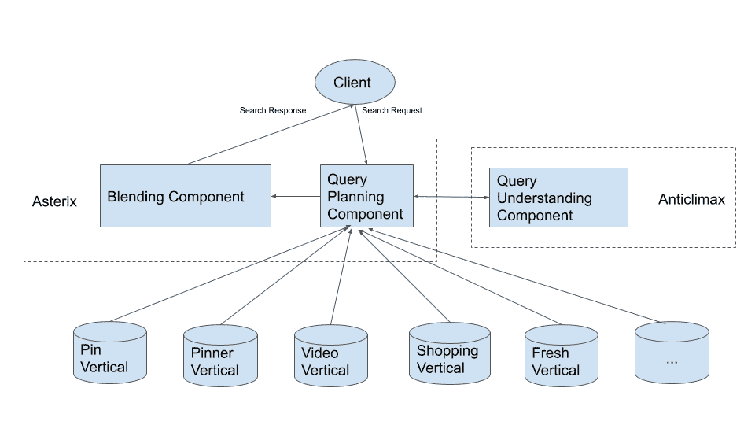
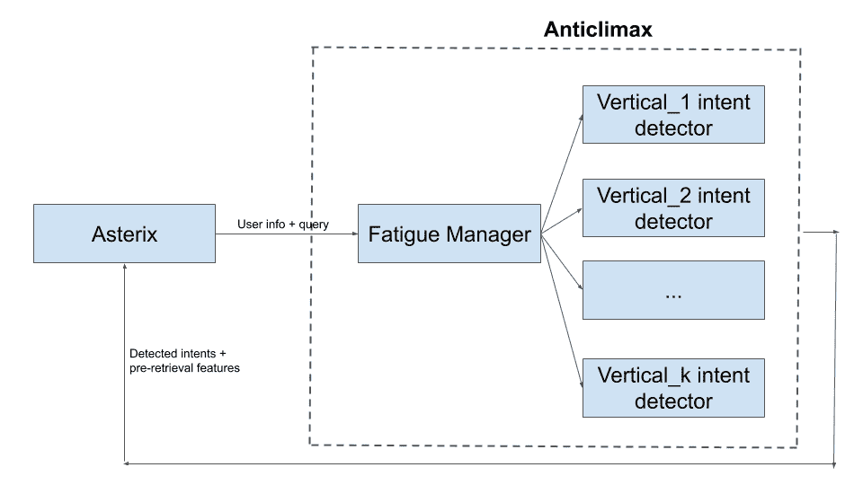
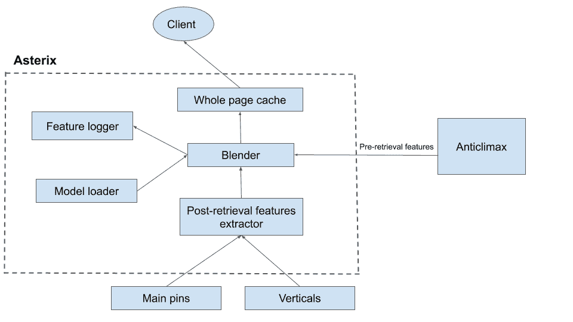
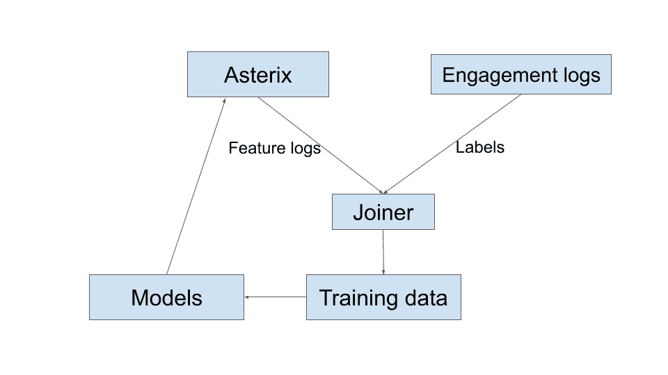

# 为 Pinterest 建立一个通用搜索系统

> 原文：<https://medium.com/pinterest-engineering/building-a-universal-search-system-for-pinterest-e4cb03a898d4?source=collection_archive---------2----------------------->

陈忠贤| Pinterest 搜索技术主管

在 Pinterest 上，最好的答案超越了文本，甚至可以超越图像。例如，当你在寻找眼妆创意时，一个根据你的肤色定制的视频，教你如何打造一种特定的妆容，可能比一枚展示最终效果的大头针更有用。如果你正在收拾你的后院，寻找照明创意，跟随一个后院照明专家可以一站式获取信息，而不是浏览多个网站。

随着 Pinterest 上内容类型的增长，我们的搜索结果也必须适应。Pinners 可以使用过滤器缩小到他们想要的内容类型，但我们可以通过预测最相关的答案来改善体验。作为一个解决方案，我们正在构建一个系统，在一个集成的搜索结果页面中提供来自不同垂直市场的内容。今天，当你搜索的时候，你已经可以看到这些不同类型的格式(视频、购物、Pinners to follow)。随着时间的推移，通过机器学习排名的进步，这些结果将变得更加个性化和相关，

# **架构概述**

该系统有三个主要组件:

*   查询理解组件负责基于查询标记以及历史参与度来检测垂直意图。它还填充混合组件中使用的预检索功能。
*   查询规划组件基于检测到的意图来决定向哪些垂直市场发送请求，并组合这些请求。它还决定是否从随机垂直市场获取结果，以生成用于机器学习混合模型的训练数据。
*   混合组件负责基于查询意图和垂直结果质量，使用模型将垂直结果混合到主 Pin 搜索结果中。

查询理解组件存在于 Anticlimax 中，这是一个为理解和重写查询而开发的服务。查询规划和混合组件都存在于 Asterix 中，Asterix 是我们搜索系统的根，与所有垂直行业对话。

# **详细设计**

查询理解和规划组件相对容易理解，所以我们将在混合组件上花更多的时间。

## **查询理解组件**

该组件决定从哪些垂直领域获取结果。因为我们有来自 Asterix 的用户信息和查询作为输入，所以我们可以检查用户最近在哪些垂直领域看到了类似的查询，以及他们在这些查询中参与了什么。如果他们没有涉足某些垂直市场，我们在不久的将来不会展示更多的垂直市场。对于在这个步骤之后还没有疲劳的所有垂直市场，我们然后通过每个垂直市场的意图检测器运行查询。每个意图检测器返回在混合中使用的具有预检索特征的意图(如果有的话)。预检索特征表示意图有多强，并且稍后用于混合来自不同垂直领域的结果。

## **查询规划组件**

该组件基于检测到的垂直意图构成并向相应的垂直发送扇出请求。该组件的一个目标是当且仅当垂直结果在混合后显示给用户时触发垂直结果检索，这样我们就不会浪费资源检索无用的垂直结果。对于一小部分流量，我们希望检索随机垂直市场，而不是具有预测意图的垂直市场。来自该随机流量的记录用于为垂直触发和混合模型产生无偏的训练数据。如果我们使用生产流量，产生的模型可能偏向现有模型，而没有先前检测到的意图(先前包含低质量内容)的垂直市场将永远不会有机会显示。

我们也可以选择一小部分随机用户来显示随机的垂直结果。然而，我们不希望任何用户总是有随机的结果，因为这不是一个好的体验，所以我们决定使用随机流量的方法。

## **融合建筑**

上图显示了混合中使用的组件以及它们如何相互连接:

*   **检索后特征提取器**:该组件从所有检索到的垂直和主要 Pin 结果中提取特征。我们希望使用代表结果质量和相关性的最重要的特征。对于主要 Pin 结果，我们将使用相关性分数、navboost 特征和流行度特征。对于垂直市场，根据内容类型的不同，功能也有所不同。由于大多数垂直和主销结果包含不止一个结果，我们将结果特征的最小值、最大值和平均值作为代表整个垂直的特征。我们在特征提取中只使用顶部的 *N 个*主销，这将在下面的模型训练部分解释。
*   **Blender** :该组件通过机器学习模型使用预检索和后检索特征来对每个垂直进行评分，并决定是否应该插入垂直以及在哪里插入垂直。在主销结果中有一些固定的槽，我们可以在其中插入一个竖线。我们在每个位置都有一个分数阈值，只有分数高于阈值的垂直市场才有资格插入。当超过一个垂直通过阈值时，我们选择得分最高的一个，将其他的留给下一个槽。我们如何决定每个槽的阈值将在模型训练部分解释。
*   **模型加载器:**这个组件从 S3 加载模型，用于混合。为了实验的方便，我们支持基于搜索请求参数加载和使用不同的模型。
*   **特征记录器:**我们想要记录每个垂直和主销结果的特征，以便进行机器学习。由于存储限制，我们只记录一小部分流量。
*   整个页面缓存:我们改进了缓存基础设施，使其能够存储来自整个搜索结果页面的多种类型的内容。

## **混合模型训练**

功能记录在 Asterix 中，我们从用户参与日志中提取标签。我们使用在线参与数据来生成标签，因为与离线数据相比，它更具可扩展性。此外，评估人员可能很难比较主要引脚结果与垂直结果的相关性。然后将要素和标注关联起来以创建训练数据。为每个垂直方向训练一个模型。以下是关于模特培训的一些细节:

*   **特征向量:** *(Q，Pq，Vq)* ，其中 *Q* 为检索前特征， *Pq* 为顶部主销检索后特征， *Vq* 为竖条检索后特征。
*   **标签:**我们在顶部 *N* 主销( *TP* )列表和用户看到的每个垂直销之间创建成对标签。我们希望使用顶部主销作为枢纽，并为每个垂直市场训练一个模型，预测该垂直市场与主销结果的相关程度。分别将插在槽 *S0、S1、S2* 处的垂线标为 *V0、V1、V2* :
*   如果与 *V0* 有些啮合，但与 *TP* 没有啮合:标签= 1，重量= 1
*   如果与 *V0* 没有啮合，但与 *TP* 有一些啮合 label = 0，weight = 1
*   如果与 *V1* 或 *V2* 有些啮合，但与 *TP* 没有啮合:标签= 1，重量= 2
*   放弃所有其他样本。
*   **模型训练:**我们使用 GDBT 并校准输出的模型，因此分数在不同的垂直行业中是可比较的。
*   **时隙阈值:**我们想要强制 *X%* 的流量在特定的时隙具有特定的垂直，所以我们为每个垂直选择一个阈值。为此，我们使用一组校准样本，并根据校准集中的垂直得分分布选择阈值。

# 下一步是什么？

我们目前正致力于构建和改进我们的通用搜索系统。与此同时，我们还致力于提高每个垂直领域的结果质量。随着我们开始向 Pinners 展示越来越多类型的内容，我们的最终目标是将这个系统变成一个平台，其他团队可以轻松地将新类型的内容插入到我们的搜索结果中。

*鸣谢:鲍里斯·林、、邝家伟、史、程龙、程露露、拉杰特·刘冰、兰德尔·凯勒、亚尼斯·马金、*