# 使用 GitHub 操作、无服务器框架和 AWS 函数 URL 构建 URL Shortener

> 原文：<https://medium.com/globant/building-a-url-shortener-with-github-actions-serverless-framework-and-aws-function-urls-64efe7535477?source=collection_archive---------0----------------------->

# 介绍

您是否想过如何以最小的开销将您的解决方案部署和维护到 AWS 中？本文将展示在构建获取短 URL 的解决方案时，如何为快速代码部署配置环境。

我们将在本文中回顾以下部分:

*   什么是网址缩写
*   第一步
*   使用无服务器框架的 Hello Lambda
*   GitHub 动作的自动化
*   创建解决方案
*   在 Route53 中添加别名记录(可选)
*   结论

# 什么是网址缩写

这是一个工具，它创建一个随机数字和字符的字符串来取代原来的网址，大大减少了它的实际长度。

本文旨在创建这个工具，同时在其开发周期中实现尽可能多的自动化，并演示一些 AWS 服务的用例。

# 第一步

让我们从使用以下代码创建 package.json 开始:

```
npm init
```

接下来，让我们添加必要的依赖项，在我们的`package.json`文件中使用 typescript 创建一个 lambda。

不要忘记安装这些新添加的依赖项:

```
npm i
```

# 使用无服务器框架的 Hello Lambda

现在让我们创建一个`serverless.yml`文件，在这里我们将把 AWS 资源定义为代码基础设施。如果你想了解更多关于[无服务器框架](https://www.serverless.com/framework/docs/providers/aws/guide/intro)。

创建一个名为`handler.ts`的文件，用这个样板代码制作一个 hello world lambda。

是时候将我们的代码放入我们的仓库了。

> git 添加。
> git commit -m "创建样板 lambda"
> git push

现在我们可以开始测试我们的 lambda 了，如果我们用`aws configure`配置我们的 AWS 凭证，用`serverless deploy`命令部署我们的代码，但是在我们这样做之前，让我们用 GitHub 动作自动化这个过程。

# GitHub 动作的自动化

[GitHub Actions](https://github.com/features/actions) 通过持续集成和持续交付，轻松实现所有软件工作流程的自动化。直接从 GitHub 构建、测试和部署您的代码。

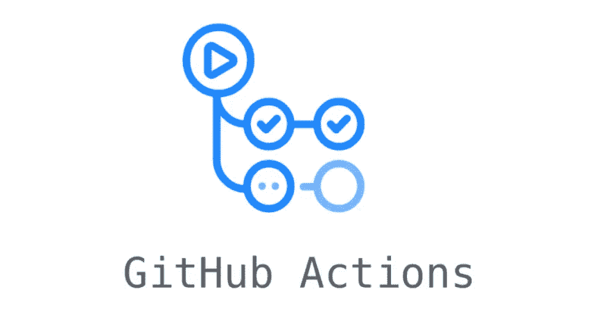

在我们的 Github 资源库中，点击左边栏的**设置**，选择**秘密**，然后选择**动作**。在“操作机密”窗口中，选择**新建存储库机密**。

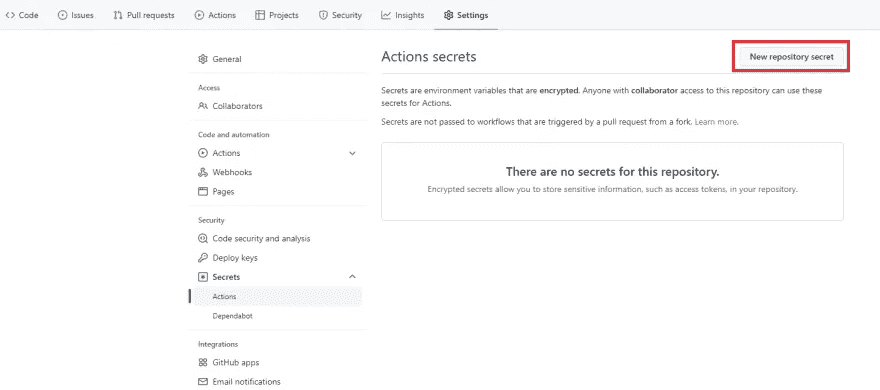

创建两个秘密，分别命名为`AWS_KEY`和`AWS_SECRET`。在这里，我们将添加我们的 AWS 访问密钥 ID 和秘密访问密钥。如果您想了解如何获得这些值，请查看此[文档](https://docs.aws.amazon.com/powershell/latest/userguide/pstools-appendix-sign-up.html)。

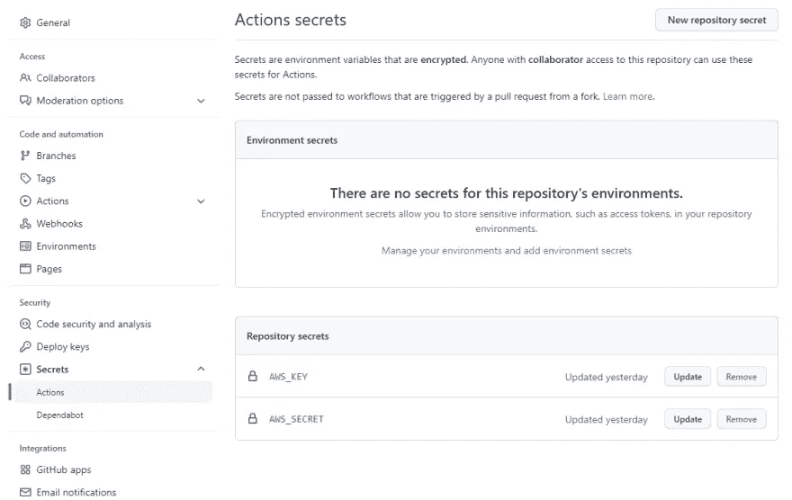

选择上方栏上的**动作**，在动作画面中选择**自行设置工作流程**。

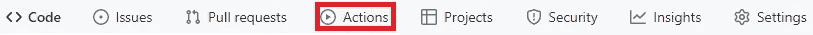

清除预定义的模板，并添加以下代码片段。这个代码片段将使用我们之前定义的秘密来验证和配置必要的环境，以便将我们的资源部署到 AWS 中。

随便给文件起什么名字，提交并推送。一定要将这个文件`git fetch`和`git pull`到您的本地存储库中。下一次我们在代码中做一些改变时，它将触发一个部署管道，这将在 AWS 中创建我们的 lambda。

> *❗注意:如果动作不激活，检查你的 deploy.yml 文件中“分支”指定的分支*
> 
> `*branches: - master*`

在管道成功完成部署之后，让我们在 AWS 中检查我们新创建的资源。

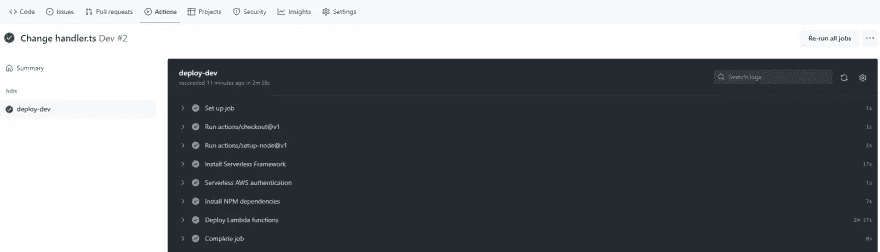

# 你好，自动气象站的 Lambda

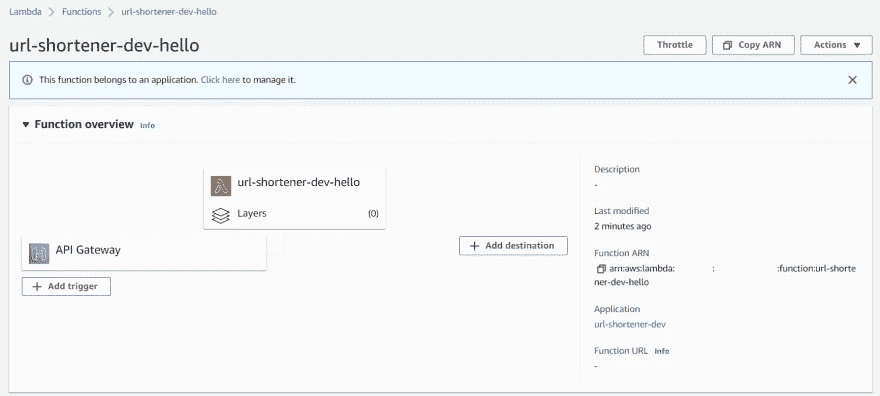

# 创建解决方案

既然我们的 CI/CD 集成工作正常，那么让我们开始编码我们的 URL-shortener 解决方案。首先，我们需要创建三个变量来帮助我们定义 bucket 的名称、一个域和应用程序的名称。对于本例，我将使用以下值:

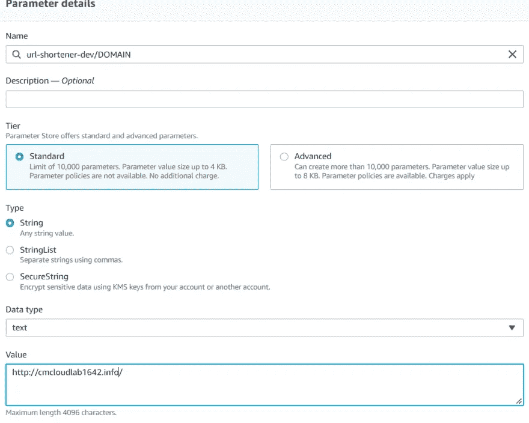

您可以添加任何您想要的域；为了这个例子，我将使用我已经注册的一个 [Route 53](https://docs.aws.amazon.com/Route53/latest/DeveloperGuide/Welcome.html) 域。如果没有域，可以使用我们将创建的 bucket 的 S3 端点作为变量`DOMAIN`的值。`S3_NAME`变量，你也可以写任何名字。但是，我将使用域名在 Route 53 下注册这个 bucket 的 s3 端点作为别名记录。对于变量`APPLICATION_NAME`的值，将其命名为与您在`serverless.yml`文件的服务字段中定义的相同。

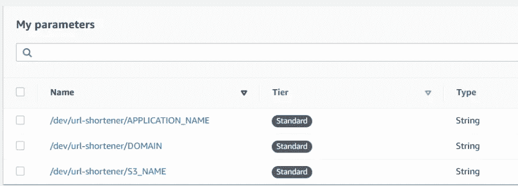

# 创建附加资源

现在我们继续修改我们的 serverless.yml，在这里我们将创建一个名为 [atomic_counter](https://docs.aws.amazon.com/amazondynamodb/latest/developerguide/WorkingWithItems.html#:~:text=With%20an%20atomic%20counter%2C%20) 的 [DynamoDB](https://docs.aws.amazon.com/amazondynamodb/latest/developerguide/Introduction.html) 表，一个带有一些规则的 [S3 桶](https://docs.aws.amazon.com/AmazonS3/latest/userguide/Welcome.html)，一些 IAM [角色](https://docs.aws.amazon.com/IAM/latest/UserGuide/introduction.html)来让我们的 lambda 访问这些资源，我们将把使用 [ApiGateway](https://docs.aws.amazon.com/apigateway/latest/developerguide/welcome.html) 的 hello lambda 更改为一个[函数 Url](https://docs.aws.amazon.com/lambda/latest/dg/lambda-urls.html) 。

让我们定义要在代码中使用的添加的参数存储变量。您可以定义变量所在的区域。在这个例子中，我们的变量在`us-east-1`中。变量值应读作:

正如我们所提到的，这些值中的一些在同一个`serverless.yml`文件中。

将 lambda 的处理程序和事件更改为 url 类型，这将创建一个带有 url 的 http 端点，我们可以用它来发送包含我们需要处理的信息的帖子。您可以自定义跨源资源共享来满足您的需求。

使用函数 URL 适合我们的用例，因为我们不需要创建复杂的 REST API。我们只需要一个可以在前端视图中使用的 HTTP 端点。

接下来，创建一个 DynamoDB 表，它将被用作原子计数器，并设置一个名为 **name** 的索引。

创建一个 S3 桶，这将有公共访问，它将作为一个静态网站主机。我们还需要一个生命周期规则，因为我们的服务将作为我们将在 bucket 中创建的对象的重定向。我们想终止我们不再使用的旧链接。

最后，让我们通过 IAM 策略访问我们的 lambda，这些策略将提供将数据放入和更新到我们的 s3 存储桶和 dynamo 表中的权限。

在我们的`handler.ts`中，我们需要用 regex 函数检查原始的入站 URL。如果给定的 URL 没有前缀，我们会追加字符串 [http://。](http://.)否则，WebsiteRedirectLocation 函数将抛出一个错误。接下来，我们获取 DynamoDB 计数器中的数字，我们将把它编码成一个缩短的字符串。我们用适当的元数据将一个零长度文件写到我们的 S3 桶中，该文件将作为重定向到所需 URL 的路径。最后，我们返回缩短的 URL。

在我们推送和部署这些资源之前，让我们用一些库来更新我们的 package.json，比如 uuid，它将使用 base62 创建一个字符串，以随机化创建的 URL。

在我们的操作管道完成部署之后，在 atomic_counter 表中创建一个寄存器，值为 1，应用程序的名称，我们将使用它作为编码字符串。

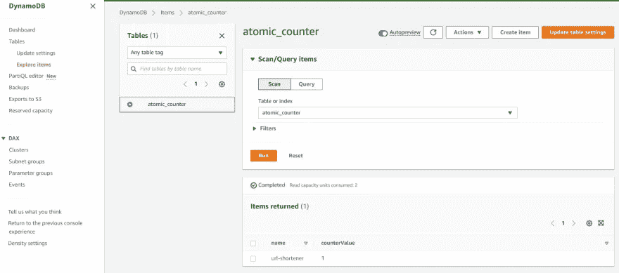

# 在 Route53 中添加别名记录

最后，让我们在 Route 53 中创建一个 s3 端点的别名记录，它将被用作 url-shortener 服务的域响应。

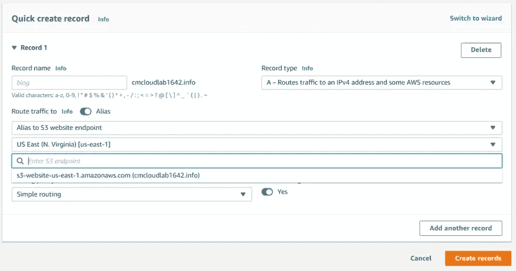

通过发送一个我们喜欢缩写的 URL 来测试我们的端点，瞧！我们完成了我们的网址缩写。

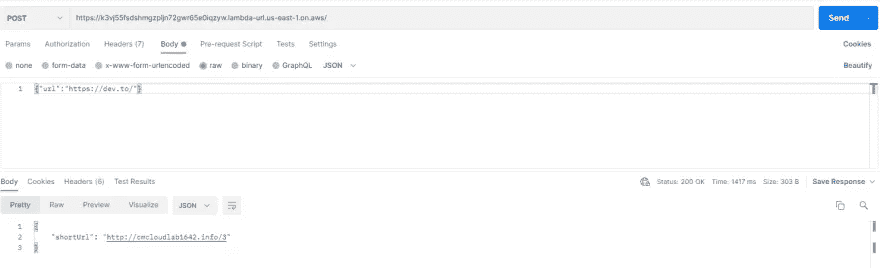

# 结论

虽然可能有不同的方法来创建一个 URL shortener，但我选择了这一堆技术，原因如下:无服务器框架，因为它的开发速度快，自动伸缩，运行时成本低。AWS 的可靠性和不同层次的服务。GitHub Actions 的易用性和设置部署与各种编程语言和云提供商。