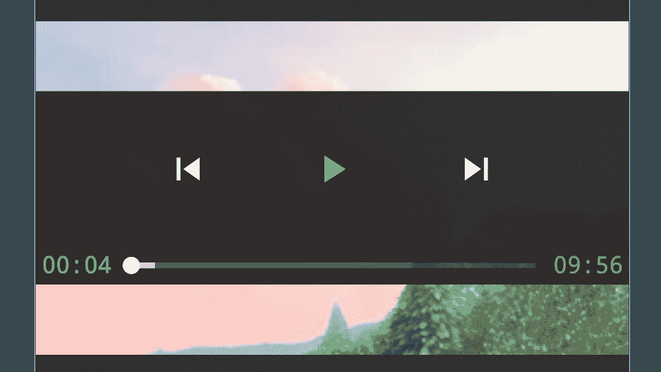

# 在 Android 中构建视频播放器应用程序(第 2 / 5 部分)

> 原文：<https://medium.com/androiddevelopers/building-a-video-player-app-in-android-part-2-5-e5a5392879fa?source=collection_archive---------4----------------------->

## 使用 ExoPlayer、播放列表、媒体会话、音频聚焦、画中画

本系列文章的目标是让您开始使用 ExoPlayer 构建一个简单但功能丰富的视频播放器应用程序(支持播放列表、媒体会话、音频焦点和画中画)。

这是 5 部分系列的第二部分，包括:

*   [ExoPlayer 简介](/@nazmul/building-a-video-player-app-in-android-part-1-5-d95770ef762d)
*   ExoPlayer 播放列表、UI 定制和事件(**本文**)
*   [exo player 的 MediaSession 连接器扩展](/@nazmul/building-a-video-player-app-in-android-part-3-5-19543ea9d416)
*   [支持音频聚焦](/@nazmul/building-a-video-player-app-in-android-part-4-5-c69f12b49143)
*   [支持 PIP](/@nazmul/building-a-video-player-app-in-android-part-5-5-725c1ec2557a)

本系列的第一篇文章介绍了创建 ExoPlayer 实例并将其附加到应用程序的 UI 以允许视频播放所需的步骤。它还介绍了如何将 ExoPlayer 与您的生命周期联系起来。本文将详细介绍如何通过连接`MediaSource`来创建播放列表，并向您展示如何定制 ExoPlayer 的播放控制 UI。

# 创建播放列表

不用给玩家提供一个`ExtractorMediaSource`(如上面的`buildMediaSource(Uri)`方法所示)，你可以简单地创建一个`DynamicConcatenatingMediaSource`，其中可以包含任意数量的`MediaSource`对象。这里有一个例子。

`DynamicConcatenatingMediaSource`创建动态播放列表。如果你想要一个静态播放列表，那么你可以使用`ContactenatingMediaSource`。它们都将无缝地组合媒体源，并处理整个播放列表的缓冲。要了解更多关于`MediaSource`构图的细节，请阅读这篇[中的文章](/google-exoplayer/dynamic-playlists-with-exoplayer-6f53e54a56c0)。

# 自定义用户界面

为了查看您的应用程序使用 ExoPlayer 加载的视频内容，您必须向创建 ExoPlayer 实例和加载媒体的活动添加一个`PlayerView`。通过将您的 ExoPlayer 实例分配给`PlayerView`的 Player 属性，您可以将该视图附加到 ExoPlayer 实例。

下面是一个显示`PlayerView`的活动的布局 XML 示例。带有“`app:`”名称空间的属性允许您将配置参数传递给视图，以便您可以根据自己的喜好定制它的行为。您可以控制视频快进或快退的增量(以毫秒为单位),以及许多其他事情。您可以在 [ExoPlayer javadocs](http://google.github.io/ExoPlayer/doc/reference/index.html?com/google/android/exoplayer2/ui/SimpleExoPlayerView.html) 中找到所有这些属性及其作用的列表。

除非用`app:use_controller=”false”`禁用控制器，`PlayerView`会自动显示一个媒体控制器 UI，允许用户播放、暂停、跳到下一个等等。通过在`show_timeout`属性中设置超时值，您可以定制控制器在自动隐藏之前显示的时间。

为了定制控制器 UI 本身，有一个属性“`controller_layout_id`”，它允许我们选择一个布局文件，其中包含对控制器 UI 本身的任何定制。这里有一个例子。

这将产生一个类似下图的媒体控制器用户界面。UI 控制器覆盖在`PlayerView`本身的前面。您可以添加或删除播放、暂停、倒带、跳过等按钮。ExoPlayer 之所以知道你想使用你的组件而不是默认组件，是因为你使用了 ExoPlayer 本身提供的 id，比如播放按钮、暂停按钮、跳到下一个按钮等等。为了了解更多关于定制`PlayerView`和 UI 控制器的信息，请阅读这篇[中型文章](/google-exoplayer/customizing-exoplayers-ui-components-728cf55ee07a)。

# 收听 UX 的玩家事件

ExoPlayer 通过`ExoPlayer.EventListener`接口提供了大量关于其内部状态的有价值的信息。您可以在代码中实现这个接口或子类`Player.DefaultEventListener`，以便在玩家状态改变时得到通知。此外，您可以实现`VideoRendererEventListener`和`AudioRendererEventListener`来获得关于音频和视频渲染的更多细节。综合使用这些信号，你可以了解应用程序的用户体验质量(QoE)受到了怎样的影响。

以下是几个例子:

*   当不在播放开始期间用`STATE_BUFFERING`调用`ExoPlayer.EventListener.OnPlaybackStateChanged()`时，或者当用户请求寻找一个尚不可用的位置时，这被认为对 QoE 有害。
*   执行`ExoPlayer.VideListener.onFirstFrameRendered`所需的时间(相对于用户在应用程序中启动回放的时间)是回放初始延迟的信号。对于良好的 QoE，这应该尽可能低。
*   `VideoRendererEventListener.onDroppedFrames`提供关于丢帧的信息。太多这样的事情会对 QoE 产生负面影响。

这些文章不会详细讨论 ExoPlayer 中的事件监听。要更深入地了解 ExoPlayer 的事件监听器以及 QoE 信号，请务必阅读 [ExoPlayer codelab](https://codelabs.developers.google.com/codelabs/exoplayer-intro/#5) 的测量 QoE 部分。要深入了解如何检测播放器何时缓冲、暂停或实际播放媒体，请参考这篇 [stackoverflow 帖子](https://stackoverflow.com/questions/47731779/detect-pause-resume-in-exoplayer/48067205#48067205)。

# 自适应流

ExoPlayer 不仅支持从 APK 和网络加载媒体文件，还广泛支持自适应流媒体。自适应流将视频和音频文件切割成给定持续时间的小块。然后 ExoPlayer 将它们缝合在一起进行播放。这些块中的每一个都可以有不同的质量(大小或比特率)。播放器可以根据设备能力和可用的网络带宽来选择每个块的质量。播放器以较低质量的块开始，然后如果更多带宽变得可用，则切换到较好的块(例如，从慢速移动网络切换到快速 WiFi 网络)。

在这篇 [MDN 文章](https://developer.mozilla.org/en-US/Apps/Fundamentals/Audio_and_video_delivery/Setting_up_adaptive_streaming_media_sources)中，您可以了解有关 HLS (HTTP 直播流)、MPEG-DASH(基于 HTTP 的动态自适应流)和 SmoothStreaming 的更多信息。要了解更多关于 DASH 和 HLS 的区别，请查看 ExoPlayer 博客上的这篇[文章。这些文章不会深入探讨如何使用 ExoPlayer 进行自适应流式传输，但是如果你想更深入地了解这一点，请浏览](/google-exoplayer/test-8b62d50362ef) [ExoPlayer codelab](https://codelabs.developers.google.com/codelabs/exoplayer-intro/#4) 的自适应流式传输部分。

# GitHub 上的源代码

通过遵循这 5 篇文章，你应该能够创建一个视频播放器应用程序，类似于我们已经创建的这个示例(你也可以从 Android Studio 获得)。

 [## 谷歌样品/安卓视频播放器

### 在 GitHub 上创建一个帐户，为 android 视频播放器的开发做出贡献。

github.com](https://github.com/googlesamples/android-VideoPlayer) 

# 进一步学习的资源

**ExoPlayer**

*   [IO17 ExoPlayer codelab](https://codelabs.developers.google.com/codelabs/exoplayer-intro/#0)
*   [IO14 ExoPlayer 介绍视频](https://www.youtube.com/watch?v=6VjF638VObA)
*   [IO17 ExoPlayer 会话视频](https://www.youtube.com/watch?v=jAZn-J1I8Eg)
*   [为什么选择 ExoPlayer？](/google-exoplayer/exoplayer-2-x-why-what-and-when-74fd9cb139)
*   [exo player v 2 . 6 . 1 的最新变化](/google-exoplayer/exoplayer-2-6-1-whats-new-a9e54bffffc5)

**媒体会话，音频焦点**

*   [exo player 的 MediaSession 扩展](/google-exoplayer/the-mediasession-extension-for-exoplayer-82b9619deb2d)
*   [什么是媒体会话](/google-developers/understanding-mediasession-part-1-3-e4d2725f18e4)
*   [什么是音频焦点](/google-developers/audio-focus-1-6b32689e4380)

破折号，HLS

*   [破折号，HLS](https://goo.gl/r9fXXf)
*   [Dash 优于 HLS 等](https://goo.gl/SNvMgQ)

**画中画**

*   [奥利奥中的画中画模式](/google-developers/making-magic-moments-with-picture-in-picture-e02964bf75ae)