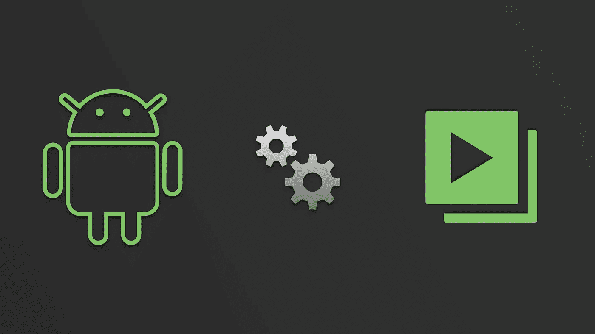

# 在 Android 中构建视频播放器应用程序(第 5 / 5 部分)

> 原文：<https://medium.com/androiddevelopers/building-a-video-player-app-in-android-part-5-5-725c1ec2557a?source=collection_archive---------6----------------------->

## 使用 ExoPlayer、播放列表、媒体会话、音频聚焦、画中画

本系列文章的目标是让您开始使用 ExoPlayer 构建一个简单但功能丰富的视频播放器应用程序(支持播放列表、媒体会话、音频焦点和画中画)。

这是 5 部分系列的最后一部分，包括:

*   [ExoPlayer 简介](/@nazmul/building-a-video-player-app-in-android-part-1-5-d95770ef762d)
*   [ExoPlayer 播放列表、用户界面定制和事件](/@nazmul/building-a-video-player-app-in-android-part-2-5-e5a5392879fa)
*   【ExoPlayer 的 MediaSession 连接器扩展
*   [支持音频聚焦](/@nazmul/building-a-video-player-app-in-android-part-4-5-c69f12b49143)
*   支持 PIP ( **本条**)

本系列的前一篇文章介绍了为您的应用程序添加音频焦点支持所需的步骤。本文将详细介绍如何为该应用程序添加画中画(PIP)支持。

# 点

Android Oreo 中引入了画中画(PIP ),它允许将一个活动最小化到一个小窗口中，该窗口位于其他活动之上。您可以设置此窗口的方向，使其浮动在屏幕上所有其他窗口的顶部。这里有一个例子。

为 AndroidManifest.xml 中的活动启用 PIP 模式非常容易。

注意——您还可以将另一个属性`android:resizeableActivity`设置为 true，这将使该活动的大小可以针对[多窗口模式](https://developer.android.com/guide/topics/ui/multi-window.html)进行调整。

一旦你标记了你的活动支持画中画，然后你必须让它进入画中画模式的基础上，一些用户的行动。通常，当用户点击 home 按钮时，您可以通过覆盖`[onUserLeaveHint()](https://developer.android.com/reference/android/app/Activity.html#onUserLeaveHint())`方法来触发它。当用户点击 home 按钮时，它会将当前活动移到后台。这里有一个例子。

请注意，当活动最小化时，我们将纵横比设置为 16:9。你可以为这个最小化的窗口设置任何你想要的长宽比。

一旦显示视频播放器的活动进入 PIP 模式，我们就会通过下面的方法得到通知。

当活动进入或退出画中画模式时，调用`onPictureInPictureChanged(…)` 方法。在我们的例子中，我们覆盖了这个方法，并在活动最小化时隐藏播放器 UI 控件。`PlayerView`有一个`useController`字段，可以设置为 false 以隐藏这些控件。当活动最大化时，我们允许这些 UI 控件再次显示。

# 音频焦点

从 UX 的角度来看，支持画中画使得与媒体会话的集成和支持音频聚焦变得有意义。

当应用程序可以将自己最小化到一个小窗口中，并在其他应用程序运行时播放媒体时，音频焦点变得非常重要。

考虑这种情况，用户启动视频播放器应用程序并开始播放视频。然后他们把它最小化成一个 PIP 窗口，然后启动 YouTube。此时，用户可以看到 YouTube 和视频播放器应用程序。

*   当您选择在 YouTube 应用程序中播放视频时，这应该会暂停示例应用程序中的播放。
*   当您选择在示例应用程序中播放视频时，这应该会暂停 YouTube 中的播放。

这正是在上一篇文章中使用 AudioFocusWrapper 类(为 SimpleExoPlayer 提供音频焦点支持)时发生的情况。

# 媒体会话

因为应用程序使用的是 MediaSession(我们在本系列的第三篇文章中添加了 media session)，所以控制回放的 UI 是由系统自动提供的，无需编写任何代码！🙌这样，用户可以很容易地播放/暂停/跳过等。就在画中画窗口。

# GitHub 上的源代码

通过遵循这 5 篇文章，你应该能够创建一个视频播放器应用程序，类似于我们已经创建的这个示例(你也可以从 Android Studio 获得)。

 [## 谷歌样品/安卓视频播放器

### 在 GitHub 上创建一个帐户，为 android 视频播放器的开发做出贡献。

github.com](https://github.com/googlesamples/android-VideoPlayer) 

# 进一步学习的资源

**ExoPlayer**

*   [IO17 ExoPlayer codelab](https://codelabs.developers.google.com/codelabs/exoplayer-intro/#0)
*   [IO14 ExoPlayer 介绍视频](https://www.youtube.com/watch?v=6VjF638VObA)
*   [IO17 ExoPlayer 会话视频](https://www.youtube.com/watch?v=jAZn-J1I8Eg)
*   [为什么选择 ExoPlayer？](/google-exoplayer/exoplayer-2-x-why-what-and-when-74fd9cb139)
*   [exo player v 2 . 6 . 1 的最新变化](/google-exoplayer/exoplayer-2-6-1-whats-new-a9e54bffffc5)

**媒体会话，音频焦点**

*   [exo player 的 MediaSession 扩展](/google-exoplayer/the-mediasession-extension-for-exoplayer-82b9619deb2d)
*   [什么是媒体会话](/google-developers/understanding-mediasession-part-1-3-e4d2725f18e4)
*   [什么是音频焦点](/google-developers/audio-focus-1-6b32689e4380)

**破折号，HLS**

*   [破折号，HLS](https://goo.gl/r9fXXf)
*   [Dash 优于 HLS 等的优势](https://goo.gl/SNvMgQ)

**画中画**

*   [奥利奥的画中画模式](/google-developers/making-magic-moments-with-picture-in-picture-e02964bf75ae)