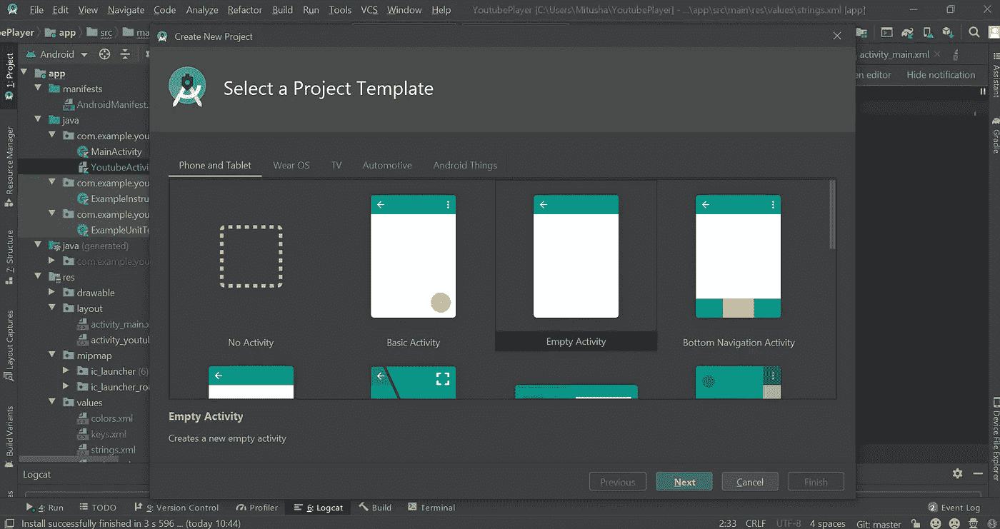
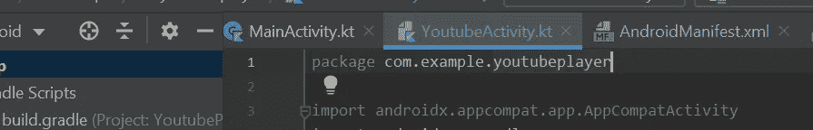

# 如何使用 Kotlin 构建 YouTube 播放器

> 原文：<https://blog.kotlin-academy.com/building-a-youtube-player-using-kotlin-b0e4beef302a?source=collection_archive---------0----------------------->

在这篇文章中，我们将学习如何使用 Android 中的 YouTube API 和 Kotlin 集成并播放视频。

YouTube Android Player API 使您能够将视频播放功能整合到您的 Android 应用程序中。API 定义了加载和播放 YouTube 视频(和播放列表)以及定制和控制视频播放体验的方法。

使用 API，您可以将视频加载或提示到应用程序 UI 中嵌入的播放器视图中。然后，您可以通过编程控制回放。例如，您可以播放、暂停或查找当前加载的视频中的特定点。

您还可以注册事件侦听器来获取特定事件的回调，例如播放器加载视频或播放器状态改变。最后，API 有助手功能来支持方向改变和全屏播放。

在进入编码部分之前，我们需要按照下面的步骤在我们自己开发的应用程序中设置 YouTube API。

# 创建 Android 项目:

**第 1 步——用一个空活动创建一个新的文件项目**

1.  *转到文件*
2.  *创建新项目*
3.  *选择项目模板-基本活动*

**步骤 2-设置 YouTube 库和清单**

在这一部分，我们将看到如何为项目设置 YouTube API 客户端库。

1.  *进入 YouTube Android Player API，下载 YouTube Android Player API jar 文件—* [*链接*](https://developers.google.com/youtube/android/player/downloads)
2.  *提取 jar 文件并将其添加到“libs”文件夹中。*

# **使用 Kotlin 在屏幕上集成 YouTube Android 播放器**

**第一步:进入谷歌开发者控制台—**[https://console.developers.google.com/apis/library/](https://console.developers.google.com/apis/library/)

**第二步:启用 YouTube 数据 API**

**第三步:转到“帮我选择”选项**

**第四步:选择凭证，如下图**

**第五步:转到凭证**

*1。在* ***【名称】*** *处输入你的包名*

*2。通过运行* ***【签名报告】*** 生成 ***SHA-1 证书指纹***

**3。* *复制生成的* ***SHA-1 证书指纹*** *，如上图*所示放置*

# *完整代码:*

*现在，您可以运行代码并在模拟器上观看视频。*

**

*链接到我的 Github 项目-[https://github.com/mitushaa/YouTube-Player-API](https://github.com/mitushaa/YouTube-Player-API)*

*感谢阅读:)*