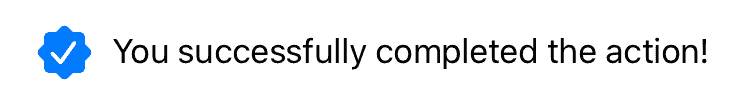
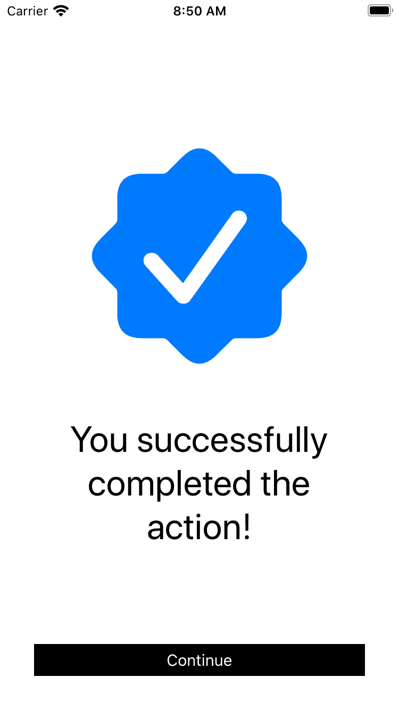

# 构建可访问的 iOS 应用

> 原文：<https://medium.com/capital-one-tech/building-accessible-ios-apps-827c3469a3e9?source=collection_archive---------0----------------------->

## 如何避免 iOS 应用中常见的可访问性问题

可访问性就是*可用性。*

可访问性不仅仅是让我们的应用为残障人士服务，而是让我们的所有客户以最舒适的方式体验我们的应用。确保您的应用程序的所有内容都包含在滚动视图中，意味着我们可以保证无论客户的屏幕大小如何，都可以访问这些内容。但这也意味着您的内容可以是动态的，而不用担心它是否仍然适合，并允许内容扩展。这只是一个例子，但是增加语音输入文本或给视频添加字幕等功能也有类似的普遍好处。

下面我收集了一些我在 iOS 代码中看到的常见的可访问性问题，以及一些避免 iOS 应用程序常见的可访问性错误的快速提示。这些不会解决你的每一个客户，但它们将大大改善你的应用程序的体验。一旦你实现了这些，一定要测试它们。如果可以的话，我会建议和具有各种能力的人一起做用户测试。在这篇博客的最后，我提供了一些开发人员测试的快速技巧。

# 构建界面

## 自定义控件

如果你需要自定义一个控件来改变设计或者增加功能，试着在尽可能高的层次上创建子类，这样可以尽可能的保持苹果的可访问性默认设置。例如，如果您的控件是按钮的变体，请子类化 UIButton。如果你不能用 UIButton 做你需要的事情，子类 UIControl。

考虑用一点额外的可访问性制作一个基本控件的集合，然后你可以在需要的地方子类化这些控件，因为你知道你总是有最好的可访问性。例如，UIButton 和 UILabel 在默认情况下都被限制为一行文本，这意味着您的客户使用较大的文本尺寸或较小的屏幕可能会丢失一些文本。在元素标签上设置 numberOfLines = 0 和 adjustsFontForContentSizeCategory = true。

## 图像按钮

所有图像按钮都需要一个 accessibilityLabel 属性，并添加一个简短但有意义的标题。理想的情况是保持一个词，不要加上“按钮”这个词。有些 UINavigationItem 按钮会自动为你添加正确的辅助功能标签，在这种情况下，坚持使用苹果的默认。

imagebutton . accessibilitylabel = " Buy "

## 形象

图标通常应该被标记为可访问性隐藏，因为它们不会增加任何额外的意义。它们旁边的文本应该添加所有需要的上下文。

icon.accessibilityHidden = true

上面的勾号图标应该隐藏起来，因为右边的文字提供了客户需要的所有信息。

较大的图标和照片应该有一个 accessibilityLabel，以避免 VoiceOver 用户在屏幕上看到一大片空白，但屏幕的初始焦点应该始终是页面标题。如果您在 VoiceOver 测试中发现图像先获得焦点，您可以使用移动焦点。屏幕出现后，布局更改通知如下。这会将 VoiceOver 焦点移动到您作为参数传递的元素。确保你的可访问性标签简短，如果是图标，它描述的是图标的含义，而不是图标本身——例如，电话图标应该是“给我们打电话”而不是“电话”。

UIAccessibility.post(通知:。layoutChanged，参数:screenTitle)

该屏幕顶部的勾号图标应该有“成功”的描述。不要在标签中包含“图像”或“图标”之类的词语，iOS 会为我们做到这一点。确保导航到此屏幕时的 VoiceOver 焦点是“您已成功完成操作！”标题，而不是图标。

## 参考数字

诸如电话号码或订单参考号码等参考号码应作为单个数字来阅读，而不是作为一个整数来阅读。我们需要告诉 VoiceOver 这样做。您可以通过设置 accessibilityAttributedLabel 来实现这一点。

let Order number = " 1234 "
let Order reference = "订单参考\(订单编号)"
ordereferencelabel . text = Order reference

let attributed string = NSMutableAttributedString(string:order reference)
let range = attributed string . string . range(of:order number)
attributed string . add attributes([。accessibilitySpeechSpellOut:true]，range: range)

ordereferencelabel . accessibilityattributed label = attributed string

## 禁用元素

禁用的元素，通常是按钮，是一种反模式。当看到该按钮时，任何用户都不清楚为什么该按钮被禁用。一般来说，尽量避免禁用按钮。相反，允许客户点击按钮，并提供清晰的反馈，解释为什么我们不能让客户继续。在 VoiceOver 中，将焦点移到屏幕上第一个出错的元素。例如，在屏幕上处于错误状态的第一个元素下面，引用为 textField，使用 layoutChanged 通知，我们告诉 VoiceOver 关注该元素。

UIAccessibility.post(通知:。layoutChanged，参数:textField)

## 滚动视图

如果屏幕上有文本，而该文本不在其层次结构的滚动视图中，则该文本不可访问。你不能保证它能在小屏幕设备上正确显示，也不能保证它有空间缩放到客户选择的文本大小。

# 测试

如同任何软件变更一样，除非您进行测试，否则您无法确定它是否有效。在移动您的机票之前，使用 VoiceOver 检查屏幕总是值得的。这不会涵盖所有内容，但它是一个很好的指南，表明您的可访问性是没问题的。
将您的应用程序加载到设备上，浏览到您的屏幕，然后启用 VoiceOver 并浏览屏幕。你能接触到每一段文字和控制吗？标签和导航顺序对看不到屏幕的人有意义吗？VoiceOver 是否访问隐藏的元素？VoiceOver 是否会访问任何不会给屏幕增加意义的元素？

**启用 VoiceOver
如果是这样，您可以按下睡眠/唤醒按钮或主屏幕按钮三次。这将启用 VoiceOver，若要停用 VoiceOver，请再次执行相同的操作。如果执行此操作时没有任何反应，请在设置>辅助功能>辅助功能快捷方式中设置辅助功能快捷方式，然后选择 VoiceOver。在继续之前这样做，否则关闭它会很困难。
使用 VoiceOver 进行导航向右滑动以向下导航页面，向左滑动以向上导航。激活控制双击。还有更多的手势，但这对于一些基本的测试应该足够了。**

# 结论

可访问性是一个巨大的话题，因为它是如此以人为中心，所以不断努力做得更好很重要。所以，不要害怕询问和重新评估你做的事情是否正确，并准备好让别人看到你可以改进的地方。使用可访问性标签，并使用我在这里提到的一些技术来确保你的界面是健壮的，这将有助于你的应用程序更好地工作；不仅仅是针对残障人士，而是针对您的所有客户。如果你想更详细地了解你可以在 iOS 上使用的各种工具，以使你的应用程序为不同能力的人提供更好的体验，请查看苹果的[辅助功能指南](https://developer.apple.com/design/human-interface-guidelines/accessibility/overview/introduction/)，作为 iOS 人机界面指南的一部分。你也可以看看我的书，[开发包容性的移动应用:为 iOS 和 Android 构建可访问的应用](https://www.apress.com/us/book/9781484258132)。

*安硕尔创建的矢量—*[*www.freepik.com*](http://www.freepik.com)

*披露声明:2020 资本一。观点是作者个人的观点。除非本帖中另有说明，否则 Capital One 不隶属于所提及的任何公司，也不被这些公司认可。使用或展示的所有商标和其他知识产权是其各自所有者的财产。*