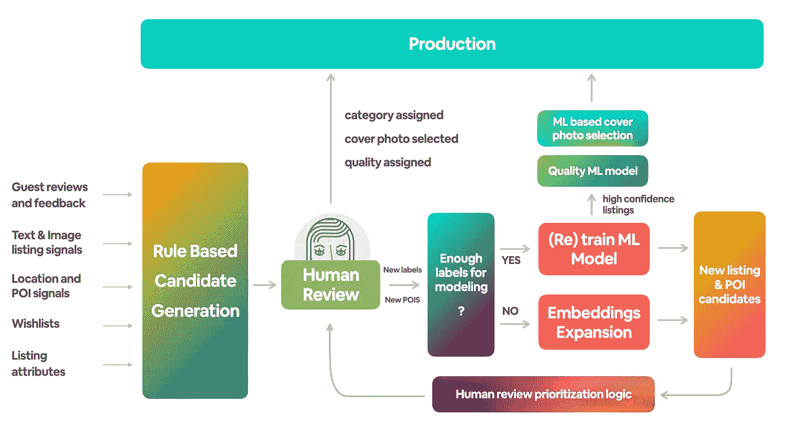

# 利用 ML 和人在回路中构建 Airbnb 类别

> 原文：<https://medium.com/airbnb-engineering/building-airbnb-categories-with-ml-and-human-in-the-loop-e97988e70ebb?source=collection_archive---------0----------------------->

## **Airbnb 分类博客系列—第一部分**

作者:【T2、米哈伊洛·格博维奇、、普拉蒂卡·卡达姆、亚伦·尹、佩雄、狄龙·戴维斯、阿迪蒂亚·穆克吉、凯达·贝拉雷、、张、杨树坤、、塞巴斯蒂安·杜布瓦、内特·内伊、詹姆斯·富尔尼里、马克·詹格里科、内特·罗森塔尔、科尔·贝克、比尔·乌曼达赫、希德·雷迪、叶戈尔·帕克霍莫夫】

Figure 1\. Browsing listings by categories: **Castles**, **Desert**, **Design**, **Beach** & **Countryside**

# 25 年的在线旅游搜索

在线旅游搜索在过去的 25 年里没有太大变化。旅行者在搜索界面中输入她的目的地、日期和客人数量，搜索界面会忠实地返回最符合标准的选项列表。最终，Airbnb 和其他旅游网站进行了改进，允许更好的过滤、排名和个性化，最近还显示了稍微超出指定搜索参数的结果——例如，通过适应灵活的日期或建议附近的地点。借鉴旅行社的模式，这些网站还建立了更多“鼓舞人心”的浏览体验，推荐热门目的地，用迷人的图像和库存展示这些目的地(想想数字“目录”)。

Figure 2\. Airbnb Destination Recommendation Example

这些方法的最大缺点是旅行者必须在头脑中有一个特定的目的地。即使是灵活的旅行者也会被集中到类似的知名目的地，从而强化了大众旅游的循环。

# Airbnb 类别介绍

在我们最近的版本中，我们颠覆了旅游搜索体验，让目录决定目的地，而不是相反。通过这种方式，我们试图激发旅行者在他们可能不会想到去寻找的地方预订独特的住宿。通过将我们独特的住宿地点分类，我们启发我们的客人找到一些不寻常的地方。

Figure 3\. Unique travel worthy inventory in lesser known destinations that users are unlikely to search for

虽然我们的目标是直观的浏览体验，但要实现这一点需要大量的幕后工作。在这个由三部分组成的系列中，我们将揭开 [Airbnb 2022 年夏季发布会](https://news.airbnb.com/2022-summer-release/)的技术层面的帷幕。

*   **第一部分**(这篇文章)旨在成为一篇高水平的介绍性文章，讲述我们如何应用机器学习来构建列表集合，并解决与浏览体验相关的不同任务——具体来说，就是质量评估、照片选择和排名。
*   **本系列的第二部分**集中于列表的 ML 分类。它更详细地解释了这种方法，包括我们使用的信号和标签，我们做出的权衡，以及我们如何建立一个人在回路中的反馈系统。
*   **第三部分**关注于根据搜索查询的类别的 ML 排序。例如，我们教导模型首先显示科罗拉多州阿斯彭查询的滑雪类别，而不是洛杉矶查询的海滩/冲浪类别。那篇文章还将介绍我们对每个类别中的列表进行 ML 排序的方法。

# 将列表分类

Airbnb 有数千个非常独特的高质量房源，其中许多获得了设计和建筑奖，或者被旅游杂志或电影收录。然而，这些列表有时很难发现，因为它们位于鲜为人知的城镇，或者因为它们在优化预订的搜索算法中排名不够高。虽然由于可用性较低或价格较高，这些独特的列表可能不总是像其他列表一样可预订，但它们非常有助于激发灵感，帮助客人发现隐藏的目的地，他们最终可能会预订受类别影响的住宿。

为了展示这些特别的列表，我们决定将它们按照独特之处进行分类。结果是 **Airbnb 分类，**围绕一些共同主题的房屋集合，包括以下内容:

*   **围绕位置或名胜(POI)的类别**如海岸、湖泊、国家公园、乡村、热带、北极、沙漠、岛屿等。
*   围绕某项活动的类别，如滑雪、冲浪、打高尔夫、露营、品酒、潜水等。
*   **围绕家庭类型的类别**如谷仓、城堡、风车、船屋、小屋、洞穴、历史建筑等。
*   **围绕家居设施的类别**如令人惊叹的泳池、厨师厨房、大钢琴、创意空间等。

我们定义了 56 个类别，并概述了每个类别的定义。现在剩下要做的就是将我们的整个列表目录分配到类别中。

距离夏季发布只有几个月了，我们知道我们不能手动管理所有类别，因为这将非常耗时和昂贵。我们也知道，我们无法以基于规则的方式生成所有类别，因为这种方法不够准确。最后，我们知道如果没有一组人工生成的标签的训练集，我们就无法产生准确的 ML 分类模型。鉴于所有这些限制，我们决定将人工审查的准确性与 ML 模型的规模相结合，以创建一个用于列表分类和显示的人在回路中的系统。

## 基于规则的候选生成

在我们可以建立一个训练好的 ML 模型来将列表分配到类别之前，我们必须依赖各种基于列表和地理的信号来生成初始候选集。我们将这种技术命名为**。*它包括建立一套信号(指标),将一个清单与一个特定的类别联系起来。该清单的指标越多，它属于该类别的机会就越大。*

**

*Figure 4\. Rule-based weighted sum of indicators approach to produce candidates for human review*

*例如，让我们考虑一个在湖泊 POI 100 米范围内的列表，在列表标题和客人评论中提到关键字“lakefront ”,在列表照片中出现湖景，并且附近有几个皮划艇活动。所有这些信息一起强烈地表明，该列表属于 *Lakefront* 类别。这些指标的加权和总计为高的 ***分数*** ，这意味着该列表-类别对将是人工审查的强有力候选。如果基于规则的候选生成创建了一个大的候选集，我们将使用这个分数来为人工审查优先排序列表，以最大化初始产量。*

## *人类评论*

*候选人的人工审核包括几项任务。给定特定类别或几个类别的候选列表，代理将:*

*   ***通过与类别定义进行比较，确认/拒绝分配给列表的类别**。*
*   ***挑选最能代表该类别的照片**。列表可以属于多个类别，因此有时选择不同的照片作为不同类别的封面图片是合适的。*
*   ***确定所选照片的质量等级**。具体来说，我们定义了**四个质量等级:******高质量******可接受质量*** ，以及 ***低质量。我们使用这些信息将高质量的列表排列在搜索结果的顶部，以达到让潜在客人“惊叹”的效果。*****
*   **一些类别依赖于与**兴趣点(POI)数据**相关的信号，例如湖泊或国家公园的位置，因此审查者可以添加我们在数据库中缺失的 POI。**

## **候选扩展**

**虽然基于规则的方法可以为某些类别生成许多候选，但对于其他类别(例如，创意空间、惊人的视图)，它可能只生成有限的列表集。在这种情况下，我们转向候选扩展。一种这样的技术利用预先训练的列表嵌入。一旦人类审查员确认一个列表属于一个特定的类别，我们可以通过余弦相似性找到相似的列表。通常，10 个最近的邻居是同一类别的良好候选，并且可以被发送用于人工审查。我们在之前的[博客文章](/airbnb-engineering/listing-embeddings-for-similar-listing-recommendations-and-real-time-personalization-in-search-601172f7603e)中详细介绍了一种嵌入方法，并从那时起开发了新的方法。**

****

**Figure 5\. Listing similarity via embeddings can help find more listings that are from the same category**

**其他扩展技术包括关键词扩展、基于位置的扩展(即，为相同的 POI 类别考虑相邻的家庭)等。**

## **训练 ML 模型**

**一旦我们收集了足够多的人工生成的标签，我们就训练了一个二元分类模型来预测一个列表是否属于特定的类别。然后，我们使用一个维持集，通过精确召回(PR)曲线来评估模型的性能。我们在这里的目标是评估模型是否足够好，足以将高度自信的列表直接发送到生产中。**

**图 6 显示了一个针对湖边类别的训练过的 ML 模型。在左侧，我们可以看到特征重要性图，表明哪些信号对一个列表是否属于湖边类别的决定贡献最大。在右侧，我们可以看到不同型号版本的支持设置 PR 曲线。**

********

**Figure 6\. Lakefront ML model feature importance and performance evaluation**

****将有信心的列表发送到生产:**使用 PR 曲线，我们可以设置一个阈值，在模拟真实列表分布的下采样保持集上实现 90%的精度。然后，我们可以对所有未标记的列表进行评分，并将高于该阈值的列表发送给生产部门，预期准确率为 90%。在这个特殊的例子中，我们可以在 90%的准确率下实现 76%的召回率，这意味着使用这个技术，我们可以期望在生产中捕获 76%的真实湖边清单。**

****

**Figure 7\. Basic ML + Human in the Loop setup for tagging listings with categories**

****选择供人工审核的列表:**考虑到 76%召回率的预期，为了覆盖其余的湖边列表，我们还需要发送低于人工评估阈值的列表。在对低于阈值的列表进行优先级排序时，除了其他因素之外，我们还考虑了该列表的照片质量分数以及该列表所属类别的当前覆盖率。一旦审查人员确认了列表的类别分配，该标签就可以用于生产。同时，我们将标签发送回我们的 ML 模型进行重新训练，以便模型随着时间的推移而改进。**

****用于质量评估和照片选择的 ML 模型。**除了上面描述的 ML 分类模型，我们还训练了一个质量 ML 模型，它将四个质量等级中的一个分配给列表，以及一个 Vision Transformer 封面图像 ML 模型，它选择最能代表类别的列表照片。在当前实现中，封面图像 ML 模型将类别信息作为输入信号，而质量 ML 模型是所有类别的全局模型。这三个 ML 模型一起工作来分配类别、质量和封面照片。在某些情况下，具有这些指定属性的列表被直接发送到生产环境中，并排队等待审查。**

****

**Figure 8\. Human vs. ML flow to production**

## **两种新的排序算法**

**[Airbnb 夏季发布](https://news.airbnb.com/2022-summer-release/)在主页(图 9 左侧)和位置搜索(图 9 右侧)都引入了类别，主页显示你附近受欢迎的类别，位置搜索显示与搜索目的地相关的类别。例如，在太浩湖位置搜索的情况下，我们显示*滑雪、小屋、湖边、湖边小屋等。*和*滑雪*如果冬天搜索应该先显示。**

**在这两种情况下，都需要两种新的排序算法:**

*   ****品类排名**(图 9 左图绿色箭头):如何从左至右对品类进行排名，考虑用户来源、季节、品类受欢迎程度、库存、预订和用户兴趣**
*   ****列表排名**(图 9 左侧的蓝色箭头):给定分配给该类别的所有列表，通过考虑分配的列表质量等级以及给定的列表是由人类还是由 ML 模型发送到生产，从上到下对它们进行排名。**

************

**Figure 9\. Listing Ranking Logic for Homepage and Location Category Experience**

# **把所有的放在一起**

**总之，我们介绍了如何从头开始创建类别，首先使用依赖于列出信号和兴趣点的规则，然后使用 ML，在循环中不断改进类别。图 10 描述了现有的端到端流程。**

****

**Figure 9: Logic for Category Creation and Improvement over time**

***我们的方法是将* ***定义为*** *一个可接受的交货；* ***原型*** *几个范畴达到可接受的水平；* ***标度*** *其余类别为同一等级；* ***重新审视*** *可接受的交付并随着时间的推移改进产品。***

**在第二部分中，我们将更详细地解释将列表分类的模型。**

# **感谢**

**我们要感谢所有参与这个项目的人。建立 Airbnb 类别在我们的职业生涯中占据着特殊的位置，因为这是一个罕见的项目，不同背景和角色的人聚集在一起，共同努力建立独特的东西。**

***有兴趣在 Airbnb 工作吗？点击* *查看我们开放的角色* [*。*](https://careers.airbnb.com/)**