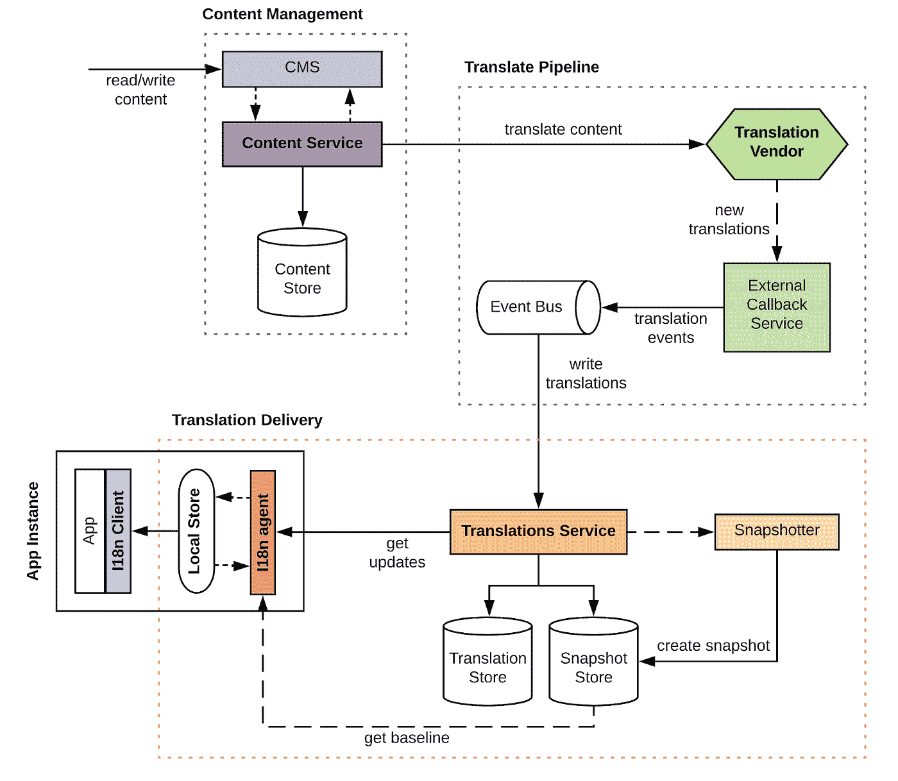
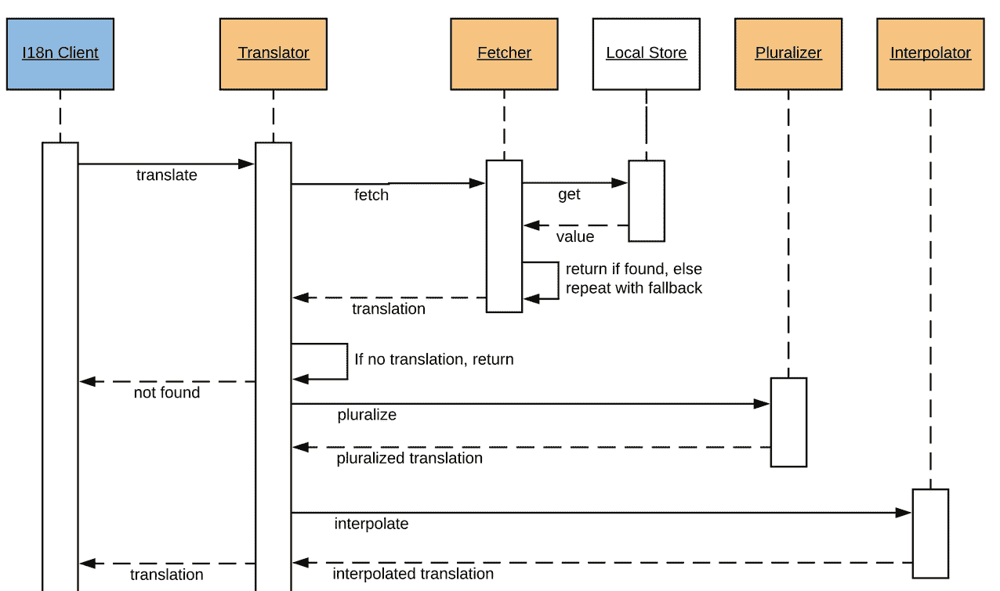
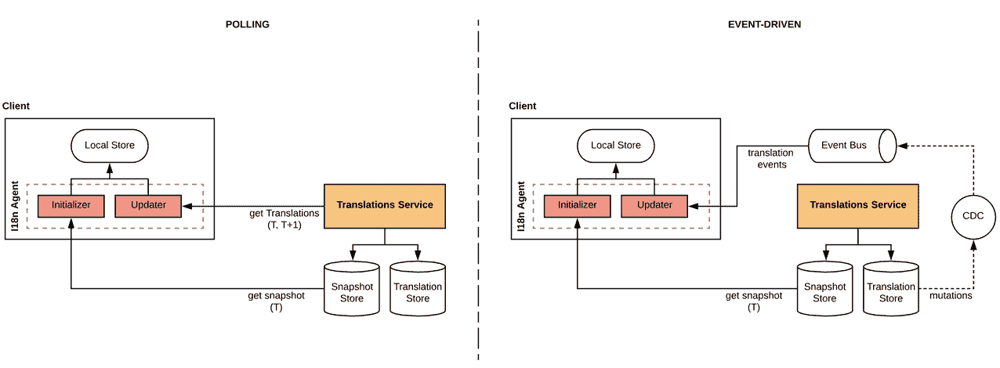
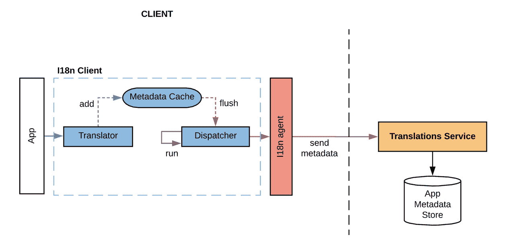

# 打造 Airbnb 的国际化平台

> 原文：<https://medium.com/airbnb-engineering/building-airbnbs-internationalization-platform-45cf0104b63c?source=collection_archive---------0----------------------->

Airbnb 的愿景是通过帮助旅行者在世界任何地方都有宾至如归的感觉，让人们“属于任何地方”。这一愿景鼓舞人心，但也在许多方面提出了挑战，其中之一就是克服沟通障碍。我们文化的多样性和丰富性使我们成为独一无二的人类，但有时也会妨碍彼此之间的联系，因为我们通过语言表达自己的方式各不相同。因此，弥合人与人之间的语言差距是帮助创造一个无论我们身在何处都能有归属感的世界的基础。

在这篇博文中，我们将讨论我们如何构建 Airbnb 的**国际化*** (I18n)平台来支持这一愿景，以高效、稳健和可扩展的方式向我们的全球社区提供跨产品线的内容及其翻译。

****国际化*** *是调整软件以适应不同语言、文化和地区(即地区)的过程，同时最大限度地减少本地化所需的额外工程变更。*

# 概观

Airbnb 用户界面中的内容最终由数百个微服务聚合而成，并以用户偏好或地区指定的语言显示。内容由 ***短语*** *【内容单元】*组成，唯一标识并存储在中央数据存储库中，在创建(或修改)后发送，以便翻译成所有支持的生产语言。一旦翻译就绪，它们将被传播到客户端应用程序以向用户显示。

我们希望在设计中坚持几个主要的系统要求:

*   **Performant:** translate 调用的延迟非常低，无需进一步的应用层优化(例如:批处理、延迟执行、并行化)。
*   **可扩展:**系统应该随着客户端应用、支持的语言、内容单元和流量的增长而高效地扩展。
*   **可用:**该系统对故障具有弹性，并限制从属客户端可能的停机时间。
*   **跨语言:**支持跨多平台、跨编程语言的 app。
*   **集成简易性** : onboarding 客户端简单、无缝，并且对开发的影响最小。

# 体系结构

***Figure:*** *High-level view of the overall architecture*

# 内容管理

一个**内容管理系统** (CMS)允许工程师和内容战略家创建、访问和修改内容。它还支持其他管理功能，如提交翻译内容、添加相关元数据(例如:描述、截图)以提高翻译质量，以及跟踪翻译进度。

内容单元(短语)和相关元数据由**内容服务**存储和管理。每个短语都有一个唯一的字符串键来标识它，还有一个时间戳来指示它最后一次更新的时间。短语也属于集合，集合提供了一个逻辑分组，以提供内容所服务的产品或应用领域的上下文。

# 翻译管道

被标记为准备翻译的新添加或修改的短语被定期发送给外部**翻译供应商**，以便在目标语言环境集合中进行翻译。一旦完成，供应商通知一个**外部回调服务**新的翻译批次，然后打包并作为翻译事件发送到我们的**事件总线**。接下来，事件消费者监听新的翻译事件，解析翻译单元，并将它们写入**翻译服务**，在那里它们被持久化并发送给客户端应用。

# 翻译交付

**翻译服务**存储每个短语的所有翻译版本。翻译由*【短语关键字、地区、时间戳】*输入，并且是不可变的，以便提供历史审计跟踪。只有每个短语的最新翻译提供给客户。

一个 **Snapshotter** 组件定期加载每个地区的最新翻译，创建一个 JSON blob 快照，并将它和相关的时间戳一起存储到一个对象存储中。快照提供了特定时间点的短语翻译的确定性视图，并有助于填充本地客户端翻译缓存(我们将在后面看到)。

在每个客户端实例(从微服务到 web 服务器)上，翻译数据被下载并存储在**本地存储**中，该存储充当应用程序访问的所有翻译的持久化节点内磁盘键值缓存。这允许在本地解析客户端翻译请求，并避免对服务器的网络调用。这种方法有几个好处，主要是提高可用性、可靠性和请求延迟。它还提供了**翻译服务**和客户端之间的松散耦合，提高了服务停机时的弹性。

## I18n 代理

一个 **I18n 代理**作为一个独立的进程**、**部署在每个客户端应用实例上，负责保持**本地存储**与服务器端存储同步。职责包括:获取最新翻译、执行预处理/后处理以及管理磁盘存储。这有助于将数据访问模式和同步操作封装到本地缓存中，从而允许与用不同语言(Java、JS、Ruby)实现的应用程序轻松集成。

代理执行的主要操作有:

*   **初始化**:用最新的翻译快照引导新的客户端应用实例。
*   **同步**:不断拉入新的翻译，更新**本地存储**。

# 客户设计

# 翻译者

***图:*** *翻译调用翻译器库的序列图。*

I18n 客户端中的**翻译器库**被应用程序用来翻译内容，给定一个短语键和区域设置。相关的翻译从**本地存储**中获取，如果翻译不存在，没有回退到服务器。缺失的内容或翻译通过内省(稍后解释)以异步方式检测和补救。本地处理翻译请求使我们能够实现低延迟(亚毫秒级)，同时确保我们的服务器群具有确定的负载&伸缩性。

客户端库还具有其他功能来支持客户端应用程序，例如:

*   **回退:**如果在请求的语言环境中没有找到翻译，我们根据预定的回退链回退到父语言环境翻译。如果在任何备用语言环境中没有找到翻译，我们将返回其原始源语言的短语。
*   **复数:**语言(例如:俄语)可能有不同的复数规则，当数字限定词出现在短语中时，翻译应该适应这些规则。
*   **插值:**短语可以嵌入在运行时解析的变量。在返回翻译之前,
    客户端帮助用相关的值替换它们。

# 同步

***Figure:*** *Synchronization with polling strategy.*

如前所述， **I18n 代理**通过获取可用的新短语和翻译来保持**本地存储**最新。

一种基本的方法是定期轮询**翻译服务**并检索自上次存储更新以来的最新翻译。这是通过保留“最后更新的”时间戳并从服务器请求在该时间戳和当前时间之间创建的新翻译来完成的。这种方法在客户机库中只需要很少的逻辑，并且将所有繁重的工作都放在翻译服务中，使用服务器端的缓存可以使翻译效率更高。

这种方法的一些缺点和优化是:

*   新的翻译不是直接可用的，可能会延迟几分钟或几小时到达，延迟时间等于轮询频率。如果某种程度的陈旧是可以容忍的，这是一个小问题。客观地说，人工翻译人员交付翻译内容的 SLA 通常需要 1-3 天。
*   客户端应用程序实例将在每次同步运行时批量获取最新的翻译，这会给我们的服务器数据库增加大量负载。随着我们扩大客户端应用数量和相应的服务规模，我们采用了 NoSQL 数据库作为翻译库的衍生存储系统，以避免性能瓶颈并更有效地进行扩展。

**注意:**优化将是在每次同步时用最新的快照重新初始化**本地存储**，而不是在时间增量内递增地检索新的翻译。这减轻了我们在线数据库的负荷，但代价是数据传输和处理时间增加。可以通过降低从快照重新设定基准的频率来降低成本。

# 翻译过滤

大多数应用程序在其工作流中只提供一小部分内容。为了避免下载所有翻译，只获取那些与应用程序相关的短语关键字集相关的翻译。这极大地提高了资源利用率(CPU、内存)、请求延迟和初始化操作。

app 短语密钥集可以通过多种方式导出，例如:

*   **配置:**开发者可以在服务配置中指定关于应用使用的短语的信息，比如短语租户/集合或关键字前缀匹配。
*   **静态分析:**可以在构建期间检查代码，提取用于从 i18n 客户端发出翻译请求的所有短语关键字。
*   **访问模式:**translate 调用上发布的短语密钥可以在运行时动态聚合，并保存在服务器端。短语密钥集在每个应用程序实例部署上获取，并用于过滤下载的翻译。下一节将描述如何以一种有效的方式来实现这一点。

# 内容分析

***Figure:*** *Workflow for aggregating app access metadata*

i18n 客户端收集应用程序在每个请求中使用的短语的信息，例如应用程序名称、使用频率、翻译成功/失败结果和上次访问时间。这些信息存储在客户端的**元数据缓存**中，实现为一个并发的有界内存缓冲区(基于[生产者-消费者](https://en.wikipedia.org/wiki/Producer%E2%80%93consumer_problem)模式)。元数据条目会定期刷新、发送到服务器，并保存在应用元数据存储中。

收集关于内容访问的元数据有几个好处:

*   识别应用内容所有权和短语活跃度。
*   通过基于应用的短语过滤优化翻译获取(前面讨论过)。
*   优先翻译内容，避免过度翻译。这在添加新语言或导入新内容(例如:产品发布)时尤其有益
*   提高翻译交付渠道的稳定性，特别是通过检测**本地存储**中缺失的翻译并相应地进行补救。

# 贮藏

在部署生命周期中，应用程序访问其工作流中短语的子集，这通常足够小以适合内存。基于此，我们实施了第二层内存缓存，采用固定容量和缓存备用策略来减少翻译请求的磁盘访问。高速缓存还存储回退解决方案，以进一步降低磁盘加载频率。

缓存可以在应用程序实例引导中或通过预热脚本预先填充，以提高命中/未命中比率。进一步的优化是将翻译记录固定在缓存中(即无时间过期策略)。然后，通过在写入后定期从磁盘重新加载来就地刷新缓存条目。另一种方法是对整个缓存使用捕获-替换机制来减少锁定争用(如果空间允许的话)。

# 结论

I18n 平台是支持我们全球有机增长和解决我们微服务架构国际化问题的关键部分。我们的系统设计仍在发展，因为我们继续改善成本、可扩展性和管道性能，即使我们面临新产品需求。

结果， ***该平台如今提供 62 种语言的 100 多万条内容，每天有 1000 多亿次翻译请求，延迟为微秒级*** 。

你真诚的，

**国际化平台团队**

*特别感谢*[*Jad Abi-Sam ra*](/@jadabisamra)*，他们共同撰写了这篇文章。*

*并感谢安德烈·梅雷斯金、* [*柴坦尼亚·加努、*](/@cganoo) *、卡米尼·丹达帕尼、* [*王小谋、*](/@xiaomou.wang) *、【文】、杰克·范、、俞孔宪、本·赫里拉。*