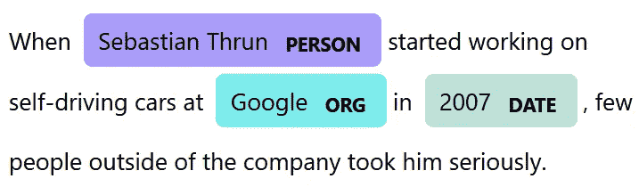
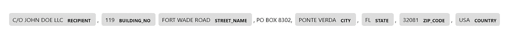
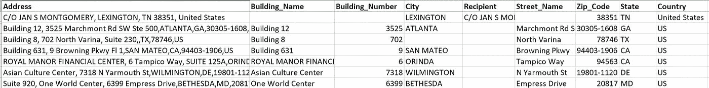

# 用 spaCy 构建地址解析器

> 原文：<https://medium.com/globant/building-an-address-parser-with-spacy-e3376b7cff?source=collection_archive---------0----------------------->

## 应用命名实体识别来识别地址。


组织的地址数据在收集客户分析或支持业务运营(如营销、物流、交付和业务通信)方面通常至关重要。经过净化、良好解析、标准化和验证的地址是数据整合和分析引擎的基础。

大量的企业地址数据可以以手动键入数据库或平面文件的原始地址串的形式找到。但是它是可消耗的吗？以下是一个独特美国地址的不同写法:

> `**111 8th Ave Ste 1509 Tulsa OK 74136 US**`
> 
> `**C/o John Doe LLC, 111, 8th Ave Ste 1509, Oklahoma, 74136-1922, USA**`
> 
> `**111, 8th Ave Ste 1509, Tulsa, OK, , USA**`

相当混乱。对吗？😳

Because the code you wrote with Python regex just can’t handle human absurdities.

因此，有必要通过解析、去杜平、标准化(映射到标准名称并填充缺失部分)、地理标记等对数据进行预处理。才能用于进一步的分析。**地址解析**是这几个预处理步骤之一，它有助于识别&将地址字符串分割成不同的部分，如收件人、建筑物、街道、州、县、邮政编码以及该特定国家的其他适用部分。

很明显，这类问题根本无法解决😉)通过编写传统的基于规则(通常是[正则](https://docs.python.org/3/library/re.html)表达式驱动)的算法。我们需要更多的复杂性，这就是自然语言处理(NLP)算法的用武之地。

# spaCy 是什么，我为什么要关心？

对，就是 [spaCy](https://spacy.io/usage/spacy-101) (就是这么写的！).正如其[维基页面](https://en.wikipedia.org/wiki/SpaCy)上介绍的那样，

> spaCy 是一个用于高级自然语言处理的开源软件库，用编程语言 Python 和 Cython 编写。

NLP 做了人类能做而传统算法做不到的事情:学习和提高。我们*建立*和*训练*我们的语言处理模型，以识别句子、段落甚至小说中隐含的上下文模式。从[众多可用的机器学习库](https://towardsdatascience.com/python-libraries-for-natural-language-processing-be0e5a35dd64)、 [spaCy](https://spacy.io/usage/spacy-101) 就是这样一个**、**、**、**用最少的努力和计算资源完成工作，否则会淹没模型构建和训练过程。

spaCy 的核心是使用深度学习库 [Thinc](https://thinc.ai/) ，它针对 CPU 使用进行了优化(通常是一种采用限制)，并处理专门的 NLP 任务，如[标记化、词汇化、词性(POS)标记、文本分类、命名实体识别以及许多其他任务](https://spacy.io/usage/spacy-101#features)。在不深入这些技术的情况下，我们将讨论局限于与我们的地址解析用例相关的**命名实体识别**。

# 命名实体识别(NER)和空间

命名实体识别(NER)被[描述为](https://en.wikipedia.org/wiki/Named-entity_recognition)

> 信息提取的一个子任务，旨在定位非结构化文本中提到的[命名实体](https://en.wikipedia.org/wiki/Named_entity)并将其分类为预定义的类别，如人名、组织、位置、医疗代码、时间表达式、数量、货币值、百分比等。

简单地说，我们在浏览一段文字或句子时，试图寻找与特定领域类别相关的“现实世界的对象”，并在找到时突出显示它们。所有这些主要是通过对文本的直觉和上下文理解(在模型训练过程中获得)来完成的，而无需编写任何编程规则。下面是 NER 模式在一段文字上的应用可以揭示的:



NER output as generated by displaCy visualizer. Courtesy: [spaCy NER usage guide](https://spacy.io/usage/linguistic-features#named-entities)

我们得到了不同实体的简洁表示，如组织、地理位置、日期、人名等。已确认。很厉害吧？

spaCy 提供了开箱即用的 [NER 特性](https://spacy.io/usage/linguistic-features#named-entities)作为其预训练管道的一部分，这样您就不必从头开始经历构建模型的步骤(尽管[定制模型设计](https://spacy.io/usage/layers-architectures)始终是一个选项):确定神经网络架构、添加层、初始化/调整权重等。

在 spaCy 中创建统计 NER 模型的构建和训练过程非常简单，并遵循配置驱动的方法:我们从预训练或空语言模型开始，添加实体识别器，可选地定义自定义实体，在我们的训练集上开始迭代训练循环，通过对训练集和配置进行少量调整，我们获得了最佳模型。让我们在接下来的小节中回顾这些步骤，并构建我们的**地址解析器**。

# NER 在地址解析中的应用

您现在可能已经知道，我们将地址字符串分割成不同部分的任务属于命名实体识别的范畴。我们希望看到我们的 NER 模型能够以合理的准确度解析任何地址字符串，比如:



Tagged entities in an address string

那么，我们开始吧。我们将遵循训练过程，详细的[在这里](https://spacy.io/usage/training)，来创建我们的解析美国地址的模型。

**spaCy 安装:** spaCy 包可以使用 pip 进行[安装](https://spacy.io/usage)，如下所示:

```
pip install -U spacy>>> import spacy
>>> spacy.__version__
'3.1.2'
```

**自定义实体标签**:针对美国地址，我们为我们的模型确定了以下自定义实体标签:

`[‘STREET’, ‘RECIPIENT’, ‘BUILDING_NUMBER’, ‘BUILDING_NAME’, ‘ZIP_CODE’, ‘CITY’, ’STATE’, ‘COUNTRY’]`

**训练数据集准备:**我们以原始 CSV 格式准备我们的[训练数据集](https://github.com/swapnil-saxena/address-parser/blob/main/corpus/dataset/us-train-dataset.csv)，将其限制为我们的源系统中地址数据的良好代表性样本。通常建议将数据(对于我们的案例研究，我们选择了大约 100+20 个数据训练和验证数据点)随机 80:20 分割成训练和验证数据集。



Sample training dataset for US addresses

然而，这个原始数据集需要在用于训练之前转换成 spaCy 的 [DocBin](https://spacy.io/api/docbin) 格式。这里有一个在我们的[代码](https://github.com/swapnil-saxena/address-parser/blob/main/training_data_prep.py)中如何做到这一点的快速演练。

I)我们从预处理地址字符串开始，去掉多余的空格和换行符。根据源数据，可能需要添加一些额外的数据处理步骤。

```
def massage_data(address):                           
'''Pre process address string to remove new line characters, add comma punctuations etc.''' cleansed_address1=re.sub(r'(,)(?!\s)',', ',address)                           cleansed_address2=re.sub(r'(\\n)',', ',cleansed_address1)                           cleansed_address3=re.sub(r'(?!\s)(-)(?!\s)',' - ',cleansed_address2)                           cleansed_address=re.sub(r'\.','',cleansed_address3)                           return cleansed_address
```

ii)接下来，我们从我们的训练/验证数据集中导出每个地址串的实体跨度(实体的开始和结束位置)。

```
get_address_span(address=None,address_component=None,label=None):'''Search for specified address component and get the span. Eg: get_address_span(address="221 B, Baker Street, London",address_component="221",label="BUILDING_NO") would return (0,2,"BUILDING_NO")''' if pd.isna(address_component) or str(address_component)=='nan':
   pass                           
 else:                               
   address_component1=re.sub('\.','',address_component)                               
   address_component2=re.sub(r'(?!\s)(-)(?!\s)',' - ',address_component1)                               
   span=re.search('\\b(?:'+address_component2+')\\b',address)                                                              
   return (span.start(),span.end(),label)
```

下面是一些数据点的情况:

```
(*19 ST ANDREW ST, BULRINGTON, VT, 05401, , United States*, [(0, 2, BUILDING_NO), (3, 15, STREET_NAME), (33, 38, ZIP_CODE), (17, 27, CITY), (29, 31, STATE), (42, 55, COUNTRY)]) 

(*2574 EAST 23RD STREE, CHATTANOOGA, TN 37404, United States*, [(0, 4, BUILDING_NO), (5, 20, STREET_NAME), (38, 43, ZIP_CODE), (22, 33, CITY), (35, 37, STATE), (45, 58, COUNTRY)])

(*5931 W ANGELA RD, MEMPHIS, TN 38120, United States*, [(0, 4, BUILDING_NO), (5, 16, STREET_NAME), (30, 35, ZIP_CODE), (18, 25, CITY), (27, 29, STATE), (37, 50, COUNTRY)])

(*3812 MYERS STREET, GREENEVILLE, TN 37743, United States*, [(0, 4, BUILDING_NO), (5, 17, STREET_NAME), (35, 40, ZIP_CODE), (19, 30, CITY), (32, 34, STATE), (42, 55, COUNTRY)])
```

iii)最后，我们用这个数据初始化一个 [DocBin](https://spacy.io/api/docbin) 对象。这将以[的形式持久化。spacy corpus](https://github.com/swapnil-saxena/address-parser/tree/main/corpus/spacy-docbins) 文件——训练和验证数据集各一个。

```
def get_doc_bin(training_data,nlp):'''Create DocBin object for building training/test corpus'''
# the DocBin will store the example documents

  db = DocBin()
  for text, annotations in training_data:
    doc = nlp(text) #Construct a Doc object
    ents = []
    for start, end, label in annotations:
        span = doc.char_span(start, end, label=label)
        ents.append(span)
    doc.ents = ents
    db.add(doc)
  return db
.
.
.###### Training dataset prep ###########                       # Read the training dataset into pandas                       df_train=pd.read_csv(filepath_or_buffer="./corpus/dataset/us-train-dataset.csv",sep=",",dtype=str)                                               # Get entity spans                       
df_entity_spans= create_entity_spans(df_train.astype(str),tag_list)                       training_data= df_entity_spans.values.tolist()
.
..
# Get & Persist DocBin to disk                       
doc_bin_train= get_doc_bin(training_data,nlp)                       doc_bin_train.to_disk("./corpus/spacy-docbins/train.spacy")                       ######################################
```

**训练配置:**在开始训练过程之前，我们需要准备一个包含所有基本参数的训练配置。让我们创建一个最小的训练框架配置文件[如下。](https://github.com/swapnil-saxena/address-parser/blob/main/config/base_config.cfg)

```
[components]
[components.ner]
factory="ner"[nlp]
lang = "en"
pipeline = ["ner"][training]
[training.batch_size]
[@schedules](http://twitter.com/schedules) = "compounding.v1"
start = 4
stop = 32
compound = 1.001
```

通过上述配置，我们使用空白英语语言模型定义了一个培训管道。我们的管道包含一个单一的模块，即 NER 将被培训。我们还初始化训练批量大小和其他相关参数。点击阅读更多关于培训配置设置[的信息。](https://spacy.io/usage/training#config)

接下来，我们运行下面的控制台命令来创建一个最终的详细配置文件。

```
**python -m spacy init fill-config config\base_config.cfg config\config.cfg**
```

让我们快速浏览一下[生成的 config](https://github.com/swapnil-saxena/address-parser/blob/main/config/config.cfg) 文件，其中有我们模型和培训过程的完整蓝图。

```
.
.
.
.[components][components.ner]
factory = "ner"
incorrect_spans_key = null
moves = null
update_with_oracle_cut_size = 100[components.ner.model]
[**@architectures**](http://twitter.com/architectures) **= "spacy.TransitionBasedParser.v2"**
state_type = "ner"
extra_state_tokens = false
hidden_width = 64
maxout_pieces = 2
use_upper = true
nO = null[components.ner.model.tok2vec]
[**@architectures**](http://twitter.com/architectures) **= "spacy.HashEmbedCNN.v2"**
pretrained_vectors = null
width = 96
depth = 4
embed_size = 2000
window_size = 1
maxout_pieces = 3
subword_features = true.
.
.
.[training.optimizer]
[**@optimizers**](http://twitter.com/optimizers) **= "Adam.v1"**
beta1 = 0.9
beta2 = 0.999
L2_is_weight_decay = true
L2 = 0.01
grad_clip = 1.0
use_averages = false
eps = 0.00000001
**learn_rate = 0.001**[training.score_weights]
ents_f = 1.0
ents_p = 0.0
ents_r = 0.0
ents_per_type = null.
.
.
.
.
```

我们可以找到以 spaCy 强大的预训练模型形式定义的[解析器](https://spacy.io/api/architectures#TransitionBasedParser)和[标记器](https://spacy.io/api/architectures#HashEmbedCNN)架构。至于训练参数，我们注意到优化器配置，即 [Adam optimizer](https://towardsdatascience.com/adam-latest-trends-in-deep-learning-optimization-6be9a291375c) ，学习率，评估频率，以及覆盖的纪元数量。正如我们将在下一节中看到的，其中一些配置可以在训练运行期间被覆盖。

**训练过程:**好了，代码和设置的东西已经够多了！让我们开始我们的培训。我们拥有最少的资源(没有 GPU，但有一个适中的四核英特尔 i7 CPU&16gb 内存！)，我们发出 [train](https://spacy.io/api/cli#train) 命令，这将触发训练过程，在大约一分钟内生成我们的模型！

```
**python -m spacy train config\config.cfg --paths.train corpus\spacy-docbins\train.spacy --paths.dev corpus\spacy-docbins\test.spacy --output output\models --training.eval_frequency 10 --training.max_steps 300**ℹ Saving to output directory: output\models
ℹ Using CPU=========================== Initializing pipeline ===========================
[2021-09-11 18:30:04,925] [INFO] Set up nlp object from config
[2021-09-11 18:30:04,925] [INFO] Pipeline: ['ner']
[2021-09-11 18:30:04,941] [INFO] Created vocabulary
[2021-09-11 18:30:04,941] [INFO] Finished initializing nlp object
[2021-09-11 18:30:05,141] [INFO] Initialized pipeline components: ['ner']
✔ Initialized pipeline============================= Training pipeline =============================
ℹ Pipeline: [ 'ner']
ℹ Initial learn rate: 0.001
E    #       LOSS NER  ENTS_F  ENTS_P  ENTS_R  SCORE
---  ------  --------  ------  ------  ------  ------
  0       0     62.71    6.18    4.13   12.21    0.06
  0      10    808.79    0.00    0.00    0.00    0.00
  0      20    468.03   23.00   33.33   17.56    0.23
  1      30    286.96   44.55   58.75   35.88    0.45
  1      40    348.01   75.10   75.38   74.81    0.75
  2      50    254.44   76.56   78.40   74.81    0.77
  2      60    244.69   82.11   87.83   77.10    0.82
  3      70    115.05   91.12   92.19   90.08    0.91
  3      80     61.84   94.57   96.06   93.13    0.95
  4      90     99.36   98.47   98.47   98.47    0.98
  4     100     29.16   98.47   98.47   98.47    0.98
  5     110     34.48   98.08   98.46   97.71    0.98
  5     120     27.44   98.08   98.46   97.71    0.98
  6     130     16.41   98.08   98.46   97.71    0.98
  6     140     15.01   98.85   99.23   98.47    0.99
  7     150      5.20  100.00  100.00  100.00    1.00
  7     160      9.05  100.00  100.00  100.00    1.00
  8     170      2.39  100.00  100.00  100.00    1.00
  9     180      0.77  100.00  100.00  100.00    1.00
  9     190      3.11  100.00  100.00  100.00    1.00
 10     200      3.14  100.00  100.00  100.00    1.00
 10     210      1.31  100.00  100.00  100.00    1.00
 11     220      3.40  100.00  100.00  100.00    1.00
 11     230      0.05  100.00  100.00  100.00    1.00
 12     240      1.55  100.00  100.00  100.00    1.00
 13     250      1.40  100.00  100.00  100.00    1.00
 13     260      0.02  100.00  100.00  100.00    1.00
 14     270      0.55  100.00  100.00  100.00    1.00
 14     280      0.82  100.00  100.00  100.00    1.00
 15     290      3.63  100.00  100.00  100.00    1.00
 16     300      0.00  100.00  100.00  100.00    1.00
✔ Saved pipeline to output directory
output\models\model-last
```

让我们浏览一下上面的控制台输出。train 命令启动 spaCy 的训练循环，该循环生成管道，初始化模型权重，并反复执行调整权重、检查损失和根据验证数据集评估模型准确性的循环。请注意性能指标:[精度、召回率和 f 值](https://en.wikipedia.org/wiki/Precision_and_recall)如何随着每个循环向完美的 100 分移动。然而，对于更大和更多样化的训练/验证集，这些指标通常会向满分靠拢，但不一定会达到满分。

在达到大约 300 步的配置阈值之后，训练过程停止，并且两个模型图像被保存到磁盘: [**【最佳】**](https://github.com/swapnil-saxena/address-parser/tree/main/output/models/model-best) (具有针对验证的最大分数)和 [**【最后**](https://github.com/swapnil-saxena/address-parser/tree/main/output/models/model-last) (在最后一个历元周期中获得)。

**预测:**真相大白的时刻到了！让我们看看我们的模型如何在几个*看不见的* 地址串上执行。

```
import spacy

nlp=spacy.load("output\models\model-best")

address_list=["130 W BOSE ST STE 100, PARK RIDGE, IL, 60068, USA",
              "8311 MCDONALD RD, HOUSTON, TX, 77053-4821, USA",
              "PO Box 317, 4100 Hwy 20 E Ste 403, NICEVILLE, FL, 32578-5037, USA",
              "C/O Elon Musk Innovations Inc, 1548 E Florida Avenue, Suite 209, TAMPA, FL, 33613, USA",
              "Seven Edgeway Plaza, C/O Mac Dermott Inc, OAKBROOK TERRACE, IL, 60181, USA"]

for address in address_list:
    doc=nlp(address)
    ent_list=[(ent.text, ent.label_) for ent in doc.ents]
    print("Address string -> "+address)
    print("Parsed address -> "+str(ent_list))
    print("******")###Prediction output###**Address string -> 130 W BOSE ST STE 100, PARK RIDGE, IL, 60068, USA
Parsed address -> [('130', 'BUILDING_NO'), ('W BOSE ST', 'STREET_NAME'), ('PARK RIDGE', 'CITY'), ('IL', 'STATE'), ('60068', 'ZIP_CODE'), ('USA', 'COUNTRY')]**
******
**Address string -> 8311 MCDONALD RD, HOUSTON, TX, 77053-4821, USA
Parsed address -> [('8311', 'BUILDING_NO'), ('MCDONALD RD', 'STREET_NAME'), ('HOUSTON', 'CITY'), ('TX', 'STATE'), ('77053-4821', 'ZIP_CODE'), ('USA', 'COUNTRY')]**
******
**Address string -> PO Box 317, 4100 Hwy 20 E Ste 403, NICEVILLE, FL, 32578-5037, USA, US
Parsed address -> [('4100', 'BUILDING_NO'), ('Hwy 20 E', 'STREET_NAME'), ('NICEVILLE', 'CITY'), ('FL', 'STATE'), ('32578-5037', 'ZIP_CODE'), ('US', 'COUNTRY')]**
******
**Address string -> C/O Elon Musk Innovations Inc, 1548 E Florida Avenue, Suite 209, TAMPA, FL, 33613, USA
Parsed address -> [('C/O Elon Musk Innovations Inc', 'RECIPIENT'), ('1548', 'BUILDING_NO'), ('E Florida Avenue', 'STREET_NAME'), ('TAMPA', 'CITY'), ('FL', 'STATE'), ('33613', 'ZIP_CODE'), ('USA', 'COUNTRY')]**
******
**Address string -> Seven Edgeway Plaza, C/O Mac Dermott Inc, OAKBROOK TERRACE, IL, 60181, USA
Parsed address -> [('Seven Edgeway Plaza', 'STREET_NAME'), ('C/O Mac Dermott Inc', 'RECIPIENT'), ('OAKBROOK TERRACE', 'CITY'), ('IL', 'STATE'), ('60181', 'ZIP_CODE'), ('USA', 'COUNTRY')]**
******
```

一点都不差！😀除了一些地址模式之外，我们的模型相当好地识别了地址串中的大多数实体。随着我们添加更多的训练示例来更新我们的模型，并开始提取其他地址实体(比如公寓号、邮政信箱等)。)，我们会观察到更好的预测结果。

# **额外的好处:将 NER 与模式匹配结合起来**

虽然一个训练有素的模型肯定会提高我们的地址数据解析能力，但我们仍然会在这里或那里看到一些异想天开的预测。虽然可能并不总是有一个简单的方法来解决这些问题，但是 spaCy 确实提供了通过一套基于[模式的规则](https://spacy.io/usage/rule-based-matching)来加强模型，通过其[实体统治者](https://spacy.io/api/entityruler)来覆盖。

让我们为我们的解析器运行另一个地址字符串。

```
address="C/o John Doe LLC, 111 8th Avenue Ste 1301, Tulsa, Oklahoma, 74136–1922, USA"
doc=nlp(address)
ent_list=[(ent.text, ent.label_) for ent in doc.ents]
print("Address string -> "+address)
print("Parsed address -> "+str(ent_list))
#######################**Address string -> C/o John Doe LLC, 111 8th Avenue Ste 1301, Tulsa, Oklahoma, 74136–1922, USA
Parsed address -> [('C/o John Doe LLC', 'RECIPIENT'), ('111', 'BUILDING_NO'), ('8th Avenue', 'STREET_NAME'), ('Tulsa', 'CITY'), *('Oklahoma', 'CITY')*, ('74136–1922', 'ZIP_CODE'), ('USA', 'COUNTRY')]**
```

相当不稳定的是，我们看到俄克拉何马州被确定为一个城市，而不是一个州！我们推断这是使用训练地址数据的结果，训练地址数据只有两个字母的州代码，而没有扩展的州名。解决这个问题的一个方法是在训练数据中添加更多这样的模式。

或者，我们可以创建基于模式的正则表达式规则来处理这些问题。让我们用美国所有州的列表创建一个[模式文件](https://github.com/swapnil-saxena/address-parser/blob/main/corpus/rules/entity_ruler_patterns.jsonl)。

```
{"label":"STATE","pattern":[{"LOWER":"alabama"}]}
{"label":"STATE","pattern":[{"LOWER":"alaska"}]}
{"label":"STATE","pattern":[{"LOWER":"arizona"}]}
{"label":"STATE","pattern":[{"LOWER":"arkansas"}]}
{"label":"STATE","pattern":[{"LOWER":"california"}]}
{"label":"STATE","pattern":[{"LOWER":"colorado"}]}
{"label":"STATE","pattern":[{"LOWER":"connecticut"}]}
.
.
.
```

为了在我们的模型中使用这些模式规则，我们将修改我们的[训练配置](https://github.com/swapnil-saxena/address-parser/blob/main/config/base_config_er.cfg)来添加**实体标尺**作为一个附加模块以及模式文件读取器设置。

```
.
.
[components.ner]
factory="ner"**[components.entity_ruler]
factory="entity_ruler"****[initialize]
[initialize.components]
[initialize.components.entity_ruler]
[initialize.components.entity_ruler.patterns]** [**@readers**](http://twitter.com/readers) **= "srsly.read_jsonl.v1"
path = "corpus\rules\entity_ruler_patterns.jsonl**[nlp]
lang = "en"
pipeline = ["ner",**"entity_ruler"**]
.
.
```

我们遵循相同的过程，再次生成完整的[配置文件](https://github.com/swapnil-saxena/address-parser/blob/main/config/config_er.cfg)，并通过它进行训练以生成规则增强预测[模型](https://github.com/swapnil-saxena/address-parser/tree/main/output/models_er)。

让我们看看结果。

```
nlp=spacy.load("output\models_er\model-best")

doc=nlp(address)
ent_list=[(ent.text, ent.label_) for ent in doc.ents]
print("Address string -> "+address)
print("Parsed address -> "+str(ent_list))###################
**Address string -> C/o John Doe LLC, 111 8th Avenue Ste 1301, Tulsa, Oklahoma, 74136–1922, USA
Parsed address -> [('C/o John Doe LLC', 'RECIPIENT'), ('111', 'BUILDING_NO'), ('8th Avenue', 'STREET_NAME'), ('Tulsa', 'CITY'), *('Oklahoma', 'STATE')*, ('74136–1922', 'ZIP_CODE'), ('USA', 'COUNTRY')]**
```

**完美！**通过仔细添加更多这样的规则(县、国家命名模式)，我们可以进一步提高模型的准确性。

# **最终想法**

使用 spaCy 强大的 NLP-NER 功能，加上其独特的规则引擎产品，我们已经展示了几乎零代码和很大程度上配置驱动的训练过程是多么容易！)和经济上(无 GPU 需求)，可以构建一个最小的地址解析实现。

虽然这种实现本身不足以处理各种各样的地址数据语义，但是与通过纯基于规则的解析方法工作相比，良好的数据预处理策略与更大的、不同的训练集相结合有望产生更好的结果。

在本案例研究中，我们将范围仅限于美国地址。然而，地址解析问题的另一个有趣的扩展是从不同地理位置的混合数据集中解析地址的国家(在运行特定于国家的解析器之前)。也许，一个合适的用例可以用 spaCy 的 tokenizer 和 [sklearn 的 multiclass](https://scikit-learn.org/stable/modules/multiclass.html) 算法来探索。但是，让我们把它留到另一篇博文中去吧！

# 资源

[**空间 101:你需要知道的一切**](https://spacy.io/usage/spacy-101)

[**GitHub 案例库**](https://github.com/swapnil-saxena/address-parser)