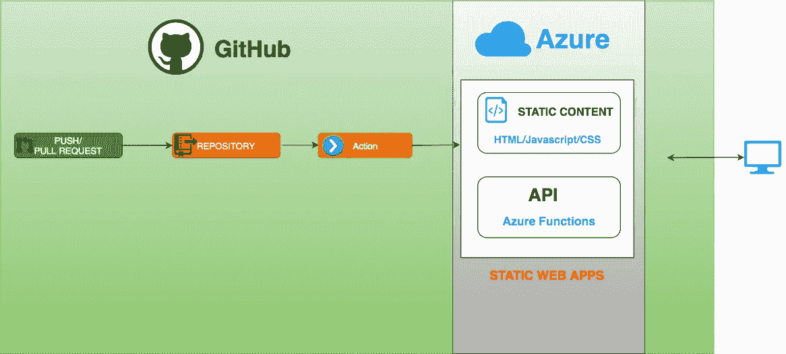

# 使用 Azure 静态 Web 应用服务构建 Angular 应用

> 原文：<https://medium.com/bb-tutorials-and-thoughts/building-an-angular-app-with-azure-static-web-apps-service-8fe84ebe4709?source=collection_archive---------0----------------------->

## 包含示例项目的完整指南

**Azure Static Web Apps**

现在有很多方法来构建和部署 Angular 应用程序，比如 angular with Java，Angular with Nodejs，serverless 等等。使用 Azure 静态 Web apps 服务构建就是其中之一，它最近由微软 Azure 发布，处于预览模式。有了这项服务，您可以…