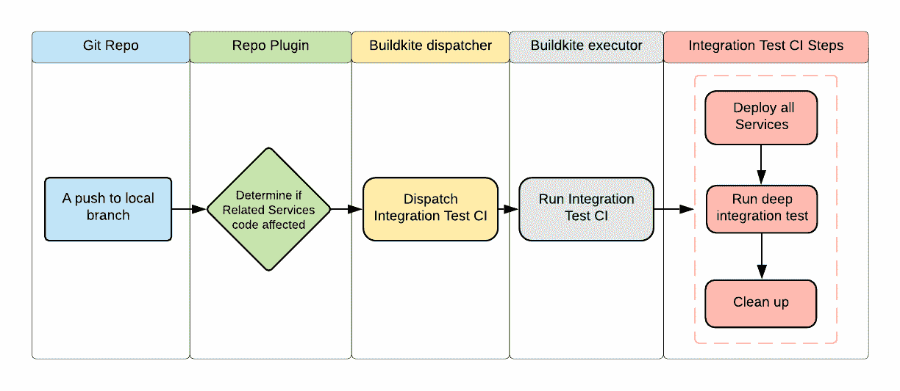
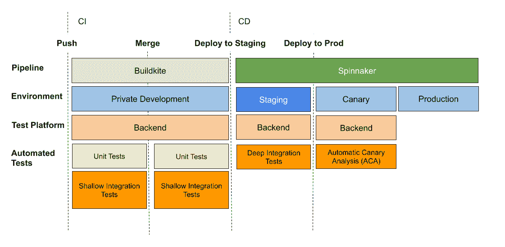
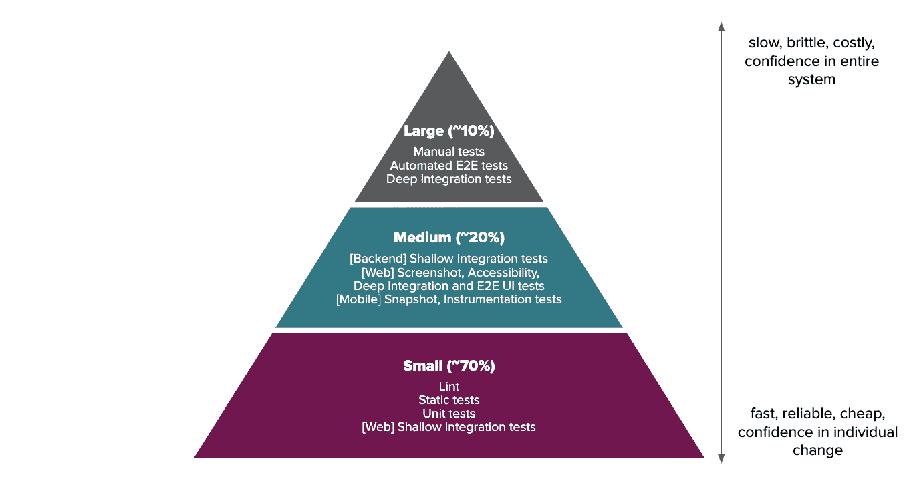
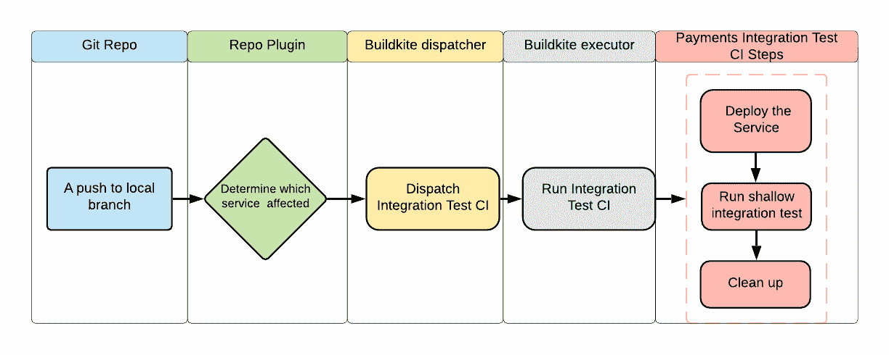
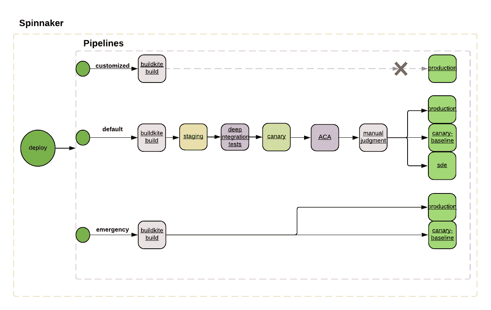

# 在面向服务的世界中构建有效的测试管道

> 原文：<https://medium.com/airbnb-engineering/building-an-effective-test-pipeline-in-a-service-oriented-world-6968c513c6bd?source=collection_archive---------0----------------------->

*了解我们如何构建一个集成测试管道，用于测试 Airbnb 中跨多个服务的关键业务流程。*

This staircase connects several floors of our beautiful new San Francisco office, 650 Townsend.

# 语境

在过去的两年里，Airbnb engineering 一直致力于一项重大计划，即从一个巨大的 Rails 应用程序迁移到一个去耦的面向服务的架构，或我们内部称之为 SOA。作为迁移的结果，一些过去存在于 monorepo 中的关键业务流现在被转换为单独的 SOA 服务。测试这些服务成为一项挑战:

*   工程师需要在将他们对 it 的任何更改部署到生产环境之前，将这些服务作为一个整体进行彻底的测试，这种彻底的测试需要时间。
*   Airbnb 很在意质量和功能正确性。我们要求 Airbnb 工程师在生产前对关键业务流程进行彻底测试，以避免对 Airbnb 的主人或客人产生任何潜在影响。
*   然而，工程师希望开发人员的工作效率很高。是 Airbnb 迁移到 SOA 的重要原因之一。不同的团队可以拥有不同的服务，这样他们可以分别快速迭代他们的服务。

在这篇博文中，我们将讨论如何通过为一些最复杂的业务流程构建有效的测试管道来解决我们在 SOA 世界中面临的测试挑战。我们将分享之前测试管道的工作流程。我们将说明它的挑战和问题，并描述新的测试管道。

# 先前的测试管道:没有连续交付的纯的、连续的集成管道

我们之前的测试管道是为了支持 SOA 迁移的测试需求而构建的。

SOA 迁移将 monorepo 中的关键业务流提取到单独的 SOA 服务中。我们需要迁移不同类型的服务:

*   有些是数据库服务，公开 RESTful APIs
*   有些也是[卡夫卡](https://kafka.apache.org/)的生产者和消费者；
*   有些可能会触发作业调度服务立即或延迟执行作业。

这些使用同步 API 调用或异步事件处理或作业执行的迁移服务之间存在复杂的交互。SOA 迁移的测试需要确保在迁移期间和之后不会对最终用户造成影响。我们需要确保维护以下不变量:

*   对于 Airbnb 的客人和主人来说，所有的业务流程都和以前一样。他们不会注意到潜在的巨大变化。
*   生产中不应出现可能对最终用户造成影响的意外不良变化。

# 深度集成测试 CI

为了满足防止最终用户影响的测试需求，我们选择枚举并编写尽可能多的重量级集成测试。这些集成测试确保了复杂的服务交互按预期工作，并且所有业务流都按预期工作。编写这些测试的过程是这样的:

*   尽可能从最终用户的角度列举所有可能的用户场景。
*   从用户场景枚举中提取后端流程。
*   将后端流程转换为测试复杂服务交互的重量级集成测试。

我们将这些类型的集成测试称为**“深度集成测试”，用于验证服务或应用及其所有软或硬依赖关系**。

为了满足确保没有不良变更部署到产品中的测试需求，我们选择在任何代码变更合并到主分支之前运行深度集成测试。

*   在 Airbnb 中，合并到 master 的任何后端服务的代码更改将在以后部署到生产中。
*   没有正式的部署管道来控制部署顺序和验证过程。在生产前环境中进行部署和验证之前，有可能会将坏的主快照部署到生产环境中。为了避免任何意想不到的糟糕部署，需要在合并到 master 之前触发测试。

我们创建了一个单一的集成测试项目，并将所有的测试放在那里。我们构建了一个单一的集成测试 CI 来运行所有的深度测试。每次提交都会触发配置项。

深度集成测试 CI 工作流如下:

*   我们在 [Buildkite](https://buildkite.com/docs/tutorials/getting-started) 之上构建了集成测试 CI 平台。Buildkite 是一个在您自己的基础设施上运行快速、安全和可伸缩的持续集成管道的平台。
*   集成测试 CI 需要一起测试所有相关的服务，这意味着相关服务的任何变化都会触发 CI。
*   每次运行都需要环境设置和拆除，这将所有相关服务部署到私有开发环境中。

除了集成测试 CI，我们还有单元测试 CI。单元测试 CI 比集成测试 CI 更有效和可靠，因为没有环境设置时间和网络成本。

先前的测试管道在防止坏的变更合并到主版本中起到了重要的作用。此外，由于工程师添加了许多深度集成测试，并在合并前在 CI 中运行所有测试，他们在 SOA 迁移期间推出生产流量时更有信心。

# 扩展和维护挑战

当支持的服务和测试数量相对较少时，以前的测试管道工作得很好。然而，随着更多服务和测试的加入，它并没有很好地工作。

# 这对开发人员的工作效率产生了负面影响

*   **CI 运行时间变长**。CI 中支持的服务和测试越多，运行时间就越长。运行时很快成为开发人员生产力的瓶颈。
*   **词不稳定**。大多数测试都是深度集成测试，有许多依赖项。不仅有涉及同步 API 调用的步骤，还有对异步事件生产者和消费者的依赖，以及作业调度。由于步骤繁重，一些测试变得不可靠。
*   **写集成测试的时间很长**。您需要设置一个本地测试环境，以便编写一个新的测试并首先在本地测试它。随着越来越多的服务添加到整个系统中，设置所有这些服务所需的时间变得很长。
*   **调试失败的集成测试的时间很长**。深度集成测试可能会涉及很多服务。一旦失败，工程师就很难判断应该调查哪些服务日志。
*   工程师无法快速获得反馈。例如，他们在预合并时等待了很长时间，发现 CI 失败只是因为某个服务由于无效的配置更改而无法启动。这可能是由仅启动该服务并运行一些简单端点测试的简单服务级配置项发现的，而不一定是由复杂的深度集成测试配置项发现的。

# 很难扩展和维护

CI 旨在一起测试所有相关的服务。在 CI 流程中，部署了所有服务，运行了所有测试。这使得 CI 很难维护和扩展:当它试图支持许多服务和测试时，CI 的运行时和稳定性很快成为一个问题。

# 它对测试最佳实践产生了负面影响

围绕可测试性的行业测试最佳实践倾向于将测试视为一个金字塔。大量快速、可靠的小型测试应该在金字塔的底部。向金字塔的顶端移动，测试的复杂性和运行时间开始增加，但是它们的数量减少了。

然而，先前的测试管道倾向于建议工程师编写更重的、深度集成的测试，这些测试难以维护且运行缓慢。这些深度集成测试应该在测试金字塔的顶端，而不是中间。

# 它缺少 CD 验证

所有的验证都是在合并前完成的。这种在 CD 时缺乏验证的情况表明了一种糟糕的工程实践:鼓励工程师在将他们的代码合并到 master 而不是预生产之后直接在生产中进行测试。不使用生产前环境进行 CD 验证的另一个副作用是，没有有效的方法来监控和保证生产前环境的运行状况。

# 我们的目标

随着 Airbnb 的发展，越来越多的 SOA 服务加入了这一关键领域。总是试图为每个提交预合并一起测试整个关键流不是一种可伸缩和可维护的方法。我们的测试管道需要更加适应 SOA 世界。

*   它应该遵循行业测试最佳实践:测试金字塔。用不同的粒度编写测试。越高级，应该考的越少。
*   **它应该在不同的阶段运行不同级别的测试**。较低水平的测试应该在早期进行。
*   不同级别的测试确保了整个关键部件在生产前以不同的方式进行彻底的测试
*   在不同的阶段运行不同级别的测试可以确保快速的反馈，这对开发人员的工作效率有好处。
*   **它应该是可扩展和可维护的。这种可伸缩性和可维护性不应该受到支持的更多服务或增加的更多测试的影响。**

# 新的测试管道:具有持续集成和持续交付的完整测试管道

# 简要概述

下面是新测试管道的完整示意图。

管道有两个阶段:持续集成(CI)和持续交付(CD)。

*   在 CI 阶段，它运行单元测试和浅层集成测试。浅层集成测试在完全独立于硬依赖和软依赖的情况下验证服务，这更加轻量级。
*   它仍然使用 BuildKite 作为管道工具，使用私有开发环境作为测试环境。
*   **在 CD 阶段，它运行深度集成测试**。在之前的测试管道中，这些是在合并 CI 之前运行的集成测试，但是通过遵循测试金字塔最佳实践，这种高级测试的数量减少了。
*   它使用[三角帆](https://www.spinnaker.io/)作为管线工具。Spinnaker 是一个开源的连续交付平台，可以提供对部署顺序的真正控制，以及每次部署后灵活的定制验证步骤。使用 Spinnaker [时，自动金丝雀分析](https://www.spinnakersummit.com/blog/what-you-need-to-know-about-automated-canary-analysis) (ACA)也被启用，这是部署到金丝雀后的验证步骤。
*   它使用登台作为测试环境。这是 Airbnb 的共享前期制作环境。

# 测试金字塔

新的测试管道在不同的测试阶段运行不同级别的测试。不同级别的测试形成了测试金字塔。下面是 Airbnb 中使用的测试金字塔的示意图。

随着我们从金字塔的底部到顶部，测试的范围变得更大，这意味着它更真实，端到端。同时，测试变得更慢、更不可靠、更难调试，因为涉及到更复杂的步骤和更多的组件。

在实现测试金字塔的环境中，有两个原则:

*   如果较高级别的测试发现了一个错误，而较低级别的测试没有失败，那么您需要编写一个较低级别的测试。
*   尽可能将测试放在测试金字塔的最下面。

以下是这些原则如何转化为我们的测试实践:

*   **使用单元测试来测试服务**中的业务逻辑。
*   **使用浅层集成测试来测试服务行为，与其他依赖项完全隔离。**这种类型的测试旨在不受任何服务依赖项的影响，因为浅层集成测试的主要目的是仅验证这一个服务，因此它的所有依赖项都应该被嘲笑。
*   用于模拟依赖服务的模拟框架允许您定义 yml 格式的 fixture 数据，其中包括一组特定 API 的请求和响应对。它还定义了匹配规则，将服务的 API 请求与来自 fixture 数据的预期 API 响应进行匹配。启用该框架后，可以模拟服务对其依赖服务的调用，而无需发送真正的网络请求，而是直接返回匹配的响应。以下是夹具数据的基本格式:

*   **使用深度集成测试来测试具有服务交互的服务行为**。但是工程师应该遵循上面提到的测试金字塔的两条规则。
*   在添加深度集成测试之前，检查它测试的场景是否在其他深度集成测试中覆盖，是否可以将其分成更小的部分，并放入单元测试或浅层集成测试中。

# 浅层集成测试 CI

新的测试管道在 CI 阶段运行浅层集成测试。下面是它的工作流程:

整个流程的工作方式类似于之前测试管道中的深度集成测试 CI 流程。不同之处在于:

*   它只部署一个服务，而前一个部署整个服务。
*   当被测试的服务有代码变更时触发，而前一个是当整片的任何部分有代码变更时触发。
*   它运行浅层集成测试，而前一个运行深层集成测试。

由于上述差异，这是一个更轻量级的 CI，运行速度更快，比以前的重量级集成测试 CI 更可靠。

# CD 管道

新的测试管道具有由 Spinnaker 运行的完整 CD 阶段管道。下面是它的简要工作流程:

*   默认管道通过所有生产前部署和验证，包括深度集成测试和 ACA。
*   应急管道可以直接部署生产，但只能用于应急修复。除紧急情况外，不允许任何形式的生产前部署或验证旁路。

# 关键要点

新的测试管道已被证明比以前的更有效。以下是它的要点。

# 它不受支持的服务数量的限制。

之前的测试管道是不可扩展的，因为它是针对所有相关服务的单个集成测试 CI。CI 的运行时间随着支持的服务数量的增加而增加。新的测试管道为每个服务定义了自己的测试管道，并有自己的测试，因此每个服务的测试都可以单独运行。添加对新服务的测试支持意味着为该服务建立一个新的测试管道，对现有的测试管道没有影响。

# 当测试形成测试金字塔时，它更容易维护

随着更多重量级的深度集成测试的增加，先前的测试管道变得越来越不稳定，这些测试本质上更容易出问题，也更难维护。新的测试管道将测试形成一个测试金字塔。较低级别的测试比高级别的测试更容易维护，也不容易出错。

# 它提供了更高的开发效率

与运行更高级测试的先前测试管道相比，运行更慢，工程师可以更快地合并他们的代码，因为 CI 运行更快的更低级测试。特别是当出现故障时，它可以快速故障，以便工程师可以快速获得反馈。工程师也可以更容易地调试失败的低级测试，因为他们只需要检查一个服务。

# 它提供了更全面的测试

通过不同级别的测试，新的测试管道实际上比以前的测试管道具有更好的测试覆盖率。

*   它鼓励工程师写更多的小测试而不是大测试。小测试比大测试更容易编写和维护，所以工程师可以编写和维护更多的测试，这提供了更好的覆盖率。
*   它迫使工程师在不同的层和粒度上测试功能:内部业务逻辑、服务端点功能、服务间行为都包括在内。

# 它遵循并鼓励测试最佳实践

测试金字塔规则鼓励工程师将测试分成更小的部分，并尽可能地将测试推向测试金字塔的底部。更小的测试更容易阅读，更容易把它们写清楚。它们还鼓励通过用较低级别的测试替换发现错误的较高级别的测试来避免测试重复，同时没有较低级别的测试失败。

# 展望未来

我们在团队中逐步推出了新的测试管道。它也被其他一些有类似业务场景的团队使用。然而，仍有大量工作要做。Airbnb 中的不同团队由于其独特的技术堆栈和业务场景，可能对测试流程、工具和环境有不同的测试要求。例如，对于一些团队来说，使用流量回放进行测试可能更合适。

我们的持续集成、持续交付和开发人员生产力团队正在开发一个通用的生产前测试环境，它可以满足不同团队的测试目的。他们还在开发一个通用的测试运行基础设施，可以以相同的方式运行用不同技术编写的所有类型的测试，无论是 java、ruby、javascript 还是任何语言。这种通用测试基础设施支持的更多细节将在未来分享。

非常感谢关、Byron Grogan、Jens Vanderhaeghe、Gilbert Huang 为测试管道提供模拟框架、CI/CD 平台支持和环境支持。非常感谢我的经理 Alice Liang 和我的同事 Michel Weksler、Gary Leung、Jason Jin、Jacob Zhang、Dipak Pawar、、Hosanna Fuller、Saleh Rastani 对项目的支持。