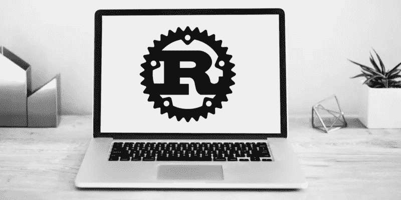

# 为 Rust 构建事件采购箱

> 原文：<https://medium.com/capital-one-tech/building-an-event-sourcing-crate-for-rust-2c4294eea165?source=collection_archive---------2----------------------->



在我最近的一篇博文中，我谈到了 [**事件与**](/capital-one-developers/event-sourcing-with-aggregates-in-rust-4022af41cf67) 事件的关联。在那篇文章中，我刚刚开始探索 Rust 语言及其强类型原生数据结构如何让我表达事件源概念和原语。

在那篇文章中，聚合上有一个`apply`函数，根据您实现它的方式，它要么改变自己的状态，要么消耗以前的自己并返回自己的新版本。在进一步思考了这个问题以及如何为生产级应用程序构建一个事件源箱之后，我决定对我的原始样本进行一些修改。

每当我坐下来写代码时，我总是问自己，我正在构建的东西是否不仅仅适用于我自己的需求。如果是的话，我会试着找出如何开源它。我还没有在日常工作中使用 Rust，但是如果社区继续以现在的速度贡献开源库，这种情况很快就会改变。通过创建这个库，我不仅解决了自己的需求，而且希望下一次 Rust 开发人员寻找 es 原语的精简实现时，他们会找到并使用我的机箱。

我利用仅有的一点空闲时间，创建了一个活动采购箱的初始版本，你可以在 Rust 的中央软件包库 [**crates.io**](https://crates.io/crates/eventsourcing) 上探索。我的第一个版本有一大堆样板代码。我发现自己写了大量多余的代码。结果，我学会了如何创建自定义的*派生的*宏(程序性宏，目前每夜都有，但很快就会稳定下来！)为您处理了样板文件，让您花更多的时间担心您的领域，而不是担心如何与我的机箱交互。

因此，让我们来看看如何使用事件采购箱构建您的域。经常妨碍我的一件事是一个板条箱，它迫使我只能按照它的方式做事，所以我的板条箱试图尽可能地远离您，同时仍然让您使用诸如*命令*、*事件*、*聚集*、*聚集状态*和*调度器*之类的概念。

让我们从一个*命令*的概念开始。该命令是一个相当简单的枚举，其中每个变量都是不同类型的命令:

```
#[derive(Debug)]
pub enum CombatCommand {
    Attack(String, u32),
}
```

这里没有样板文件，也没有特殊的宏。这只是一个普通的旧枚举。记住，命令应该用*祈使句*或现在时态的动作动词来命名:*攻击*对“被攻击”或“攻击”，*移动*对“被移动”或“移动”。

为了定义一个事件，我们将创建一个包含该事件所有变量的枚举。您可以为每个*类别*事件使用一个枚举，或者您可以让一个枚举承载您的所有事件变量。在我的示例“战斗”演示中，我的事件如下所示:

```
#[derive(Serialize, Deserialize, Debug, Clone, **Event**)]
#[**event_type_version**("1.0")]
#[**event_source**("events://.../samples/combat")]
pub enum CombatEvent {
    EntityAttacked(String, u32),
    RandomEvent { a: u32, b: u32 },
    UnitEvent,
}
```

在这里，我们开始看到一些活动源库的工作。首先，我们派生一个`Event`，我们指定事件类型版本和该事件的*源*。您可以为该源代码选择任何内容，但是我更喜欢使用带有方案`events`的 URI 语法。事件一旦离开有界限的上下文，就必须遵守固定的公共契约。因此，我们需要知道特定事件是在哪个版本的契约下发布的。

这是我最初手写的样板文件，但是通过一些自定义的宏使它变得更加清晰。每一个派生事件都会自动从`Event`特征中获取函数:

```
pub trait Event: Serialize {
    fn event_type_version(&self) -> &str;
    fn event_type(&self) -> &str;
    fn event_source(&self) -> &str;
}
```

现在我们已经得到了一个事件和一个命令，如果我们还记得之前的博文，我们应该能够在一个聚合中处理一个事件并发出一个新的状态。同样，我们应该能够*对聚合应用*命令，并获得一个或多个事件。作为 event sourcing 库的消费者和您自己的域应用程序的作者，这是您提供业务逻辑核心的地方。

让我们为战斗样本定义一些状态:

```
pub struct CombatState {
    pub entity_id: String,
    pub hitpoints: u32,
    pub generation: u64,
}impl AggregateState for CombatState {
    fn generation(&self) -> u64 {
        self.generation
    }
}
```

这看起来像是当我们处理战斗事件时，我们将能够得到一个新版本的状态。例如，如果我们*攻击*(命令)一个给定的实体，这有可能产生该实体状态的新版本(**代**)。为了符合`AggregateState`特征，我在我的状态结构上有一个`generation`字段。一旦我知道了如何创建一个宏来自动处理状态生成的单调递增，我也会把它放入机箱中。

这与我之前的想法有些不同。在这里，我采用了一种更实用的方法。我的聚合是*无状态*。它既不消耗也不借用自己的田地。相反，在每次`handle_command`调用后，它*返回*一个新的(世代递增)状态。

我使用这个`generation`字段的原因是为了给应用程序开发人员一个解决并发冲突的潜在工具。不管出于什么原因，如果它们运行多个线程，每个线程处理一个事件，那么通过比较多个状态实例上的`generation`号，可能会有解决状态的线索。许多数据库和服务中的乐观锁定/并发都是这样处理的。

现在让我们实现业务逻辑，这是我们事件采购领域的核心:

```
pub struct Combat;
impl Aggregate for Combat {
    type Event = CombatEvent;
    type Command = CombatCommand;
    type State = CombatState;fn apply_event(state: &Self::State, evt: Self::Event) -> Result<Self::State> {
        unimplemented!()
    }fn handle_command(_state: &Self::State, cmd: Self::Command) -> Result<Vec<Self::Event>> {
        println!("Command handled: {:#?}", cmd);
        // SHOULD DO: validate state and command// if validation passes...
        Ok(vec![cmd.into()])
    }
}
```

显然，我现在已经有了占位符，但你可以想象我会调用一些数学，也许会查找伤害图表来解决战斗事件处理和验证处理命令(例如，拒绝不朽实体或不存在实体的攻击)。

到目前为止，我认为这极大地简化了事件源的使用，使得任何 Rust 应用程序都可以很容易地对其部分或全部内部管道采用这种模式。但是我们还有一件事要处理，那就是*分派—* 处理`handle_command`函数调用产生的事件。

在许多场景中，你将获得这个向量，然后立即*将它发送给*一个事件存储或一个队列或某种消息系统。为了使这更容易，我把*调度程序*的概念变成了一个可插入的东西，它还附带了一些消除样板文件的宏:

```
#[derive(Dispatcher)]
#[aggregate(Combat)]
pub struct CombatDispatcher;
```

当前版本的 crate 已经实现了一个发送到[**eventstore.org 事件存储**](https://eventstore.org/) 的 dispatcher。这是一个非常流行的、开源的、轻量级的、易于使用的事件存储。下面是我们可能看到的实际情况:

```
let combat_store = OrgEventStore::new("localhost", 2113);let swing = CombatCommand::Attack("ogre".to_string(), 150)// set up initial state (likely pre-fetched from a DB in a production scenario)
let state = CombatState {
    entity_id: "ogre".to_owned(),
    hitpoints: 900,
    generation: 0,
};// every successful event that comes out of this will automatically be sent to the eventstore DB
let res = 
  CombatDispatcher::dispatch(&state, swing, &combat_store, "ogre");
```

这里有一些微妙的东西使这个工作。首先，我们的聚合中有几个相关联的类型:

```
type Event = CombatEvent;
type Command = CombatCommand;
type State = CombatState;
```

这些告诉聚合它负责哪种事件源组件。接下来，dispatcher 自定义派生宏让我们告诉它将要调度的聚合:

```
#[derive(Dispatcher)]
#[aggregate(Combat)]
pub struct CombatDispatcher;
```

所有这些就绪后，`dispatch`函数实际上可以调用集合上的`handle_command`,获得结果，并将这些结果发送到调度程序上一个名为*的流*:

```
CombatDispatcher::dispatch(&state, swing, &combat_store, "ogre");
```

eventstore.org 调度程序向数据库发送数据，但是你可以想象我们也有其他种类的调度程序，比如卡夫卡或 NATS 的调度程序，它向一个主题发送事件。这一点也很重要:同一个聚合可以有多个调度器，所以如果您想要持久化 ***和*** 发布您的事件，只需设置两个调度器！

这个机箱的一个有趣的额外好处是，我包含了一个 [***云事件***](https://cloudevents.io/) 的实现。这是一个开放的规范，为在云中发布和共享事件提供了一个通用的标准形式。您可以简单地编写这样的代码，从“常规”事件中获取云事件:

```
let ce: CloudEvent = swing.into();
```

因为您的所有事件都有自定义的派生样板，所以我可以利用这一点从它那里获取足够的元数据，从而生成一个云事件实例，而您无需做任何工作。有了这个`CloudEvent`，你现在可以与任何遵循云事件 JSON 格式的系统进行交互(这个机箱的`CloudEvent`根据云事件 JSON 规范进行序列化/反序列化)。

总结一下，我目前正在两个不同的副业项目中使用这个板条箱，我最终将把它们推向真正的、实时的生产基础设施。我希望有更多的人使用这个板条箱，这样我们就可以强化它，并为不同类型的调度员提供灵感(我可能很快就会建造一个 NATS)。

我还想给潜在的 crate/library 作者留下一个教训:如果我不能构建“快速而肮脏”的迭代，思考它们，并随着时间的推移进行小的调整，我绝对不会达到现在的位置。在花了大量时间进行重构之后，我终于找到了一个我认为可以建立的基础。如果我不能从一个不完美的初始里程碑开始，我永远不会有这个基础。