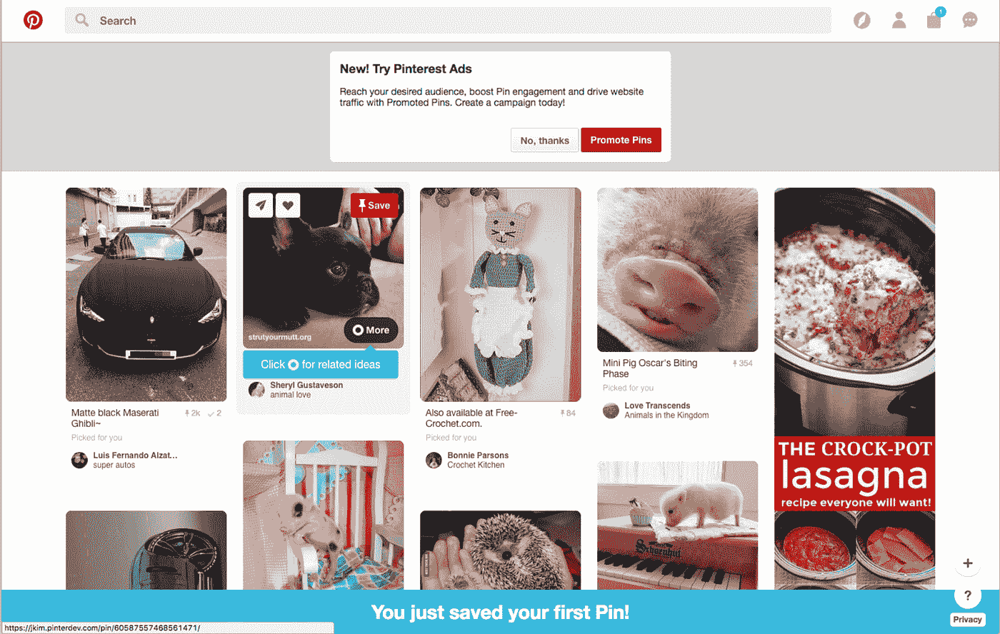
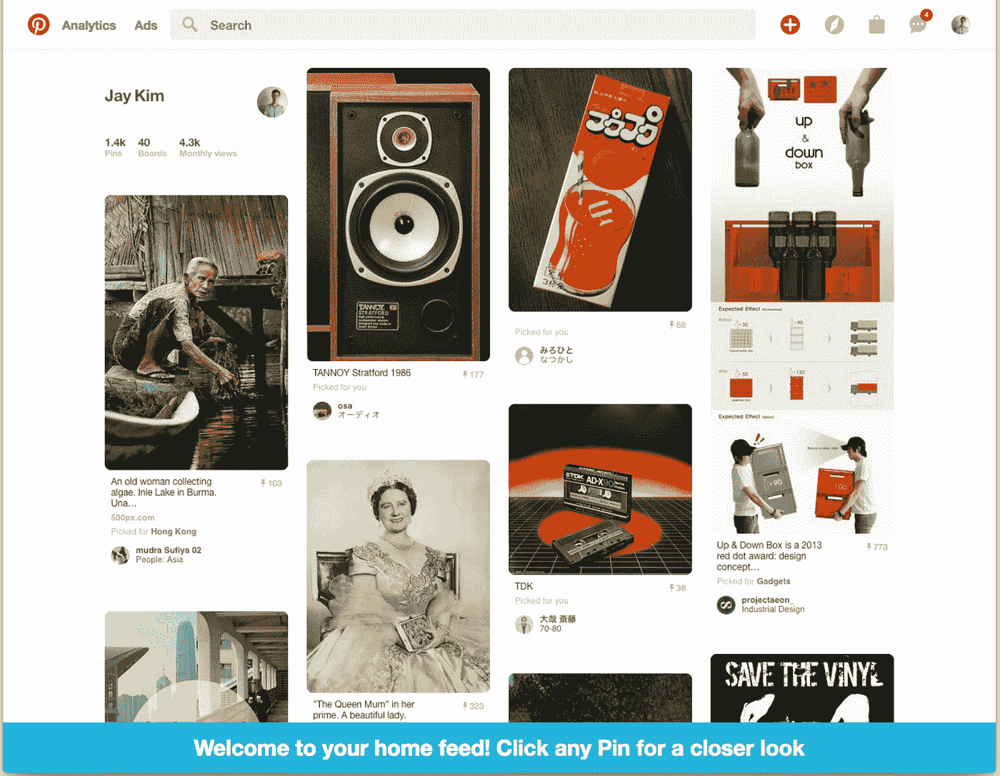
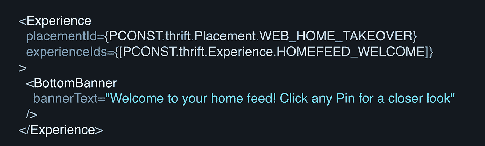
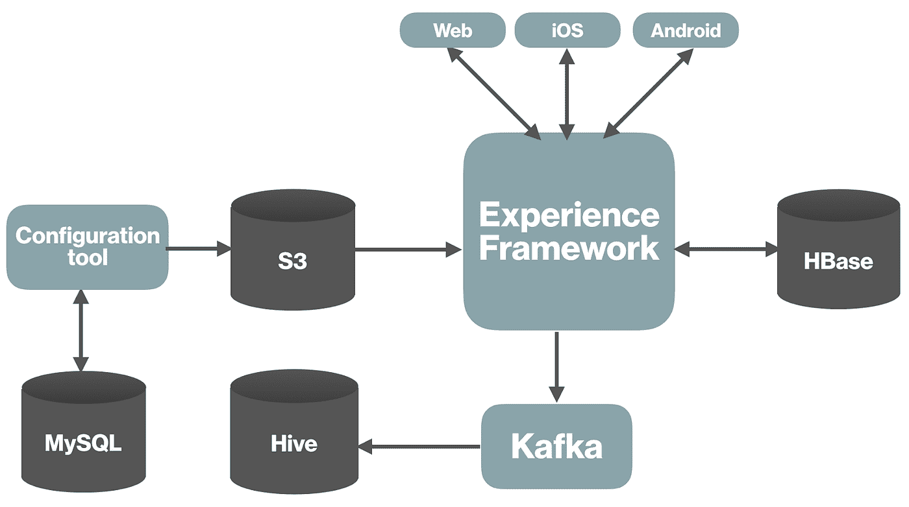
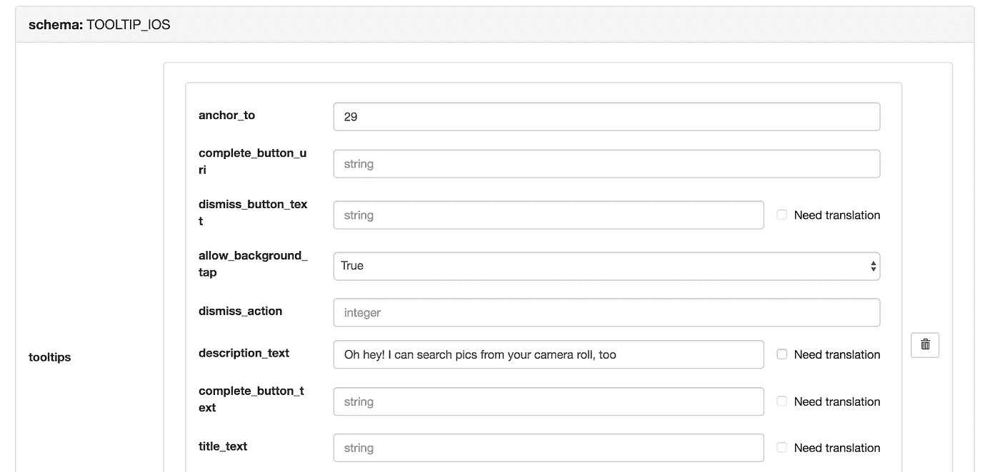
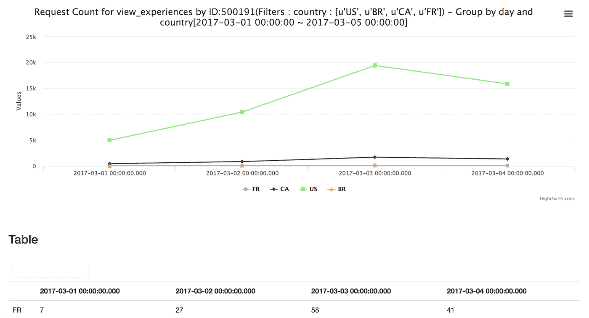

# 构建体验框架

> 原文：<https://medium.com/pinterest-engineering/building-an-experience-framework-ea6c4e619935?source=collection_archive---------2----------------------->

Pinterest 工程师魏智波、Steven Liao 和 Jay Kim

在 Pinterest，我们致力于为超过 1.75 亿月活跃用户提供出色的体验。除了 home feed 和搜索等核心功能之外，每天还会向 Pinners 提供数百种产品内体验，包括新用户入职流程、用户培训、工具提示等。这些体验是由多个不同的产品工程团队构建的。为了确保一致性和正确的用户定位，我们建立了一个名为体验框架的系统。

## 挑战

随着每周有数十种新体验交付给 Pinners，我们需要避免一些问题:

1.UI 冲突。我们希望避免多种体验出现在同一个页面上，并避免相互冲突。例如，如果工具提示、横幅和模态显示在同一个页面上，这将是一个糟糕的体验(如下图所示)。

2.垃圾用户体验。有时候我们需要重复展示体验而不被垃圾邮件。例如，我们教育用户创建他们的第一个 Pin 几次(直到他们实际上这样做)，但是我们不想太激进。

3.积累经验需要时间。通常需要以下几个步骤:

*   为特定用户组实施定制目标功能。实施逻辑来控制体验的频率和持续时间。
*   与其他团队协调以实现产品体验并减少潜在的冲突。
*   实现服务器层来收集显示的内容数据。
*   如果需要，负责度量和统计记录。
*   实现客户端(即移动设备、web)来呈现特征。
*   测试和质量保证。

这些是大部分产品体验的步骤，背后的逻辑彼此非常相似。在我们的框架之前，开发人员每次在产品中添加体验时都会重新创建轮子。

## 系统目标

当我们构建产品体验框架时，我们需要以下特性:

*   一个集中的系统来管理所有的产品体验配置，并解决跨团队和功能的冲突。对于任何给定的页面，系统决定向用户显示哪种产品体验。在 Experience Framework 中，所有产品体验按照其显示位置被分组到不同的集合中，并且冲突的功能被捆绑在一起，因此系统可以通过为用户选择最佳功能来轻松解决冲突。
*   展示产品体验的统一时间表系统。为了使用 Experience Framework，所有产品体验都被表示为一个 JSON 配置，其中包括目标用户组规范、呈现频率、UI 内容等等。基于这些静态配置，系统选择合格的体验以在给定时间显示给当前用户。
*   一种跨不同平台使用通用语言的系统，支持通用客户端库。不同平台上的体验应该遵循相同的协议，以确保相同的食谱可以在 web、iOS 和 Android 等平台上显示。应该构建标准的客户端库，这样开发人员就不需要多次重新实现组件。这种方法将显著提高开发人员的工作效率，并使用户体验更加一致。

## **例子**

在我们进入我们构建的系统的细节之前，让我们看一个网上横幅体验的例子:

要在上图底部构建蓝色横幅，web 开发人员只需编写以下代码:

如您所见，体验框架只需要两行代码。开发者所要做的就是输入体验定义。关于如何以及何时呈现横幅的所有其他细节都完全封装在体验框架中，客户端库在服务器端决定。

## **建筑**

现在让我们进入一些关于我们如何建立这个系统的技术细节。

Experience Framework 的核心向最终用户公开 RESTful APIs，因此所有客户端都直接与 Experience Framework 对话。为了确定向用户显示的功能，Experience Framework 依赖于来自两个不同来源的数据——S3 上的体验配置和 HBase 中存储的数据。

我们还为开发人员构建了一个 web 工具来编辑他们的体验配置，如下图所示。

我们使用 MySQL 来存储草稿配置。一旦开发人员准备好了，就很容易将更新的配置实时发布到生产中。

为了将请求和用户操作记录到 Kafka 中(然后通过数据管道加载到 Hive 中)，我们构建了一个分析工具，以便开发人员可以了解体验的表现如何。

这个系统中有几个关键点值得仔细研究:

*   数据存储:在选择数据存储系统时，我们有两个主要考虑因素。首先，我们需要一个线性可扩展的数据存储系统来支持我们每天的巨大流量。我们还需要动态扩展数据模式来动态添加新列，因为体验可以在运行时部署。我们决定使用 Hbase，因为它符合我们的要求。
*   配置分发系统:体验框架将在数千台服务器上运行，因此能够跨所有服务器实时同步配置是至关重要的。我们利用 Pinterest 的内部 s3+ [动物园管理员](/@Pinterest_Engineering/zookeeper-resilience-at-pinterest-adfd8acf2a6b)系统来实现这一点。在配置分发系统的帮助下，我们可以在运行时更新产品特性，而无需部署任何代码。
*   客户端库:我们在构建和改进客户端库上花了很多时间，因为一个正确设计和实现的客户端库可以省去很多麻烦。例如，我们封装了大部分技术细节，并对客户开发人员隐藏了这些细节，使他们能够专注于业务逻辑。它还提高了开发人员的工作效率，降低了错误的风险。

## **吸取的经验教训**

每次用户打开 Pinterest，都会向 Experience Framework 发送一个请求。总体而言，整个系统每天接收约 15 亿个请求，并托管来自多个工程内部团队的 300 多个体验。在构建这样一个支持各种团队、数百名开发人员和数十亿个请求的关键系统的过程中，我们学到了很多东西。以下是主要的经验教训:

*   总是将代码模块化，尽可能地将不同的组件解耦。由于我们需要支持各种产品团队，新的功能需求是常见的。重构大部分代码来支持特性请求是很痛苦的。
*   作为 Pinterest 的核心和关键系统，框架连接着许多组件，任何一个环节都可能给整个系统带来麻烦。例如，一个设计不良的客户端代码会使体验框架的流量增加一倍或三倍。相反，我们需要积极实施安全措施。
*   系统可见性很重要。你必须了解系统的每个部分在任何时候都是如何工作的，尤其是在事故发生的时候。这就是为什么我们的团队花了很多时间来建立一个全面的警报和监控系统。

## **未来工作**

当前系统基于静态商业规则和排名来决定显示哪个产品特征。有时这些静态配置可以任意设置，很难说出为这些配置设置的最佳值。例如，最大显示计数被设置为三，但是用户可能只需要看一次特征。此外，考虑到配置中有许多不同的可用字段，设置不同的实验来测试所有变量可能会很困难且耗时。为了解决这个问题，我们正在研究在我们的系统中采用机器学习机制的可能性，以便我们可以更好地锁定用户，并决定是否动态显示体验。这确保了体验可以充分展示其潜力，并最终为 Pinners 带来更好的体验。

*鸣谢:非常感谢 NUX、状态机和许多其他产品团队每天给我们宝贵的反馈并帮助改进系统。特别感谢海伦·傅、维多利亚·邝和文晏建立了体验框架的客户图书馆。*