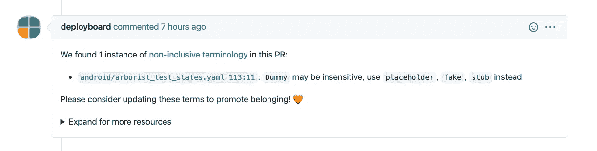
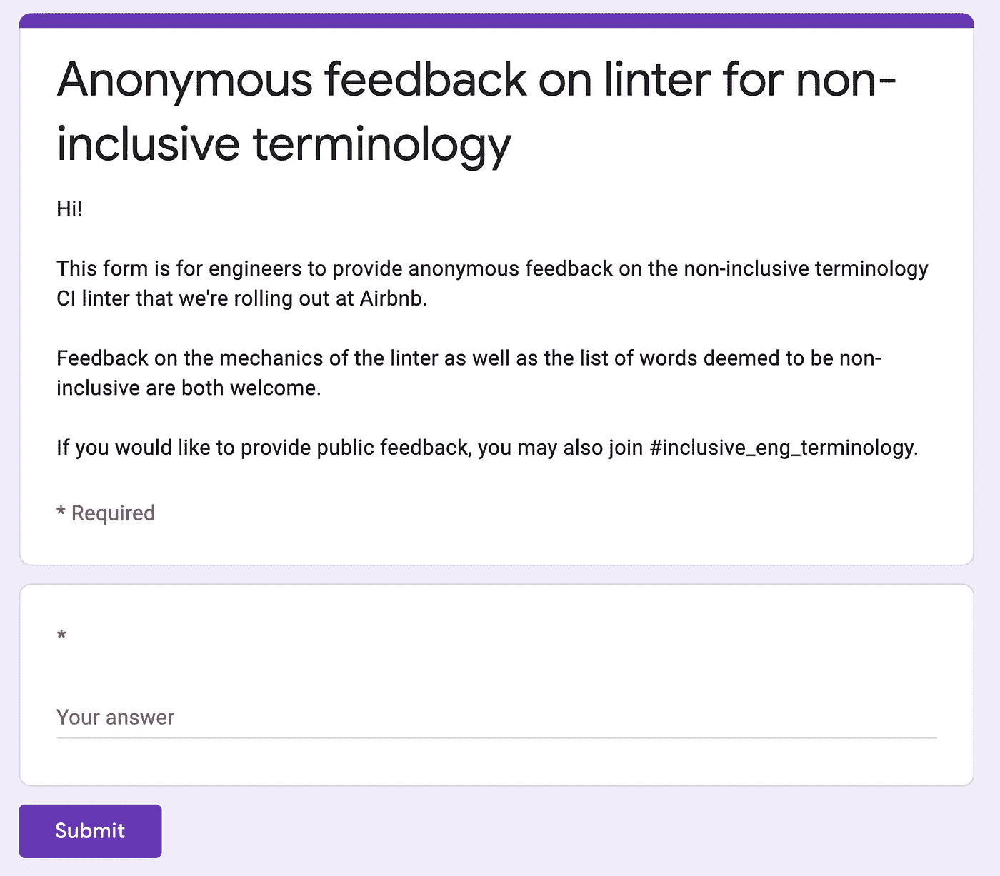

# 构建包容性的代码库

> 原文：<https://medium.com/airbnb-engineering/building-an-inclusive-codebase-bbaa2315e5b8?source=collection_archive---------2----------------------->

我们降低非包容性术语的剧本

**由:** [迈克尔·巴赫德](https://www.linkedin.com/in/mbachand)[阿曼达·瓦特](https://www.linkedin.com/in/amanda-vawter-pmp-she-her-4149a752)[丹·费德曼](https://www.linkedin.com/in/dsfed)[杰克·西尔弗](https://www.linkedin.com/in/silverjake)[王春婵](https://www.linkedin.com/in/juliahw)，马克·泰

代码是我们的手艺。在 Airbnb，我们将我们的代码和产品视为我们价值观的反映。每个开发人员都在他们的工作中融入了自己的一部分。我们希望所有的工程师都为他们工作的代码库和他们每天使用的系统感到自豪。

我们希望与您分享我们在 Airbnb 为构建包容性工程文化所做的一些工作。我们希望分享我们的故事可以激励和支持类似的努力，以消除整个行业的非包容性术语。

# 引导变革

Airbnb 的使命是创造一个任何人都可以属于任何地方的世界。针对代表性不足的群体的持续暴力和偏见威胁着归属感和平等。Airbnb 工程中增加的多样性将使我们的团队能够更好地授权 Airbnb 主机为 Airbnb 客人服务。当务之急是，来自各种背景的 Airbnb 工程师在为 Airbnb 做出贡献时，要有归属感。

2020 年夏天，我们在 Airbnb 的技术堆栈中发现了破坏我们归属感核心价值的术语。团队成员在空闲渠道中积极组织志愿者活动，与来自受影响社区的员工合作实施变革。我们共同撰写了一份提案，以解决我们代码库中的非包容性术语。不到一个月，我们就向首席技术官提交了提案。然后，他通过安排专门的工程师时间来优先考虑这项工作，以使我们的代码和系统更具包容性。

来自最高管理层的认可和资源使这一努力合法化。个人采取的较小行动进一步加强了这一努力的合法性。每一项任务、拉式请求注释和松弛反应都发出了一个信号，表明这项工作受到了企业的重视。

# 培养新习惯

我们认为非包容性术语是我们想要消除的遗留编程风格。为此，我们从衡量代码中非包容性术语的使用开始。然后，我们将问题分成两部分:防止这些术语的新添加和减少这些术语的现有实例。

为了解决第一个问题，我们推出了一个 [linter](https://en.wikipedia.org/wiki/Lint_(software)) 来标记引入 Airbnb 认为不包含的术语的 pull 请求。我们考虑过构建自己的 linter，尽管最终我们对外部工程师[凯特琳·艾尔弗林](https://github.com/caitlinelfring)创作的开源工具印象深刻。linter 对每个添加包含一个或多个这些术语的行的 pull 请求进行注释。拉取请求注释建议了替代术语。

An example GitHub comment posted by the inclusive linter.

为了与工程师建立信任，我们致力于使 linter 具有可操作性。我们希望作者能够在他们现有的 pull 请求中解决 linter 的注释，而不需要在另一个存储库中编辑代码。因此，我们倾向于排除第三方代码和当林挺拉请求时从上游仓库拉进来的代码。

我们开始将 linter 引入到单独的存储库中，一次一个。我们请在该代码库中知名的开发人员来推动最初的推出。这些本地专家能够判断哪些目录应该被排除在 linter 之外，并且也获得了代码库中其他开发人员的信任。

我们已经成功地利用非阻塞棉绒提高了意识并限制了新术语的添加。我们不阻止工程师合并他们的拉动式请求。我们相信，通过适当的沟通，工程师们会意识到这是一项业务重点。

我们现在在 Airbnb 的所有内部仓库上运行 linter。我们已经将注意力转移到减少现有的违规行为上。

# 加强我们的方法

对于这些初始术语，员工资源组(ERGs)的成员，如 Black@和 Able@，参与了寻找攻击性词语列表和实施这些改进。就背景而言，ERGs 为员工提供了专用空间，让他们围绕共同的特征、兴趣和生活经历聚在一起。Black@代表非裔美国人和黑人雇员，而 Able@支持那些有残疾、慢性病或精神健康状况的人。在 Airbnb，我们有 19 个员工资源小组。

我们还回顾了整个行业的类似倡议以获取灵感，包括[谷歌关于编写包容性文档的指南](https://developers.google.com/style/inclusive-documentation)和 [Twitter 关于包容性语言的帖子](https://twitter.com/TwitterEng/status/1278733303508418560)。我们专注于一个初始的术语列表，这个列表大到足以产生有意义的影响，小到足以避免压倒工程师。

这种努力的动机是让每个人在从事 Airbnb 代码和系统工作时都有归属感。为此，我们创建了一个匿名反馈表，让任何工程师都有机会表达他们的想法。

Engineers can submit anonymous feedback via a Google Form.

匿名反馈带来了具体的改进，最明显的是我们的术语列表。例如，我们最初建议工程师用“遗留状态”替换“不受影响的”匿名反馈告诉我们“遗产状态”不是一个在许多情况下都有效的替代方案，所以我们将建议的替代方案改为“豁免”

匿名反馈还强调，我们不清楚为什么每个术语都要用 lint。具体来说，一些员工想知道为什么“dummy”在我们的名单上。对于每个不包含的术语，我们现在记录我们的推理和术语的历史。我们在我们的贴吧发布的每个拉请求评论中链接到这些资源。我们觉得有责任让工程师更容易理解我们为什么要求他们改变代码。

我们认为这个项目是一个永远不会完成的长期计划。随着世界的发展，我们将需要更新我们的非包容性术语列表，并更新我们的代码以反映我们当前的价值观。我们正在建立一个透明的流程来扩展我们的非包容性术语列表。包括受影响群体代表在内的多元化个人团体将与所有利益主体密切联系，单独考虑每个提议的条款。该流程考虑了该术语对个人和社区的影响、与公司价值观的一致性，以及在我们的代码库中替换该术语所需的工作范围。

# 展望未来

我们不能逃避历史，但我们可以告知未来。降低非包容性术语是我们在 Airbnb 和整个技术社区所做的更大努力的一部分，目的是让来自各种背景的工程师感到被倾听、受欢迎和受重视。

删除不反映我们价值观的语言向 Airbnb 的工程师表明，我们关心他们，他们确实属于我们，他们受到关注和尊重。

# 分享我们的工作

感谢您对促进技术包容性的关注。我们对这项工作在 Airbnb 内部以及作为我们同行公司更大努力的一部分可能产生的影响持乐观态度。

为了支持整个行业的类似努力，我们公布了我们认为不包含的术语列表。我们将这些术语作为一个简单的数据文件发布，该文件可以与其他公司的工具和系统集成，或者根据不同的上下文派生和发展。我们用这个相同的数据文件驱动我们的内部 linter。