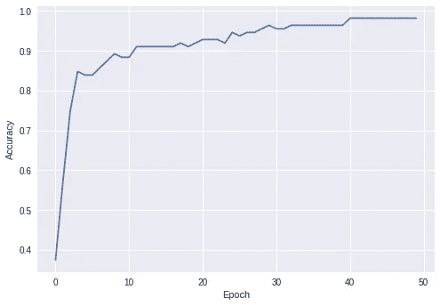
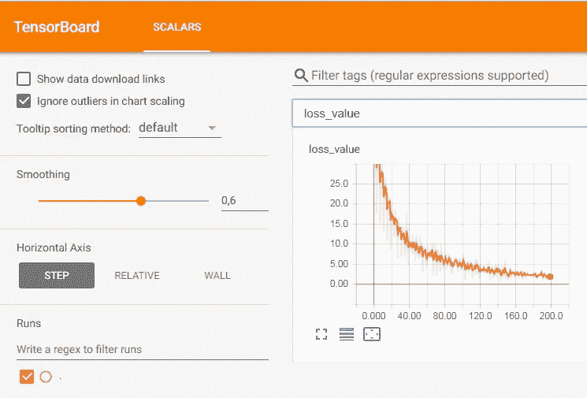

# 构建一个具有快速执行能力的虹膜分类器

> 原文：<https://medium.com/google-developer-experts/building-an-iris-classifier-with-eager-execution-3d77ef2c024?source=collection_archive---------1----------------------->

## (转自 [TensorFlow 博客](/tensorflow/building-an-iris-classifier-with-eager-execution-13c00a32adb0))

近几个月来，TensorFlow 的新增功能之一是[渴望执行](https://research.googleblog.com/2017/10/eager-execution-imperative-define-by.html)，这是一个额外的底层接口，有望使开发变得更加简单和易于调试。只要启用了急切执行，操作就会立即执行，而不必经过单独的执行步骤。简而言之，这意味着编写 TF 代码可以(潜在地)**像编写纯 NumPy 代码**一样简单！

作为一个长期要求的功能，我期待着测试它。在玩了一会儿新的界面后，我可以说新的工作流程感觉更加简单和直观，所有的方法都与 TF 的其余部分完美地集成在一起，尽管处于试验阶段，但大多数功能已经稳定地实现了。

与此同时，渴望执行是对许多新来者来说已经很复杂的框架的进一步补充。这就是这篇文章的原因:通过展示在[虹膜数据集](https://archive.ics.uci.edu/ml/datasets/iris)上从头开始构建一个简单分类模型所需的所有步骤，导航到这个新界面的指导教程。在本文结束时，您将已经在热切的执行中实现了一个完全工作的模型，您可以继续从中进行试验。

这篇文章也是对热切执行的自我介绍:如果你是 TensorFlow 低级编程的新手，你将学习如何实现你自己的算法，并使用这个新的接口运行它们。但是如果你已经认为自己是 TF 方面的专家，这篇文章也将强调启用急切执行与标准图构造的区别。

大家准备好了吗？我们走吧！

*注:如果你想尝试急切执行，我还写了一个* [*Jupyter 笔记本*](https://github.com/tensorflow/workshops/blob/master/extras/eager/eager-tutorial-simone.ipynb) *作为这个帖子的扩展伴侣。如果你没有可用的 TensorFlow 设备呢？记得你可以使用* [*谷歌合作服务*](https://colab.research.google.com/) *在云端运行笔记本！*

# 为什么我们需要急切的执行力？

如今 TF 包括几个高级 API，比如[估算器](https://www.tensorflow.org/programmers_guide/estimators)和 [Keras](https://keras.io/) 。但是很多时候，您还想探索和运行一些底层代码，或者更深入地研究框架。在这一点上，您可能想开始编写或运行一些简单的东西。

为了了解急切执行是如何工作的，让我们从一些数字的加法和乘法开始，看看没有急切执行的代码看起来会是什么样子**:**

Just adding and multiplying… simple enough!

如果你(像我一样)从早期的[开始就已经在这里了，如果你不习惯的话，很难记得**这段代码感觉有多奇怪:为什么你甚至需要一个外部对象来打印一个数字？还有为什么在任何地方都找不到 b *的值*？原因是，在内部，TensorFlow 正在构建一个描述所有操作的计算图，然后在幕后进行编译和优化——在 TF 的最初开发中，优化应该只在模型的完整规范之后发生。**](http://deeplearning.net/software/theano/)

现在比较同一个示例，但是在启用了急切执行之后:

Adding and multiplying, this time with eager execution enabled.

这是相当多的 NumPy 代码！用编程术语来说，TF 的默认 API 是**声明性的**:只有当我们请求特定节点的输出时才会执行，并且它只返回特定的结果。相反，新的急切执行是**命令式的**:执行立即遵循定义，有其所有的好处，例如立即的可视化调试。让我们看看这对优化我们的模型意味着什么——但是首先，让我们绕一个小弯路，看看如何安装和启用热切执行。

# 在代码中启用急切执行

从 TF v1.5 开始，急切执行就已经作为一个实验性的特性被包含进来了，为了这篇文章的目的，我将使用最新的 v1.7rc0 版本(提到为了向后兼容可能需要修改代码的地方)。

如果你想玩最新版本，推荐的方法是建立一个单独的虚拟环境(你可以在笔记本和[官方指南](https://github.com/tensorflow/tensorflow)上找到详细的说明)并从控制台安装 TF 的每夜版本:

> pip 安装 tf-nightly[-gpu]

可以通过一行代码实现急切执行:

Importing and enabling eager.

> 如果您正在使用 1.5 版或 1.6 版，请用`*tfe.enable_eager_execution()*`更改`*tf.enable_eager_execution()*`。

重要的是，你需要在程序的开头运行命令**，否则命令会抛出错误并拒绝执行。原因是，通过启用渴望执行，您正在改变前面描述的 TF 的默认内部机制，这意味着几个低级命令将只在文档中描述的两种模态(图构造或渴望执行)之一中可用。**

# 我们将在本教程中做什么

在本教程的剩余部分中，我们将为 Iris 数据集构建一个分类模型(启用了渴望执行)，这是一个简单的分类数据集，您在遵循 TF 的[入门指南时应该已经遇到过。任务是根据描述其几何形状的四个数字特征将一组虹膜分为三个不同的类别:](https://www.tensorflow.org/get_started/premade_estimators)

The three classes of Irises we want to classify ([taken from Getting Started with TensorFlow](https://www.tensorflow.org/get_started/premade_estimators)). From left to right, original copyright by by [Radomil](https://commons.wikimedia.org/wiki/User:Radomil), CC BY-SA 3.0, [Dlanglois](https://commons.wikimedia.org/wiki/User:Dlanglois), CC BY-SA 3.0, and [Frank Mayfield](https://www.flickr.com/photos/33397993@N05), CC BY-SA 2.0.

出于本文的目的，我只是从 [scikit-learn 库](http://scikit-learn.org/)加载数据集的版本，规范化其输入，并将其一分为二用于训练和测试。如果您有兴趣，以下是加载数据集的完整代码:

Sample code for loading the Iris dataset.

我们将分五步进行。第一部分只是熟悉一些基本的 eager 对象，比如变量和函数，以及它们如何与 NumPy 数组进行互操作。然后，我们将学习如何构建分类模型(第 2 部分)、优化分类模型(第 3 部分)、将数据加载到 TF 中(第 4 部分)以及调试整个过程(第 5 部分)。

# 构建分类器(1/5):函数、梯度和变量

eager execution 提供的基本操作是**自动微分**:给定一些在张量上操作的函数，我们可以自动计算关于这些张量中的一个或多个的梯度(并且，不用说，是高效的)。

如果你正在构建一个 TF 图，函数和梯度被定义为计算图中的节点。启用急切执行后，**这两个函数都是标准的 Python 函数**。例如，下面是一些定义简单平方函数并计算其梯度的代码:

Automatic gradient computation in eager.

所有操作都内部保存在“磁带”中，对用户透明，而不是必须构建图形。`tfe.gradients_function`就是神奇之处:您可以将任何 Python 函数(至少有一个张量作为输入)作为参数传递，它将返回**另一个 Python 函数**来计算关于它的任何参数的梯度。

> 您可能已经注意到，在上面的第 6 行中，我们使用了`*tf.constant*`来构建一个常量张量:这一步是可选的，因为传递一个 NumPy 数组或一个 float 值会触发一个自动转换操作。

您还可以将调用链接起来以获得高阶导数:

Higher-order derivatives with eager execution.

TF 的一个基本构件是[变量](https://www.tensorflow.org/programmers_guide/variables):组成我们模型的有状态数组，我们需要在训练阶段对其进行优化。Eager 有一个自定义的变量实现:

Variables in eager execution and casting to/from NumPy objects.

正如您所看到的，eager 中的变量**完全可以与 NumPy 数组**互操作，它们的值一旦被请求就会被自动初始化(而对于图形构造，您需要显式调用一个初始化例程)。使用`tfe.implicit_gradients`，你也可以自动计算一个函数相对于*它使用的所有*变量的梯度。例如，这等同于上面的梯度计算，但是使用变量和隐式梯度:

Computing implicit gradients with respect to all variables.

现在我们已经有了所有的构建模块，我们可以进入更高的抽象层次，从神经网络的定义开始。

# 构建分类器(2/5):层和网络

理论上，我们已经拥有了优化模型所需的一切:我们可以实例化一堆变量(模型的参数)，并将模型本身的逻辑封装在一个函数中。例如，这是一个一维逻辑回归模型:

A simple logistic regression model (without using high-level methods).

然而，一旦我们开始添加更多的操作(例如，新的隐藏层、dropout 等等)，这种方法就无法扩展。构建更复杂模型的一个简单方法是使用[层](https://www.tensorflow.org/tutorials/layers)，这对于使用 TF 高级接口的人来说应该很熟悉:

Defining a neural network model with Layers.

在上面的例子中，我们正在构建一个只有一个隐藏层的模型，中间有一个 dropout 操作:变量的**定义在每一层**中处理，我们可以通过在一个简单的(再次，Python)函数中将各层链接在一起来定义我们的模型。这个模型很容易解释，即使你不习惯 TF，我们可以通过向函数传递另一个布尔标志来实现 dropout 逻辑，增加可读性。

> `*tf.layers*`模块是`*tf.keras.layers*`的实现，它包含一组在 [Keras 库](https://www.tensorflow.org/api_docs/python/tf/keras/layers)中定义的高层。目前的实现只是部分的，新的层在不断的增加:同时，你也可以直接使用`*tf.keras.layers*`中定义的层。

由于以这种方式构建网络是一个常见的工作流，TF 还提供了一个更高层次的抽象，即`Model`对象，一个封装了模型逻辑的定制类，提供了一些用于调试和检查训练的高级工具:

Defining a neural network model with the Network object.

> 如果你使用的是 v1.5 或者 v1.6，你需要使用`*tfe.Network*`而不是`*tf.keras.Model*`，你需要为初始化中添加的每一层显式调用`*self.track_layer()*`。

网络的一个主要好处是它们封装了与模型变量相关的所有逻辑。为了理解它，让我们稍微摆弄一下我们的模型:

Using a network to compute predictions and get its variables.

第 2 行只是模型的初始化。第五行显示了模型中变量的**惰性**:即使 eager 执行有一个动态工作流，变量也只在模型第一次运行时被初始化，因为在此之前，eager 对其输入张量的形状没有任何指示。预测可以通过简单地用一些数据调用对象来获得(第 8 行):在这之后，变量被正确地初始化，如第 11 行所示。

# 构建分类器(3/5):损失和优化器

由于我们将使用我们的模型来做一些分类，我们需要定义一个适当的成本函数来训练它。与之前类似，我们可以使用 TF 的标准组件，通过**将它们封装在 Python 函数**中:

Cross-entropy definition with eager execution enabled.

> 作为一个小提示，我们正在使用`*softmax_cross_entropy_with_logits_v2*`，因为旧的`*softmax_cross_entropy_with_logits*`将很快被废弃！两者在这里完全相同，不同之处在于新版本允许对标签进行梯度计算(这个简单的例子不需要)。通过去除一键编码，我们也可以等效地使用`*sparse_softmax_cross_entropy*`。

为了优化，我们可以定义自己的定制逻辑，或者(更有可能)使用 TF 中已经定义的[优化器之一。此时，您可能会猜到我们的代码会是什么样子:](https://www.tensorflow.org/api_guides/python/train)

Building and calling optimizers in TF.

这里唯一的语法上的好处是使用一个没有参数的匿名函数来调用最小化例程:这是必需的，因为优化器是为图形构造而设计的，并且已经被定制为支持新的 eager 接口。另一种可能性是显式计算我们模型的梯度，并使用优化器的`apply_gradients`函数:如果你感兴趣，我在笔记本中描述了这种替代方式。

# 构建分类器(4/5):加载数据和迭代器

如果您了解 TF 的最新信息，您会知道向我们的模型提供数据的首选方式是通过[高级数据集 API](https://www.tensorflow.org/programmers_guide/datasets) ，它可用于从多个来源加载数据，并与所有高级 API 连接。急切执行的一个很好的特性是，您可以将数据集封装在 Pythonesque 迭代器中，并像使用任何其他迭代器一样使用迭代器**循环遍历它。**

在使用迭代器之前，让我们遍历一下我们加载的 Iris 数据集的训练部分:

Building datasets and iterating over it using the tfe.Iterator object.

在上面的代码中，我们将数据加载到`Dataset`对象中(第 2 行)，然后使用迭代器遍历 32 个元素的小批，计算每批的阳性标签的平均数，例如:

> 第[0]类百分比:31.25 %
> 第[0]类百分比:34.375 %
> 第[0]类百分比:37.5 %
> 第[0]类百分比:25.0 %

# 构建分类器(5/5):调试工具

我们的任务最不需要的是一些调试和可视化结果的工具。因为在标准的图结构中，执行被隐藏在会话的动态之下，所以调试一直是 TF 新手的难点，也是开发 [TensorBoard](https://www.tensorflow.org/programmers_guide/summaries_and_tensorboard) 的主要原因。然而，在急切执行中，一切都是动态运行的，你可以使用 Python 工具箱中的任何工具来完成它:从 Matplotlib 的绘图到控制台的输出，你可以命名它。

Eager 也有一些实用程序来简化调试。例如，[度量](https://www.tensorflow.org/versions/master/api_docs/python/tf/contrib/eager/metrics)可用于计算和累加每个时期的值:

Accumulating the accuracy for an entire epoch using a tfe.metrics.Metric object.

上面的代码循环遍历一个时期，并为每一批计算模型的准确性。由于我们还没有训练它，准确率可能会达到 33%左右，或者说是随机的。

如果您喜欢好的 ol' TensorBoard，您可以使用摘要的[实验实现](https://www.tensorflow.org/versions/master/api_docs/python/tf/contrib/summary)在仪表板上保存可视化值:

Saving the accuracy on disk using a summary.

这里的语法稍微复杂一些:在创建一个 writer 之后，我们需要将它设置为默认的 writer*和*选择一个在磁盘上保存值的时间间隔(基于 TF 的全局步长，它将随着我们每次优化步长而增加)。

这只是粗略地看了一下一些启用了急切执行的调试工具:查看笔记本，了解其他可视化和调试技术的描述。

# 把所有的放在一起

我们终于准备好把所有的东西放在一起了！我们将对我们的网络进行几个时期的训练，使用一个度量来计算准确性并将其存储在一个 NumPy 数组中，并通过将它保存在磁盘上来跟踪损失。最后，我们使用 Matplotlib 绘制所有时期的精确度。

Training procedure for our Iris classifier.

网络很容易达到 100%的准确性，这是一个简单的基准:

如果你打开 TensorBoard，你可以查看损失进度:

你已经到了我的急切执行教程的结尾。到目前为止，我希望您相信使用 eager 可以非常快速地构建原型，同时使调试更加简单。再一次，如果你想了解我们在本教程中使用的所有方法的更多细节，你可以查看 [Jupyter 笔记本](https://github.com/tensorflow/workshops/blob/master/extras/eager/eager-tutorial-simone.ipynb)，本教程只是对界面的简明介绍。

这里有很多我们没有看到的东西，比如如何启用 GPU 支持，或者如何在模型内部使用控制流操作。尽管如此，我希望这是足够的样板代码，可以帮助您踏上 TF 的低级编程之旅！

*原载于 2018 年 4 月 13 日*[*medium.com*](/tensorflow/building-an-iris-classifier-with-eager-execution-13c00a32adb0)*。*