# 在 Go 中构建无界通道

> 原文：<https://medium.com/capital-one-tech/building-an-unbounded-channel-in-go-789e175cd2cd?source=collection_archive---------0----------------------->

## 在 Go 上发布一系列中的一个

Go 中的并发性建立在三个相互依赖的特性之上:goroutines、通道和 select 语句。当然，也有像 *sync 这样的帮手。等待组*和*同步。Once* 使并发变得更简单。此外，在幕后你有标准的底层特性，比如互斥、conds 和 atomics。但当人们在 Go 中解决并发问题时，他们大多是在看 goroutines、channels 和 selects。让我们进一步探索渠道。

通道有两种类型:*缓冲*和*非缓冲*。默认的无缓冲通道将值从一个 goroutine 传递到另一个 go routine，一次传递一个。写入通道块的 goroutine，直到另一个 goroutine 从同一通道中读取。如果读操作发生在写操作之前，读操作会阻塞，直到通道中有数据为止。

缓冲通道给了作者更多的灵活性。缓冲通道时，可以将一定数量的值写入通道，但在通道阻塞之前不会读取这些值。它的行为就像一个大小有限的同步队列。

但是，如果您希望一个 goroutine 能够在不等待读取器的情况下写入无限量的数据，该怎么办呢？缓冲通道似乎提供了一个解决方案，因为它们允许一个 goroutine 继续写，而不需要等待另一个 goroutine 读取。问题是缓冲通道总是有界的；如果您以这种方式使用缓冲通道，您可能(并且可能最终)会遇到一个点，在这个点上，正在编写的 goroutine 被阻塞，等待一个读者。这就留下了一个问题: ***我如何创建一个从不阻塞通道写入的编写器？***

这个问题比看起来要难。由于 Go 不会自动在缓冲通道中存储无限量的数据，我们需要在写入通道和读取通道之间放置一个中介。这带来了一些限制。

首先是我们受限于类型 ***接口{}*** 的通道。这是因为我们不能在 Go 中编写自己的通用函数，我们需要编写一个函数来提供功能。Go 社区中关于泛型的争论由来已久，我们不打算在这里重新讨论这个问题，而只是探索什么是有效的。

第二个限制是我们需要把我们的单通道变成两个通道。因为 Go 不允许操作符重载，所以无法将我们的功能隐藏在返回单个通道的重载的 *make* 函数之后，我们需要返回两个通道，一个是我们写入的通道(让我们调用这个通道)，另一个通道用于从我们的无界通道读取(让我们调用这个通道)。

虽然可以有多个 out 通道的读取器和多个 in 通道的写入器，但是我们需要实施一些限制:

*   您无法从 in 通道中读取
*   您不能写入输出通道
*   你不能关闭输出频道

做这些事情中的任何一件都会破坏无界的通道语义，并可能引发恐慌。

考虑到这些要求，这里有一个建议的函数签名:

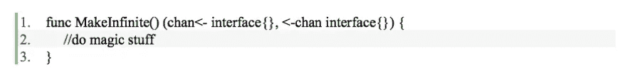

我们的函数将不接受任何内容，并返回两个通道。我们不需要任何输入参数，因为只有一种可能的通道类型，***{ }***。第一个输出参数是只写(可关闭)的输入通道，第二个输出参数是只读的输出通道。通过在返回的通道上使用通道方向标记，我们可以防止用户执行会破坏我们的无界通道的操作。这为我们的用户消除了错误的来源。

# **试验台**

在我们写代码之前，我们应该写一个测试来告诉我们代码是否工作正常。我们将使用以下代码测试我们的功能:

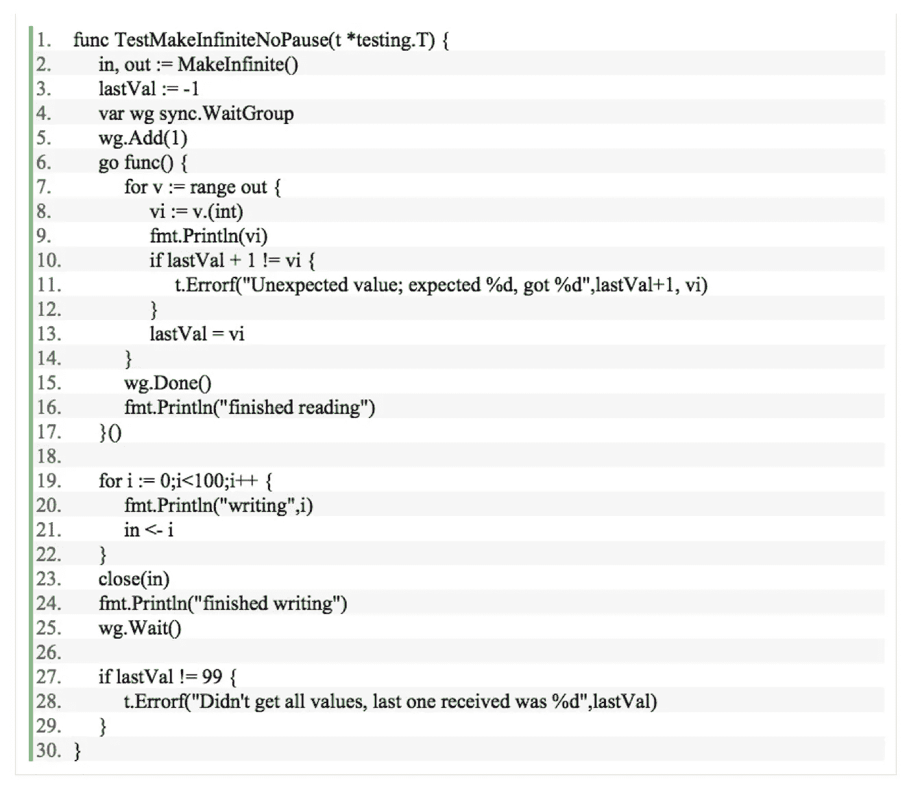

这段代码发送 100 个值，从 0 到 99，然后确保它们以正确的顺序从另一端出来。它不*而*确保写和读是异步的。为了做到这一点，我们需要一个减慢书写速度的测试和一个减慢阅读速度的测试。我们可以通过创建另外两个测试来实现，一个插入 ***时间。睡眠(50 *次。毫秒)*** 插入到写循环中，而另一个将相同的代码插入到读循环中。代码在其他方面是相同的。

既然我们已经弄清楚了我们的界面是什么样子，以及如何测试它，让我们看看如何构建这个函数。

# **设计**

为了在写入时不阻塞，我们需要在写入 In 通道时立即读取，并按照接收顺序存储值。存储的值的数量需要是无限的，以防读取器比写入器慢。一个无界的、有序的值列表意味着我们应该使用一个片来存储排队的数据。我们还需要启动我们自己的 goroutine 来从 in 通道进行读取。

到目前为止，这并不难。问题第一部分的模式是:

1)在中创建 ***和**中创建*出*** 通道***

推出一款 goroutine

**a)** 而 通道中的 ***打开***

**i)** 从 ***中读取*** 通道

**ii)** 把从**到*的数值放入*到**通道中

**b)** 关闭 ***出*** 通道

**c)** 退出 goroutine

**3)** 返回 中的 ***和 ***中的*** 通道***

实现这一点的代码如下所示:

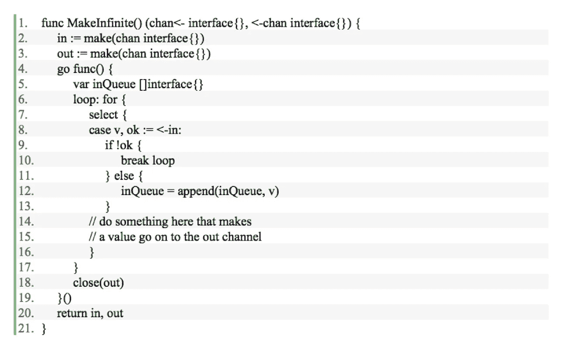

我们利用 ***、*、**、**、 *ok、*、**习语在 Go 中检测一个通道是否关闭。从通道中读取通常如下所示:

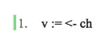

这将阻塞，直到从通道 ***ch*** 中读取一个值。然后，该值将被赋给 v。当您尝试从一个关闭的通道读取时，该通道总是返回值，即该通道的零值。既然向通道写入零值是合法的，那么如何判断从通道读取的值是写入的零值，还是因为通道关闭而产生的零值呢？通过使用第二个布尔参数作为从通道读取的一部分，可以做到这一点:

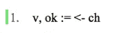

如果 ***ok*** 为 ***true*** ，则通道打开。如果 ***ok*** 为 ***false*** ，则通道关闭。我们使用这些信息来知道何时打破循环。

## **还有一点要注意:**

我们需要在 ***上为*** 循环使用一个标签，这样我们就可以从 ***case*** 子句中 ***break*** 出来。如果没有使用标签，则 ***中断*** 将应用于当前 ***案例*** ，并且 ***为*** 循环将永远运行。

如果我们现在运行测试，它将如预期的那样失败，因为我们不再写回任何东西:

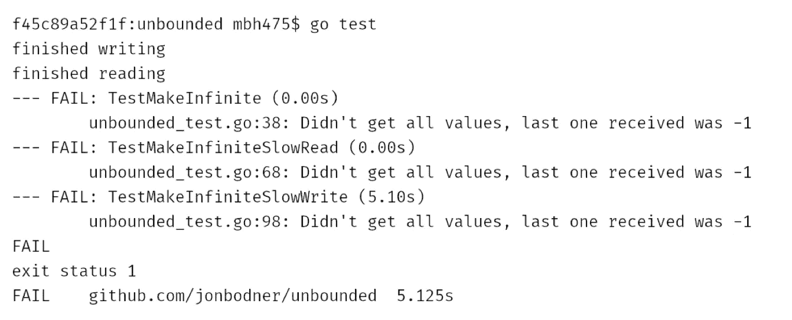

# **书写无阻塞**

现在，我们正在对所有写入的值进行排队，我们需要某种方式将它们发送回来，这里 ***select*** 帮助我们。虽然我们通常使用 ***选择*** 来同时从多个通道读取，但是也可以使用 ***选择*** 来写入通道。通道写的情况就像通道读的情况一样处理；如果写入成功(被写入的通道被另一个 goroutine 读取)，则执行 case 子句中的代码。所以让写作工作的第一步看起来像:

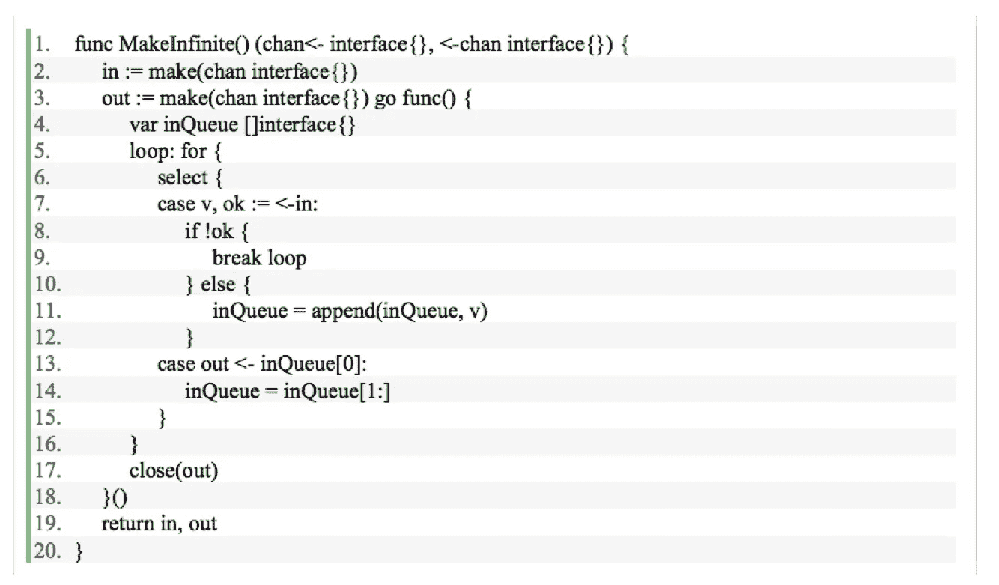

我们可以将队列 中 ***的第一个值写入输出通道，当它成功时，我们将该值从队列头取出并再次循环。让我们运行测试，看看会发生什么:***

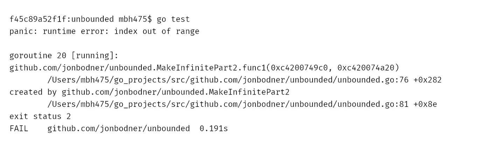

哎呀。当我们试图从队列 中的 ***读取第一个值时，我们会得到一个错误，因为队列*** 中的 ***一开始是空的。这不仅仅是一个创业问题。如果读取者比写入者更快，队列将再次清空，我们将面临同样的问题。 ***我们如何解决？******

像许多计算机科学问题一样，解决方案是另一个间接层。与其直接读取队列 中的 ***，我们可以将它封装在一个函数调用中，该函数调用在尝试获取第一个值之前检查队列是否为空。Go 中的闭包使得内联函数变得很容易:***

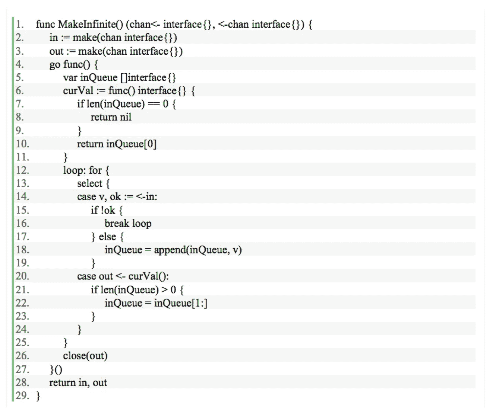

让我们看看这是如何工作的:

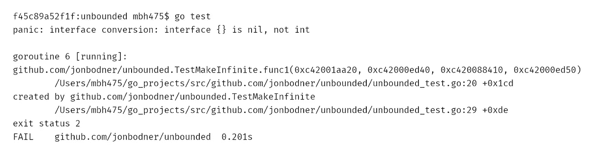

哼。看来写出 ***nil*** 值是个馊主意。它被我们的 reading goroutine 选中，当它试图转换成一个 ***int*** 时，测试惊慌失措。每当队列中没有任何东西时，我们不想将***【nil】***写入 ***out*** 通道；我们根本不想写*。有什么办法可以在没有东西发送的时候阻止写入到 ***out*** 通道？*

*我们将结合两个技巧， ***nil*** 通道和包装功能。如果您尝试写入一个 ***nil*** 通道，写入尝试将永远阻塞。通常，这似乎是不好的行为，但是有一个地方是可以的——在 ***select*** 语句中。当没有数据要发送时，我们应该写一个 ***nil*** 通道，这样 case 就阻塞了，不发送任何东西。*

*为了根据队列的长度获得不同的行为，我们需要在通道周围有一个间接层；这听起来像是另一个功能。另外，我们的代码变得简单了一些。因为当队列 中的 ***为空时，我们不再潜在地写，所以我们不再需要一个 ***if*** 语句来包装从队列中移除头部。****

*这会产生代码:*

*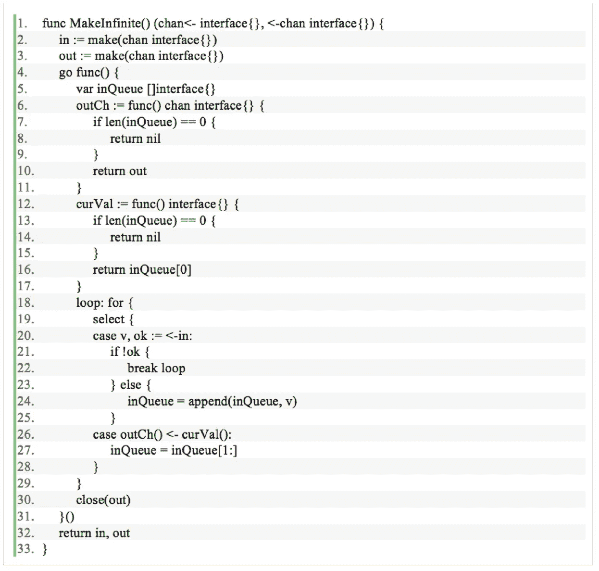*

*让我们看看这是如何工作的:*

*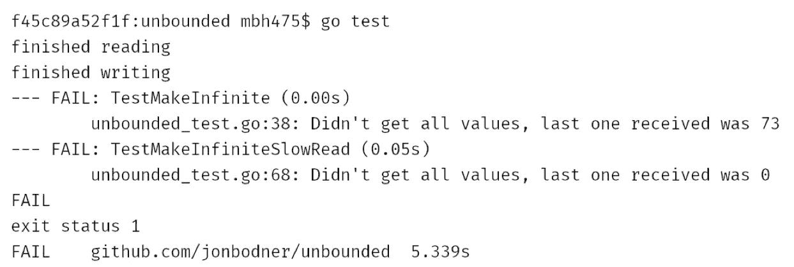*

*啊哦。现在我们有一个不同的问题。我们可以读和写，但是我们关闭得太快了，因为写的比读的快。我们如何获得所有的值？*

# ***清空队列***

*显然，这段代码中有一个错误。任何时候写者比读者快，在队列 中 ***就会有多个值等待读取。如果我们退出 ***for*** 循环，而不等待队列清空，那些排队的值将永远不会被写出。我们需要不断循环，直到两件事都为真:通道关闭，队列为空。****

*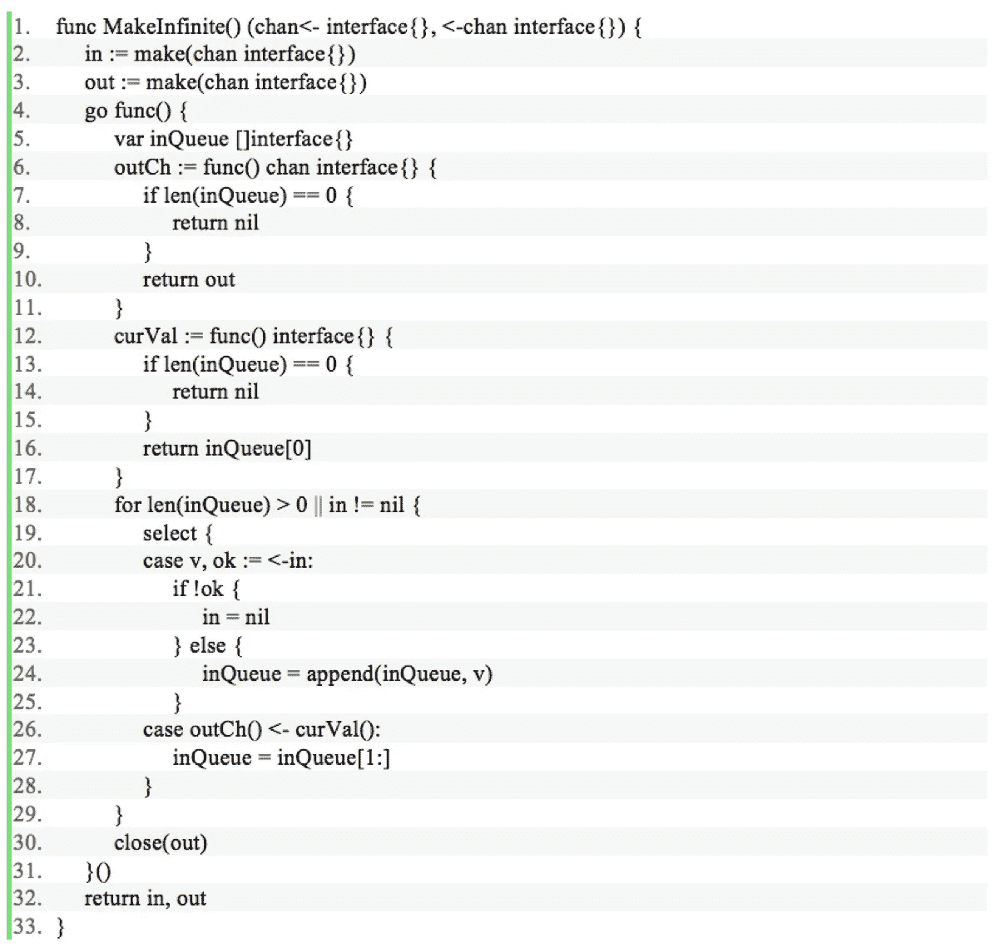*

*这段代码的大部分都很简单，我们能够去掉标签上的*语句，但是通道处理和 ***上的条件对于*** 语句可能需要一些解释。特别是****nil****怎么回事？****

**就像向一个 ***nil*** 通道写入会永远阻塞一样，从一个 ***nil*** 通道读取也会永远阻塞。通过将 中的 ***设置为****select***语句将不再尝试从 in 中读取。这很好，因为我们只在通道关闭时将**** *中的 ***设置为 ***nil*** ，一个关闭的通道总是返回值。从一个 ***for-select*** 循环内的一个封闭通道中读取将导致该通道被反复读取；这将严重影响性能和 CPU 使用率。******

*鉴于此， ***对于*** 的条件是有意义的。只要我们仍能读取值 ***(in！= nil)*** 或者还有值在排队***(len(in queue)>0)***。如果队列为空，通道关闭，我们就完成了，所以关闭 ***out*** 通道，退出 goroutine。*

*这段代码最终通过了我们的测试:*

*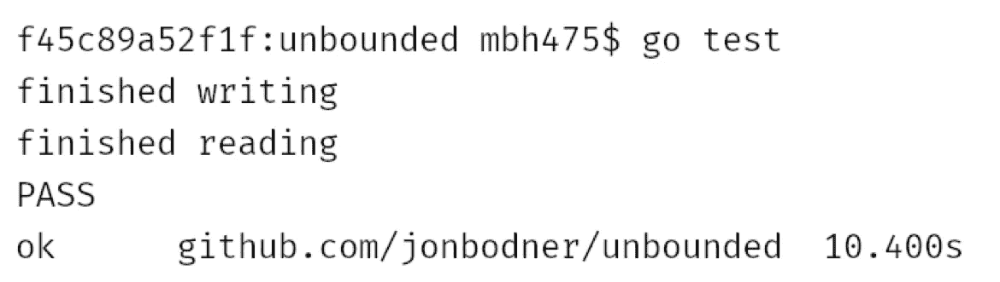*

# ***嗯？***

*事实证明，如果您想要一个从不阻塞写操作的通道，缓冲通道不在实现中。那么它们有什么用呢？为什么要在 Go 中加入这个功能？我将在本系列的下一篇博文中讨论缓冲通道的使用。*

*[***披露声明:以上观点为作者个人观点。除非本帖中另有说明，否则 Capital One 不属于所提及的任何公司，也不被其认可。使用或展示的所有商标和其他知识产权均为其各自所有者所有。本文为 2017 首都一。***](https://appliedgo.net/generics/%20%20http:/blog.jonathanoliver.com/golang-has-generics/%20%20https:/github.com/golang/go/issues/15292%20%20https:/news.ycombinator.com/item?id=9622417%20%20http://stackoverflow.com/questions/3912089/why-no-generics-in-go)*

*欲了解更多关于 Capital One 的 API、开源、社区活动和开发人员文化的信息，请访问我们的一站式开发人员门户网站 DevExchange。[***developer.capitalone.com/***](https://developer.capitalone.com/)*

***附加链接***

*   *[在 Go 中构建 REST API](https://developer.capitalone.com/blog-post/building-a-serverless-rest-api-in-go/)*