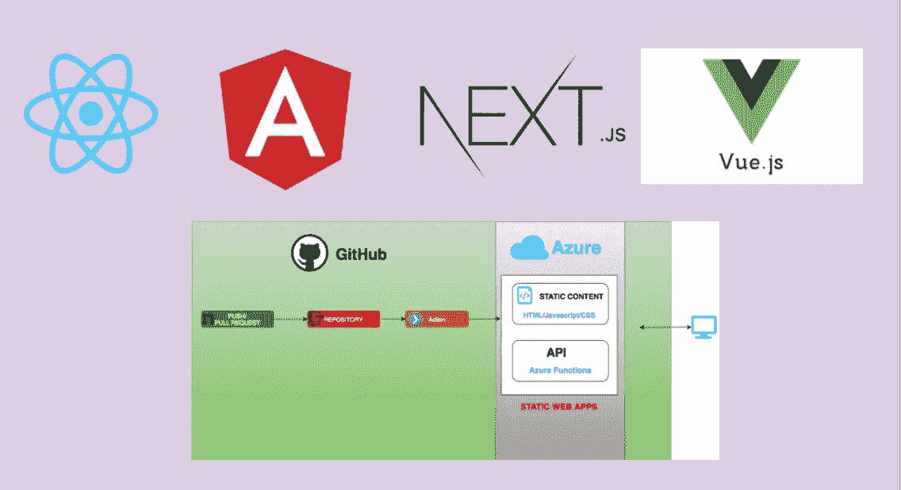

# 用所有主要的 UI 框架/库构建 Azure 静态 Web 应用

> 原文：<https://medium.com/bb-tutorials-and-thoughts/building-azure-static-web-apps-with-all-major-ui-frameworks-libraries-f9d7cd16605e?source=collection_archive---------0----------------------->

## 带有 Angular、React、Vue.js、Next.js 的示例项目

现在有很多方法来构建和部署前端应用程序，如无服务器、容器等。使用 Azure 静态 Web apps 服务构建就是其中之一，它最近由微软 Azure 发布，处于预览模式。有了这项服务…