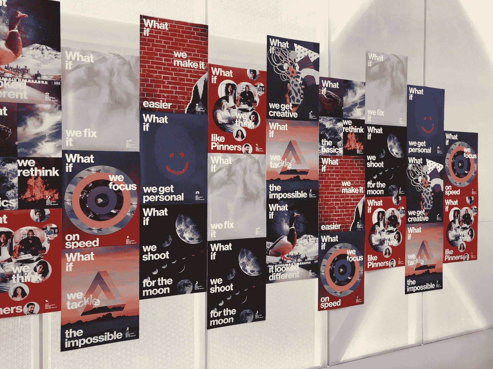
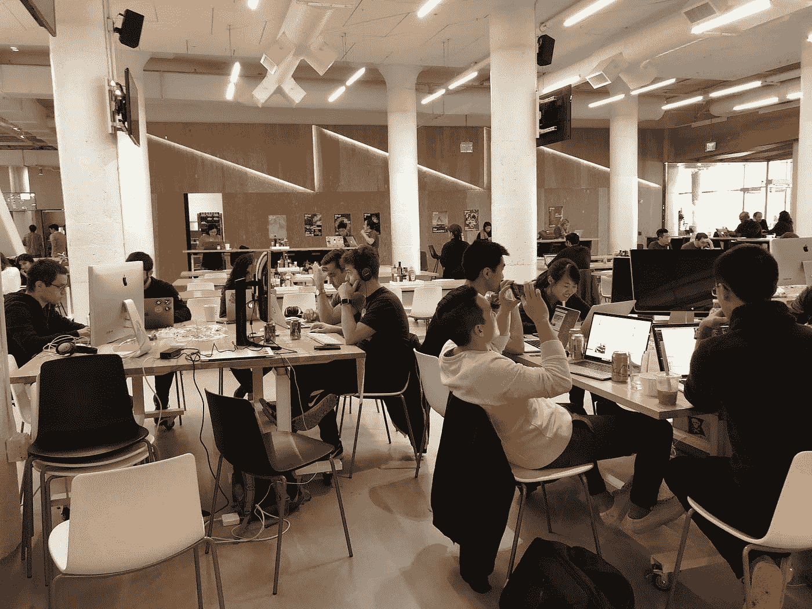
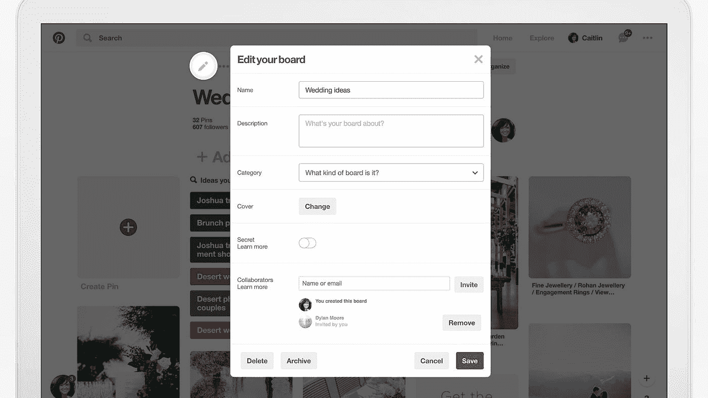
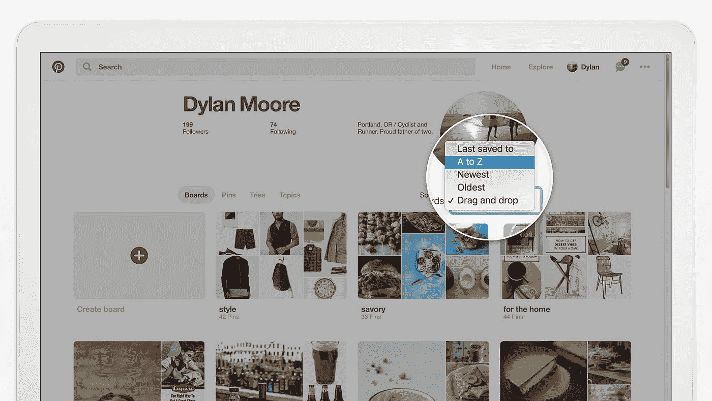

# 建筑板归档和分类

> 原文：<https://medium.com/pinterest-engineering/building-board-archiving-and-sorting-c1a605130e9?source=collection_archive---------2----------------------->

Connor Montgomery |产品工程软件工程师

Pinterest 的一个传统是马拉松，这是我们在黑客马拉松上的一个转折。马拉松让不同学科的员工聚集在一起，创造新的东西。在过去，我们的项目从扩展黑客到 AR 原型到我们实际发布的产品内功能，如 [GIF](/@Pinterest_Engineering/building-support-for-gifs-over-night-8909df8ef4ca) 支持和[试用](https://newsroom.pinterest.com/en/post/a-new-way-to-keep-track-of-ideas-you-try-on-pinterest)。

我们的上一次马拉松是在 2017 年底，提交了 50 多个想法，30 个项目及时完成评审。我们把公司的全体员工区域变成了一个“创造空间”,在这里我们用三天时间构思和开发项目。我最喜欢的部分是评委，因为我们第一次邀请了一群品酒师与团队见面，评判项目并选出获胜者。

上周[我们宣布了](https://newsroom.pinterest.com/en/post/new-tools-for-organizing-pins-boards-and-sections-on-pinterest)新工具来帮助 Pinners 组织他们的引脚和电路板，其中一些功能实际上是从制作马拉松项目开始的！我想在这篇文章中强调它们。

# **板卡归档**

在深入讨论板载存档之前，我想先介绍一下我(和其他人)在 Pinterest 上遇到的一些挑战。

几年前，我和妻子结婚，我们(显然)在 Pinterest 上策划了我们的婚礼。这是一次非常棒的经历——我们有 12 个婚礼主题的展板(如果当时我们有[区](https://newsroom.pinterest.com/en/post/a-new-way-to-organize-your-ideas-on-pinterest)就好了！)并且能够轻松地合作计划我们梦想中的婚礼。

然而，婚礼后几个月，我开始注意到一些问题:

*   每当我存下一枚胸针，我都要从所有的结婚卡片中筛选出我想要的那一枚。
*   婚礼过后很久，这 12 个板块还在我的个人资料里(尽管我已经不再处于“婚礼模式”了)。
*   因为我保存了很多结婚别针，所以在我们结婚后很久，Pinterest 仍在向我推荐更多的婚礼创意。

我可以删除我的电路板，但我不想永远失去这些引脚。我并不是唯一有这种经历的人，产品中有一个明显的缺口需要为 Pinners 解决。

有了这样一个清晰的问题，就很容易确定产品需求:

*   保存 Pin 时，存档电路板会将其从电路板列表中删除。
*   存档一个公告板会向我们的系统发出负面信号，这样我们就不再提出相关的建议和通知。
*   存档一个协作板不应该干扰其他协作者如何使用该板。
*   存档的公告板应该在他们自己部分的最底部。
*   当查看已存档的公告板时，我们应该清楚您已经将其存档。

## *数据存储*

我们使用我们的图形存储系统 [Zen](https://www.youtube.com/watch?v=yI0vHfgK6oI&app=desktop) ，为电路板存档的后端提供动力。我们以一种非常简单的方式构建了它——每当用户归档电路板时，我们从用户 ID < >电路板 ID 添加一条边。

默认情况下，Zen 给 edges 一个当前纪元时间的分数，单位是毫秒。当查看存档的公告板页面时，我们使用该分数来显示公告板存档的时间。

如果用户取消存档电路板，我们只需移除边缘。

这种 userId <> boardId 存储系统的额外好处是它是针对每个用户、每个主板的。这意味着它不会影响用户已存档的群组板上的其他协作者。

由于 Zen 有内置缓存，我们可以很容易地从给定用户的板列表中过滤出存档的板，而不必担心性能。我们有下面的函数签名来过滤电路板列表，只返回未存档的电路板:

`def filter_archived_boards(all_boards, user_id)`

在幕后，我们简单地检查在该函数中生成的`(user_id, board_id)`元组之间是否存在边。Zen 支持批量抓取，所以我们只需要调用一次图形服务。然后，我们从 all_boards 列表中删除存档的公告板，并将新列表返回给调用者。

## *负信号*

存档板的最后一个要求是提供负面信号，这样 Pinners 就不会再在主页订阅、电子邮件或应用内通知中看到基于其存档板的建议。

在与消费数据的团队以及拥有索引管道的团队进行了一些协调之后，我们同意将这些数据放入 [BoardJoin、PinJoin 和 UserJoin](/@Pinterest_Engineering/creating-serving-amp-storing-data-for-discovery-3f9f9ce7c139) 中。需要一些小的数据工作来将来自 Zen 的数据转换成正确的格式，以便集成到连接中。

一旦数据被传播到正确的地方，我们就把接力棒交给通知和 home feed 推荐团队的工程师，启动该功能所需的最终项目很快就完成了。

# **板卡分类**

从聚会上可以明显看出，平纳渴望在他们的董事会和个人资料中获得更多的组织权力，因为平纳选择奖的获奖项目是对董事会进行分类的新方法。事实上，按字母顺序重新排列电路板的能力是我们在 2017 年收到的三大功能请求之一。

尽管这个特性很简单，但构建起来比预期的更具挑战性。马拉松让我们完成了大约 70%的功能，但是我们需要考虑一些额外的事情来确定预期的行为:

*   如果用户更改了自己的董事会订单，这是否应该反映在他们的公共档案中？
*   这种新的排序是如何在所有平台上持续的？
*   用户在查看其他人的个人资料时，是否应该能够对他们的论坛进行排序？
*   这对那些花了无数时间在网页上用现有的“拖放”方法重新排列他们的图板的用户有什么影响？

在与来自设计、产品和营销部门的成员合作后，我们就预期行为达成一致，并将上述问题转化为更加固化的产品需求:

*   用户为其个人资料选择的顺序应该反映在他们的公共视图中。
*   一旦用户选择了他们喜欢的排序顺序，这个选项应该在所有平台(例如，web、移动)上得到反映。
*   如果用户已经通过“拖放”重新排列了电路板，他们不应该失去访问他们的定制订单的权限

在后端和 API 层开发该特性的一个挑战是确定以持久和跨平台的方式存储客户端 UI 状态设置的正确位置。我们希望用户能够为自己的配置文件设置自己的本地电路板排序覆盖，并让该设置跨设备保持不变。有用户属性的现有系统，但是没有通用 UI 状态设置的系统。作为这一变化的一部分，我们创建了一个新的 API 来通过 REST API 访问存储在用户元数据服务中的内容，因此产品工程师可以更快地满足这些需求。

# **结束**

这些只是我们最近一次马拉松中的几个项目。作为工程师，我们一直在想办法改进 Pinterest，让它对我们每月超过 2 亿的活跃 Pinners 更有用。如果你喜欢建造人们喜爱的产品，[加入我们](https://careers.pinterest.com/careers/engineering)！

*鸣谢:与 Jean Yang、、Grace Si、Koichiro Narita、Helen Fu、Connor Gall、Julia Cochran、Becky Stoneman、Jordan Adler、Joseph Zingarelli、Shira Netter 和 Kim O' Rourke 合作建立了董事会存档和分类。特别感谢 Jean Yang、Julia Cochran 和 Jordan Adler 对本文的贡献。*