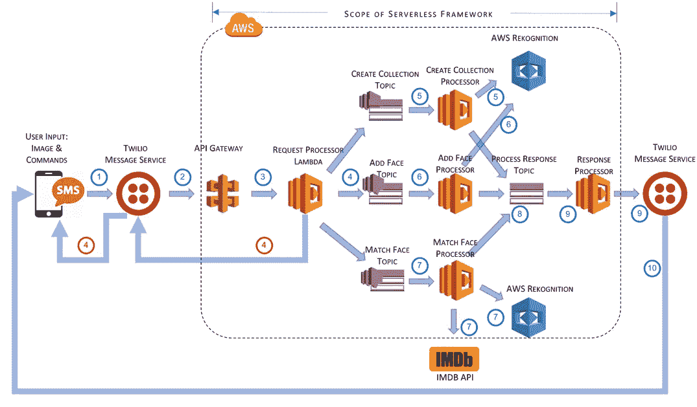
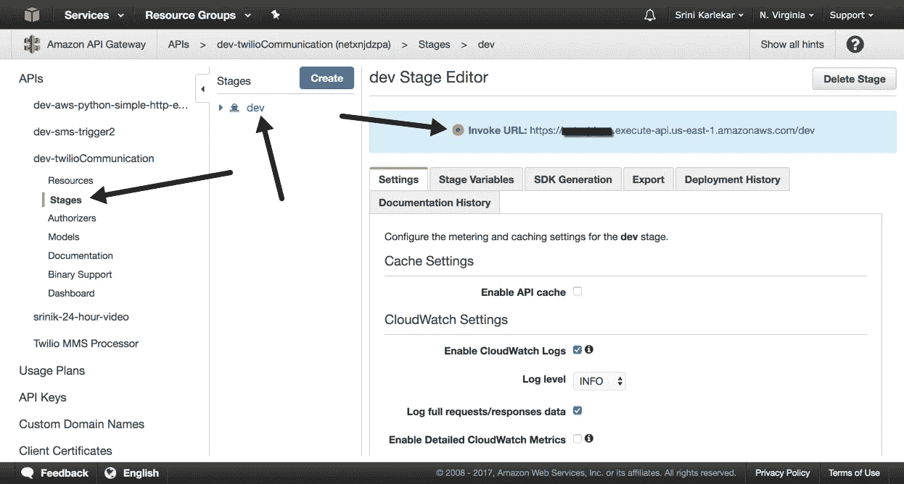
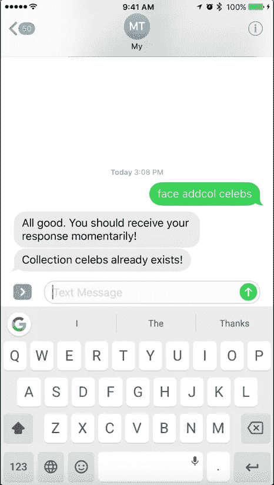
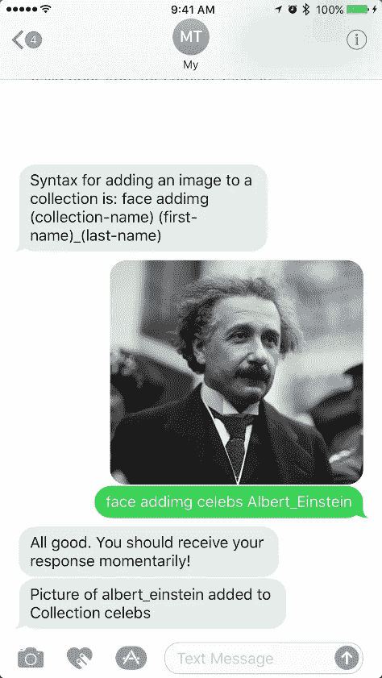
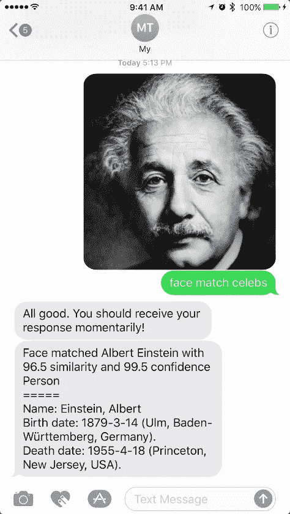

# 构建一个无服务器的框架应用程序

> 原文：<https://medium.com/capital-one-tech/building-celebritysleuth-a-serverless-framework-application-42ce9fe9d22f?source=collection_archive---------6----------------------->


# 庆祝活动

我用 [Twilio](https://www.twilio.com/) 、 [Amazon Rekognition](https://aws.amazon.com/rekognition) 和 [IMDbPy API](http://imdbpy.sourceforge.net/) 用[无服务器框架](https://serverless.com/framework)构建了一个名人人脸识别服务。

该项目提供了无服务器计算的概述，并通过帮助构建一个引人注目的名人*Shazam*示例(使用无服务器框架命名为 **CelebritySleuth** )来深化这一概念。

*有关无服务器架构和无服务器框架的更多信息，请查看本* [*白皮书*](https://github.com/skarlekar/faces/blob/master/What_is_Serverless.md) *。*

# 介绍

我们正处于计算时代的转折点，机器学习正在商品化，允许普通开发人员运用人工智能的能力来处理自然语言，识别人脸，并将文本转换为语音，而不必涉足神秘的神经网络或其他基于深度学习的算法。亚马逊的 Rekognition、Polly 和 Lex 等服务就是很好的例子，它们允许个人开发者设计应用程序，而这些应用程序直到最近还是研究实验室和大型科技公司的领域。(最重要的是，这些是 100%无服务器的。你只需要为你使用它们的时间付费，而且它是不可思议的可扩展的。)

为了理解这些服务的能力，同时享受使用无服务器模型构建应用程序的乐趣，我在寻找一个有趣的问题来解决。我解决的第一个问题是计算放在桌子上的硬币的价值。使用 Python 和各种 Python 图像库很容易构建该解决方案。不幸的是，当要把代码塞进 AWS Lambda 时，我遇到了硬停。AWS Lambda 对可部署的代码大小有上限，我使用的图像库非常庞大。这很快被证明是行不通的。

大约在这个时候，我的小女儿面临着她自己的一个令人烦恼的问题。在看电视节目时，她不能把女演员的脸和她的名字放在一起。她知道她以前在另一部迪斯尼系列剧中见过这位女演员，但她是谁呢？当我们在餐桌上讨论这个问题时，我们很快决定由我来做点什么来解决她的困境。CelebritySleuth 诞生了。

# 观众

希望实现以下目标的开发人员或解决方案架构师:

1.了解有关无服务器框架以及如何使用它来开发自动伸缩、按执行付费、事件驱动的应用程序的更多信息。

2.构建对业务目标至关重要的应用程序，而不是花费时间配置、部署和维护基础架构。

3.探索无服务器架构带来的效率提升。

# CelebritySleuth 应用程序

CelebritySleuth 应用程序是一个事件驱动的应用程序，它利用了:

1.表示层的用户的移动 SMS/MMS，

2.Twilio 位于中间层，是短信世界和 AWS 网关之间的桥梁

3.一组用 Python 编写的 AWS Lambda 函数，使用 AWS Rekogniton 进行图像处理，使用 IMDB 收集名人信息。

在一个典型的应用中，用户拍摄一个名人的照片(在电视上？！)使用他/她的手机摄像头，并将图像和指令一起发送到 Twilio 上的电话号码。系统会验证指令，如果指令集中有错误，系统会立即做出响应，如果验证通过，系统会显示一条消息以等待实际响应。不一会儿，用户就会收到一个回复，上面有这个名人的名字和传记。

首先，该应用程序必须通过建立名人集合来训练识别人脸。您可以通过向应用程序发送名人图片(图片 URL)及其相应名称的随机样本来实现这一点。个人名人发送的照片越多，识别就越准确。

CelebritySleuth 应用程序包含两个服务:

- [Twilio 通信服务](https://github.com/skarlekar/faces/tree/master/twilioCommunicationService)

- [人脸识别服务](https://github.com/skarlekar/faces/tree/master/faceRecognitionService)

服务被分离，以允许将来使用不同的表示层。

*   **建筑**

CelebritySleuth 应用程序使用 Lambda 函数来满足计算需求。因此，应用程序组件在使用前配置，使用后关闭，从而形成低成本、高可扩展性的应用程序。



上图展示了应用程序的高级架构。详情如下:

1.用户发送一张图片和命令，以添加/匹配一个集合的脸。或者，用户可以创建一个集合，在这种情况下不需要图片。SMS/MMS 被发送到 Twilio 拥有的电话号码。

2.Twilio 截取消息，并根据用户的 Twilio 配置将其转发给 API 网关。

3.API Gateway 将 TwiML 翻译成 JSON，并调用请求处理器 lambda 函数。

4.请求处理器 lambda 验证这些命令，并向 SNS 上的适当主题发送一条消息。如果验证失败，它会通过 Twilio 向用户返回错误消息。

5.当消息到达 Create Collection 主题时，会触发一个 lambda，通过 Boto 库将命名的集合添加到 AWS Rekognition 中。成功/错误消息放在响应处理器主题中。

6.当消息到达 Add Face 主题时，会触发一个 lambda 来标识图像中最突出的面部，并将该面部的元数据添加到给定的集合中。如果没有识别出面孔，它会创建一条错误消息，并将响应发送到响应处理器主题。

7.当消息到达匹配面部主题时，lambda 被触发，该 lambda 识别图像中最突出的面部，并将该面部的元数据与集合中的已知面部进行匹配。如果找到匹配，则返回相应人员的姓名。Lambda 然后使用 IMDB 来查找这个人的传记。

8.各种基于 lambda 的处理器丢弃响应处理器主题上的响应消息。

9.响应处理器获取响应并构造一条 SMS 消息，然后调用 Twilio 的 SMS 服务。

10.Twilio 验证发件人号码，并将消息发送到相应的收件人号码。

*   **组件**

该应用程序由以下组件组成:

1. **Python** — Python 是一种编程语言，可以让你快速工作，更有效地集成系统。我们将使用 Python 2.7 来构建 CelebritySleuth 应用程序。

2. **Twilio** — Twilio 消息服务，让用户通过 SMS 与应用程序通信。

3. **AWS Lambda** — AWS Lambda 让您无需供应或管理服务器即可运行代码。您只需为您消耗的计算时间付费，当您的代码不运行时，则不收费。

4.**AWS Rekognition**—Amazon Rekognition 是一项服务，可以轻松地将图像分析添加到您的应用程序中。使用 Rekognition，您可以检测图像中的对象、场景和人脸。您还可以搜索和比较面孔。

5. **IMDb** — IMDbPY 是一个 Python 包，用于检索和管理 IMDb 电影数据库中关于电影、人物、角色和公司的数据。

# 安装说明

**1。** **安装 Python**

如果您在 Mac 或 Linux 机器上，您可能已经安装了 Python。在 Windows 上，您必须安装 Python。

不管您的操作系统是什么，您都应该使用虚拟环境来运行 Python。 [Anaconda](https://www.continuum.io/downloads) ，或者它的简洁版本 [Miniconda](https://conda.io/miniconda.html) ，是 Python 虚拟环境，允许你管理 Python 的各种版本和环境。Python 自带了安装程序和包管理器 *conda* 。

按照此处的说明[安装 Miniconda。*注意:对于这个项目，我们将使用 Python 2.7。*](https://conda.io/docs/install/quick.html)

**2。** **创建 Python 虚拟环境**

安装 Python 2.7 后，创建一个虚拟环境，如下所示。注意:我调用我的虚拟环境 *faces* :

```
*$ conda create -n faces python=2*
```

**3。** **初始化你的 Python 虚拟环境**

要开始在新的 Python 虚拟环境中工作:

```
*$ source activate faces*
```

如果您在 Windows 中工作，请使用:

```
*$ activate faces*
```

**4。** **安装 Git**

Git 是一个流行的代码修订控制系统。要为您各自的操作系统安装 Git，请遵循这里的说明。

**5。** **安装庆典灯**

要从 Git 安装 CelebritySleuth，请遵循以下说明:

```
*$ mkdir DevFestDC**$ cd DevFestDC**$ git clone — recursive* [*https://github.com/skarlekar/faces.git*](https://github.com/skarlekar/faces.git)
```

**6。** **Twilio 设置**

如果您还没有 Twilio 号码，[注册 Twilio](https://www.twilio.com/try-twilio) 并获得一个带有彩信功能的试用电话号码。您可以在 30 天的试用期内使用该号码。

**设置 Twilio 环境变量**

使用您从 Twilio 获得的凭证更新存储库中的 *setTwilio.sh* 并设置您的环境。 *vi* 的使用说明此处为。

```
*$ cd faces**$ vi setTwilio.sh**$ source ./setTwilio.sh*
```

Windows 用户，使用:

```
*$ cd faces**$ edit setTwilio.cmd**$ setTwilio.cmd*
```

**测试 Twilio 设置**

为了测试你的 Twilio 设置，运行 *twilioTester* 下的 Python 程序 *sendmessage.py* 。该程序只需使用您的 Twilio 凭据向您的手机号码发送一条消息。*注意:确保您是在 Python 2.7 环境中运行的。*

```
$ python twilioTester/sendmessage.py
```

如果您在手机上收到一条带有图像的信息，则您的 Twilio is setup 正在运行。

**7*。*** ***安装 Node.js 和无服务器框架***

无服务器框架是一个 Node.js 应用程序。要使用无服务器框架并运行 CelebritySleuth 应用程序，您需要安装 Node.js。按照无服务器框架网站上的[说明](https://serverless.com/framework/docs/providers/aws/guide/installation/)安装 Node.js 和无服务器框架。

使用以下方法确保您的无服务器框架正常运行:

```
*$ serverless –version*
```

***8。*** **亚马逊 AWS 设置**

1.登录您的 AWS 帐户或[注册](https://console.aws.amazon.com/console/home?region=us-east-1)获得一个帐户。

2.按照此处的[中的说明设置您的 AWS 凭证。](https://serverless.com/framework/docs/providers/aws/guide/credentials/)

**9。** **测试您的无服务器设置**

既然您已经设置了 AWS，那么是时候通过使用无服务器框架创建一个模拟函数来测试您的无服务器设置了。

创建一个测试目录。在测试目录中，从默认模板创建一个 Lambda 函数，如下所示:

```
*$ mkdir sls-tester**$ cd sls-tester**$ sls create — template aws-python — name sls-test*
```

这将在当前目录中创建两个文件:

```
*> serverless.yml**>**> handler.py*
```

*serverless.yml* 声明了一个示例服务和一个函数。 *handler.py* 返回一条消息，表明您的函数执行成功。

要部署该功能，只需键入:

```
*$ sls deploy — verbose*
```

这将部署该功能。verbose 选项提供额外的信息。

要测试您的函数，请键入:

```
*$ sls invoke — function hello*
```

如果您收到以下消息，则您的无服务器安装正在运行。

***警告:您正在运行 1.9.0 版。1.10.0 版将包含以下重大变更:***

***-部署插件的一些生命周期事件将移动到一个新的插件包中。更多信息->***[***https://git.io/vy1zC***](https://git.io/vy1zC)

您可以通过设置“SLS_IGNORE_WARNING=*”环境变量来退出这些警告。

```
*{**“body”: “{\”input\”: {}, \”message\”: \”Go Serverless v1.0! Your function executed successfully!\”}”,**“statusCode”: 200**}*
```

**10。** **Twilio 通信服务**

[Twilio 通信服务](https://github.com/skarlekar/faces/tree/master/twilioCommunicationService)将 Twilio 的短信服务与人脸识别服务连接起来。当用户向他/她的 Twilio 号码发送消息时，该消息会被 Twilio 的消息服务拦截。Twilio 消息服务会将 SMS 消息内容转发到 AWS API 网关 URL。AWS API 网关将依次调用*twilicommunicationservice*中的请求处理器(*process _ Request*)Lambda 函数。

*twilio communication service*支持两个功能:

1. *processRequest* 函数验证传入的请求，如果消息格式正确，则同步发送响应，如果不正确，则发送一条给出正确用法的错误消息——有关如何使用该服务的详细信息，请参见[用法](https://github.com/skarlekar/faces#usage)一节。然后它通过 SNS 异步调用*facecognitionservice*来处理命令。

2. *sendResponse* 函数编写来自[facecognitionservice](https://github.com/skarlekar/faces#face-recognition-service)的响应，并将响应发送回发出请求的号码。

**部署 Twilio 通信服务**

假设您的本地无服务器设置已经完成，并且上面的测试通过，按照下面的说明使用无服务器框架部署*twilioCommunicationService*:

通过运行您之前更新的 shell 脚本来设置您的 Twilio 凭证。

```
*$ source ./setTwilio.sh*Windows users, use:*$ setTwilio.cmd*
```

将目录切换到 twilioCommunicationService 目录，并通过运行 *sls deploy* 部署服务，如下所示:

```
*$ cd twilioCommunicationService**$ sls deploy — verbose*
```

确保部署过程中没有错误。您也可以前往您的 [AWS 控制台](https://console.aws.amazon.com/apigateway/home?region=us-east-1#/apis)并验证 API 网关已经创建。您应该会看到一个名为*dev-twilio communication*的 API 网关。

此外，通过验证*twilio communication-dev-process reques*t 和*twilio communication-dev-send response*Lambda 函数在 [AWS Lambda 控制台](https://console.aws.amazon.com/lambda/home?region=us-east-1#/functions?display=list)中可用，确保创建 Lambda 函数。

确保您的 Twilio 凭证设置为环境变量，方法是单击每个 Lambda 函数，并验证 *TWILIO_AUTH_TOKEN* 和 *TWILIO_ACCOUNT_SID* 已使用正确的值在*代码*选项卡的*环境变量*部分创建。

**设置 Twilio 消息服务**

按照以下说明在 Twilio 中设置信息服务，并将您的 Twilio 号码与信息服务相关联:

1.在 Twilio 网站上，登录您的帐户，进入[信息服务](https://www.twilio.com/console/sms/services)。

2.点击 Copilot 信息服务下的 *+* 添加新的信息服务。

3.为您的服务命名，然后点击*创建*。比方说， *CelebritySleuth* 。

4.在*用例*下拉列表中的*属性*下，选择*聊天机器人/交互式双向*。

5.在*入站设置*部分，确保勾选*处理入站消息*。

6.将 AWS API 网关 URL 从您的 AWS 控制台复制并粘贴到*请求 URL* 字段，并将 */process_request* 添加到 URL 的末尾。你的网址应该是这样的:[***https://netxnasdfda . execute-API . us-east-1 . amazonaws . com/dev/process _ request***](https://netxnasdfda.execute-api.us-east-1.amazonaws.com/dev/process_request)



7.在字段旁边的下拉列表中选择 HTTP GET。

8.将其余字段保留默认值，并点击*保存*。

9.前往 Twilio 控制台中的[数字](https://www.twilio.com/console/phone-numbers/incoming)部分。

10.点击分配给您的号码。这将带您到一个部分，在那里您可以配置当 SMS 消息发送到您的电话号码时应该发生什么。

11.在 *Messagin* g 部分，选择 *CONFIGURE WITH* 下拉框下的*消息服务*。

12.在*消息服务*中，选择上面步骤 2-8 中创建的消息服务，点击*保存*。

**11。** **人脸识别服务**

[人脸识别服务](https://github.com/skarlekar/faces/tree/master/faceRecognitionService)目前支持三种功能。它们是:

***创建收藏*** :添加收藏。

***addFace:*** 向现有集合添加一个面。

***matchFace:*** 匹配集合中的人脸，并在 IMDb 查找匹配人姓名的传记。

集合是面索引(面向量)及其相应名称的逻辑组。当您使用*create collection*Lambda 函数创建集合时，它是空的。在后端， *createCollection* 在 AWS Rekognition 中创建一个集合。然后，您可以将新面孔添加到集合中，并将其与给定的名称相关联。这样创建的集合然后可以用于以高置信度搜索已知人脸的图像。实际上，面索引存储在由 AWS Rekognition 管理的服务器上的数据库中，您不能直接访问该数据库。

创建集合后，您可以使用 *addFace* Lambda 函数将面添加到集合中。要将人脸添加到收藏中，您必须提供图像、收藏名称以及要与人脸关联的名称。如果给定图像中没有人脸，或者集合不存在，则会返回一条错误消息。 *addFace* 函数使用 AWS 重新识别来检测给定图像中的面部，从面部提取特征，并将图像中检测到的面部特征信息保存到 AWS 重新识别中。面部特征被存储为可搜索的图像向量。

一旦你有了一些使用 *addFace* 功能索引的人脸，你就可以提供使用 *matchFace* 功能索引的人的图像。

**12。** **部署人脸识别服务**

将目录更改为 faceRecognitionService 目录，并通过运行 *sls deploy* 部署服务，如下所示:

```
*$ cd faceRecognitionService**$ sls deploy — verbose*
```

确保部署过程中没有错误。您也可以直接进入您的 [AWS Lambda 控制台](https://console.aws.amazon.com/lambda/home?region=us-east-1#/functions?display=list)并验证 Lambda 函数*face recognition-dev-addFace*、*face recognition-dev-match face*和*face recognition-dev-create collection*已经创建。

13。 **测试应用程序**

要测试该应用程序，请通过向您的 Twilio 号码发送以下短信来创建收藏:

```
*face addcol celebs*
```

有用吗？你从那边收到消息了吗？如果不是为什么？查看您的 processRequest Lambda 函数的 CloudWatch 日志。有什么问题？

如果你仔细观察，你会发现 Lambda 函数没有足够的权限来操作 SNS 主题或 AWS Rekognition 资源。

14。 **修复*twilio communication service***

打开*twilicommunicationservice*中的 *serverless.yml* 文件，取消对 *iamRoleStatements* 部分的注释，保存并重新部署服务。

```
*$ cd twilioCommunicationService**$ vi serverless.yml**$ sls deploy — verbose*
```

再次重复添加收藏。

```
*face addcol celebs*
```

这一次，您应该会收到一条消息，说明您将很快收到回复。

***谓都好。你应该很快就会收到回复！”***

你可以等到母牛回家，但你没有得到回应，是吗？这是因为，你必须在*facecognitionservice*中为 Lambda 函数提供更多的权限。

**15*。*** **固定*面部识别服务***

打开 *faceRecognitionService* 中的 *serverless.yml* 文件，取消对 *iamRoleStatements* 部分的注释，保存并重新部署服务。

```
*$ cd twilioCommunicationService**$ vi serverless.yml**$ sls deploy — verbose*
```

这应该已经解决了。现在，如果您添加一个集合:

```
*face addcol celebs*
```

您不仅会得到以下响应:

***“一切都好。你应该很快会收到你的回复！***

您还应该收到以下消息:

***“收藏名人创建成功”***

**16。** **向集合添加一张脸**

要在收藏中添加人脸和人物图像，请在同一条短信中发送以下内容:

```
*(image)**face addimg celebs firstName_lastName*
```

您应该会收到以下响应:

***“名 _ 姓添加到名人收藏中的照片”***

17。 **匹配集合中的一张脸**

现在，通过 SMS 向您的 Twilio 号码发送图像和以下命令，找到该人的另一张图像并测试 AWS Rekognition 的面部匹配能力:

```
*(image)**face match celebs*
```

您不仅会收到以下消息:

***“一切都好。你应该很快就会收到回复！”***

您还应该收到以下消息，以及此人的传记。

***“面部匹配名姓，具有 xx.xx 相似度和 yy.yy 置信度。***

***…。***

***…。***

# 使用

以下是 CelebritySleuth 目前支持的命令。

**添加收藏**

要添加新的收藏，请在 SMS 正文中键入以下内容。您不需要用这个命令添加任何图像。任何添加的图像都将被忽略。

*face addcol(收藏名称)*

其中*收藏名称*是您想要创建的收藏的名称。

示例:

```
*face addcol celebs*
```



**添加图像**

要将图像添加到给定的集合并将图像中的人脸与姓名相关联，请在 SMS 的正文中键入以下内容。您应该在同一条短信中包含一张图片。

```
*face addimg (collection-name) (first-name_last-name)*
```

其中*收藏集名称*是现有收藏集的名称，名字姓氏是该人的全名。*注意:名字和姓氏应该用下划线隔开。*

示例:



```
*face addimg celebs Albert_Einstein*
```

**牌面**

要匹配给定集合中的面孔:

```
*face match (collection-name)*
```



其中*收藏名称*是现有收藏的名称。该命令必须在同一 SMS 消息中附带一个图像。

示例:

```
*face match celebs*
```

# 实际应用:

以下是实际应用的动画示例:

[https://gist . github . com/skarlekar/c 27 AE 9 fef 725683 c0f 969 e2b 02649454/raw/6749 a 5103 b 006 E0 b 313 F4 DD 510 e9 BD 9 b 664 c 33 b 3/Mel-fuzzed-less . gif](https://gist.github.com/skarlekar/c27ae9fef725683c0f969e2b02649454/raw/6749a5103b006e0b313f4dd510e9bd9b664c33b3/mel-fuzzed-less.gif)

# 结论

亚马逊、谷歌和微软等提供商提供的人工智能服务是构建智能应用程序的基石。它使开发人员能够使用预先训练的服务将智能添加到他们的应用程序中，而不是从头开始构建他们的算法和模型。

另一方面，无服务器框架是采用无服务器架构的加速器。它承诺大大减少开发工作量、降低成本、高可伸缩性以及跨各种提供商的多种部署选项。

在我的测试中，我无法在 Microsoft Azure 上部署 CelebritySleuth 应用程序，因为无服务器框架目前不支持部署用 Python 编写的函数。除此之外，使用无服务器框架，我能够在几个小时内从头到尾构建 CelebritySleuth 应用程序，相比之下，通过 AWS 控制台手动设置组件需要半天时间。

*免责声明:Capital One 与这篇博文中提到的公司无关。所有使用的商标都是其各自所有者的财产。*