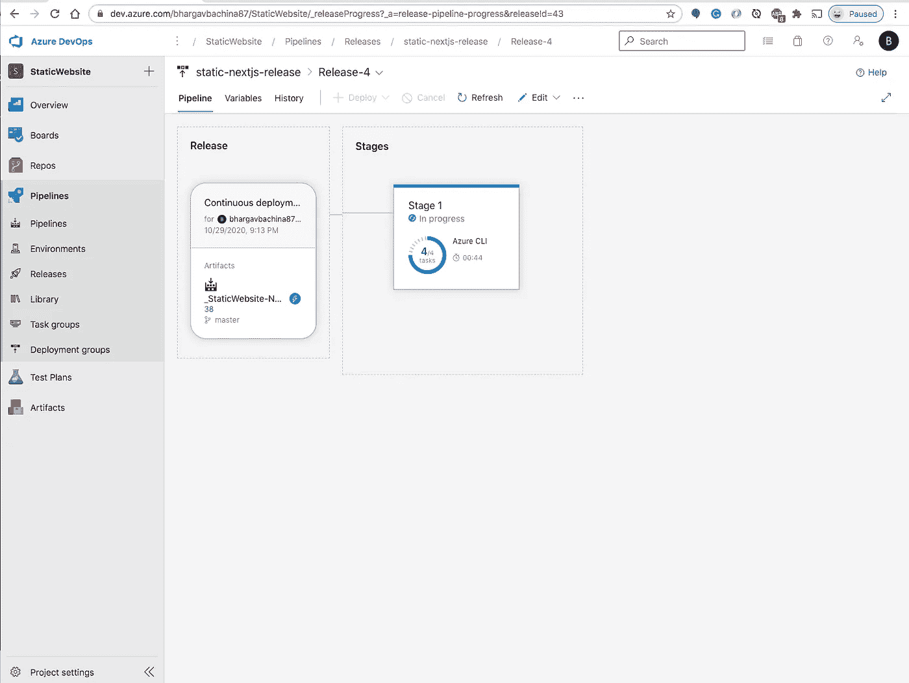

# 使用 Azure DevOps 为 React 静态 Web 应用服务构建 CI/CD

> 原文：<https://medium.com/bb-tutorials-and-thoughts/building-ci-cd-for-react-static-web-apps-service-using-azure-devops-efef72e3772?source=collection_archive---------0----------------------->

## 包含示例项目的逐步指南

现在有很多方法来构建和部署前端应用程序，如无服务器、容器等。使用 Azure 静态 Web apps 服务构建就是其中之一，它最近由微软 Azure 发布，处于预览模式。