# 使用推特、甲骨文分析云和自主数据库在甲骨文云基础设施上构建云本地情感分析社交媒体仪表板

> 原文：<https://medium.com/oracledevs/building-cloud-native-sentiment-analysis-social-media-dashboard-on-oracle-cloud-infrastructure-7534752f3c47?source=collection_archive---------3----------------------->

**什么是情绪分析？**

数据科学背景下的情感分析(SA)是对文本进行分析，以定义客户对某个主题或产品的情感。一般来说，情绪分析会提取极性信息(感觉很好/不，谢谢/嗯，好吧！)&背景——主观性(受个人观点/感觉的影响)或客观性(不受个人观点/感觉的影响)。数据科学网站[towardsdatascience.com](http://towardsdatascience.com)关于“情绪分析”的定义如下:

[“情感分析”](https://www.paralleldots.com/sentiment-analysis)是对文本进行语境挖掘，识别并提取源材料中的主观信息，帮助企业了解其品牌、产品或服务的社会情感，同时监控在线对话。”**—towardsdatascience.com**

“情感基于语言内容、语义结构和语境”**赛伦·科特查**

# 服务协议的业务用例:

*   选举前的民意调查例如:根据选举前和选举后的情况，了解候选人 X 对候选人 Y 的情绪以及获胜的机会。
*   客户对新产品发布的预期情绪例如:一家大型手机制造商在开发者大会上宣布，一款新平板电脑将在 3 个月后发布，业务开发部门希望使用社交媒体来了解消费者对新产品发布的看法:人们对发布感到兴奋还是情绪是中性或负面的
*   产品反馈，例如:一家大型相机制造商推出了一种新的相机型号，他们想知道顾客对他们产品的看法。如果很大比例的情绪是负面的，则可能表明相机存在潜在故障，上市后未在质量控制(QC)中检测到。
*   对服务中断负面情绪的反馈:例如:一家大型电信公司停电，人们在社交媒体上抱怨，使用情绪分析，任何带有负面情绪的推文/帖子都可以用来自动回复客户。
*   对于航空公司来说，它可以用来通过私人信息向可能有退款/错过航班/行李等问题的客户发送自动回复。

在这篇博文中，我们将基于极性，即积极、消极或中立，进行基本的情感分析。情感分析是一个非常广泛的数据科学主题，有更多的内容需要探索，但这超出了本文的范围。我们正在构建的解决方案基于 Oracle 云基础设施(OCI)服务，这是一种经济高效且最简单的方法。AWS 上的相同解决方案需要两倍的移动部件和复杂性。

第 1 部分— OCI 架构和组件列表

第 2 部分—在 OCI 上构建和部署组件

第 3 部分—运行 Twitter 接收并从 Oracle 分析云创建可视化

# 第 1 部分— OCI 架构和组件列表

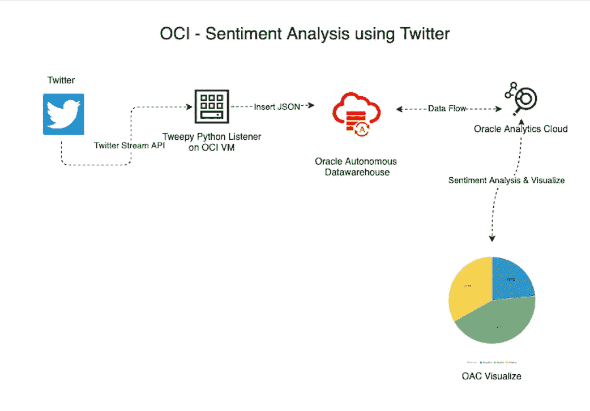

OCI SA Workflow

# 成分

*   Twitter 开发者账户
*   运行在 OCI 计算虚拟机上的 Python 2.7 Twitter 监听器
*   Oracle 自治数据库实例
*   Oracle 分析云实例

# 第 2 部分—在 OCI 上构建和部署组件

1.  使用开发人员帐户创建 Twitter 应用程序(应用程序权限:读取、写入和定向消息),并创建 API 密钥、API 秘密密钥、访问令牌和秘密。

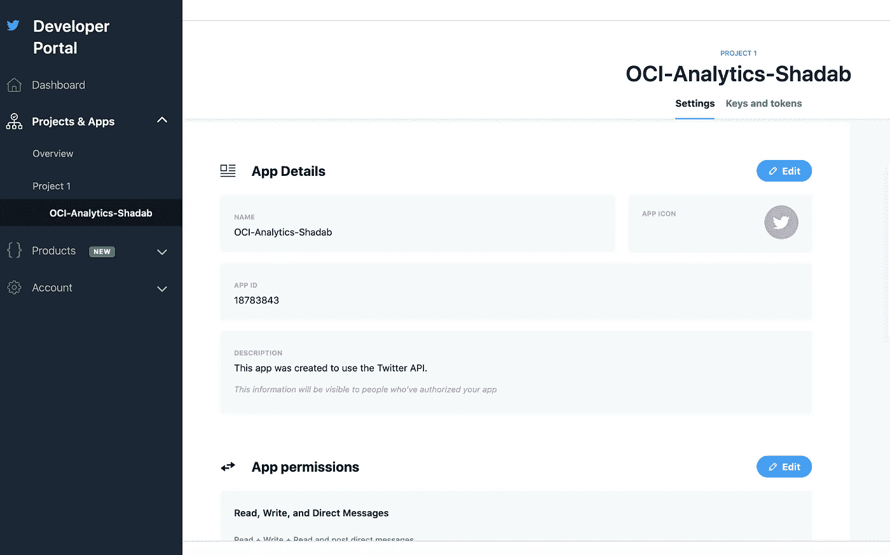

#创建 twitter api 应用密钥
#消费者密钥、消费者秘密、访问令牌、访问秘密。

ckey= '不要'
csecret= '披露'
atoken= '这些'
as Secret = '秘密钥匙'

**2。启动安装了 Python 2.7.5 的 OCI 虚拟机，并 pip 安装“CX _ Oracle”&“tweepy”**
$ pip 安装 cx_Oracle
$ pip 安装 tweepy

**3。创建 Oracle 自治数据库:**[https://docs . Oracle . com/en/cloud/PAAs/Autonomous-data-warehouse-cloud/tutorial-getting-started-Autonomous-db/index . html](https://docs.oracle.com/en/cloud/paas/autonomous-data-warehouse-cloud/tutorial-getting-started-autonomous-db/index.html)

**4。使用 Twitter &自治数据库凭证**
在计算虚拟机上创建 Python 脚本 Tweepy 监听器的代码基于 Arthur Daytons 的精彩[帖子](http://www.vlamis.com/blog/2016/10/3/twitter-live-feed-with-oracle-database-as-a-service-and-business-intelligence-cloud-service)。我增加了一些额外的功能；对其进行了调整，使其可以在自治数据库上工作，Twitter bot 包括在内，可以在每次 Twitter 侦听器被启动时发送一条推文&在 Tweepy 中使用“**和**”“**或**”操作符选择不同的短语/文本属性

# Twitter Streamer Python2.7 代码##

**5。在自治数据库中创建 Twitter 表和视图**

从版本 12.1 开始，Oracle 数据库中就提供了 JSON 表特性:[https://docs.oracle.com/database/121/SQLRF/functions092.htm](https://docs.oracle.com/database/121/SQLRF/functions092.htm)

**6。创建 Oracle 分析云(OAC)实例:**[https://docs . Oracle . com/en/Cloud/PAAs/Analytics-Cloud/index . html](https://docs.oracle.com/en/cloud/paas/analytics-cloud/index.html)

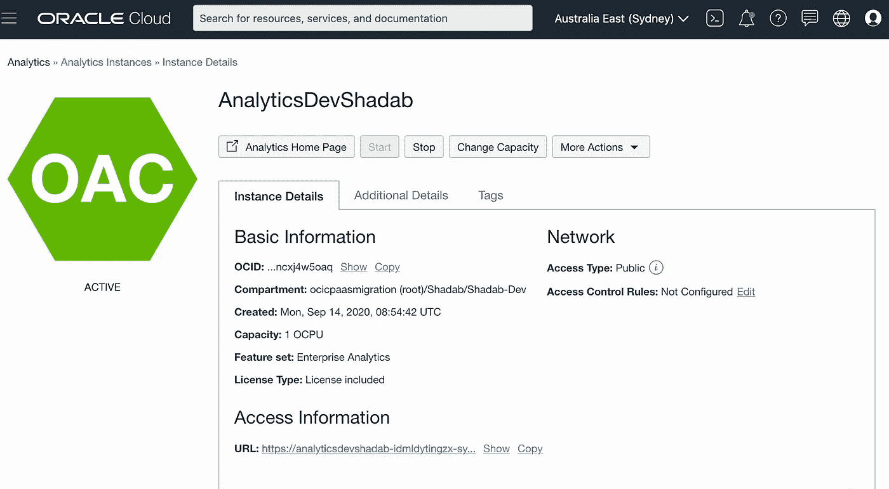

# 第 3 部分—运行 Twitter 接收并在 Oracle 分析云上创建可视化

# 第一步。运行 Python Tweepy 监听器

$ python streamtweetsoracleupdatestatus . py

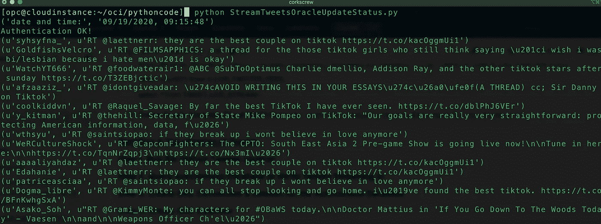

Tweet Bot 在开始流之前发送 Tweet

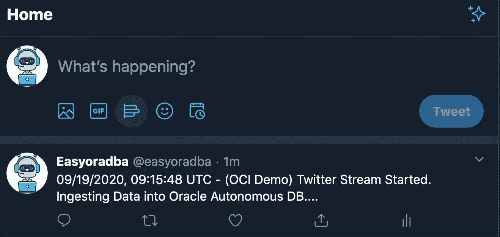

# 第二步。查询自治数据库以验证流入的推文

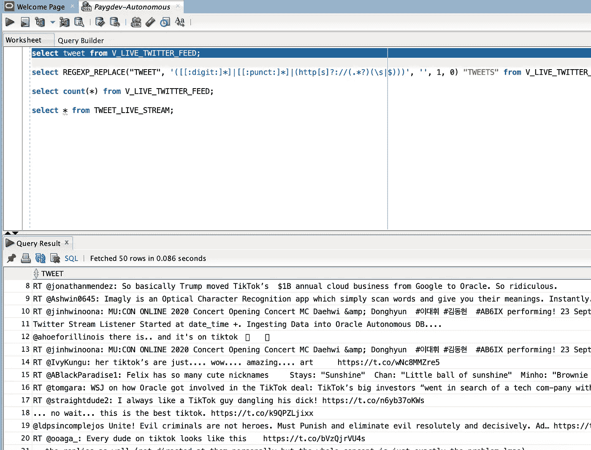

# 第三步。为 OAC 上的自治数据库创建连接和数据集

[https://docs . Oracle . com/en/cloud/PAAs/analytics-cloud/acsds/connect-data-visualizations-and-analyses . html # GUID-c 8d 2 C5 a 1-d4c 6-404 a-9F3E-d2e 92 b 290726](https://docs.oracle.com/en/cloud/paas/analytics-cloud/acsds/connect-data-visualizations-and-analyses.html#GUID-C8D2C5A1-D4C6-404A-9F3E-D2E92B290726)

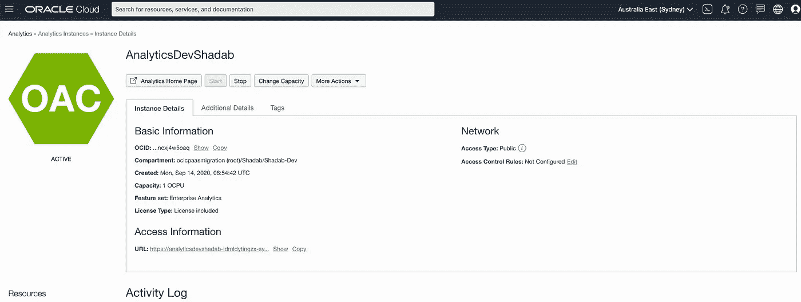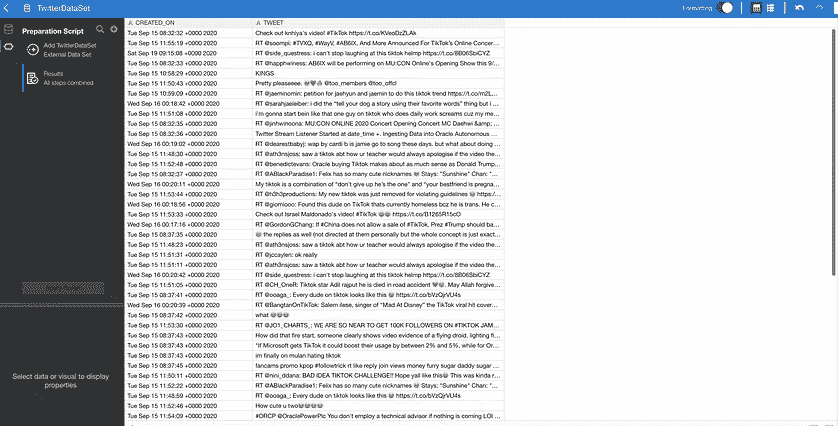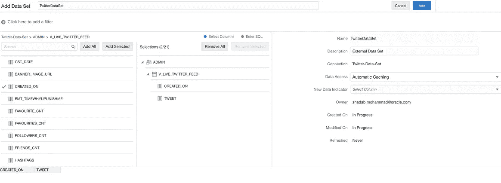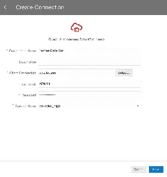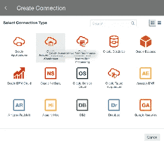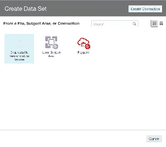

# 第四步。创建 OAC 数据流，并在“推特”字段添加情感分析

[https://docs . Oracle . com/en/cloud/PAAs/analytics-cloud/a cubi/add-opinion-analysis-data-flow . html](https://docs.oracle.com/en/cloud/paas/analytics-cloud/acubi/add-sentiment-analysis-data-flow.html)

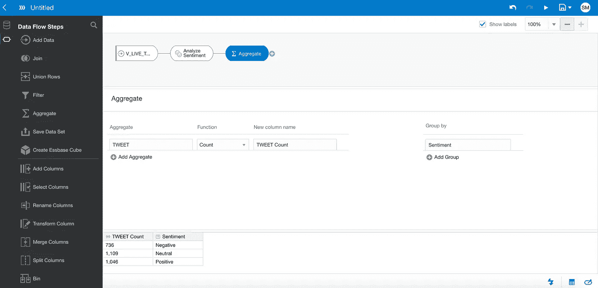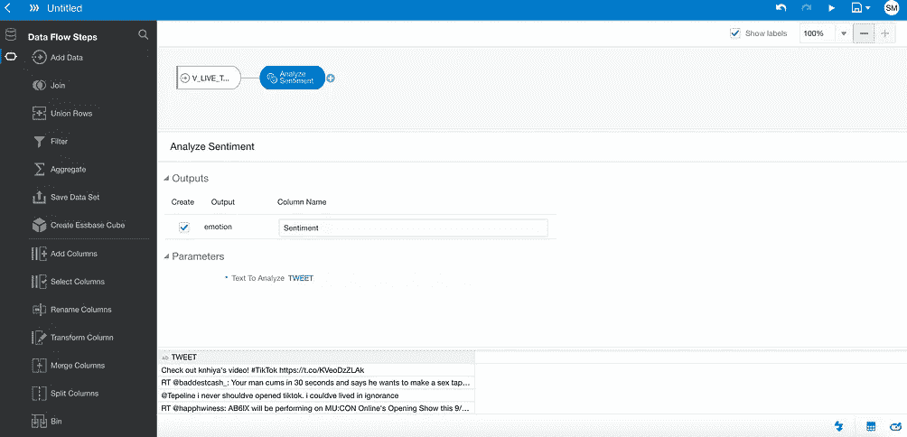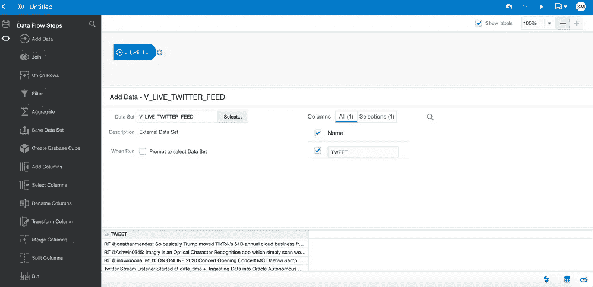

**运行数据流**

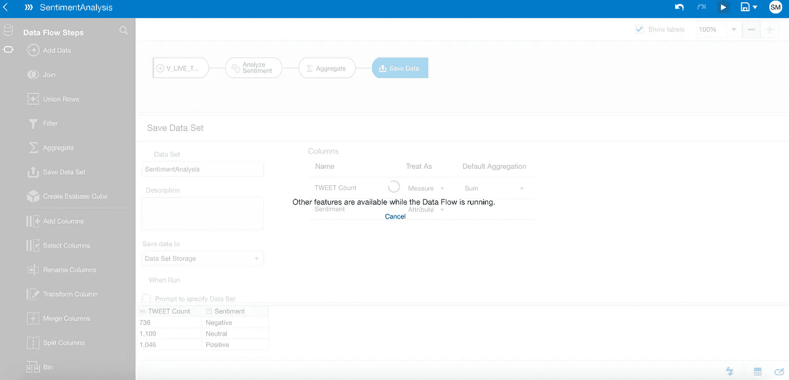

# 第五步。最后使用 OAC 情感分析数据流创建推特情感可视化

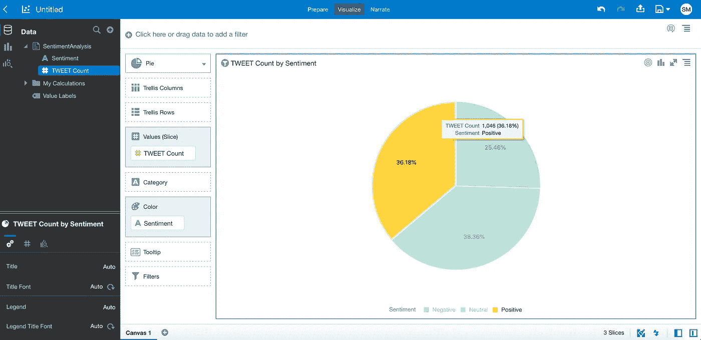

**概要:**

我们在 OCI 上创建了一个云原生情绪分析社交媒体仪表板，它可以以惊人的速度接收推文。此演示是使用最小的自治数据库形状(1ocpu 和 1 TB 存储)和最小形状的 OAC 创建的。

**解决方案构建的参考:**

[1 https://developer . Oracle . com/DSL/mastering-Oracle-python . html](https://developer.oracle.com/dsl/mastering-oracle-python.html)

[2](https://confluence.oci.oraclecorp.com/pages/createpage.action?spaceKey=~shadamoh&title=2)[http://www . vlamis . com/blog/2016/10/3/Twitter-live-feed-with-Oracle-database-as-a-service-and-business-intelligence-cloud-service](http://www.vlamis.com/blog/2016/10/3/twitter-live-feed-with-oracle-database-as-a-service-and-business-intelligence-cloud-service)

[3](https://confluence.oci.oraclecorp.com/pages/createpage.action?spaceKey=~shadamoh&title=3)https://python programming . net/Twitter-API-streaming-tweets-python-tutorial/

[4](https://confluence.oci.oraclecorp.com/pages/createpage.action?spaceKey=~shadamoh&title=4)https://dinodba.github.io/dinosaurdba/tweetoracle[4](https://dinodba.github.io/dinosaurdba/tweetoracle)

[5](https://confluence.oci.oraclecorp.com/pages/createpage.action?spaceKey=~shadamoh&title=5)[https://docs . Oracle . com/en/cloud/PAAs/analytics-cloud/a cubi/add-sensation-analysis-data-flow . html](https://docs.oracle.com/en/cloud/paas/analytics-cloud/acubi/add-sentiment-analysis-data-flow.html)

[6](https://confluence.oci.oraclecorp.com/pages/createpage.action?spaceKey=~shadamoh&title=6)[https://www . infosysblogs . com/Oracle/2018/04/sensation _ analysis _ with _ twitte . html](https://www.infosysblogs.com/oracle/2018/04/sentiment_analysis_with_twitte.html)

[7](https://confluence.oci.oraclecorp.com/pages/createpage.action?spaceKey=~shadamoh&title=7)https://docs.oracle.com/database/121/SQLRF/functions092.htm