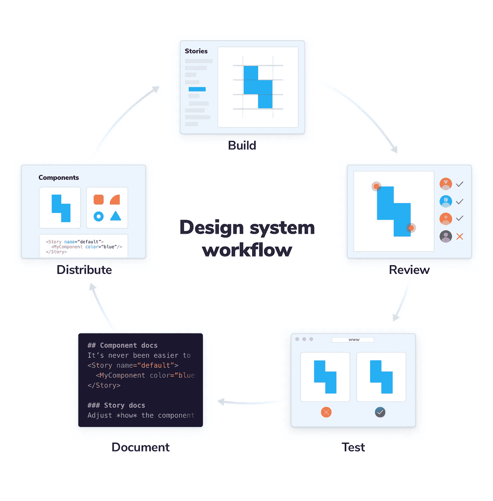
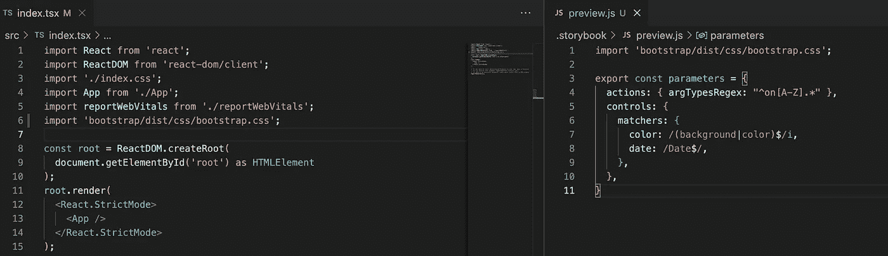
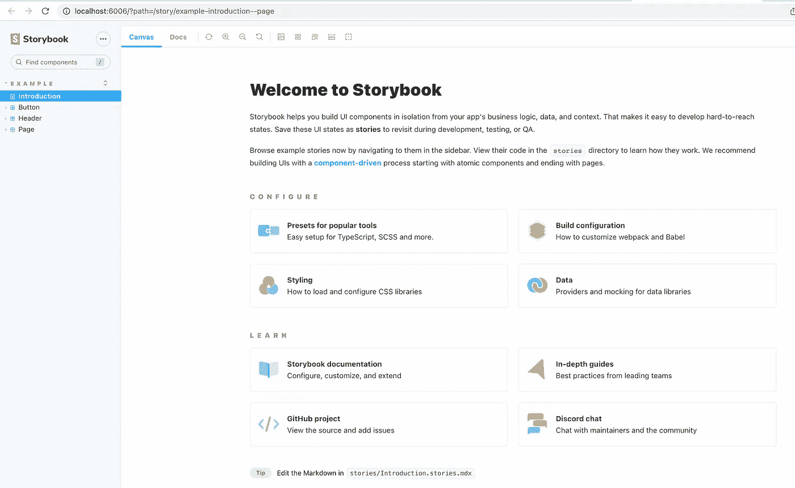
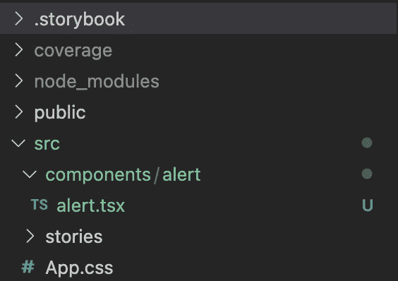
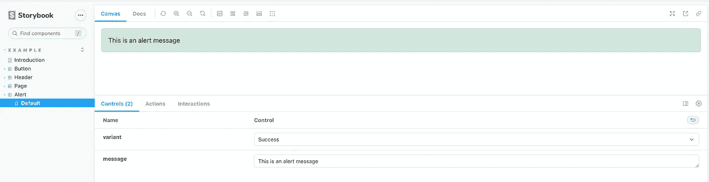
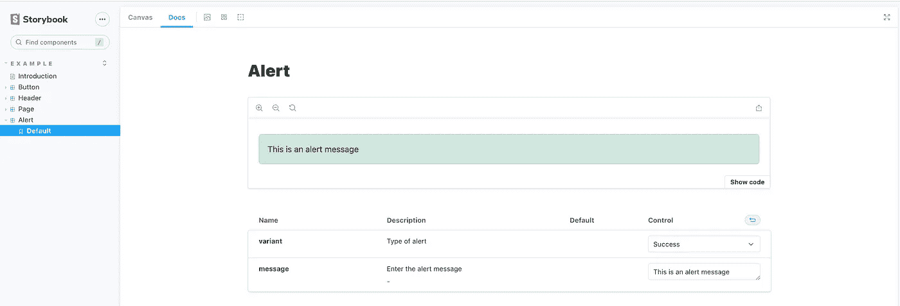
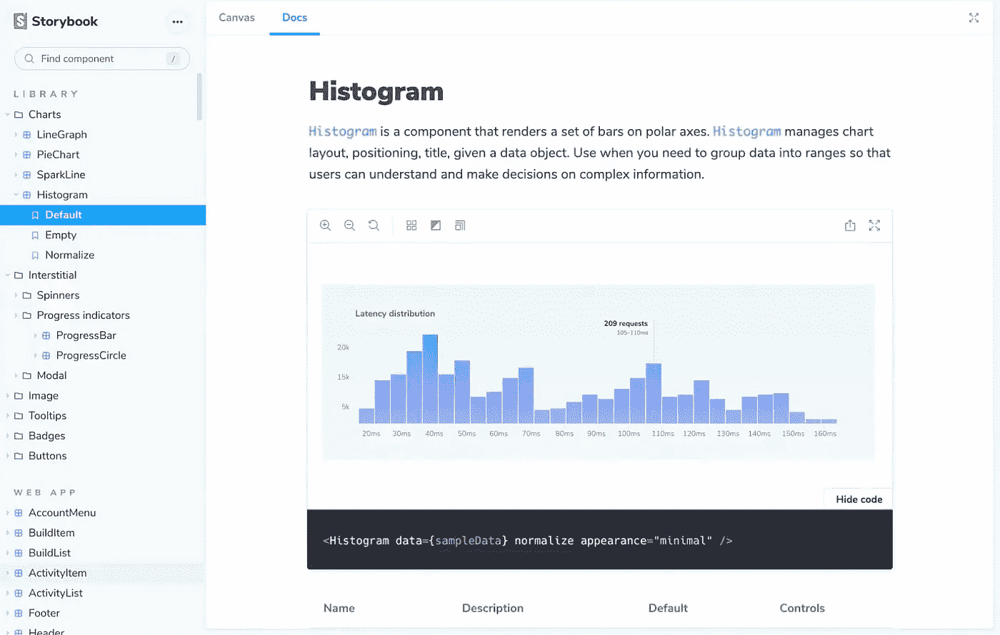
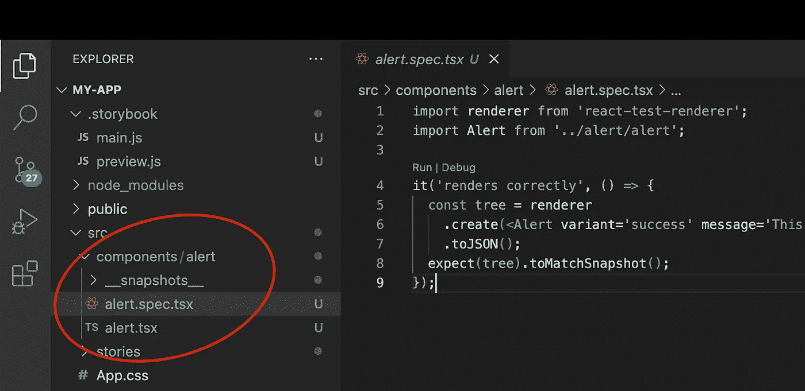

# 面向大型前端应用的建筑设计系统 UI 套件

> 原文：<https://medium.com/walmartglobaltech/building-design-system-ui-kits-for-large-frontend-applications-1bb1d1ac234f?source=collection_archive---------3----------------------->


设计系统对于构建大规模前端应用变得越来越重要。它们用于构建可重用的组件，帮助我们构建、扩展和维护前端应用程序。

构建复杂的前端架构需要从小的基础模块开始。这个基础帮助我们建立应用程序的城堡。可重复使用的组件就像**乐高**积木一样，可以用来搭建各种产品。


Photo Credits: [Steffi Timm](https://pixabay.com/photos/lego-construction-site-replica-516559/)

> **什么是设计系统？**

设计系统是多个项目之间共享的 UI 组件的完整指南。它也是一个组织的共享 UI 组件的真实来源。它侧重于促进采用和简化维护的核心工作流。



**Storybook Design System Workflow**

在本文中，我们将讨论如何通过使用这个工作流来构建可重用的组件。

先决条件: [**节点**](https://nodejs.org/en/) (版本 14 或以上)。

让我们使用下面的命令创建一个简单的 React 应用程序。

```
npx create-react-app starter-design-systems --template typescript
```

这将创建一个名为`starter-design-system`的 React starter 项目。接下来在 IDE 中打开这个项目(我使用的是 Visual Studio 代码)。

现在让我们安装下面的包来开始设计系统。上图项目去终端。以下命令将安装必要的软件包(安装可能需要一些时间)。

```
#Install the React bootstrap frontend framework
npm install react-bootstrap bootstrap#Installs the testing packages
npm install --save-dev react-test-renderer @types/react-test-renderer#Installs and initializes the storybook
npx storybook init
```

如果您当前的节点版本低于 14.17，您将需要一个额外的包来运行 jest 命令。

```
#Installs the typed definitions for react-test-renderer
npm i --save-dev jest-watch-typeahead
```

初始化故事书会将相关的文件夹和文件引导到项目中。它在项目的根目录下创建一个`.storybook`文件夹，在`src/`下创建一个`stories`文件夹，其中包含所有组件的故事文件。

同样在`src/index.tsx`文件和`.storybook/preview.js`文件中导入 bootstrap.css 文件。这将把所有的引导 css 和样式添加到项目和故事书故事中。

```
import 'bootstrap/dist/css/bootstrap.css';
```



Index.tsx and preview.js file with import bootstrap css

接下来让我们运行故事书

```
npm run storybook
```

这将在 Google Chrome 中打开故事书页面，显示可重用组件的列表。默认情况下，Storybook 提供了三个新组件:按钮、标题和页面。如果不需要，这些组件可以移除。



Storybook in Browser

让我们创建一个**警报**组件，它可以给出警报消息，还可以根据警报的类型改变颜色。

在`src/`文件夹中创建一个`components`文件夹。在这个文件夹中创建一个`alert`文件夹。在这个文件夹中创建一个文件`alert.tsx`

> **src - >组件- > alert - > alert.tsx**



File structure for components

为`alert.tsx`中的警报组件复制以下代码。

```
import { Alert as ReactAlert } from 'react-bootstrap'import { Variant } from 'react-bootstrap/esm/types';interface Props {variant?: Variant;message?: string;}const Alert = ({ variant, message } : Props) => {return (<ReactAlert variant={variant}> {message} </ReactAlert>)}Alert.defaultProps = {variant: 'success',message: 'This is an alert message'}export default Alert;
```

现在让我们为这个组件创建一个故事，以便在故事书界面中查看这个组件。用下面的代码在`src/stories`文件夹中创建一个文件`alert.stories.tsx`。

```
import { ComponentStory, ComponentMeta } from '@storybook/react';import Alert from '../components/alert/alert';enum VariantType {Primary = "primary",Secondary = "secondary",Danger = "danger",Success = "success",}export default {title: 'Example/Alert',component: Alert,argTypes: {variant: {control: { type: "select", options: VariantType },description: "Type of alert",defaultValue:"success",},message: {control: 'text',description: 'Enter the alert message',defaultValue: 'This is an alert message'}}} as ComponentMeta<typeof Alert>;const Template: ComponentStory<typeof Alert> = ({variant, message}) => <Alert variant={variant} message={message} />;export const Default = Template.bind({});Default.args = {
variant: "success"
}
```

你可以在这里阅读更多关于故事书配置[。](https://storybook.js.org/docs/react/writing-stories/introduction)

如果您保存这些文件并刷新浏览器中的运行故事书界面，您应该会在组件列表中看到一个警告组件。如果在故事书中没有看到您的新组件，那么停止并运行故事书命令。



Storybook canvas interface with new component

这也将在**文档**选项卡中添加组件的文档，当在应用程序中使用组件时，该文档可用作参考。



Storybook Docs tab

故事书 UI 可以帮助我们将组件的构建与应用程序 UI 并行隔离。大型前端应用程序可能有许多不同类型的可重用组件。



Sample Storybook components list

我们还可以通过在`src/stories/`文件夹中创建`.stories.mdx`来为故事书 UI 中的这些组件创建故事。这也将添加 Markdown 语法和`.jsx`语法。你可以在这里找到更多关于`.mdx`文档[的信息。](https://storybook.js.org/docs/react/writing-docs/mdx)

接下来，我们需要创建快照测试。创建组件的快照可以确保它不会意外更改。

在警报组件文件夹中创建一个新文件`alert.spec.tsx`，并添加下面的代码，该代码将创建警报组件的快照。

```
import renderer from 'react-test-renderer';import Alert from '../alert/alert';it('renders correctly', () => {const tree = renderer.create(<Alert variant='success' message='This is an alert message'/>).toJSON();expect(tree).toMatchSnapshot();});
```

> **src->components->alert->alert . spec . tsx**

运行`npm run test`为警报组件生成快照。这将创建一个 _ _ snapshots _ _ 文件夹，在其中生成`.snap`文件。



File structure for the snapshots and tests

您还可以根据组件的功能测试覆盖率，向这个`.spec`文件添加其他测试用例。

现在，这个组件可以在应用程序的任何地方使用。对此组件的任何更改都将导致 npm 测试失败。这些快照必须根据更改进行更新，以便可以及早识别任何意外的更改。

## 最后的想法

创建一个复杂的前端应用程序需要大量的规划、设计和开发。在软件开发生命周期的初始阶段构建一个设计系统可以帮助我们更加容易和精确地达到可交付成果。

**参考文献:**

1.  【https://storybook.js.org/ 号
2.  【https://jestjs.io/docs/tutorial-react 