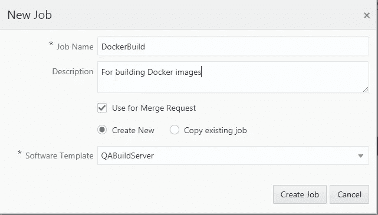
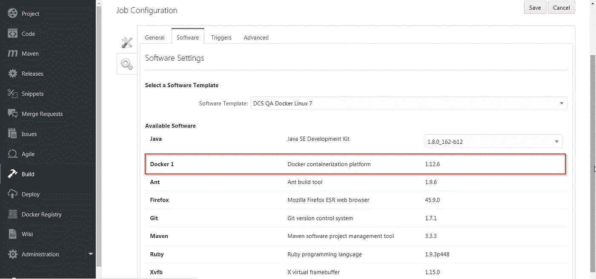
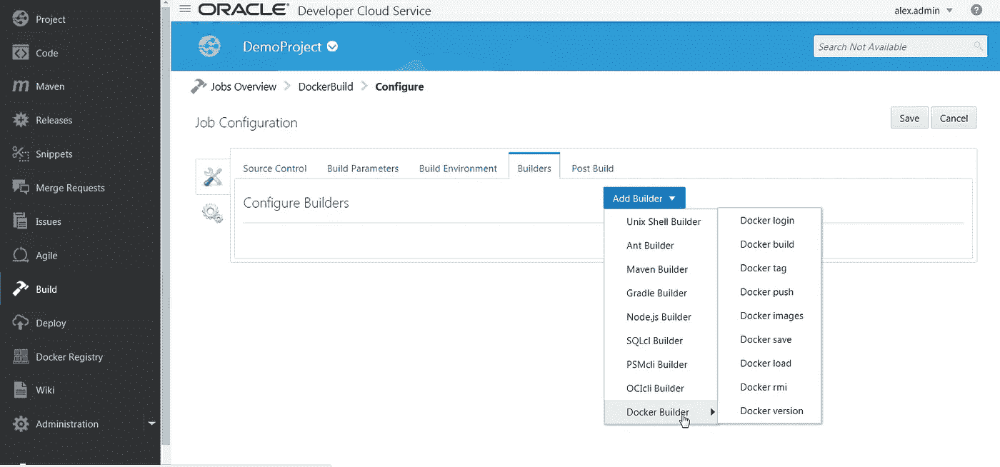
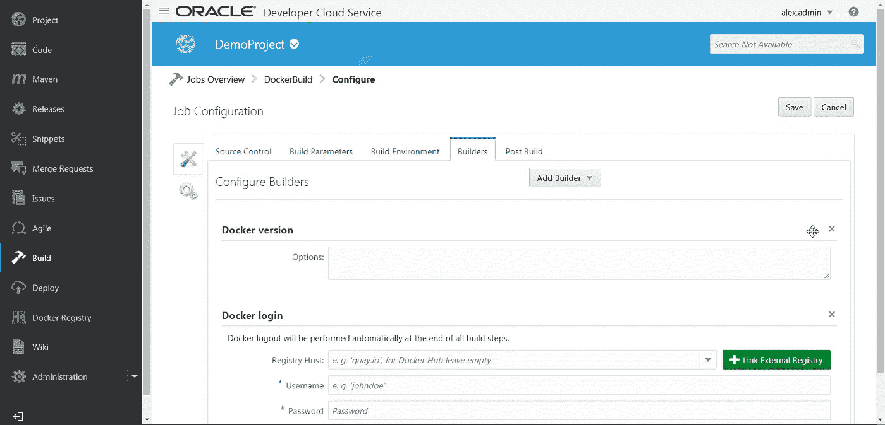
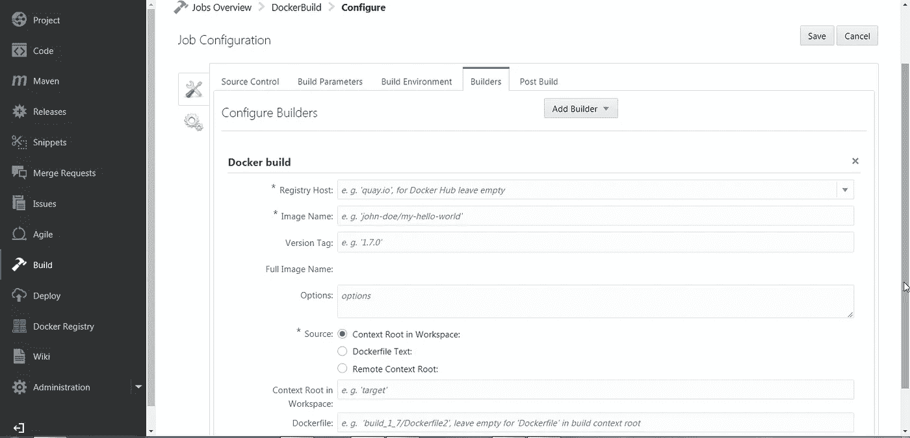
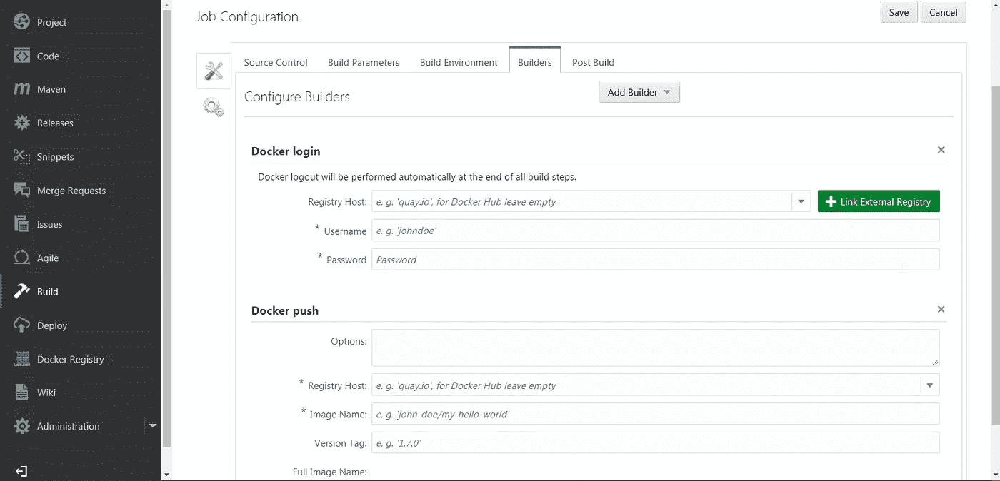
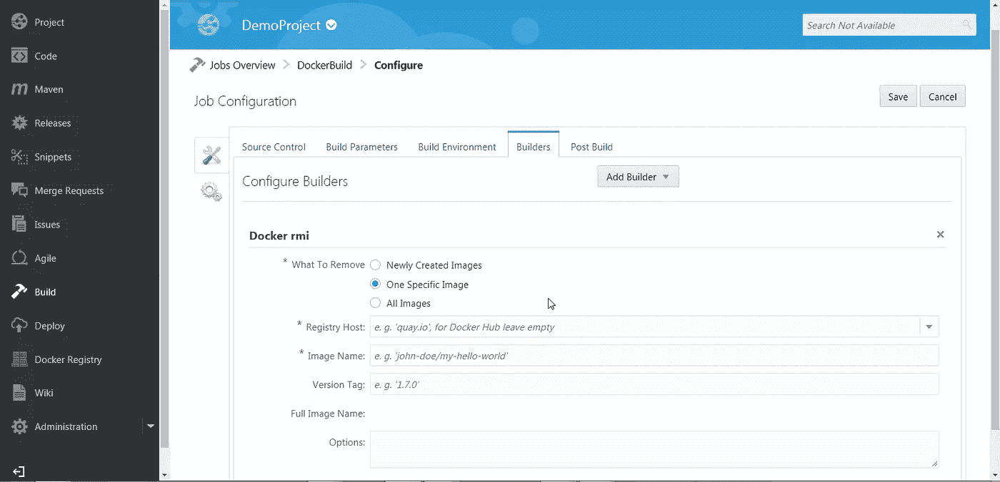

# 基于 Oracle 开发人员云服务构建 Docker

> 原文：<https://medium.com/oracledevs/building-docker-on-oracle-developer-cloud-service-42f5917d68c6?source=collection_archive---------0----------------------->

期待已久的对 Oracle 开发人员云服务的 Docker 构建支持已经到来。现在，您将能够构建 Docker 映像并执行 Docker 命令，作为连续集成和连续部署管道的一部分。

本博客描述了如何以及如何利用开发人员云服务上的 Docker 构建支持。它将让我们了解作为构建工作的一部分，我们可以在开发者云上运行/执行的 Docker 命令。

**注意:**将会有一系列关于使用 Docker build on Developer Cloud 的博客，涵盖不同的技术堆栈和用法。

**造工要领:**

能够在构建工作中运行 Docker 命令或使用 Docker 构建步骤的先决条件是，我们应该选择一个包含 Docker 作为软件包的软件模板。使用 Docker 选择模板可确保使用所选软件模板实例化的 Build VM 上安装了 Docker 运行时，如下图所示。模板名称可能因您的实例而异。

要了解新的构建系统，你可以去这个博客**链接**。您也可以参考关于配置构建虚拟机的**文档**。

您将能够通过导航到构建--><build job="">->构建设置-->软件来验证 Docker 是否是所选虚拟机的一部分</build>

您可以参考这个**链接**来了解更多关于开发者云的新构建界面。

如上所述，选择正确的软件模板创建构建作业后，转到构建作业中的构建器选项卡，然后单击添加构建器。您将在下拉菜单中看到 Docker Builder，如下图所示。选择 Docker Builder 将为您提供现成的 Docker 命令选项。

您也可以运行所有其他 Docker 命令，方法是选择 Unix Shell Builder 并在其中写入您的 Docker 命令。

在下面的屏幕截图中，您可以看到从 Docker Builder 菜单中选择的两个命令。

**Docker 版本** —该命令界面打印安装在您的构建虚拟机上的 Docker 版本。

**码头工人登录** —使用该命令界面，您可以登录码头工人登记处并与之建立连接。默认情况下，它是 DockerHub，但您可以使用 Quay.io 或任何其他可通过互联网获得的 Docker 注册表。如果您将注册表主机留空，那么默认情况下，它将连接到 DockerHub。

**Docker 构建** —使用此命令界面，您可以在 Oracle 开发人员云中构建 Docker 映像。您必须在 Git 存储库中有一个 Dockerfile 文件，您将在构建作业中配置它。Dockerfile 字段中必须提到 Dockerfile 的路径。如果 Dockerfile 位于构建上下文根中，您可以将该字段留空。您必须给出图像名称。

**Docker 推送** —现在将使用 Docker 构建命令接口构建的 Docker 映像推送到 Docker 注册表。您必须首先使用 Docker 登录来创建一个到 Docker 注册中心的连接，您希望将图像推送到这个注册中心。然后使用 Docker Push 命令给出您在 Docker Build 命令中给出的映像构建的确切名称。

**Docker RMI** —删除我们构建的 Docker 映像。

如前所述，您可以在开发人员云中运行任何 Docker 命令。如果没有给出命令的 UI，您可以使用 Unix Shell Builder 来编写和执行 Docker 命令。

在我的后续博客系列中，我将结合使用开箱即用的命令界面和 Unix Shell Builder 来执行 Docker 命令并完成构建任务。因此，请关注这里即将推出的博客。

码头快乐！

* *本文表达的观点是我个人的观点，不一定代表甲骨文的观点