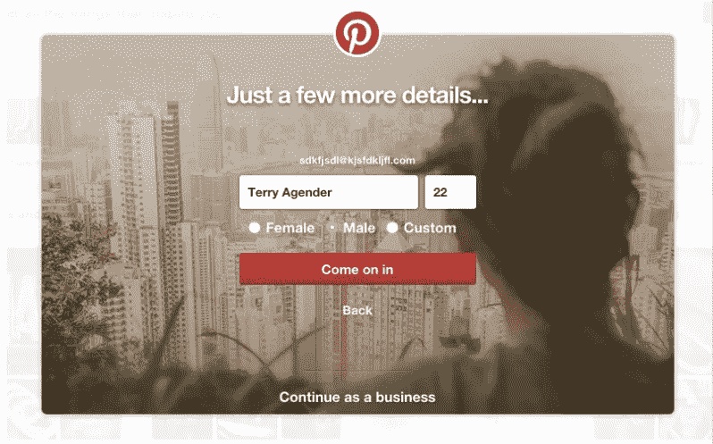
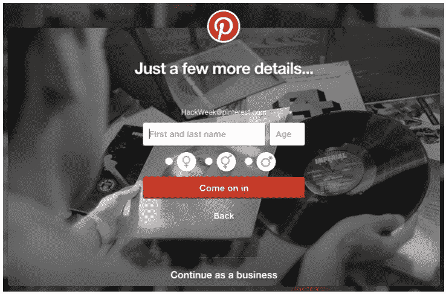
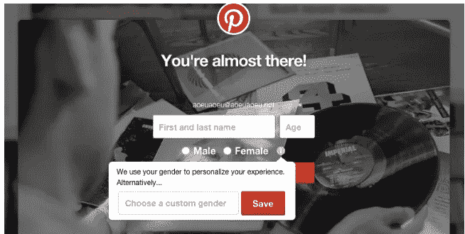
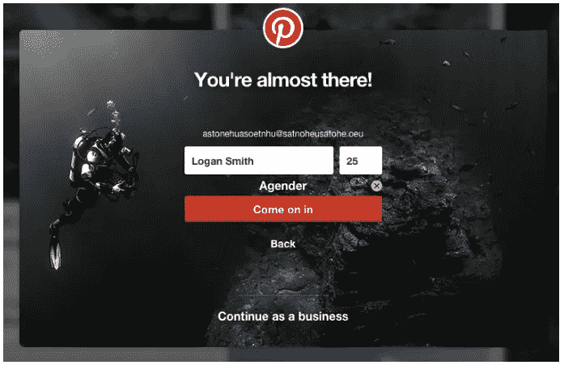

# 在注册时建立扩展的性别选项

> 原文：<https://medium.com/pinterest-engineering/building-expanded-gender-options-on-signup-19e010151d03?source=collection_archive---------0----------------------->

Tilde Pier | Pinterest 工程师，合伙人

去年 6 月，Pinterest 推出了[定制性别选项](https://blog.pinterest.com/en/more-gender-options-pinterest)，让该产品更具包容性。最近，我们扩展了这一功能，允许新 Pinners 在注册时输入自定义性别。在我们构建全球创意目录时，我们希望确保所有的创意和人员都包含在我们的使命中。我最近在 [AlterConf](http://www.alterconf.com/speakers/tilde-ann-thurium) 做了一个关于 Pinterest 自定义性别选项的演讲。以下是我们如何构建该功能以及自发布以来的新功能。

性别是一个敏感的话题。许多人可能不理解为什么提供“男性”和“女性”之外的选项很重要。我们如何向对其非常重要的一小部分用户展示这一特性，而不使其他人感到不安或困惑呢？

## 网页设计迭代

我们尝试的第一个迭代是一个单选按钮，增加了选择自定义性别的选项。然而，在德语和法语中，“自定义”按钮标签放不下文本框。当国际化用户界面时，建议留出 30%的水平空间来容纳平均单词长度更长的语言。Pinterest 的外观和感觉极其重要，因此是时候采用新方法了。

接下来，我们尝试使用符号来减少水平空间的使用。这种方法也有问题。首先，没有一个单一的符号代表所有不认同男性或女性的人。此外，许多人不清楚哪个符号表示“男性”，哪个表示“女性”，所以这种形式可能会给每个人造成困惑。此外，这些符号不能跨文化使用。不那么有趣的事实:任何被认为是“LGBT 宣传”的东西在俄国都是非法的，一个非二进制符号可能属于这一类。因此，这个版本的表单不会运行。

最后，我们用了一个信息图标。

当用户将鼠标悬停在图标上时，会弹出一个工具提示，解释我们为什么要询问性别。当用户在文本框中输入自定义性别并点击“保存”时，男性和女性文本将被替换为他们键入的文本。

## 数据驱动的方法

注册表单是一个重要的不动产，因为它影响许多顶级业务指标。我们在这里采用了数据驱动的方法，在 A/B 实验中测试这些变化。

我们的实验试图证明零假设:我们需要验证添加自定义性别选项不会减少注册。从统计学上来说，证明实验没有效果比证明有效果更难。你需要更大的群体，更多的数据。

最初的实验结果显示注册人数下降了约 1%。我假设用户无意中触发了悬停交互，变得困惑，并放弃了流。我们决定将悬停交互改为点击交互，并再次运行实验。这一次，注册人数持平——万岁！我们梳理了我们的日志，以验证用户正在与该功能交互，因此我们可以确信，想要找到并使用该功能的用户可以轻松地这样做。

## 更大胆的移动设计

在我们的移动注册流程中，我们采取了更大胆的方法，将自定义性别直接放入注册流程中——一点也不隐藏。由于整个流程被重新设计，这不是一个苹果与苹果的比较。然而，新的流动转换的速度比旧的要快。然而，定量数据从来没有说明全部情况。在用户调查中，关于注册时自定义性别的反馈都是正面的。例如，一个用户说“在我们进步的社会氛围中，自定义性别是一个很棒的想法。”

## 性别包容设计的建议

如果你正在开发一个产品，并且想知道如何表现性别，那么[首先问问自己是否真的需要这些信息](http://43epnd.axshare.com/gender.html)。

如果你真的需要用户的性别信息，[使用自由格式的文本框](http://juliepagano.com/blog/2015/06/12/on-forms-and-personal-information/)。不属于性别二元的用户以许多不同的方式进行识别。如果你试图保留一个列表，你将不可避免地遗漏一些人:让人们输入他们想要的东西更容易！

## 底线

添加扩展的性别选项不会对我们的指标产生负面影响。有时候花时间在少数用户的特性上是很重要的，因为这是正确的做法。

*鸣谢:非常感谢迈克尔·普罗伯、安吉尔·斯蒂格勒、瑞克·詹姆斯·查塔斯、文晏、穆斯塔法·莫蒂瓦拉、卢多·安东诺夫、伊万尼·托马斯和塞斯·劳尔对本文的贡献！*