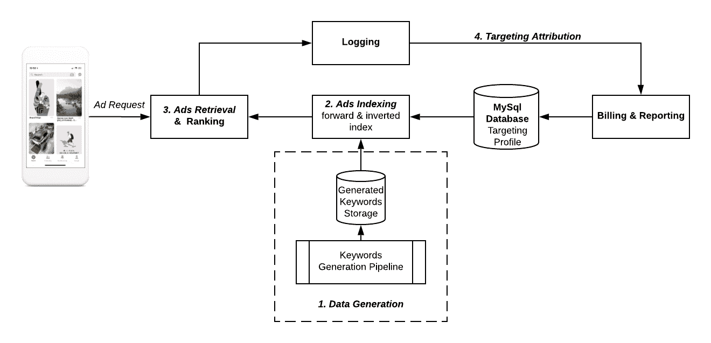
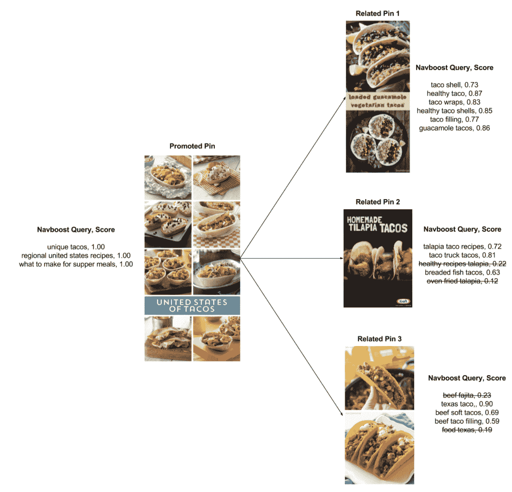
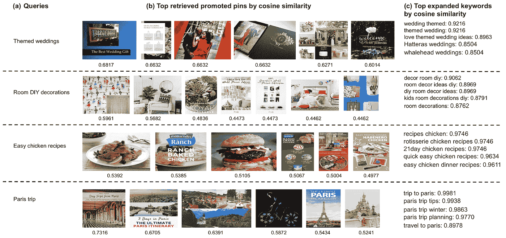
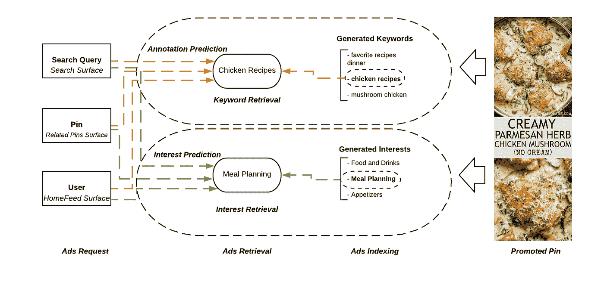

# 为 Pinterest 广告建立扩展目标

> 原文：<https://medium.com/pinterest-engineering/building-expanded-targeting-for-pinterest-ads-27975ff0da18?source=collection_archive---------1----------------------->

Zhiyuan(John)Zheng | Ads 工程软件工程师

每月有超过 3 亿人访问 Pinterest，Pinterest 为广告商提供了独特的机会，让他们的产品出现在有商业意图的人面前。与其他平台类似，Pinterest 提供各种针对产品的广告[。广告商可以根据 Pinners 的兴趣、关键词、设备、位置等来定义目标受众。如果做得好，定位可以向理想的受众投放广告，并最大限度地提高合作伙伴的价值和投资回报(ROI)，为每个人创造良好的体验。](https://help.pinterest.com/en/business/article/targeting-overview)

然而，由于许多第一次在 Pinterest 上做广告的人对我们的平台或 Pinners 的兴趣了解不多，许多人采用了他们在其他平台上使用的相同的定向配置文件(关键词、兴趣或人口统计)，这可能导致次优的广告表现，因为 Pinterest 为用户提供了独特的体验，帮助他们找到他们寻求的灵感。一个主要原因是某些关键词或兴趣在 Pinterest 上不太受欢迎。例如，更多的品酒师对“房间装饰”感兴趣，而不是“家居装饰技巧”。

为了帮助广告客户成功锁定目标，我们开发了[扩展锁定](https://help.pinterest.com/en/business/article/expanded-targeting)，这是一种锁定产品，可以自动智能地将推广的 Pin 连接到理想的 Pin。随着目标的扩大，广告商不需要确定他们推广的 pin 的关键字或兴趣列表，而是可以依靠 Pinterest 来提供最佳的广告效果。

自 2017 年在搜索广告中首次推出扩展目标定位以来，扩展目标定位已经成为所有产品表面(搜索、相关 pin 和 home feed)上受欢迎的目标定位产品。截至 2019 年 8 月，Pinterest 上超过 85%的广告商和 60%的广告组(即一组共享相同目标定位配置文件的推广 pin)选择了扩大目标定位。

在本文中，我们将分享 Pinterest 广告扩大目标定位背后的技术。

# 产品概述

**上下文定位**利用关键词和兴趣为广告寻找最佳受众。在 Pinterest，我们提供三种类型的上下文定位产品:[关键词定位](https://help.pinterest.com/en/business/article/keyword-targeting)、[兴趣定位](https://help.pinterest.com/en/business/article/interest-targeting) ⁴和扩展定位。

关键词定向要求广告客户提供相关关键词列表，而兴趣定向允许广告客户从固定的兴趣分类中选择相关主题。

然而，扩展的目标定位自动确定与推广的 pin 相关联的最相关的关键词或兴趣，并从推广的 pin 中获取知识，了解 pin 用户的兴趣，并将广告商与对其业务最感兴趣的 pin 用户联系起来。

Fig. 1\. Advertisers Can Easily Enable Expanded Targeting During Campaign Setup

扩大目标定位的目的是让广告商的价值和客户的体验都受益。

*   **广告客户优势** —扩展的目标定位简化了活动创建，因为广告客户不再需要指定关键词或兴趣，只需要在活动设置期间启用该功能，如图 1 所示。它还通过向最感兴趣的 Pinners 展示广告来最大化投资回报率。
*   **Pinner 受益**——它提高了 Pinterest 广告的质量，因为 Pinners 看到了更多与其兴趣或意图相关的广告。

# 扩展的目标技术

扩展目标定位利用两种技术，通过基于文本的检索和基于嵌入的检索将广告发送给最相关的 Pinners。

*   **基于文本的检索** —确定推广 Pin 应该针对的最佳关键词或兴趣，然后用于匹配搜索查询或兴趣。
*   **基于嵌入的检索** —利用不同的嵌入模型，如 [PinSage](/pinterest-engineering/pinsage-a-new-graph-convolutional-neural-network-for-web-scale-recommender-systems-88795a107f48) ⁵和视觉嵌入，找到最相关的用户上下文(搜索查询、特写 Pin 或用户个人资料)以显示推广的 pin。

在本帖中，我们以生成的关键词为例，讨论扩展目标定位中基于文本的检索。关于基于嵌入的检索的讨论将留到以后的文章中讨论。

# 基于文本的检索

## 高层架构

Fig. 2\. Architecture of Keyword Generation

图 2 示出了扩展目标定位中基于文本的检索的高级架构，其包含以下阶段。利息产生遵循类似的程序。

*   **数据生成** —使用启发式和基于模型的方法为促销的 pin 生成关键字和兴趣
*   **广告索引** —用生成的关键字和兴趣索引促销的 pin
*   **广告检索&排名** —使用生成的关键字和兴趣检索广告并对其进行排名
*   **目标定位归因** —记录广告印象和参与度并将其归因于目标定位规格

## 数据生成

我们开发了两种关键字生成方法:Pin2Pin 算法和基于 PinText 模型的算法。

*   **Pin2Pin 算法** —一种启发式算法方法，它聚集了与每个推广的 Pin 及其最相关的 Pin 相关联的最受关注(点击、重复、特写)的搜索查询。
*   **基于 PinText 模型的算法** —一种基于嵌入模型的方法，其中 PinText 是 Pinterest 使用广告参与数据开发的多任务学习(MTL)单词嵌入。

Fig. 3\. An Example of Using Pin2Pin Algorithm to Generate Keywords

图 3 显示了我们如何使用 Pin2Pin 算法来为提升的 Pin 生成关键字的示例。首先，我们构建一组引脚，其中包含与提升引脚的输入相似的相关引脚(相关引脚 1、2 和 3)。对于每个提升的 Pin 和一组相似的 Pin，我们得到其最频繁参与的搜索查询。具体来说，在本例中，我们得到了“unique tacos”和另外两个关于促销 Pin 的 Navboost 查询。“taco shell”查询和其他五个 Navboost 查询出现在相关的 Pin 1 上。接下来，对于这些查询中的每一个，我们计算提升的 Pin 和查询之间的相关性分数。在这个例子中，我们看到来自相关大头针 3 的“texas taco ”,其与被提升的大头针的相关性分数为 0.90。最后，我们通过阈值处的相关性分数来过滤 Navboost 查询，并为提升的 Pin 确定关键字集。

此外，我们使用 PinText Embeddings⁶，一种内部机器学习模型，基于嵌入空间中的余弦相似性来预测输入提升 Pin 的最相关术语。该模型基于 Pinterest 参与度数据，通过使正面参与度实体对之间的嵌入相似度大于随机采样的背景对之间的相似度来训练，其中实体嵌入是通过简单地平均其单词的嵌入来获得的。图 4 示出了使用 PinText 嵌入检索广告的例子。

Fig. 4 Use PinText-Model for Expanded Targeting Keyword Generation

关键字生成管道生成从关键字到 Pin IDs 列表的映射，数据存储在我们的内部服务系统中。目前，我们的关键字生成管道每天都在更新。

## 索引

在索引过程中，我们的 ads 索引服务器从 MySQL 数据库加载目标配置文件，并加载批量数据来构建正向索引和反向索引。反向索引将不同的特征(例如关键词和兴趣)映射到提升的 Pin，而正向索引将每个提升的 Pin 映射到特征列表。与广告商提供的关键词或兴趣类似，我们生成的关键词和兴趣也以同样的方式被编入索引。生成的索引用于在线检索和排名。

## 检索

广告检索负责根据与每个广告请求相关联的内容信号来检索最佳推广的 pin。这是为了确保投放的广告不会损害 Pinner 的体验。这里，请求上下文在不同的位置有所不同。具体来说，它指的是 Pinners 对 Homefeed 的兴趣，search 中的搜索查询，以及相关 Pin 上的特写 Pin 信号。

我们利用许多机器学习模型将上下文(搜索查询、特写大头针和用户资料)映射到上下文信号(注释和兴趣)，并使用它们来检索广告。

图 5。使用生成的关键字和兴趣进行检索

例如，如图 5 所示，对于右侧的提升的 Pin，我们生成关键字和兴趣的列表来构建索引。对于广告请求(搜索查询、Pin 或用户)，我们还预测最具代表性的上下文信号(注释和兴趣)。在检索期间，当搜索查询(在搜索上)、Pin 注释(在相关 Pin 上)或 Pinner 注释(在 home feed 上)是“chicken recipes”时，我们能够通过关键字检索来检索这个提升的 Pin。同样，通过兴趣检索，可以使用“用餐规划”兴趣来检索此广告。

## 目标归因

作为我们广告产品生命周期的一部分，定位归因负责将广告印象和投放归因于广告商的定位规范。在我们的广告产品中，这是一个非常重要的阶段，因为广告客户依赖这些信息来评估目标客户档案的性能，并为未来的广告策略制定计划。如果通过一种扩展的目标定位技术检索到广告，我们将交付归因于生成的关键字或兴趣。归因信号也为我们评估和改进我们的发电管道的质量提供了良好的反馈信号。

# 下一步是什么

*   开发不依赖关键词或兴趣检索广告的技术。
*   活动设置期间的实时关键词和兴趣生成及建议
*   通过扩大目标来扩展 SMB(中小型企业)

**鸣谢:**非常感谢 Albert Koy、Cynthia Johanson、叶茂、徐佳婧、Islam Al-Aarag、Roelof van Zwol、Jinfeng Zhuang 以及整个 Ads 质量团队，他们帮助改进和扩大了 Pinterest 的目标定位。我们还要感谢内容团队和应用科学团队在我们的合作中开发了许多这些优秀的技术。

# 参考

1.  [Pinterest 广告定位概述](https://help.pinterest.com/en/business/article/targeting-overview)
2.  [扩大针对 Pinterest 的目标](https://help.pinterest.com/en/business/article/expanded-targeting)
3.  [Pinterest 广告关键词定位](https://help.pinterest.com/en/business/article/keyword-targeting)
4.  [Pinterest 广告兴趣定位](https://help.pinterest.com/en/business/article/interest-targeting)
5.  [PinSage:一种新的用于网络规模推荐系统的图卷积神经网络](/pinterest-engineering/pinsage-a-new-graph-convolutional-neural-network-for-web-scale-recommender-systems-88795a107f48)
6.  *“PinText:Pinterest 中的多任务文本嵌入系统”被 2019 年在美国安克雷奇举行的 KDD 接受。*
7.  [Pinterest 推荐系统 Pixie 的更新](/pinterest-engineering/an-update-on-pixie-pinterests-recommendation-system-6f273f737e1b)

> 我们正在建造世界上第一个视觉发现引擎。全世界有超过 2.5 亿人使用 Pinterest 来梦想、计划和准备他们在生活中想做的事情。来加入我们吧！