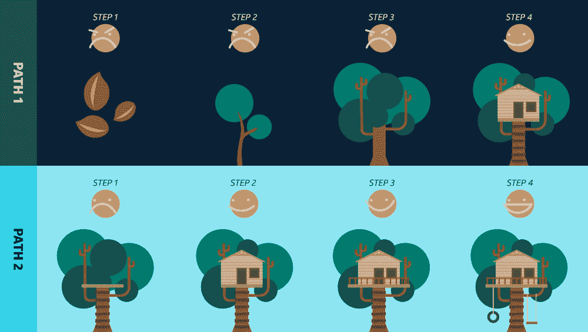

# 在敏捷世界中构建体验

> 原文：<https://medium.com/capital-one-tech/building-experiences-in-an-agile-world-d949c63dcd5e?source=collection_archive---------5----------------------->

## 把你基于功能的思维模式和设计思维留在门外

> 在我职业生涯的早期，销售部门的一个人走到开发团队面前说“…如果…”这句话现在一说出来，我就害怕得要死。

我们的应用程序有一个可以定制屏幕的特性——可以根据客户的需要添加、删除或重命名各种功能的字段。销售部门提议的功能是，我们可以*将多个屏幕组合在一起，在一个地方输入数据，但同时处理所有的操作。从表面上看，这听起来很合理，所以开发团队开始工作。几个月和许多复杂的工程之后，我们达到了预期的结果。然而，十多年后，我没有发现任何客户真正使用这个特性。我们着手建造一个东西，希望有人会使用它，但有人从未实现。相反，我们应该与我们的客户交谈。*

今天，大多数人都会同意敏捷开发比传统瀑布更好。更快的交付，迭代开发，小的功能团队，以及更多的行话来帮助填写你的行话宾果卡。但是我认为*做*敏捷和*交付*敏捷不是一回事。

# 从瀑布到敏捷——承诺

我在 IT 部门的第一份工作利用了传统的瀑布交付周期。通常是三个月的需求，三个月的开发，三个月的测试/发布，然后是另外三个月的无所事事，等待周期的重新开始。作为一名工程师，这非常令人沮丧。感觉我 75%的时间都是无所事事的，因为我没有做我真正喜欢做的事情，写代码！2005 年中期，我在一家小型软件开发公司找到了一份新工作，第一次接触到了“敏捷”这个东西。

像当时的许多人一样，在这家公司，我们正在将一个遗留的绿屏 COBOL 应用程序重写为一个 Java web 应用程序。我们的工作是将 30 多年的功能转换成一个新系统，从我以前的工作经验来看，这无疑是一项艰巨的任务。为了更好地让团队完成这个目标，我们使用了敏捷方法而不是瀑布方法。我最初的反应是敏捷似乎很酷；我可以做一件东西的一部分，然后一周又一周地添加进去。与我以前的工作相比，我以前的工作有很多停机时间，等待看到结果，这似乎很棒！

敏捷帮助我们专注于我们正在构建的应用程序的较小部分。但这也意味着我们可以建造仅从技术角度有用的东西。有了这个新的敏捷框架，我发现在迭代中完成的开发对最终用户来说通常是“没有价值的”,直到你完成了更多的工作。团队可能已经交付了可工作的*软件*([敏捷宣言](https://agilemanifesto.org/)中包含的项目之一)，但是我们没有交付*用户/业务*价值；当更多的代码完成后，就可以发布了。

很快，团队开始增加新的角色，比如 scrum master，我们的业务分析师变成了产品负责人。一个更好的功能独立团队的概念正在形成。但是仍然缺少一样东西——我们仍然不确定我们是否在建造任何人真正想要的东西。这就是像设计思维这样的新原则开始在我们的过程中发挥作用的地方。

# 敏捷符合设计思维

在 21 世纪初我加入 Capital One 后不久，我第一次接触到了开发生态系统中的一个新角色:设计师。在加入 Capital One 之前，设计只是我们“匆匆忙忙”做的事情，由碰巧对构建页面有最佳眼光的人来做。最初，我误解了他们在团队中的角色。设计师是这样一个人，他创作出漂亮的 Photoshop 图像，把它们扔给工程团队，然后说，“做一个像这样的网页！”对吧？但角色有天壤之别。设计师是我们敏捷团队不可或缺的一部分，专注于正在构建的东西的全部 UX。

他们实现这一点的方法之一是利用设计思维，设计思维被定义为[“…一个以人为中心的迭代设计过程，由 5 个步骤组成——移情、定义、构思、原型和测试](https://www.interaction-design.org/literature/topics/design-thinking)。”使用这个过程，设计师帮助驱动一个功能看起来像什么，它如何交互和被交互，并通过将工作建立在为用户提供真正价值的知识上来提高其效率。这是通过与工程团队和我们的实际用户一起开发这一价值来实现的。就像产品负责人帮助推动团队正在做的工作一样，设计师帮助创造*为什么*团队正在做这项工作。

但是这对敏捷过程有什么帮助呢？即使使用敏捷，你也可能要花三个月(或更长时间)来为你的系统构建一个特性；然而，随着设计思想的加入，我们更加注重提供一种体验，改善用户与产品的交互。否则，如果你的用户不关心它，你已经浪费了大量的时间和金钱来开发不必要的功能。因为我们不能读心，我们必须在快速反馈循环中迭代，以准确确定用户想要什么和需要什么。这是通过创建一个或多个应该做什么工作的假设来实现的，然后通过与真实的人进行交互并收集反馈来构建和原型化这些假设。

这让我们决定什么可行，什么不可行，并重复这个过程，直到你达到想要的结果。你会经常听到这里提到的术语*【快速失败】*。你越早发现某件事是否可行，你就能越早开始建造它(或者继续下一件事)。

# 平衡速度与满意度

那么这对敏捷和构建软件意味着什么呢？传统上，敏捷是关于构建全局的，一次一个冲刺。然而，仅仅因为某样东西是*造的*，并不意味着它就是*可用的*。因此，我们如何获得已完成工作的反馈，并利用这些反馈来调整下一步的工作。让我们以下面的插图为例。

*We can assume each step was done in a sprint*

该图像包含许多元素:

1.  它展示了这两个过程是如何一次一件地建造某物(树屋)的。
2.  *它通过流程跟踪客户满意度。*
3.  *它显示了每次迭代交付了什么。*
4.  *重新使用从头开始*

乍一看，你可能会说，*“但是两条路都以一个树屋结束。成功！”*是的，虽然最终结果相似，但随着时间的推移和最终结果，总体客户满意度降低了。我们这么想吧。让我们把这些脸转换成代表每个人快乐程度的数字。于是我们愤怒的脸变成了 0，灿烂的笑容变成了 4。

然后，让我们把这两个过程的各个阶段的数字加起来，以达到最终状态。您将获得:

*   路径 1 : 0 + 0 + 0 + 2 = 2
*   路径 2 : 1 + 2 + 3 + 4 = 10

通过途径 2，客户在相同的时间内获得更多的累积价值，并获得更好的最终产品。你会注意到，虽然两条路径都创建了一个树屋，但路径 2 发现用户喜欢*和*想要一些秋千和栏杆。路径 1 已经完成了一项任务，但是它不一定更接近于交付客户所期望的。通过敏捷地工作，他们可以根据以前版本的反馈来调整工作，交付更多给*客户*想要的东西，而不是*我们*可能认为他们想要的东西。它还指出了我们在工程领域有时会失败的事情，重用现有的服务(一棵树)，而不是从头开始构建(从橡子开始)。

这个简单的例子展示了增量*开发*和增量*交付*的优势。你的目标应该是尽可能频繁地发布小部件，以发现你的赌注是否正确。

# 打造更好的体验

虽然你不需要在你的团队中有一个设计/UX 领导来实现这一点，但是考虑他们的心态和技能如何帮助你的过程是很重要的，特别是当涉及到尽早开发假设并尽快测试它们的时候。一个失败的假设并不是一件坏事，它意味着你现在知道该做什么而不是做什么，这让你专注于下一步该做什么。这意味着专注于为用户提供正确的体验，而不是提供用户可能关心或可能不关心的单一功能。

回顾我介绍敏捷的故事，如果能安排时间和我们的客户谈论他们是如何工作的，他们需要什么，那将是非常强大的。至少，我们应该向他们展示我们正在构建的早期原型，以获得他们对工作的反馈。如果我们有，我们可能早就学会了如何改变我们的方向。虽然我可能仍然害怕这句话*“…如果…*不是很酷吗”，但我现在期待听到*“查看客户对…*的反馈，因为我知道我们离提供出色的体验更近了一步。

# 相关:

*   [设计思路和 API 设计](/capital-one-tech/experimental-api-strategy-from-capital-one-be72db15362)
*   [采用设计思维如何让我成为更好的数据科学家](/capital-one-tech/how-adopting-a-design-mindset-made-me-a-better-data-scientist-863ab0fcd20b)

*声明:这些观点是作者的观点。除非本帖中另有说明，否则 Capital One 不属于所提及的任何公司，也不被其认可。使用或展示的所有商标和其他知识产权都是其各自所有者的所有权。本文为 2019 首都一。*