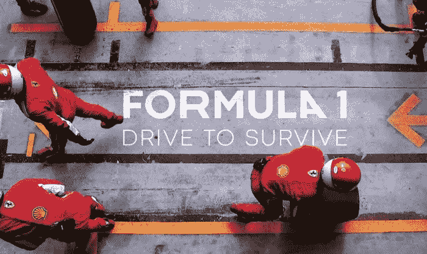
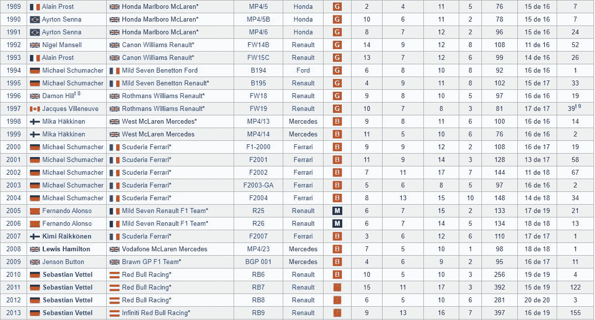
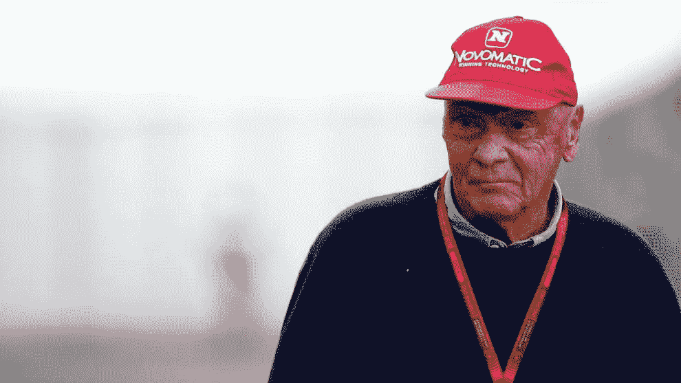
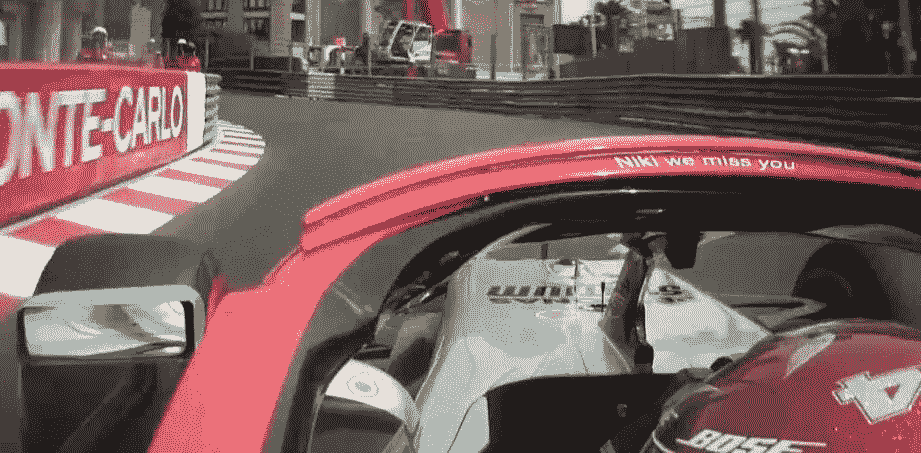
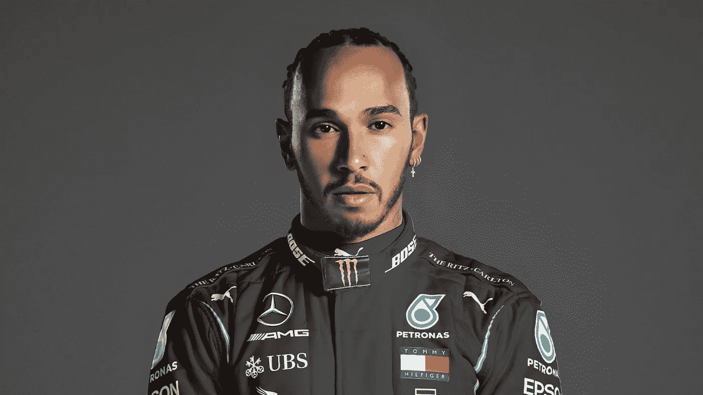
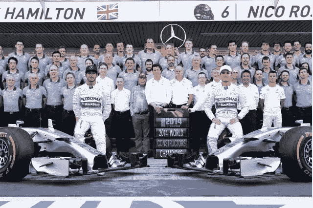

# 建立非凡的产品团队

> 原文：<https://medium.com/globant/building-extraordinary-product-teams-fb885b5e8271?source=collection_archive---------1----------------------->

Formula 1: Drive to Survive by Netflix & Box to Box Films

当我在网飞上看完"[f1 Drive to Survive](https://www.netflix.com/gb/title/80204890)"第四季第二集时，我不太清楚我是刚刚看了一集关于高性能赛车运动的精彩节目，还是参加了产品管理主题演讲。一个简短的免责声明:我甚至不是 F1 的粉丝，我也很少在电视上关注任何大奖赛。

产品团队取得非凡成就的故事总是给我留下深刻印象。从硅谷车库中起步的初创企业，到更朴实、更紧密的团队。是什么让一个非凡的团队影响结果，让它的用户不断爱上它的产品？

# 创新和转型

我钦佩这种转变和一系列变量——以这种方式构建——让一个失败的团队成为一个成功的团队。这时，成功既不是偶然的，也不是巧合的，而是长期持续的，是必不可少的。创新、创造和再创造是这些团队和创造过程的本质的一部分。

梅赛德斯-奔驰在 2014 年之前一直是一支失败的一级方程式车队。如果我们看看过去 25 年的冠军，我们可以看到梅赛德斯和像迈凯轮、法拉利或红牛这样的车队之间的差异，这只是几个例子。

Source: [Wikipedia](/conversaciones-de-producto/equipos-extraordinarios-776f8315e818#:~:text=https%3A//es.wikipedia.org/wiki/Campeonato_Mundial_de_Pilotos_de_F%25C3%25B3rmula_1)

自 2014 年以来，德国队连续获得了最近 7 次车队总冠军(2014-2020)。包括疫情。梅赛德斯是第三支拥有 9 个车手总冠军(1954 年、1955 年、2014 年、2015 年、2016 年、2017 年、2018 年、2019 年和 2020 年)的车队。这也是历史上第三支在这两个项目上都获得最多胜利的球队，仅次于法拉利和迈凯轮。

结果令人印象深刻。毫无疑问，秒表是帮助团队和飞行员测量 X 距离所需秒数的工具，例如，我们和我们产品的转换率或保留率。

Niki Lauda

2012 年夏天，车队通过几项变革开始了转型:一方面，[尼基·劳达](https://www.formula1.com/en/drivers/hall-of-fame/Niki_Lauda.html)被聘为梅赛德斯董事会顾问，同时，[托托沃尔夫](https://www.mercedesamgf1.com/en/team/management/toto-wolff/)被聘为梅赛德斯-AMG 马来西亚国家石油公司 F1 车队的车队负责人兼首席执行官。使命很明确:持续引领梅赛德斯走向成功。但是，另一方面，同年尼基·劳达签下了刘易斯·汉密尔顿作为车队的主要车手。他是他那一代人中最好的车手，离开迈凯轮成为梅赛德斯变革的一部分。

这与雷德·哈斯汀斯和艾琳·迈耶在《没有规则的规则:网飞和重塑文化》(2020)中谈论人才密度时告诉我们的没有什么不同。“当所有成员都很优秀时，绩效就会飙升，员工会互相学习，互相激励。”(……)“我们的主要目标是尽力而为；我们将雇佣市场上最优秀的员工，并支付最高的薪水。”

# 从结果中学习

2013 年，事情开始发生变化。不是一夜之间，而是迭代，就像产品组织中的一个季度又一个季度。梅赛德斯开始成为一支更具竞争力的车队，在每场比赛中都为登上领奖台而战。虽然远未达到目标，但那年比赛中的实验帮助团队学习并改变了趋势。用尼基·劳达的话来说:“赢了固然好，但输了才能学到更多。”最纯粹的精益创业。

“最困难的时刻，最痛苦的情况，是你从中学习最多的时候。”这可能是埃里克·里斯的话，但这是尼基·劳达自己说的。

Source: [Twitter](https://twitter.com/racefansdotnet/status/1132229081632792577?s=20)

2019 年 5 月，劳达去世，享年 70 岁。事情发生在摩纳哥大奖赛前几个小时。他是德国队的导师、教练、传播者、顾问和激励者。劳达可以让事情发生。“我觉得我们失去了 f1 的核心和灵魂”。那天梅赛德斯和汉密尔顿赢得了摩纳哥大奖赛。

这是一个非凡的结果的总和，将一个普通的团队变成了一个超越系列的团队。

随着 sprints 的进展，我们经常在我们的产品团队中看到这种情况。我们在顶级公司的产品团队以及类似的故事中看到了这一点。

同年，在德国大奖赛上，梅赛德斯车队在家中和比赛前庆祝其 125 周年纪念日。但同时，这也是一场和其他比赛一样值 25 分的比赛。在资格预审的那一天，汉密尔顿因为一种影响他身体和精神的病毒而发着 40 度的高烧醒来。然而，尽管条件不利，他还是取得了杆位。这是他职业生涯的第 87 个杆位，也是 2019 年的第四个杆位。

Sir Lewis Carl Davidson Hamilton

F1 赛车进站的平均时间是 2 秒。汉密尔顿在那个周日的霍根海姆林大奖赛上的进站持续了 58 秒。这场比赛最终被红牛车队赢得，荷兰人马克斯·维斯塔潘；汉密尔顿获得第十名。

在一次回顾会议中，团队在亲密、透明和真诚的背景下，讲述了我们在产品方面经历了一次糟糕的冲刺或一次糟糕的 Q 之后所做的回顾:“我们失败是因为我们不够好，因为我们做得不够。”汤姆·沃尔夫:“当你把事情搞砸了，你就想找出那个人。这就是人类思维的方式。但是我们不自责。我们责怪问题而不是人。听起来很容易，其实不然。当我们犯错时，我们都会犯错。”

# 公司如何建立非凡的团队

不幸的是，没有神奇的食谱可以做到这一点。但好消息是，我们可以从成功的公司或伟大的例子中学习，就像梅赛德斯-奔驰团队中的这个例子。

最重要的事情之一是帮助组织创造一个人们可以发挥潜力的环境，我们可以通过在我们的文化中工作来实现这一目标。一个好的开始是写一个文化卡片，在那里我们陈述我们的主要原则和价值观。这个工具可以很方便地将我们的团队和其他团队在同样的原则下联合起来。有很多这样的甲板可以帮助你建立自己的，像著名的[网飞](https://es.slideshare.net/reed2001/culture-1798664)的文化甲板，但我最喜欢的是 [Hubspot 的文化代码](https://blog.hubspot.com/blog/tabid/6307/bid/34234/the-hubspot-culture-code-creating-a-company-we-love.aspx)，如果我必须选择一个的话。

我强烈推荐阅读[硅谷产品组的](https://svpg.com/)博客，关于 Marty Cagan 的[授权产品团队](https://svpg.com/empowered-product-teams/)。

# 最后

F1 是一个竞争异常激烈的市场，每天都有很多强度和压力让你接受评判。最终，同样的事情会发生在我们这些开发数字产品的人身上，我们的用户是每天评判我们的人，不管是我们还是我们的产品。

刘易斯·汉密尔顿在这一集的结尾说:“追逐比领导容易。”。当然，我们都希望实现世界一流的产品，但挑战在于，除了作为我们的环境、我们的团队、我们的同事和我们的竞争对手的基准之外，还要每天都做得更好。

梅赛德斯车队由 1600 人组成。这 1600 人中的每一个人都有团队的力量。作为产品团队的领导者，我们努力为每个人提供一个框架，让他们发挥出自己的最佳水平，并且每天都在进步。

正如我在这篇文章开头所评论的，产品团队取得非凡成果的故事总是给我留下深刻印象。你可以在初创企业或大型组织中，在亚马逊、Spotify 或网飞这样的高科技公司中，或者在像你这样的团队中找到他们中的许多人。

本文最初发表在 [Mind the Product](https://www.mindtheproduct.com/building-extraordinary-teams) 网站上。